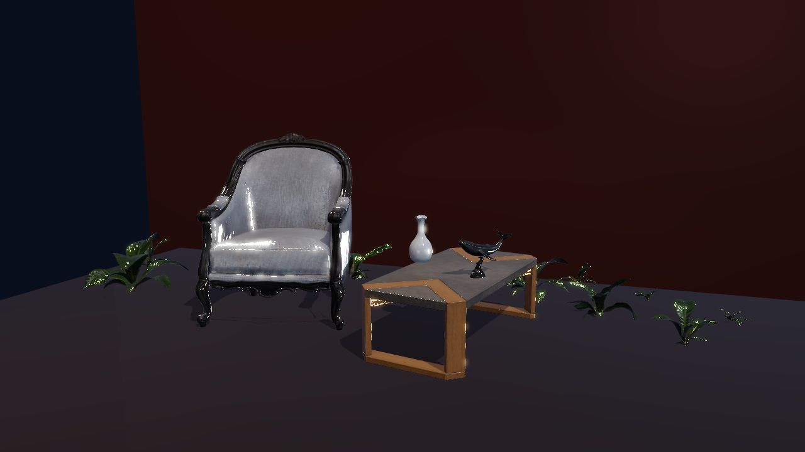
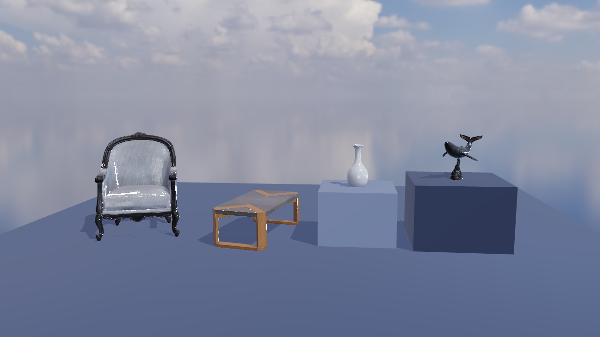
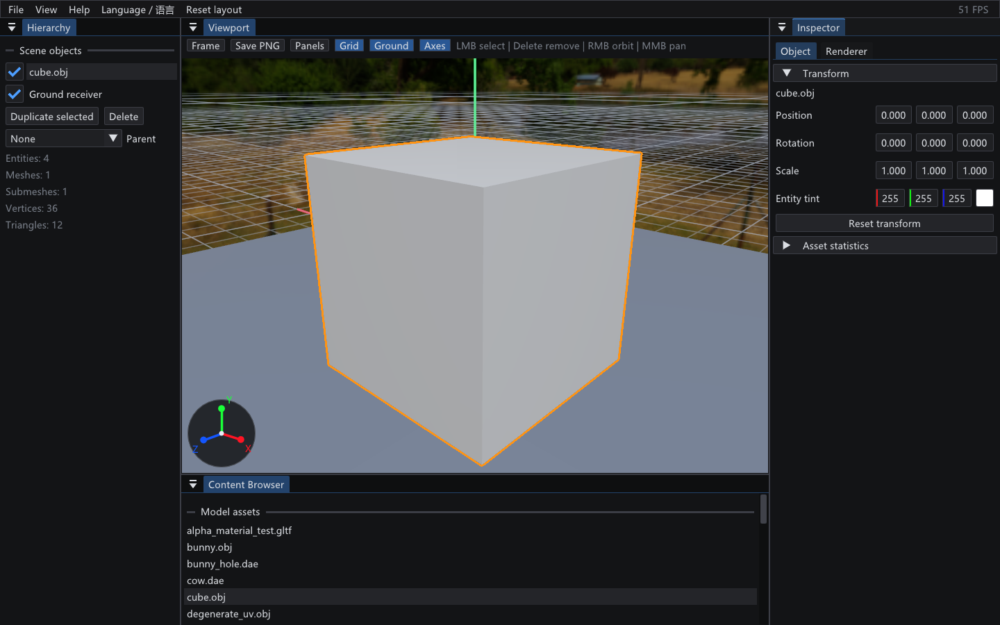
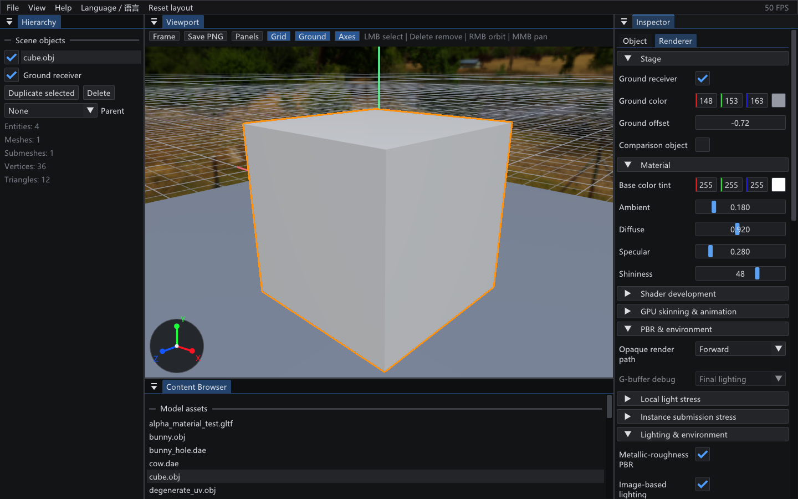

# MyRenderer

一个独立的 C++17 / OpenGL 3.3 GPU 光栅化渲染器与 Scene Rendering Lab。项目从 Dandelion 图形学实验框架中保留了模型、相机、材质与实时预览的设计思路；当前正在新增独立的 CPU Reference Path Tracer，不包含旧 CPU 软光栅化、物理模拟和半边网格模块。

当前版本可以加载 OBJ、DAE、glTF 2.0 和 GLB 静态模型，将网格与纹理上传到 GPU，按子网格材质范围通过 `glDrawElements` 完成多材质渲染，并在 Dear ImGui 界面中实时调整模型与渲染参数。

Post-MVP 阶段已将文件导入、CPU 模型数据、GPU 模型和渲染执行拆分；OBJ 使用独立轻量导入器，DAE 与 glTF/GLB 使用统一 Assimp 适配器，渲染层不依赖具体文件格式。

项目中出现的图形学与工程概念统一记录在 [`dictionary.md`](dictionary.md)，包含通俗解释、项目用途和当前实现状态。

## 已实现

- OpenGL 3.3 Core Profile 与 GLFW 窗口。
- OBJ 三角化、多 shape 合并、缺失法线生成和 AABB 自动取景。
- 通过导入专用 Assimp 6.0.5 支持 DAE、glTF 2.0/GLB 的多 Mesh、节点变换、UV0、切线和材质关联。
- 基础色纹理、材质常量色、外部纹理、Data URI 与 GLB/Assimp 内嵌纹理来源。
- `Texture2D` OpenGL RAII、跨材质纹理缓存、白色无纹理回退与洋红缺失纹理回退。
- 基础色贴图按 sRGB 解码，材质/灯光在线性空间计算，并在最终输出时编码为 sRGB。
- 切线空间法线贴图、退化 UV 安全回退与可关闭的法线贴图着色。
- 按子网格材质范围绑定材质并提交 Draw Call，同一模型可显示多个材质。
- GPU 顶点/索引缓冲、深度测试、背面剔除和线框模式。
- 可实时切换的 Forward / Hybrid Deferred 不透明渲染路径：`GL_RGBA8` Albedo、`GL_RGBA16F` Encoded Normal、`GL_RG8` Metallic/Roughness 与 `GL_DEPTH24_STENCIL8` Depth/Stencil G-Buffer，支持 1×/4× MSAA Resolve、逐附件 Debug View、世界坐标重建与全屏 PBR/IBL Lighting Pass；透明/玻璃继续使用 Forward Refractive Pass。
- Point Light / Spot Light 局部光照与确定性压力场景：8/32/64 三档灯光、100 个独立物体、平滑有限半径逆平方衰减与聚光锥；GUI/Benchmark 对比 Forward/Deferred 的 GPU P50/P95、Draw Call、显存和估算 Attachment 流量。
- GPU Instancing、CPU Frustum Culling 与屏幕尺寸 LOD：2,500 个共享 Sphere Mesh 的固定场景按模型/Tint/LOD 合批，六平面包围球剔除并切换三档聚类索引；1080p/4×MSAA 实测 Draw Call 2,501→19、CPU P50 5.386→2.077 ms、GPU P50 1.465→0.653 ms。
- TAA 与 SSAO 屏幕空间管线：8 样本 Halton Jitter、深度反投影 Motion Vector、History Reprojection、历史深度拒绝、3×3 Neighborhood Clamp，以及 16 样本 SSAO + 5×5 深度感知滤波；提供静止/运动 Ghosting、Motion、History Weight 和 SSAO 调试基线。
- glTF Skin 与 GPU 骨骼动画：每顶点四组 Joint/Weight、每 Mesh Skin Palette、Inverse Bind Matrix、节点层级、Clip/TRS 关键帧采样与 Vertex Shader Linear Blend Skinning；支持 Bind Pose、播放/暂停、时间拖动、速度和关节/权重调试。
- 轻量 Scene/Entity/Transform 场景图：父子层级、显隐、选择、复制/删除、独立 Tint 材质实例，以及同一 Mesh 的多 Node/多 Entity 几何复用。
- 可独立保存的 `.myscene` 场景项目：持久化实体 ID/父子层级、模型相对路径、Transform、显隐、Tint、阴影/实例标记、轨道相机、局部光源、全局环境/渲染参数以及动画和 Prism 播放状态；同一资源在重新打开时只加载一次。
- 显式 Render Pass Context 与 OpenGL State Cache；Shader 文件改动可热重载，编译失败时保留上一可用 Program 并在 Inspector 显示日志。
- 相机、刚体对象与骨骼的统一 Temporal History；G-Buffer 输出动态 Motion Vector，TAA 可处理对象与蒙皮运动。
- SR-P1A CPU Reference Path Tracer 基础：实时 Scene/Camera 可导出共享只读 `SceneSnapshot`，保留 Mesh Instance、材质/纹理来源、相机与灯光/环境；提供 Ray/AABB、Ray/Triangle、Surface Interaction 和确定性 Median-Split BVH 构建/遍历。
- SR-P1B～M CPU Reference Path Tracer：确定性渐进累积、可取消后台任务、线性 HDR/PNG、glTF PBR/纹理、Russian Roulette、发光/显式/HDR Environment NEE/MIS、介质 Fresnel/IOR/Beer-Lambert、七组 AOV、确定性 Tile 线程池、16-bin SAH、共享几何 BLAS/TLAS、逐像素 Adaptive Sampling，以及同场景/相机的 Raster / Path Traced / Difference 自动验收。
- P0-C 编辑器 CPU Progressive Preview：Viewport 可在 Raster / CPU Path Traced 间切换；后台 `RenderTask` 发布带代次的 CPU RGBA staging image，主线程上传 OpenGL Texture，并在相机/场景/材质 Tint/灯光/尺寸/积分器设置变化时取消旧任务。支持自动 1/4→1/2→全分辨率、固定分辨率、八种 Beauty/AOV、Pause/Resume/Restart、统计 Overlay 以及 Beauty/HDR/AOV 导出。详见 [`docs/cpu-progressive-preview.md`](docs/cpu-progressive-preview.md)。
- P0-D 采样与降噪：CPU Preview 支持 Direct/Indirect 分离的 AOV A-Trous、SVGF 风格时序方差、History Reprojection/Disocclusion Rejection、可选有偏 Firefly Clamp、Power-weighted Light Alias Table 与 GGX VNDF。三场景 1/2/4/8/16 SPP 对 2048 SPP 的 Raw/Denoised 指标和失败边界见 [`docs/p0-d-sampling-denoising.md`](docs/p0-d-sampling-denoising.md)。
- P1-0B Batch/Queue 闭环：版本化 `.renderjob` 通过无 ImGui Runtime 复用 `.myscene`、Model Importer、Builtin Model、SceneSnapshot 与 CPU Progressive Renderer；CLI 与持久多任务 GUI Render Queue 共用 Sequence Runtime、取消令牌和明确状态，逐帧按需原子输出 PNG/RGBE HDR/线性 FP32 OpenEXR、八类 AOV 与 Schema 2 Frame Report。CLI 支持事务性 Output Override；Resume 会精确校验 Manifest，并结构化诊断/安全恢复 `.partial`、缺失报告、格式变化和提交中断。Queue 状态使用主备原子替换、正常/中断 Session 标记及 Running/Cancelling 恢复，并自动验证 GUI/直接 Runtime 的产物一致性。Schema、命令、退出码和当前边界见 [`docs/render-job-batch.md`](docs/render-job-batch.md)。
- SR-P2A～C Stylized / NPR 模式：同一 Scene/Camera 可在 PBR 与 Toon 间切换，支持 2～8 档明暗分层、可调分层高光、Rim Light、Shadow Tint、TAA 后描边、时序稳定的有序 Dither、解析 Height Fog、32³ 3D Color Grading LUT，以及 Clean Toon / Painterly / Night Aurora 三组 Preset；参数可持久化并有六种调试视图、跨路径图像验收和 Low/High GPU 分档。
- P1-0C Module Runtime：`Timeline`（Frame/Time/FPS/Start-End/固定 `deltaTime`/Loop/Scrub，GUI 与 Batch 共用同一定义，时间只由帧号与固定帧率导出）、编辑态与可丢弃 `RuntimeScene` 的分离（含顺序无关、对变换敏感的 `sceneContentHash`）、`ISceneModule` 最小生命周期与受限 `SceneContext`（无 Widget/GL/线程句柄，宿主注入取消检查）、六类参数并带范围与事务性覆盖的 `ParameterRegistry`、按稳定字符串 ID 显式注册的 Module Registry/Manifest/Build ID、`ModuleRuntime` runner（只向前固定步进、起始帧也求值、失败隔离），以及独立 `MyRendererModules` 目标与首个确定性模块 `myrenderer.core.turntable`。Inspector 新增 `Module` 页：由参数元数据自动生成控件，Viewport 的 Raster 与 CPU Path Traced 预览都渲染模块驱动的运行态场景，编辑态不被写回。`.renderjob` schema 2 可用 `module` 段驱动渲染序列，Frame Report 记录模块 Manifest（id/API 版本/Build ID/Seed/内容哈希/状态），模块、版本或 Seed 变化都会让 Resume 帧失效；`simulate` 只运行并输出每帧内容哈希，`bake` 写出确定性 Simulation Cache（键含场景哈希/模块/版本/Build ID/Seed/时间步/帧范围，复用时重新哈希校验，陈旧或损坏一律报 `Stale` 并重新模拟）。`module-rendering-acceptance` 逐步验证 simulate/bake、缓存命中与无缓存序列逐字节一致、陈旧缓存被拒；实测两条独立 CLI 序列（含事务性 `--output` 覆盖）帧 PNG 逐字节一致。详见 [`docs/module-runtime.md`](docs/module-runtime.md)。
- P1-A 切片 1 解析式天空与统一太阳：`src/optics/Atmosphere.*` 提供 Rayleigh/Mie 单次散射模型（Kasten-Young 气团、闭式指数积分、太阳盘与地面反照率），一个 `sunDirection()` 同时驱动环境立方体贴图（天空盒 + IBL）、方向光方向、阴影贴图与方向光能量；`skyIntensity`/`sunIntensity` 分别控制环境天空与关键光+日盘，`skyLightColor()` 让关键光携带逐通道太阳颜色。`.myscene` 持久化天空参数，Inspector 新增 `Atmosphere` 分组（`SetAtmosphereSettings` 域命令，场景启用时自动展开），太阳盘亮度锚定晴天地面照度比 `E_sun/E_sky≈10` 使环境下半球与受光地面一致，辐照度卷积刻意排除日盘以避免重复计算与萤火虫。重建成本约 0.6 s 并在控制台/Inspector 如实显示。模型、参数、验证与已知边界见 [`docs/atmosphere-sky.md`](docs/atmosphere-sky.md)。
- P1-A 切片 2 Aerial Perspective：`opticalDepthAlongSegment()` 用同一套 Rayleigh/Mie 系数与同一气团约定积分相机到表面的有限线段，`verticalOpticalDepth()` 给出整根垂直气柱作为计量单位。合成在 `postprocess.frag`：复用已有的深度重建，因此不需要新增 render target，透明物体会与背后的几何一起淡出；顺序为 Height Fog → Aerial Perspective → 显示变换。in-scatter 取不含太阳盘的天顶/地平线天空色，保证射线走到无穷远时精确收敛到天空、零距离处不改变像素。`.myscene` 增加三个字段，Inspector 增加 `Aerial perspective` 子节。已知边界：CPU Path Tracer 尚未接入。实现、近似与 On/Off 证据见 [`docs/atmosphere-sky.md`](docs/atmosphere-sky.md)。
- Debug 构建在驱动支持时启用 OpenGL `KHR_debug` 诊断。
- Model/View/Projection 变换与基础 Blinn-Phong 光照。
- 离屏 Framebuffer 渲染视口、可切换 1x/4x MSAA Resolve 与解析后视口 PNG 导出。
- glTF 2.0 metallic-roughness PBR（Cook-Torrance GGX）、Radiance HDR/OpenEXR equirectangular 环境、Diffuse Irradiance、GGX Prefiltered Specular Cubemap、BRDF LUT、Split-Sum IBL、天空盒与方向光 PCF 阴影；环境资产缺失时回退到程序化 Studio 环境。
- glTF `OPAQUE` / `MASK` / `BLEND`、Alpha Cutoff、双面材质、透明子网格后向前排序，以及独立的透明深度/混合状态。
- glTF `KHR_materials_transmission` / `KHR_materials_ior` / `KHR_materials_volume` / `KHR_materials_dispersion`：IOR 驱动的 Fresnel、Snell 折射、全反射、深度 Ray March、Thickness Texture、对象级前/后表面深度、真实出射法线、双界面折射、Beer-Lambert 体积吸收、环境回退与 13 种 Glass/Light Debug View；材质色散可被 Inspector 全局覆盖。
- Glass-3/4 彩色光传输与作品集验收：RGBA16F 透射阴影、可控 Caustics Projector、Light-space RGB Photon Splat 焦散、两次空间滤波，以及独立 Glass / Dispersion / Caustics 开关、四组玻璃 Preset、14 场景视觉回归、逐 Pass GPU Timestamp 和带标记 Nsight Capture。
- Prism-0～5 光谱 Demo：原创封闭三棱柱、纯黑舞台、固定正面镜头、CPU 双界面 Ray/Prism 求交，以及 380～700 nm 的 7/15/21/31 档波长采样；每个样本使用 Cauchy IOR、CIE 1931 近似线性 RGB、两界面 Fresnel 与 Beer-Lambert 能量。独立 `Spectral beam HDR` Pass 把结果生成相机朝向的柔边 Ribbon Mesh，支持连续光谱和七色美术模式，并提供固定视觉回归、性能报告和 Demo Reel。
- 多对象 `RenderItem` 场景提交、跨对象透明 Draw List 全局排序，以及可调颜色/高度并能接收 PBR 光照与阴影的程序化地面；可开启第二模型实例验证场景级排序。
- `Shadow map → Transmission shadow → Caustics HDR/filter → Forward Opaque 或 G-Buffer + Deferred Lighting → Forward refractive → Bloom/tone map` 多 Pass 管线；Opaque HDR Color、最终 HDR Scene Color 与可采样 Depth 相互独立，可切换 ACES Tone Mapping、曝光和 Bloom。
- 简约棱镜应用图标，覆盖 GLFW 标题栏、任务栏、Alt+Tab 和 Windows 可执行文件资源。
- 顶部菜单、模型列表、Scene 面板、Inspector 面板和运行状态。
- Windows 原生模型文件选择器、窗口拖放加载与后台 CPU 资产导入；失败导入不会替换当前场景。
- 按文件、节点、Mesh、材质和纹理分组的结构化诊断。
- CPU 帧时间、无阻塞 GPU 时间查询、Draw Call、三角形和纹理内存统计。
- 可独立开关的 XZ 地面网格、世界 XYZ 轴线和随相机旋转的视口方向指示器（X 红、Y 绿、Z 蓝）。
- 轨道相机、平移、缩放、自动旋转和材质/灯光控制。

## 构建要求

- CMake 3.20+
- 支持 C++17 的编译器（Visual Studio 2022 或 MinGW-w64）
- 支持 OpenGL 3.3 的显卡与驱动
- Git 与 Python 3（首次配置时用于获取依赖和生成 GLAD）
- 首次配置需要访问 GitHub；依赖版本已在 `CMakeLists.txt` 中锁定

## Visual Studio 2022 构建

```powershell
cmake -S . -B build -G "Visual Studio 17 2022" -A x64 -T host=x64
cmake --build build --config Debug --parallel
.\build\Debug\MyRenderer.exe .\assets\models\bunny.obj
```

## MinGW-w64 构建

```powershell
cmake -S . -B build-mingw -G "MinGW Makefiles" -DCMAKE_BUILD_TYPE=Debug
cmake --build build-mingw --parallel
.\build-mingw\MyRenderer.exe .\assets\models\bunny.obj
```

不传模型参数时，程序默认加载 `assets/models/cube.obj`。

## GUI 操作

### 独立场景文件

每个渲染场景都可以保存为一个独立的 `.myscene` JSON 文件。使用 `File / 文件` 菜单中的 `Open scene...`、`Save scene`、`Save scene as...` 和 `Reopen last scene`，快捷键分别为 `Ctrl+O`、`Ctrl+S`、`Ctrl+Shift+S`；也可以把场景文件作为启动参数直接打开：

```powershell
.\build\Release\MyRenderer.exe .\assets\scenes\01_multi_model_hierarchy.myscene
```

模型资源路径以场景文件所在目录为基准保存为相对路径，因此场景目录和它引用的资源目录保持相对布局后可以整体复制到另一台机器。打开场景时，编辑器先校验层级并加载全部唯一模型资源，只有全部成功才替换当前工作区；资源缺失或格式错误时现有场景仍会保留。最近一次成功保存或打开的路径记录在运行目录的 `MyRenderer.recent-scene`，可用 `Reopen last scene` 恢复。

`assets/scenes` 内置了可直接从 `File > Open bundled scene` 打开的功能场景：

- `01_multi_model_hierarchy`：多模型、共享资源、父子层级、Tint 与隐藏实体。
- `02_pbr_materials`：PBR、IBL、发光与 Alpha 材质。
- `03_deferred_ssao_taa`：Hybrid Deferred、SSAO 与 TAA。
- `04_volume_glass`：双界面折射、体积吸收和共享玻璃实例。
- `05_glass_caustics`：Light-space 焦散、彩色透射阴影和接收地面。
- `06_prism_spectrum`：Prism 光谱求解、HDR 光束与固定镜头。
- `07_local_lights`：Point/Spot 局部光源与 Deferred 光照。
- `08_instancing_lod`：共享 Sphere 的 Instancing、Frustum Culling 与 LOD。
- `09_gpu_animation`：glTF Skin 与 GPU 骨骼动画播放状态。
- `10_reference_pathtracer_pbr_hdri`：Poly Haven 家具与摆件组成的 PBR/HDRI 光栅/光追固定对照。
- `11_reference_pathtracer_lights`：Emissive、Point/Spot Light 和 PBR 接收物。
- `12_reference_pathtracer_volume`：闭合玻璃、双界面折射、Beer-Lambert 体积与背景参照物。
- `13_polyhaven_studio_lounge`：暖色室内陈列，验证复杂 glTF 材质、Alpha 植物、局部灯光、阴影与构图。
- `14_polyhaven_material_gallery`：中性材质展台，集中验收织物/木材、石材、陶瓷和氧化金属。
- `15_stylized_clean_toon_gallery`：Clean Toon 材质展台，固定硬分层、细描边和 Clean LUT。
- `16_stylized_painterly_interior`：Painterly 室内陈列，固定暖色 Rim、轻 Dither、Height Fog 与低强度 Bloom。
- `17_stylized_night_aurora_outdoor`：Night Aurora 室外自然代理构图，固定冷色分层、浓雾、Night LUT 与 Bloom。
- `18_atmosphere_sky`：P1-A 解析式天空外景夹具（地面、球、立方体、立柱），默认启用 `Atmosphere` 与 `Aerial perspective`，由太阳同时驱动天空、方向光、阴影与光照能量；用于正午/黄金时刻固定截图与 `atmosphere-model` 之外的端到端验收。模型、参数、成本与已知边界见 [`docs/atmosphere-sky.md`](docs/atmosphere-sky.md)。
- `19_coastal_cascades`：P1-A 级联阴影海岸夹具（80×80 地面、近/中/远三排礁石与海蚀柱，跨约 110 单位进深），低太阳制造长阴影，默认 3 级级联。用于验证远景阴影：单级正交盒在这个跨度上会出现可见的阴影分辨率断层，级联把它抹平。对比与量化见 [`docs/shadow-cascades.md`](docs/shadow-cascades.md)。

`10`～`12` 专门冻结光追相关的模型、材质、灯光、环境和相机配置，可作为实时预览、SceneSnapshot 捕获及 Raster/Path Traced 对照的统一输入；`13`～`14` 是面向展示和材质验收的 Hero Scene。离线路径追踪的 SPP、Max Depth 和 Seed 仍由渲染任务设置控制，不写入 `.myscene` v1。





五个 1K glTF 模型来自 Poly Haven，均为 CC0：Arm Chair 01、Modern Coffee Table 01、Ceramic Vase 01、Anthurium Botany 01 与 Bronze Whale Statue。作者、原始页面和文件校验信息见 [`assets/models/polyhaven/README.md`](assets/models/polyhaven/README.md)。植物使用 Alpha Mask，目前只进入实时展示场景；严格 Raster/Path Tracer 对照暂不使用它，避免 CPU Alpha Visibility 尚未实现时产生无意义差异。

- Scene Explorer：按父子关系显示可展开的 Entity 树；可拖放到另一对象或场景根节点调整层级，Parent 下拉框保留键盘操作入口。选择、显隐、复制/删除和父对象变化通过 `EditorSession` / `EditorCommand` 集中提交。模型仍可使用原生文件选择器、输入路径或拖放导入，CPU 导入期间当前场景保持可用。
- Inspector / Object：按 Transform、Material、Lighting 与 Object actions 分组，以“属性名 / 控件”两列调整 Position、旋转、缩放、Tint、Visibility 与 Casts Shadow；长名称会自动换行，不再被窄面板遮挡。这些修改和 Delete 均提交 `EditorCommand`，由集中入口校验并更新 Scene，不再由 Inspector 直接改写实体。模型导入后以 AABB 中心作为局部原点，默认世界 Position 为 `(0, 0, 0)`。
- Inspector / Renderer：参数按 Stage、Material、Directional Light、PBR、Atmosphere、Glass、Post processing、Rasterization 等抽屉收纳；单击分组标题展开或折叠。Stage、Material、Directional Light、PBR / Environment、Atmosphere、Shading / Stylized、Post processing、Rasterization、Camera、Runtime、Glass、Caustics 与 Instancing 全部按领域快照提交 `EditorCommand`，由集中入口校验并应用，并按领域失效语义统一处理 CPU Preview 重启与 TAA History：PBR/Environment、Atmosphere 与 Camera 同时失效两者，Shading/Stylized 与 Glass/Caustics 只失效 TAA History，Post processing 仅在 SSAO/TAA 参数变化时失效 History，Runtime 不影响画面。`PBR & environment > Shading mode` 可在 Physically Based 与 Stylized / Toon 间一键切换，并调整明暗层级、分层高光、Rim、Shadow Tint、描边、Dither、Height Fog、3D LUT 和三组风格 Preset；这里也可选择 glTF Animation Clip、切换 Forward / Deferred、查看 G-Buffer/SSAO/TAA 及六种 Stylized 调试结果和 GPU 时间。完整说明见 [`docs/stylized-rendering.md`](docs/stylized-rendering.md) 与 [`docs/editor-workspace-p1.md`](docs/editor-workspace-p1.md)。
- 顶部工作流工具栏切换 `Raster` / `CPU Path Traced` 与 `Edit / Preview / Bake / Render`，并提供 Pause、Single Step、Reset、Render Frame、Render Sequence。GPU Path Traced 在 Vulkan 后端完成前明确显示为不可用；Render Sequence 提交 Render Queue 当前选择的版本化 `.renderjob`。
- CPU 模式的 `CPU Settings` 提供 SPP、Max Depth、Seed、Beauty/AOV、Auto/1/4/1/2/Full 分辨率、AOV A-Trous/Temporal Denoising、Power-weighted Lights、GGX VNDF 和可选有偏 Firefly Clamp；Raster/CPU 共用同一 Overlay 位置，CPU 额外显示进度、Render/Denoise 耗时、History、Path/Shadow Ray 与 BVH 测试数。`Export` 会保存原始与降噪 PNG/HDR 及 AOV。
- 底部 Workspace 提供 Assets、Timeline、Modules、Render Queue、Log/Profile；Assets 递归索引 Scenes/Models/Materials/Textures/HDRI/Modules/Simulations/Caches/RenderJobs/Presets，支持路径/名称搜索、扩展名筛选、名称/大小排序、网格/列表和稳定预览缓存键，Scene/Model/Render Job 动作统一走 `EditorCommand`。真实图像缩略图仍待后续切片。Timeline 已使用与 Batch 共用的确定性 `Timeline`（Frame/FPS/Range/Loop/Scrub）。Modules 页读取静态模块注册表的真实 Manifest（Module ID、Name、Kind、CMake Target、Source、Module API 版本与 Build ID），不扫描也不解析 C++ 源码；模块实例运行与参数控件属于后续切片。Render Queue 支持多个 Job 的持久队列、Pending 重排/移除、进度与结果、运行中安全取消、失败重试，以及主状态损坏或进程中断后的可诊断恢复；工作线程仍按顺序一次执行一个任务。P1 工作台当前切片、限制与验证见 [`docs/editor-workspace-p1.md`](docs/editor-workspace-p1.md)。
- View / `Prism spectrum preset`：加载 `prism_spectrum.gltf` 并恢复 Prism-0 固定镜头与黑场参数；Renderer 面板可单独开关 `Prism incident beam guide`。成功加载其他模型时会自动退出 Prism 模式，关闭光束/光路 Overlay，并恢复进入 Preset 前的通用渲染与场景显示设置。
- View / `Volume glass preset`：加载平滑闭合球体，自动创建两个独立玻璃实例、原创棋盘格背景和固定正面机位；Renderer 面板可切换真实双界面折射，并使用 Clear / Olive / Amber / Crystal 四组体积玻璃参数。
- View / `Glass caustics preset`：加载透明水晶球、白色接收地面与固定高机位，默认启用 Light-space RGB 焦散、彩色透射阴影和空间滤波；可即时切到 Projector / Decal 做美术对照。
- View / `Local light stress preset`：加载 10×10 立方体固定舞台，并在 Renderer 面板选择 8/32/64 档 Point/Spot 灯光；切换 Forward/Deferred 可查看相同画面下的活动 Pass、Draw Call 与估算 Opaque Attachment 流量。
- 渲染视口：鼠标右键拖动旋转相机，中键拖动平移，滚轮缩放；工具栏或 File 菜单可将当前解析后画面保存为 PNG。
- 面板收纳：使用视口工具栏 `Panels` 或 `View > Panels` 显示/隐藏 Scene Explorer、Inspector 和 Workspace；`Reset layout` 会恢复完整默认工作区。
- `Esc`：退出程序。

ImGui 窗口支持拖动与 Docking，布局会保存到运行目录下的 `MyRenderer.editor.ini`。应用窗口最小为 1100×680，Dock 叶节点最小为 260×120；启动时会自动修复旧配置中小于该界限的异常布局。隐藏的 Smoke Test、Benchmark 与 Demo Reel 不会写入交互布局文件。

### Editor UI 设计规范



界面采用成熟游戏引擎常见的中性黑灰工作区：背景从 `#0E0F10` 到 `#202126` 分层，边框与普通按钮保持低饱和灰色；`#4D9EFF` 只用于选中、激活和拖拽反馈。不要用大面积高饱和颜色区分普通层级，也不要为单个功能再引入一套强调色。



- 布局：Viewport 永远是主工作区；Hierarchy、Inspector 与 Content Browser 是可收纳辅助面板。新增默认布局时必须同时满足 1100×680 应用下限和 260×120 面板下限。
- 属性：Inspector 参数必须放进语义清晰的折叠分组，并通过 `EditorUi::section` 创建；高频基础分组可默认展开，诊断、压力测试和高级光学分组默认折叠。
- 控件：滑块、输入框、颜色和下拉框统一使用 `EditorUi` 属性控件，以保持左侧标签、右侧值的两列结构。不要在面板中直接依赖 ImGui 默认的“控件后置标签”布局。
- 状态：工具栏布尔项使用紧凑状态按钮；中性灰表示关闭，蓝色表示开启。操作说明在宽视口中直接显示，空间不足时由悬停提示承接，不能挤压渲染区域。
- 坐标轴：固定使用高亮 RGB——X `#FF1424`、Y `#1AFF38`、Z `#1456FF`。世界轴默认长度为 2.25，线宽为 3 px；方向指示器保留字母标签和深灰圆形底座，避免和场景颜色混淆。
- 文案与可访问性：标签应完整显示或换行，禁用态仍需可读；颜色不能作为唯一状态提示。新增控件应保留键盘导航，并为中文模式补充 `EditorUi::tooltip` 说明。

维护 UI 截图时可运行下面的隐藏窗口命令；它会在真实 OpenGL/ImGui 帧完成后捕获整个编辑器，而不是只保存 Viewport 纹理：

```powershell
$env:MYRENDERER_SMOKE_TEST = "1"
$env:MYRENDERER_EDITOR_SCREENSHOT = "docs/images/editor-ui-overview.png"
.\build-mingw\MyRenderer.exe .\assets\models\cube.obj
Remove-Item Env:MYRENDERER_SMOKE_TEST, Env:MYRENDERER_EDITOR_SCREENSHOT
```

## 支持范围与格式路线

当前正式支持静态 `.obj`、`.dae`、`.gltf` 和 `.glb`。OBJ 继续使用轻量的 tinyobjloader；DAE 与 glTF/GLB 通过统一 `ModelImporter` 接口接入 Assimp，第三方数据类型不会进入渲染层。

所有格式最终转换为相同的 `ModelData`、子网格、材质和纹理来源数据。渲染层统一解码并缓存外部或内嵌图像，基础色 Shader 将材质因子、可调 Tint 和基础色贴图相乘；没有贴图的材质使用白色纹理，无法解码或缺失的基础色贴图使用洋红棋盘并在状态区报告原因。基础色纹理使用 sRGB 内部格式，法线贴图保持线性数据；光照在线性空间完成，最终颜色仅进行一次 sRGB 编码。

OBJ、DAE 与 glTF/GLB 材质可使用切线空间法线贴图；缺失或退化 UV 会禁用对应顶点的切线扰动并回退到几何法线。glTF PBR 使用标准 metallic-roughness 工作流，并支持 Alpha Mode、双面材质、Transmission、IOR、Volume 和 Dispersion。glTF Skin/Animation 支持最多四权重、每 Mesh 64 关节、单 Clip TRS 采样、GPU Linear Blend Skinning、上一帧骨骼 Motion Vector 与保守动态 Bounds；尚不支持动画混合、Root Motion、Morph Target 和 FBX。

固定回归资产包括 `material_regression.obj`（基础色/法线贴图、常量材质、缺失纹理）、`degenerate_uv.obj`（退化 UV 法线贴图回退）、`textured_quad.dae`（DAE 外部纹理）、`textured_triangle.gltf`（Data URI 内嵌纹理）、`pbr_material_test.gltf`（五组金属度/粗糙度组合与打包数据纹理）、`alpha_material_test.gltf`（OPAQUE/MASK/BLEND、双面与重叠透明排序）、`glass_material_test.gltf`（闭合光滑/粗糙玻璃与几何厚度）、`volume_texture_test.gltf`（线性 G 通道 Thickness Texture 导入）、`glass_volume_sphere.gltf`（1,986 顶点闭合流形球体）、`prism_spectrum.gltf`（原创封闭三棱柱与体积玻璃）和 `skinning_test.gltf`（原创 3-Joint Wave 动画）。展示与真实资产导入回归另覆盖五个 Poly Haven 1K glTF CC0 模型。默认环境为 Poly Haven 的 4K `Kloofendal 48d Partly Cloudy (Pure Sky)` CC0 OpenEXR，来源和许可记录见 `assets/environments/README.md` 与 `assets/models/polyhaven/README.md`。

## 自动测试

纯 CPU 资产导入、场景透明排序、`.myscene` 重复保存/加载、棱镜光路与 Reference Path Tracer 几何/BVH 测试不创建 OpenGL 上下文，可直接通过 CTest 运行。`scene-document-repeat-load` 会执行两次往返并校验层级、相对资源路径、Transform、可见性、Tint、相机、局部光源和渲染/播放设置，同时解析全部内置功能场景：

```powershell
ctest --test-dir build-mingw --output-on-failure
```

改动验收会同时编译 MSVC（`build-ci-msvc`）与 MinGW/GCC（`build-mingw` Debug、`build-release` Release）两套编译器：两者的警告集合不同，GCC 的 `-Wextra` 会额外报告聚合体部分初始化（`-Wmissing-field-initializers`，为每个被省略且有默认值的成员各报一条）等问题，只跑 MSVC 看不出来。GCC 只对真正重新编译的翻译单元报警告，所以审计整棵树要 `cmake --build build-release --clean-first --parallel` 后再看 `warning:` 行；第三方头（`_deps/`）在 include 处用 `#pragma GCC diagnostic ignored` 隔离，项目自身代码则修因不屏蔽。

隐藏窗口模式会创建真实 OpenGL 上下文、加载模型并渲染 5 帧后退出：

```powershell
$env:MYRENDERER_SMOKE_TEST = "1"
.\build-mingw\MyRenderer.exe .\assets\models\sphere.obj
Remove-Item Env:MYRENDERER_SMOKE_TEST
```

设置 `MYRENDERER_SCENE_DEMO=1` 会额外创建一个模型实例，用于验证多个对象之间的透明排序；`gpu-smoke` 已对 Alpha 回归场景启用该模式。

自动测试还可通过 `MYRENDERER_MSAA=1|4` 选择采样数，并用 `MYRENDERER_SCREENSHOT=<输出.png>` 在渲染后导出截图。交互模式下截图默认写入运行目录的 `screenshots` 文件夹。

SR-P2A～C 的同机位 Stylized 验收会自动捕获 PBR/Toon、Forward/Deferred、640×360/960×540、TAA On、Outline、Dither、Height Fog、三张 LUT、三组 Preset、六种调试视图和玻璃边界，检查效果确实改变画面，并限制两条 Toon 渲染路径的显示空间差异；该目标不会改写既有固定图回归：

```powershell
cmake --build build-ci-msvc --config Release --target stylized-acceptance
```

Low/High 两档固定 GPU 数据可独立重测：

```powershell
cmake --build build-ci-msvc --config Release --target stylized-benchmark
```

设置 `MYRENDERER_PRISM_DEMO=1` 会默认加载 Prism-0 固定资产和 Hero Shot 参数；可与隐藏窗口截图组合，用于生成同机位 baseline：

```powershell
$env:MYRENDERER_SMOKE_TEST = "1"
$env:MYRENDERER_PRISM_DEMO = "1"
$env:MYRENDERER_SCREENSHOT = ".\prism0_baseline.png"
.\build-mingw\MyRenderer.exe
Remove-Item Env:MYRENDERER_SMOKE_TEST, Env:MYRENDERER_PRISM_DEMO, Env:MYRENDERER_SCREENSHOT
```

Prism-2 可通过 `MYRENDERER_PRISM_SAMPLES=7|15|21|31` 选择光谱采样档位（其他数值吸附到最近档），并以 `MYRENDERER_PRISM_SPECTRUM_MODE=seven` 切换七色美术模式；默认是 21 样本连续光谱。

Prism-3 光束参数可通过 `MYRENDERER_PRISM_BEAM_WIDTH`、`MYRENDERER_PRISM_BEAM_INTENSITY` 与 `MYRENDERER_PRISM_BEAM_SOFTNESS` 覆盖，也可在 Inspector 的 `Spectral beam ribbons` 下实时调整；整体曝光与 Bloom 继续使用通用后处理控件。

Prism-4 在 Inspector 中提供实时 Beam Direction、IOR、Dispersion/Abbe、光谱采样、连续/七色模式、White Point、Bloom Contribution、四个光学 Preset、完整 Optical Path Debug，以及镜头锁定/恢复。自动化可使用 `MYRENDERER_PRISM_PRESET=0|1|2|3`、`MYRENDERER_PRISM_BEAM_ANGLE`、`MYRENDERER_PRISM_IOR`、`MYRENDERER_PRISM_DISPERSION`、`MYRENDERER_PRISM_WHITE_POINT`、`MYRENDERER_PRISM_BLOOM_CONTRIBUTION` 与 `MYRENDERER_PRISM_DEBUG=1`。

Glass-2B 默认启用前/后表面几何厚度，也可用 `MYRENDERER_GEOMETRIC_THICKNESS=0|1` 做回退厚度与几何厚度的同机对照；`MYRENDERER_GLASS_DEBUG=8` 显示 Front/Back Depth 数据有效性与深度跨度。

Glass-2C 默认启用真实出射面追踪；`MYRENDERER_TWO_INTERFACE_REFRACTION=0|1` 提供局部平行近似/双界面同机对照，`MYRENDERER_GLASS_DEBUG=9|10` 分别显示 Exit Surface Normal 与 Object ID。可重复验收命令为：

```powershell
cmake --build build-mingw --target glass2c-visual-regression
cmake --build build-mingw --target glass2c-benchmark
```

视觉目标重拍并比较 7 张 1920×1080 固定镜头图片；Benchmark 覆盖 1x/4x MSAA 与双界面 On/Off 的 CPU/GPU P50/P95、Draw Call 和显存估算。参考结果见 `docs/glass2c-volume.md`。

Glass-3 使用 `MYRENDERER_GLASS3_DEMO=1` 进入焦散固定场景，`MYRENDERER_CAUSTICS=0|1`、`MYRENDERER_CAUSTICS_MODE=0|1` 与 `MYRENDERER_TRANSMISSION_SHADOWS=0|1` 控制独立功能；`MYRENDERER_GLASS_DEBUG=11|12` 显示 Caustics 与 Transmission Shadow。可重复验收命令为：

```powershell
cmake --build build-release --target glass3-visual-regression
cmake --build build-release --target glass3-benchmark
```

视觉目标比较 6 张 1920×1080 固定镜头图片；Benchmark 输出 Off / Projector / Light-space 的独立 Caustics GPU P50/P95、整帧、Draw Call 与显存。参考结果见 `docs/glass3-caustics.md`。

Glass-4 增加 `MYRENDERER_GLASS_PRESET=0|1|2|3`、`MYRENDERER_TRANSMISSION=0|1`、`MYRENDERER_DISPERSION_ENABLED=0|1`、`MYRENDERER_DISPERSION` 与 `MYRENDERER_IOR`，并提供最终作品集验收目标：

```powershell
cmake --build build-release --target glass4-visual-regression
cmake --build build-release --target glass4-benchmark
cmake --build build-release --target glass4-nsight-capture
```

视觉回归覆盖 14 张 1920×1080 固定镜头图片；Benchmark JSON 输出所有活动 Pass 的 GPU P50/P95、整帧、Draw Call 和显存。参考结果与已知边界见 `docs/glass4-validation.md`。

GP-P1A Deferred 基线使用 `MYRENDERER_RENDER_PATH=0|1` 切换 Forward/Deferred，使用 `MYRENDERER_GBUFFER_DEBUG=0..4` 选择 Final/Albedo/Encoded Normal/Metallic-Roughness/Depth。固定画面与性能对照可重复执行：

```powershell
cmake --build build-release --target deferred-visual-regression
cmake --build build-release --target deferred-benchmark
```

视觉回归覆盖 6 张 1920×1080 固定镜头图片；Forward/Deferred 最终图 MAE 为 0.000517。RTX 4060 Laptop 的 4× MSAA 基线上，Forward / Deferred GPU Frame P50 分别为 1.435 / 1.860 ms，RenderTarget 估算分别为 291.2 / 469.1 MiB。当前单光源基线不宣称 Deferred 更快，多光源扩展性将在下一阶段验证。实现、GUI 调试和限制见 `docs/deferred-shading.md`。

GP-P1B 多光源压力场景可重复执行：

```powershell
cmake --build build-release --target local-lights-visual-regression
cmake --build build-release --target local-lights-benchmark
```

Benchmark 覆盖 Forward/Deferred × 8/32/64 灯。RTX 4060 Laptop 的 64 灯 GPU Frame P50 为 Forward 3.773 ms、Deferred 2.183 ms；Deferred 约快 1.73×，同时 RenderTarget 显存由 291.2 MiB 增至 469.1 MiB。画质、带宽估算边界与完整曲线见 `docs/local-light-stress.md`。

GP-P1C 实例提交、CPU 视锥剔除与 LOD 可重复执行：

```powershell
cmake --build build-release --target instance-stress-visual-regression
cmake --build build-release --target instance-stress-benchmark
```

Benchmark 分别记录 2,500 个 Sphere 的逐对象基线、Instancing、Instancing+Culling 和完整 LOD 四个阶段。RTX 4060 Laptop 的完整路径将 Draw Call 从 2,501 降至 19、CPU Frame P50 从 5.386 ms 降至 2.077 ms、GPU Frame P50 从 1.465 ms 降至 0.653 ms；算法、固定截图、三角形代价和边界见 `docs/instance-culling-lod.md`。

GP-P1D TAA 与 SSAO 可重复执行：

```powershell
cmake --build build-release --target screen-space-visual-regression
cmake --build build-release --target screen-space-benchmark
```

视觉矩阵覆盖 Baseline、SSAO Final/Debug、TAA Static/Moving、Motion Vector 与 History Weight。RTX 4060 Laptop、1080p、1×MSAA 下 Baseline / TAA moving / SSAO+TAA GPU P50 为 0.536 / 0.695 / 1.457 ms；算法、显存策略与对象运动边界见 `docs/taa-ssao.md`。

GP-P1E glTF 骨骼动画可重复执行：

```powershell
cmake --build build-release --target skinning-visual-regression
cmake --build build-release --target skinning-benchmark
```

视觉回归覆盖 Bind Pose、1 秒动画姿势、Joint Influence 与 Dominant Weight。原创固定资产包含 3 个关节和一个 3 秒 Wave Clip；导入、采样、GPU Palette、性能数据与限制见 `docs/gpu-skinning.md`。

`gpu-smoke` 目标会运行材质场景以及“成功场景后加载错误资产”的恢复测试，确保 GPU 路径使用真实上下文且失败导入保留当前场景：

```powershell
cmake --build build-mingw --target gpu-smoke
```

SR-P0 场景基础与全部视觉/性能入口：

```powershell
cmake --build build-release --target foundation-visual-regression
cmake --build build-release --target renderer-regression-suite
cmake --build build-release --target renderer-benchmark-suite
cmake --build build-release --target package
```

`package` 生成可独立运行的 ZIP，程序优先从可执行文件旁的 `shaders` / `assets` 解析资源。项目、依赖与资产授权分别见 [`LICENSE`](LICENSE)、[`THIRD_PARTY_NOTICES.md`](THIRD_PARTY_NOTICES.md) 和 [`ASSET_LICENSES.md`](ASSET_LICENSES.md)；SR-P0 设计与边界见 [`docs/scene-rendering-foundation.md`](docs/scene-rendering-foundation.md)。

Prism-5 提供三组可重复的作品集验收目标：

```powershell
cmake --build build-release --target prism5-visual-regression
cmake --build build-release --target prism5-benchmark
cmake --build build-release --target prism5-reel-frames
python tools/encode_prism5_reel.py build-release/prism5-reel-frames docs/media/prism5_demo_reel.mp4 --fps 24
```

视觉目标会重拍并比较 10 张 1920×1080 固定镜头图片；Benchmark 在关闭 VSync 后预热 60 帧、采样 180 帧，分别输出 7/15/21/31 光谱档位的 CPU/GPU P50/P95、Draw Call 与显存估算。参考结果见 `docs/prism5-validation.md`。

## 代码结构

文档写作规范与一致性审计见 [`docs/README.md`](docs/README.md)；阶段文档在 [`docs/`](docs/)，回归基线清单在 [`docs/images/README.md`](docs/images/README.md)，文档插图在 [`docs/media/`](docs/media/)，调研简报表在 [`docs/research/`](docs/research/)。

```text
src/app/Application.*    窗口、主循环、后台导入、ImGui 与模块整合
src/app/FileDialog.*     Windows 原生模型文件选择器
src/asset/ModelData.h    格式无关的顶点、材质、Mesh、Skin、骨架节点与 Animation Clip 数据
src/io/ModelImporter.h   统一模型导入接口与导入结果
src/io/AssimpImporter.*  DAE 与 glTF/GLB 模型、Skin 与 Animation 导入适配
src/io/ObjLoader.*       OBJ 导入器：统一索引、UV、法线与 AABB
src/runtime/BatchRuntime.*  无 ImGui 的批处理运行层：Render Job 帧/序列、原子提交、恢复诊断
src/runtime/Timeline.h   GUI 与 Batch 共用的确定性 Frame/Time/FPS/Loop/Scrub 定义
src/module/SceneModule.h  ISceneModule 最小生命周期、Module Manifest、受限 SceneContext
src/module/ParameterRegistry.*  Bool/Int/Float/Color/Enum/Asset 参数、范围校验与事务性覆盖
src/module/RuntimeScene.*  编辑态与运行态 Scene 分离、场景内容哈希
src/module/ModuleRegistry.*  稳定字符串 ID 的显式模块注册、API 版本与 Build ID 诊断
src/module/BuiltinModules.*  静态链接模块集与首个模块 myrenderer.core.turntable
src/optics/PrismOptics.* 无 OpenGL 依赖的三棱镜求交、双界面折射、Fresnel 与 TIR
src/optics/PrismDemo.*   Prism 参数、四组光学 Preset、White Point 与实时求解入口
src/pathtracer/RayGeometry.* Ray/AABB/Triangle 求交与 Surface Interaction
src/pathtracer/Bvh.*     可切换 Median/16-bin SAH BVH、稳定近命中裁决与遍历 Profile
src/pathtracer/InstancedBvh.* 唯一 Mesh BLAS、刚体 Instance TLAS、局部/世界空间命中变换与共享统计
src/pathtracer/SceneSnapshot.* 共享 CPU 资产、Mesh Instance、相机与灯光的只读快照
src/pathtracer/PbrBsdf.* glTF Metallic-Roughness BRDF 求值、PDF 与采样
src/pathtracer/MaterialBsdf.* 不透明 PBR/介质透射混合、精确 Fresnel、IOR 与 Beer-Lambert
src/pathtracer/TileScheduler.* 固定行优先 Tile 划分与持久 CPU 工作线程池
src/pathtracer/TextureSampling.* CPU 材质纹理解码、双线性查询与 glTF 材质参数求值
src/pathtracer/LightSampling.* 发光三角形与显式灯光采样、PDF 和 MIS 权重
src/pathtracer/EnvironmentSampling.* HDR/EXR 等距柱状环境、亮度分布、方向采样与 PDF
src/pathtracer/ReferenceComparison.* 与实时后处理一致的 ACES/sRGB 导出、PNG 对照、差异图和 JSON 指标
src/render/Camera.*      轨道相机
src/render/DebugGrid.*   世界网格、XYZ 轴线与 Debug Line GPU 绘制
src/render/EnvironmentMap.* Radiance HDR/OpenEXR 等距柱状环境导入、Split-Sum IBL 预计算、程序化回退与天空盒
src/render/GBuffer.*     Deferred MRT、1x/4x MSAA Resolve、Attachment 绑定与显存估算
src/render/GpuModel.*    一个模型所拥有的 GPU Mesh 集合与统计
src/render/Mesh.*        VAO/VBO、多档 EBO、实例矩阵 Buffer 与 Instanced Draw
src/render/OpenGlDebug.* Debug 构建的 OpenGL 驱动诊断
src/render/OpticalPathDebugRenderer.* 世界空间光路、交点、法线、TIR 与能量调试层
src/render/PostProcessor.* TAA 历史重投影、HDR Bloom、ACES Tone Mapping 与最终 sRGB 输出
src/render/RenderTarget.*Opaque/HDR/MSAA 场景、可采样深度与最终 LDR 离屏 Framebuffer
src/scene/SceneDocument.*.myscene JSON 读写、版本校验和资源相对路径解析
src/render/Renderer.*    渲染状态、轻量 Pass 编排、相机参数与离屏绘制
src/render/SceneDrawList.* 透明排序、视锥平面、包围球与屏幕尺寸 LOD 决策
src/render/ShadowMap.*   方向光深度贴图
src/render/SsaoRenderer.* G-Buffer 半球遮蔽与深度感知滤波
src/render/Shader.*      GLSL 编译、链接与 uniform
src/render/Texture2D.*   GPU 纹理 RAII、图像解码、缓存和回退纹理
shaders/                 GPU 顶点和片元 Shader
assets/models/           模型资源
assets/icons/            SVG 源稿、PNG 预览和 Windows ICO
tests/AssetImportTests.cpp 无 OpenGL 上下文的 CPU 导入回归测试
tests/SceneDocumentTests.cpp 场景文件重复加载与内置场景资源验收测试
tests/PrismOpticsTests.cpp 无 OpenGL 上下文的棱镜光路与数值稳定性测试
tests/PathTracingFoundationTests.cpp SceneSnapshot、几何求交与 BVH 的 CPU 回归测试
```

CPU Reference Path Tracer (SR-P1B-M): deterministic progressive rendering,
glTF Base Color / Metallic-Roughness / Normal texture sampling, GGX, Russian Roulette,
emissive/explicit/environment-light NEE and MIS, dielectric Fresnel/refraction and Beer-Lambert volume,
seven deterministic AOVs, cancellable tiled worker-pool jobs, binned-SAH world BVH or shared BLAS/TLAS,
variance-guided adaptive sampling, linear HDR and tone-mapped PNG, plus same-camera
raster/path-traced/difference acceptance output.
See [the reference path tracer guide](docs/reference-path-tracer.md) for fixed
acceptance images, scope, tests and `path-tracing-regression` commands.

The integrated comparison can be reproduced with:

```powershell
cmake --build build-ci-msvc --config Release --target path-tracing-raster-comparison
```

The target opens `10_reference_pathtracer_pbr_hdri.myscene`,
`11_reference_pathtracer_lights.myscene`, and `12_reference_pathtracer_volume.myscene`
through the normal scene loader. For each scene it disables raster-only Bloom/TAA/SSAO/editor
overlays and writes `raster.png`, `path-traced.png`, `difference-raw.png`, `difference.png`,
`triptych.png`, `comparison.json`, and all CPU AOVs under
`<build>/path-tracing-raster-comparison/<scene-name>/`. The acceptance script fails if a scene
cannot render, an artifact is missing, or the report does not record the fixed 256x256, 512 SPP,
Depth 8, Seed 20260915, ACES/sRGB, and 5x5-median difference configuration.

This suite is additive. `MyRendererReferenceRender`, `path-tracing-acceptance`, and
`path-tracing-regression` keep their existing procedural fixed-image/Reinhard output contract and
baseline paths.
