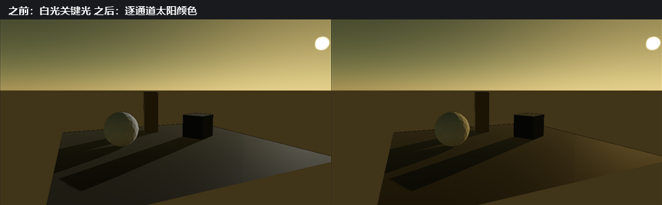

# MyRenderer 文档撰写规范

本文档是 `docs/` 与 `docs/images/README.md` 的写作标准。它的读者是**后续写文档的人（或 AI Coding 会话）**，不是渲染器使用者。写新文档或审阅既有文档前先读这一页；`docs/reference-path-tracer.md` 是最完整的既有范例。

## 1. 语言

- **正文以中文为主。** 叙述、结论、取舍、限制、下一步都用中文句子写完整，不要写成英文提纲式短句。
- **专业术语、API、类型、文件、参数、命令、错误码一律保留英文**，并在首次出现时给出中文解释。
  - 保留英文：`Rayleigh/Mie`、`Beer-Lambert`、`Split-Sum IBL`、`Henyey-Greenstein`、`Worley noise`、`TAA`、`SAH`、`BLAS/TLAS`、`RenderPassContext`、`uLightColor`、`Seed`、`AOV`。
  - 需要解释：首次出现写成「Kasten-Young 相对大气质量（relative air mass）」这种「英文术语 + 中文说明」，之后可只用英文。
- **不要中英混排成半句。** 例如写「该 pass 只写 staging image」，不要写「the pass writes staging image 到内存」。
- 章节标题用中文加英文术语，例如 `## Aerial Perspective：相机到场景的积分`、`## 验证`。

## 2. 文档骨架

每一篇阶段文档按下面的顺序组织；不需要的小节可以省略，但顺序不变。

| 小节 | 内容 | 必须 |
| --- | --- | --- |
| 一级标题 | `# 阶段号 + 中文主题`，例如 `# SR-P2C Stylized 收口` | 是 |
| 元信息块 | 日期、源码 revision、构建目录、GPU/驱动/OpenGL 版本 | 是 |
| 目标与范围 | 这一阶段要解决什么、明确不做什么 | 是 |
| 实现 | 按数据流顺序写：持久化 → 运行时 → 渲染 → UI → 诊断 | 是 |
| 截图 | 见第 3 节 | 是 |
| 验证 | 具体测试名、指标、退出码，以及**已知失败或未验证项** | 是 |
| 限制与取舍 | 被有意接受的近似、被推迟的部分 | 是 |
| 复现命令 | 可直接粘贴的 PowerShell | 是 |
| 下一步 | 指向路线图里的具体条目 | 否 |

写作规则：

- **一篇文档一个阶段。** 不要把所有历史塞进一篇；跨阶段总览放 `todolist.md`。
- **只写已经发生的事。** 未实现的能力写在「限制」或「下一步」，不写成既成事实。
- **结论要给数字。** 不写「性能更好」，写「64 灯下 Deferred GPU P50 相对 Forward 约 `1.73×`」。
- **失败与限制必须留痕。** 记录未解释的漂移、无法验证的环境限制、被推迟的验收口，不要为了好看删掉。
- **命令里的路径用仓库相对路径**（`build-ci-msvc/...`），不要写某台机器的绝对路径。

## 3. 截图规范

**每篇阶段文档至少配一张图，并写清「这张图证明了什么」。** 只有文字没有图的阶段文档视为未完成。

### 3.1 两类图片，不要混用

| 类别 | 位置 | 规则 |
| --- | --- | --- |
| **回归基线（baseline）** | `docs/images/`、`docs/reference-images/`、`docs/performance/` | 被 CTest / visual-regression 目标逐像素比对。**只能在明确批准的基线更新中改写**，并且必须同步 `docs/images/README.md` 清单与 `docs/regression-baseline-audit.md`。 |
| **文档插图（illustration）** | `docs/media/` | 只为解释功能、UI 或前后对照而拍，不参与任何自动比对。可以自由重拍，重拍后同步命令即可。 |

不确定该放哪一类时，放 `docs/media/`：**把说明性截图塞进 `docs/images/` 会污染回归基线**。这条规则同时写在 `$myrenderer-visual-regression` 里，改基线前先读那一篇。

### 3.2 插图写法

图片紧跟在它所证明的段落后面，一句中文图注 + 复现命令：

```markdown
大气启用后关键光携带逐通道颜色，场景从白光照亮变为与天空一致的暖金光。



复现：`MYRENDERER_SUN_ELEVATION=10 MYRENDERER_SUN_AZIMUTH=120
MYRENDERER_SCREENSHOT=build-ci-msvc/p1a-keylight-after-golden.png
build-ci-msvc/Release/MyRenderer.exe assets/scenes/18_atmosphere_sky.myscene`
```

规则：

- **图注用中文，写结论不写文件名。** 「GPU Pass 时间分布」而不是「screenshot 3」。
- **前后对照合成一张图**（before / after、On / Off、Low / High）优于贴两张独立图；贴多图时用一致的机位、分辨率与曝光。
- **UI 截图必须说明状态**：哪个标签页、哪个分组、是否处于禁用态、窗口尺寸（例如 1440×900 默认工作区与 1100×680 最小窗口）。
- **每张图都要能重拍。** 图注附近必须能查到产生它的 target、环境变量或命令；找不到重拍方式的图不要放进文档。
- `docs/media/` 的文件名用 `阶段号-主题-状态.png`，例如 `p1a-atmosphere-keylight-before-after.png`、`c1c-log-profile.png`。

### 3.3 图注与清单

`docs/images/README.md` 是回归基线的唯一清单。新增或改写基线图时：

1. 在 `docs/images/` 放图；
2. 在 `docs/images/README.md` 增加一条中文条目：文件名 + 机位/参数 + 这张图证明什么；
3. 如果因此改动了既有基线，在 `docs/regression-baseline-audit.md` 记录原因与旧/新差异。

`docs/media/` 不要求逐条清单，但文件所在文档必须能重拍它。

## 4. 与代码和路线图的联动

- 文档提到的 target、`.myscene`、环境变量、类型名必须真实存在；改名时同步文档。
- **每个阶段的完成条件包含文档**：实现 + 测试 + 性能/画质数字 + 截图 + 限制说明，缺一不算完成（见 `todolist.md` 第 8 节）。
- 路线图条目与文档互相引用：`todolist.md` 指向文档，文档末尾「下一步」指向 `todolist.md` 的具体条目。
- 新增文档后在 `todolist.md` 的对应阶段证据里加链接。

### 4.1 其他文档类型

阶段文档不是唯一的文档类型，另外两类有各自的规则：

| 类型 | 位置 | 与阶段文档的差别 |
| --- | --- | --- |
| **调研简报（research brief）** | `docs/research/` | 文献与可行性输入，**不是实施记录**。必须在开头声明这一点，因此**不要求截图与实测数字**；相反，它必须显式标注哪些结论未核实、哪些数字只是公开资料的量级估计。每条建议要标明来源链接，无法核实来源的引用宁可写成「社区流传资料，未核实」。它的下游是 `todolist.md` 里的工作包，而不是「已完成」结论。 |
| **审计记录（audit）** | `docs/` 根目录，例如 `regression-baseline-audit.md` | 记录某一时点的验收矩阵与基线决策。证据以表格与命令为主，可以不带图，但必须写明「本记录的证据是表格与命令，不是图片」以及审计日期、revision 与被接受的基线变更。 |

判断标准很简单：**写「已经发生的事」用阶段文档，写「将要做什么以及依据」用调研简报，写「当时的状态与决定」用审计记录。**

## 5. 审阅清单

提交文档前逐条确认：

- [ ] 正文是中文句子，术语保留英文且首次出现有解释。
- [ ] 元信息块写了日期、构建目录、GPU/驱动。
- [ ] 至少一张截图，图注说明结论，且可重拍。
- [ ] 数字有单位、有对照基线、有测试名。
- [ ] 限制与未验证项已写明，没有把推测写成事实。
- [ ] 复现命令可直接粘贴执行。
- [ ] 文档里的 target / 路径 / 参数名真实存在。
- [ ] 回归基线图没有被无意改写；如改写，清单与审计文档已同步。

## 6. 一致性审计

规范只有被检查才有效。引入或修改规范时，跑一次全目录审计，不要只改手上那一篇：

```powershell
# 每篇文档的中文字符数、插图数、行数；中文字符为 0 的正文文档需要改写
Get-ChildItem docs/*.md | ForEach-Object {
  $c = Get-Content $_.FullName -Raw
  [pscustomobject]@{
    Name = $_.Name
    Han  = ([regex]::Matches($c, '[\u4e00-\u9fff]')).Count
    Imgs = ([regex]::Matches($c, '!\[')).Count
    Lines = (Get-Content $_.FullName | Measure-Object -Line).Lines
  }
} | Sort-Object Han | Format-Table -AutoSize
```

判读方式：

- **中文字符数为 0 或个位数**：正文仍是英文，按本规范改写。
- **中文字符数正常但没有插图**：阶段文档缺截图，补图或显式说明为什么不配图（仅审计记录与调研简报允许）。
- **图表编号与命令对不上**：打开文档核对，规范要求每张图都能重拍。

审计结果与例外（例如被有意保留的英文名词表、外部引用原文）记录在提交说明里，不要只写在会话里。
