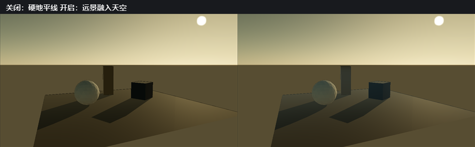

# P1-A 切片 1～2：解析式大气、统一太阳与 Aerial Perspective

- 记录日期：2026-09-20（切片 2 与 `docs/media/` 插图采集于同日）
- 源码 revision：`35a726c`；本切片的核心实现目前只在工作树里（`src/optics/Atmosphere.h` / `.cpp`、`src/pathtracer/SceneLighting.cpp`、`shaders/postprocess.frag` 的 Aerial Perspective 合成，以及 `basic.frag` / `deferred_lighting.frag` 的 `uLightColor` 路径都尚未入库）
- 构建目录：`build-ci-msvc`，Visual Studio 17 2022，Release，`BUILD_TESTING=ON`
- GPU / 驱动 / OpenGL：NVIDIA GeForce RTX 4060 Laptop GPU / NVIDIA 591.44 / OpenGL 3.3.0（与 [`regression-baseline-audit.md`](regression-baseline-audit.md) 记录的审计环境是同一台参考机）

## 目标与范围

Hero Scene 的目标是一张海岸外景：天空读作白昼或读作金时刻，水面反射它，阴影与两者一致。P1-A 按纵向切片交付，本文覆盖切片 1 与切片 2：天空本身与驱动它的唯一太阳（解析式 Rayleigh/Mie 单次散射模型、一个太阳统一方向/能量/颜色、`.myscene` 持久化、Inspector 分组，以及 CPU Path Tracer 使用同一片天空），以及把同一套光学厚度积分器用在相机与场景之间的 Aerial Perspective。

本切片明确不做：3～4 级 CSM、Gerstner 海面与体积云。它们属于 `todolist.md` 里 P1-A 的切片 3～6，状态见本文「下一步」。

## 实现

### 持久化：`RendererSettings::atmosphere` 与 `.myscene` 字段

`RendererSettings::atmosphere` 保存全部大气参数，`.myscene` 持久化它们（原有的太阳和天空七字段、切片 2 的 Aerial Perspective 三字段，以及昼夜序列新增的 `nightSkyEnabled`、`moonIntensity`、`starIntensity`；旧文件缺少字段时取默认值）。Inspector 通过 `EditorCommandType::SetAtmosphereSettings` 编辑大气域设置；海岸序列的月光和星光强度由 Module 参数控件调整。Aerial Perspective 与天空同属一个 domain，因为它就是同一片空气、只是积分区间换成相机到表面；入口层拒绝非有限与越界值，捕获层（`EditorDomain::captureAtmosphereSettings`）按控件范围先做归一化，避免手改 `.myscene` 的越界值锁死整个分组。夜空默认关闭，避免改变旧场景与已有视觉基线；其模型和局限见 [`coastal-sequence.md`](coastal-sequence.md)。

### 运行时：`src/optics/Atmosphere.h` / `.cpp` 是天空的唯一描述

所有消费者求值同一批函数，因此 Raster Skybox、它的 Image-Based Lighting 与（下一个切片）CPU Path Tracer 不可能对「天空是什么」产生分歧：

- `sunDirection(params)`：由仰角与「自 `+Z` 起向 `+X` 度量」的方位角得到的单位向量，方向从场景指向太阳。
- `skyRadiance(direction, params)`：天空的光谱辐亮度（spectral radiance）。
- `sunTransmittance(params)`：直射太阳经过大气消光（atmospheric extinction）后保留的颜色。
- `sunDiskRadiance(direction, params)`、`sunAngularRadiusDegrees()`：被渲染的太阳盘。
- `sunIrradiance(params)`：正对太阳的表面接收的辐照度。
- `skyLightColor(params)`：关键光的光谱，即把 `sunTransmittance` 的亮度除出去后的结果，因此颜色与能量是两个独立的关注点。
- `verticalOpticalDepth(params)`：整根垂直气柱的光学厚度，逐 RGB 通道。它是 Aerial Perspective 的计量单位——水平方向每走过一个 scale height 就累积一整根气柱——实现上就是天顶方向的 `sunTransmittance` 取负对数。
- `opticalDepthAlongSegment(params, length, directionY, worldUnitsPerMetre)`：有限线段的光学厚度，即 Aerial Perspective 的积分器。
- `generateEquirect(params, width, height)`：同一片天空的等距柱状（equirectangular）缓冲。

模型本身是 Rayleigh/Mie 单次散射：气团用 Kasten-Young 相对大气质量（relative air mass），沿视线方向用闭式指数积分 `beta * H * m * (1 - exp(-tau)) / tau`，不做数值步进（numeric march），因此求值足够便宜，可以重建环境立方体贴图。太阳透射率在地面求值，并在整条视线上视为常量；没有多次散射，也没有臭氧层。

参数与其含义：

| 参数 | 范围 | 含义 |
| --- | --- | --- |
| `enabled` | - | 用解析天空替换 HDR 环境。默认关闭。 |
| `sunElevationDegrees` | -10 .. 90 | 太阳在地平线以上的高度角。 |
| `sunAzimuthDegrees` | 0 .. 360 | 太阳方位角，自 `+Z` 向 `+X` 度量。 |
| `turbidity` | 0 .. 10 | 海平面 Mie 系数的倍数。0 是纯 Rayleigh，1 加一层晴朗乡村气溶胶，更大的值把天空压灰。 |
| `skyIntensity` | 0 .. 20 | 同时缩放作为光源与作为可见背景的天空。 |
| `sunIntensity` | 0 .. 8 | 一同缩放关键光与太阳盘。 |
| `groundAlbedo` | 0 .. 1 | 环境贴图下半球反射多少天空。 |
| `aerialPerspectiveEnabled` | - | 让远处几何按同一套系数融入天空。默认关闭，因此从未要求它的场景保持原像素。 |
| `aerialPerspectiveStrength` | 0 .. 4 | 光学厚度的乘数。1 就是模型自己的大气，0 等于关闭。 |
| `aerialPerspectiveScaleHeight` | 0.01 .. 20000 | 密度剖面的 scale height，单位是**世界单位**而非米，这样场景不必知道模型的米制约定。默认 60。 |

### 渲染：统一太阳不变量（the single-sun invariant）

一个太阳驱动四样东西，它们来自同样两个数字，而不是各自单独编辑：

1. Skybox 与 IBL 采样的环境立方体贴图（`EnvironmentMap::useAtmosphere`）。
2. 方向光方向（`Renderer::render` 用 `-sunDirection()` 覆盖 `lightDirection`）。
3. 阴影贴图——它在同一个函数的更下方用同一个光照方向构建。
4. 关键光的能量与光谱：`diffuseStrength` 与 `specularStrength` 乘上 `sunTransmittance()` 的亮度（luminance）与 `sunIntensity`，这让低太阳真的变暗；`uLightColor` 携带 `skyLightColor()`，所以落日既让光线变红、也让它变暗。

`captureSceneLighting()` 为 CPU Path Tracer 推导出同一方向、能量与颜色，因此大气场景的追踪帧与光栅帧由同一个太阳照亮。

因此在 Inspector 里移动太阳会同时移动天空、阴影与着色。大气启用时 Inspector 的 `directionalLight` 分组被旁路，界面会说明这一点。

> **待复核**：`Application.cpp` 里 `Directional light` 分组本身没有随大气启用进入禁用态，禁用态文案 `This sun drives sky, light and shadows` 出现在 `Atmosphere` 分组内；被解析式太阳覆盖的是方向与颜色，`diffuseStrength` / `specularStrength` 仍作为乘数继续生效。此处按原文保留，未擅自改写。

三条着色路径（PBR、非 PBR 与 Stylized）都把直接光项乘上它：`basic.frag` 与 `deferred_lighting.frag` 各有三条直接光路径读取同一个 `uLightColor`；CPU Path Tracer 的方向光携带同一颜色，因此 Raster 预览与追踪预览在太阳光谱上的分歧不会比在太阳方向上的分歧更大。

### 渲染：CPU Path Tracer 用的是同一片天空，而不是碰巧打包进来的文件

`captureSceneLighting()` 过去无论光栅路径正在显示什么，都把被追踪的环境指向打包的 Kloofendal EXR，于是外景的 CPU 预览或 Batch 帧会被一片无关的天空照亮。现在大气启用时它从同一批参数求值 `atmosphere::generateEquirect()`：同一个模型、同一个下半球地面、同一个太阳盘，`skyIntensity` 也已经折算进辐亮度。`environmentIntensity` 仍是它在光栅路径上的独立乘数，因为光栅采样的立方体贴图携带的是同一份内容。

有两个细节值得记下：

- 贴图是 1024x512。64x32 时 1.2 deg 的盘落在像素中心之间、会完全消失（`generateEquirect` 对粗网格专门有告警，模型测试也在能真正分辨该盘的分辨率上做了断言）；1024x512 让它落在几个 texel 上，代价是几十毫秒，而不是立方体贴图重建那样的几百毫秒。
- 它在参数变化时生成，而不是每次捕获都生成。GUI 每一批渐进 tile 捕获一次快照，Batch 序列每帧捕获一次，因此 `captureSceneLighting` 保留一份互斥锁保护的缓存，键是 `atmosphere::parametersMatch`——与渲染器环境重建使用的同一套容差，这也是该比较放在模型层而不是 `Renderer` 里的原因。

`18_atmosphere_sky.myscene` 在 `256x256 / 512 SPP / Depth 8 / Seed 20260915` 下测得的 Raster 与 Path Traced 一致性是 MAE `0.061105`、RMSE `0.096592`、PSNR `20.30 dB`、超过 8/255 的像素占 `54.7%`（对照合同见 [`docs/reference-path-tracer.md`](reference-path-tracer.md)）。这是整套场景里跨算法一致性最好的一次——HDRI 场景是 MAE `0.0956`，灯光场景 `0.0680`，体积场景 `0.1343`——三联图里天空梯度、地平线与地面着色都对得上，剩余差异集中在太阳盘及其反射。

```powershell
$env:MYRENDERER_REFERENCE_COMPARE_DIR='build-ci-msvc/p1a-atmosphere-comparison'
$env:MYRENDERER_REFERENCE_SPP='512'; $env:MYRENDERER_REFERENCE_MAX_DEPTH='8'
$env:MYRENDERER_RENDER_WIDTH='256'; $env:MYRENDERER_RENDER_HEIGHT='256'
$env:MYRENDERER_SUN_ELEVATION='8'; $env:MYRENDERER_SUN_AZIMUTH='120'
build-ci-msvc/Release/MyRenderer.exe assets/scenes/18_atmosphere_sky.myscene
```

### 渲染：系数对光谱做了什么，是记录下来的而不是假设的

`Atmosphere.cpp` 里的海平面 Rayleigh 系数故意远高于物理值（每米 `5.8e-6 / 13.5e-6 / 33.1e-6`，而真实光学厚度大致在 `5.8e-9` 量级）。模型没有数值步进，所以它靠「每米散射更多」换来看起来是蓝色的天空，而这个选择有一个值得写下来的后果：在天顶，蓝通道也只透过 `0.75`，因此高太阳是暖的近白色（90 deg 时 `1.0, 0.94, 0.80`），而不是按物理系数缩放会得到的近乎中性的白。蓝色透射率随太阳升高单调回升，并在地平线处塌陷（2 deg 时 `1.0, 0.30, 0.014`），这正是 `atmosphere-model` 测试锁定的方向。要复现光谱上真正白色的正午，就得把大气重新缩放到物理系数，而那是改变天空已发布外观的改动，不属于本切片。

### 渲染：太阳盘为什么这么亮

这里的 RGB 值不是光度学量，所以绝对尺度是自由参数。它锚定在渲染中唯一可观测的比值上：晴天地面照度比（illuminance ratio）`E_sun / E_sky` 约为 10。太阳盘张开的立体角约 3.4e-4 sr，于是 `sunDiskRadianceScale` 取 4.6e3，对应天空辐亮度约 0.1。

这件事的意义不止于观感。环境贴图的下半球是 `groundAlbedo` 的 Lambertian 地面反射的辐亮度 `albedo/pi * (E_sky + E_sun)`。如果那里只有一个象征性的太阳，环境的地面会比关键光真正照亮的地面暗一个数量级，表现为每一帧只要看到地面几何之外，地平线下方就有一条生硬的黑带。采用上面的比值后，背景与受光地面几乎无缝衔接。

### 渲染：采样上，辐照度 pass 有意排除太阳盘

太阳盘占半球的 5e-5，而辐照度立方体贴图每个 texel 积分 128 个均匀余弦样本。把盘算进去意味着一个 texel 要么完全错过它，要么采到一个满亮度的 4.6e3 样本；而且会重复计算太阳，因为解析关键光已经提供了直接项。因此 `EnvironmentMap::build` 接受一个单独的 `diffuseRadiance` lambda：辐照度 pass 拿到不含盘的天空，辐亮度与预滤波高光 pass 拿到天空加盘。预滤波贴图**应该**保留太阳——那正是反射里的太阳高光。

### 渲染：Aerial Perspective 复用同一套系数，而不是另写一份大气

Aerial Perspective 与天空共用系数、共用气团约定，唯一区别是积分区间：天空积到大气顶，Aerial Perspective 积到相机与表面之间。
`opticalDepthAlongSegment()` 沿指数剖面 `rho(y) = exp(-(y-y0)/H)` 积分，得到
`beta * H * airMass * (1 - exp(-heightDelta / H))`：水平射线每走过一个 scale height 就累积一整根气柱，向上的射线最多饱和到整根气柱（与 `sunTransmittance` 用的是同一根），零长线段完全透明，任何输入都不会产生 NaN。`worldUnitsPerMetre` 把场景自己的单位换算成模型的米，因此一个把一米当作一个单位、和另一个把一公里当作一个单位的场景，对同一段物理距离会得到同一光学厚度。

合成位置在 `postprocess.frag`，不是材质着色器，理由有三条：

1. 它已经有深度缓冲与 `uInverseCurrentViewProjection`，可以重建相机到表面的线段，不需要新增 render target，也不需要每个材质着色器各抄一份。
2. 透明物体会复用它们背后的 opaque 深度，所以透明面也会一起淡出，而不是像放在材质阶段那样被跳过。
3. 它不是逐材质的效果，放在合成阶段天然只写一处。

着色器侧的参数是 `uAerialColumnDepth`（整根垂直气柱的逐通道光学厚度）、`uAerialScaleHeight`、`uAerialStrength`、`uAerialZenithColor` 与 `uAerialHorizonColor`。它用的近似值得写清楚：**in-scatter 直接取天空本身**，按视线仰角在天顶色与地平线色之间插值，而不是对散射项做第二次体积积分。这不是物理推导，但它保证了两件事——射线走到无穷远时结果精确收敛到天空（`mix(surface, sky, 1 - T)`，`T` 由同一模型给出），以及近处几何不受影响（`T → 1`，混合权重为 0）。

合成顺序是 **Height Fog → Aerial Perspective → exposure/ACES/sRGB → LUT/Dither/Outline**。空气在风格化雾之前，因为雾是一种观感、而 Aerial Perspective 是场景所站的大气。

关键的一点是它用的是**不含太阳盘**的天空：太阳盘辐亮度是 4.6e3，把它涂抹到整个远景上会毁掉这个效果；地平线采样取 2 deg 仰角，因此淡出的是光栅真正画在天际线上的那片天空，日落的暖色也能保住。

### UI：Inspector 的 `Atmosphere` 分组

Inspector 的 `Atmosphere` 分组按上面的范围暴露 `Analytic Rayleigh/Mie sky` 开关与全部参数，编辑后提交一条 `EditorCommandType::SetAtmosphereSettings`；分组默认随天空一起展开，禁用态下写明这个太阳同时驱动天空、光照与阴影。Aerial Perspective 是同一分组下独立的 `Aerial perspective` 子节（开关、`Air strength`、`Scale height`），它在天空未启用时整体禁用并给出说明文案，因为空气模型来自天空。

### 诊断：重建成本与门限

重建环境是唯一昂贵的部分：辐亮度立方体贴图是 6 x 512^2 次求值，辐照度 pass 是 6 x 16^2 x 128，预滤波 mip 是 6 x 5461 x 96。参考机器上实测 570-660 ms，每次重建都打印到控制台并在 Inspector 里显示。有两件事让拖动时感觉不到它：

- 重建由键比较（`atmosphereKeyMatches`）门控：太阳移动 0.35 deg，或任一其他参数变化 0.01。低于这个量就复用已渲染的天空，因此光照不会以肉眼可见的程度滞后于显示的天空。
- 下半球地面是一个与视角无关的值，每次重建只解算一次，而不是每个样本重算。按样本做要付出数百万样本各 9 次散射求值，会把 600 ms 的重建变成 4.3 s。

## 截图

### Aerial Perspective 的 On/Off 对照

同一机位、同一 960x540 分辨率、同一金时刻参数（sun elevation 14 / azimuth 128 / turbidity 1.4 / sky intensity 3.0）下，关闭时地面一直铺到地平线、远景与近景反差相同；开启后远处地面与柱子失去对比度、向天空色靠拢，天空与地面在地平线处不再硬碰硬。scale height 取 12 世界单位，是为了在这个只有约 17 单位进深的夹具里让效果可见；`assets/scenes/18_atmosphere_sky.myscene` 里写的是 8。



两栏的重拍命令：

```powershell
$env:MYRENDERER_SMOKE_TEST='1'; $env:MYRENDERER_RENDER_WIDTH='960'; $env:MYRENDERER_RENDER_HEIGHT='540'
$env:MYRENDERER_SUN_ELEVATION='14'; $env:MYRENDERER_SUN_AZIMUTH='128'
$env:MYRENDERER_SKY_TURBIDITY='1.4'; $env:MYRENDERER_SKY_INTENSITY='3.0'

$env:MYRENDERER_AERIAL_PERSPECTIVE='0'
$env:MYRENDERER_SCREENSHOT='build-ci-msvc/p1a-aerial-before.png'
build-ci-msvc/Release/MyRenderer.exe assets/scenes/18_atmosphere_sky.myscene

$env:MYRENDERER_AERIAL_PERSPECTIVE='1'; $env:MYRENDERER_AERIAL_SCALE_HEIGHT='12'
$env:MYRENDERER_SCREENSHOT='build-ci-msvc/p1a-aerial-after.png'
build-ci-msvc/Release/MyRenderer.exe assets/scenes/18_atmosphere_sky.myscene
```

两张 960x540 截图用 `System.Drawing` 并排合成后写入 `docs/media/p1a-aerial-perspective-on-off.png`（中文标注用 `Microsoft YaHei`）。这两栏都能从当前代码直接重拍，与下面那张关键光对照不同。

### 关键光颜色的金时刻对照

大气启用后关键光携带逐通道颜色：同一机位、同一 960x540 分辨率、同一金时刻参数（sun elevation 10 / azimuth 120 / turbidity 0.8 / sky intensity 2.4）下，左栏是白光关键光、右栏是逐通道太阳颜色；地面、球体与柱体从被白光照亮变为与天空一致的暖金色，阴影方向不变。


右栏（当前版本）的重拍命令：

```powershell
$env:MYRENDERER_SMOKE_TEST='1'; $env:MYRENDERER_RENDER_WIDTH='960'; $env:MYRENDERER_RENDER_HEIGHT='540'
$env:MYRENDERER_SUN_ELEVATION='10'; $env:MYRENDERER_SUN_AZIMUTH='120'
$env:MYRENDERER_SKY_TURBIDITY='0.8'; $env:MYRENDERER_SKY_INTENSITY='2.4'
$env:MYRENDERER_SCREENSHOT='build-ci-msvc/p1a-keylight-after-golden.png'
build-ci-msvc/Release/MyRenderer.exe assets/scenes/18_atmosphere_sky.myscene
```

左栏来自接入 `uLightColor` 之前的工作树状态，该状态未入库（仓库里只保留了 `build-ci-msvc/p1a-keylight-before-golden.png` 这张截图）。要重拍左栏，需要临时把 `Renderer::render` 里的 `lightColor` 退回 `glm::vec3(1.0f)` 后按同一组环境变量再拍一张；注意 `MYRENDERER_ATMOSPHERE='0'` 不能替代这一步，那会换成打包的 HDR 环境、天空也跟着变。两张 960x540 截图用 `System.Drawing` 并排合成后写入 `docs/media/p1a-atmosphere-keylight-before-after.png`（中文标注用 `Microsoft YaHei`）。

CPU Path Tracer 与 Raster 的三方对照是「同一片天空」的交叉验证：从左到右依次是 Raster、Path Traced 与 Difference，天空梯度、地平线与地面阴影位置重合，剩余差异集中在太阳盘与地面上的 firefly。该产物只写入构建目录、不入库，因此本文给出路径与复现命令而不内嵌图片。

路径：`build-ci-msvc/p1a-atmosphere-comparison/triptych.png`（同目录还有 `raster.png`、`path-traced.png`、`difference-raw.png`、`difference.png` 与 `comparison.json`）。

```powershell
$env:MYRENDERER_REFERENCE_COMPARE_DIR='build-ci-msvc/p1a-atmosphere-comparison'
$env:MYRENDERER_REFERENCE_SPP='512'; $env:MYRENDERER_REFERENCE_MAX_DEPTH='8'
$env:MYRENDERER_RENDER_WIDTH='256'; $env:MYRENDERER_RENDER_HEIGHT='256'
$env:MYRENDERER_SUN_ELEVATION='8'; $env:MYRENDERER_SUN_AZIMUTH='120'
build-ci-msvc/Release/MyRenderer.exe assets/scenes/18_atmosphere_sky.myscene
```

## 验证

- `atmosphere-model`（CTest）覆盖：跨太阳仰角、视线方向与退化输入的有限性与非负性；蓝色天顶；低太阳偏红；透射率单调性；关键光颜色的归一化、暖色排序与大气关闭时的中性值；太阳盘的主导性与包含关系；太阳/天空辐照度比值；地面反射直射太阳；方位角旋转对称；确定性；以及在 1.2 deg 盘真正被分辨的分辨率下的等距柱状朝向。Aerial Perspective 的积分器另有覆盖：零长与负长线段透明、更长的线段累积更多光学厚度、水平线段有限且非零、逃逸的向上线段饱和在整根气柱上（与 `verticalOpticalDepth()` 的一致性用 1% 容差断言，残差只允许来自 Kasten-Young 在 0 deg 给出 0.99971 而非 1 这一气团约定）、气柱与太阳位置无关、turbidity 加厚气柱而 `skyIntensity` 不影响它、世界单位换算、以及 1e9 长度与 1e-9 垂直分量这类极端输入仍然有限。
- `editor-session` 覆盖 `SetAtmosphereSettings` 载荷往返（含三个 Aerial Perspective 字段）。
- `scene-document-repeat-load` 覆盖 `.myscene` 持久化，以及旧文件取默认值。
- `gpu-smoke` 在太阳仰角 8 下用 Forward 与 Hybrid Deferred 两条路径渲染 `18_atmosphere_sky.myscene`，因此 `uLightColor` 必须在两个着色器里都能编译链接，而不是只在模型测试里成立；夹具现在启用了 Aerial Perspective，另外两条 smoke 命令专门跑 `MYRENDERER_AERIAL_PERSPECTIVE=0` 与放大后的 `=1`（strength 3 / scale height 2），覆盖合成器里的两条 uniform 分支。
- `stylized-acceptance` 与 `path-tracing-regression` 保持各自的固定输出：大气关闭时关键光颜色恒为白色，所以没有任何固定图移动。本切片的渲染证据是金时刻对照 `p1a-keylight-before-golden.png` / `p1a-keylight-after-golden.png`，用 `MYRENDERER_SUN_ELEVATION=10 MYRENDERER_SUN_AZIMUTH=120 MYRENDERER_SKY_TURBIDITY=0.8 MYRENDERER_SKY_INTENSITY=2.4` 在 960x540 下采集。
- Raster 与 Path Traced 的天空一致性不是新的固定 target。它用现有的 `MYRENDERER_REFERENCE_COMPARE_DIR` 路径在 `18_atmosphere_sky.myscene` 上测量，只把 raster、path-traced、difference、triptych 四张图和 `comparison.json` 写进构建目录。
- 同一个对照在 Aerial Perspective 开启后是 MAE `0.072188`、changed `67.97%`（`256x256 / 256 SPP / Depth 8 / Seed 20260915`，sun elevation 14 / azimuth 128 / turbidity 1.4）。比关闭时的 `0.061105` 差一点，原因明确：CPU Path Tracer 不做空中透视，所以远景色调在两条路径上本来就不该一致。这个数字的作用是量化「只作用于 Raster 的近似」的代价，而不是判定回归——关闭 AP 后数值回到 `0.061105`。

## 限制与取舍

- **只有单次散射。** 没有多次散射，也没有臭氧层，因此暮光时天顶比现实更暗，深蓝的暮光带缺失。
- **没有 anti-solar darkening。** 真实晴空最暗的部分是背对太阳的地平线，单次散射模型不产生它；测试改为断言它**确实**保证的向阳侧增亮。
- **沿视线方向太阳透射率恒定。** 这是实用天空模型的标准做法，也是在没有数值步进的前提下让天顶保持蓝、日落保持红的原因。
- **被追踪的太阳是环境贴图的一个 texel，不是 delta light。** 等距柱状贴图用大约两个 texel 表示 1.2 deg 的盘，所以追踪出的太阳盘比 Raster 的解析盘更粗，对它做重要性采样会在低 SPP 下产生 firefly。这是采样限制，不是辐亮度分歧：它随 SPP 上升而下降，已有的可选 firefly clamp 覆盖交互预览。在 CPU Path Tracer 里给太阳一个独立的解析光是另一项改动。
- **关键光的光谱即使在高太阳下也偏暖。** 它是 `sunTransmittance` 归一化到最亮通道的结果，因此继承了上面那组调过的系数。光永远不会变蓝；测试持有的合同是蓝色透射率随太阳升高单调回升，以及光的颜色与同帧绘制的太阳盘一致。
- **高粗糙度高光会出现斑点。** 预滤波 mip 对 96 个方向做重要性采样，一个 4.6e3 的盘落进宽波瓣里就是高方差估计。镜面反射正确且稳定，中等粗糙度会有噪声。
- **下半球是 Lambertian 地面，不是真实表面。** 它没有阴影、没有视角依赖，所以它是合理的背景与合理的 IBL 反弹，而不是几何。
- **Aerial Perspective 的 in-scatter 取的是天空本身，不是散射积分。** 按视线仰角在天顶色与地平线色之间插值，是对真实单次散射项的近似：它没有考虑沿途太阳高度角的变化（`skyRadiance` 是在地表求值的），也没有考虑云层（切片 6 落地后需要一并处理）。它精确保证的是两个端点——无穷远处收敛到天空、零距离处不改变像素。
- **Aerial Perspective 只在 Raster 合成阶段实现。** CPU Path Tracer 目前不做空中透视，所以同机位对照里远景的差异会比近景大；把它接入路径追踪器的相机射线是后续工作。
- **Aerial Perspective 的 scale height 是场景量，不是物理量。** 默认 60 世界单位对夹具那种约 17 单位进深的场景几乎没有可见效果，必须按场景调整；本文给出的 12 与夹具里的 8 都是为该夹具选择的，不是一个通用推荐值。
- **金时刻对照图的左栏不可从当前代码直接复现**：它取自接入 `uLightColor` 之前的工作树状态，该状态未入库，重拍方法见「截图」。
- **三方对照（triptych）只写入构建目录、不入库**，所以本文只给路径与命令；`docs/images/` 与 `docs/reference-images/` 中的回归基线没有被本切片改写。
- 重建耗时 570-660 ms 只在 `build-ci-msvc` 那一台参考机上实测，本文没有跨机器证据。

## 复现命令

`assets/scenes/18_atmosphere_sky.myscene` 是外景夹具：一块开阔地面、一个球体、一个立方体、一根柱子，大气启用。太阳、turbidity 与强度可以在命令行上覆盖：

```powershell
# 正午固定截图
$env:MYRENDERER_SMOKE_TEST='1'; $env:MYRENDERER_RENDER_WIDTH='960'; $env:MYRENDERER_RENDER_HEIGHT='540'
$env:MYRENDERER_SCREENSHOT='build-ci-msvc/p1a-sky-noon.png'
$env:MYRENDERER_SUN_ELEVATION='52'; $env:MYRENDERER_SKY_TURBIDITY='0.6'; $env:MYRENDERER_SKY_INTENSITY='2.4'
build-ci-msvc/Release/MyRenderer.exe assets/scenes/18_atmosphere_sky.myscene

# Raster / Path Traced 对照：triptych、difference 与 comparison.json
$env:MYRENDERER_REFERENCE_COMPARE_DIR='build-ci-msvc/p1a-atmosphere-comparison'
$env:MYRENDERER_REFERENCE_SPP='512'; $env:MYRENDERER_REFERENCE_MAX_DEPTH='8'
$env:MYRENDERER_RENDER_WIDTH='256'; $env:MYRENDERER_RENDER_HEIGHT='256'
$env:MYRENDERER_SUN_ELEVATION='8'; $env:MYRENDERER_SUN_AZIMUTH='120'
build-ci-msvc/Release/MyRenderer.exe assets/scenes/18_atmosphere_sky.myscene
```

可用的覆盖项是 `MYRENDERER_SUN_ELEVATION`、`MYRENDERER_SUN_AZIMUTH`、`MYRENDERER_SKY_TURBIDITY`、`MYRENDERER_SKY_INTENSITY`、`MYRENDERER_ENVIRONMENT_INTENSITY`、`MYRENDERER_ATMOSPHERE`，以及切片 2 的 `MYRENDERER_AERIAL_PERSPECTIVE`、`MYRENDERER_AERIAL_STRENGTH`、`MYRENDERER_AERIAL_SCALE_HEIGHT`。它们在场景加载**之后**应用，因为打开场景会整体替换 `RendererSettings`。

要拍折叠线以下的 Inspector 分区，配合 `MYRENDERER_EDITOR_SCREENSHOT_TAB` 使用 `MYRENDERER_EDITOR_SCREENSHOT_SCROLL=<pixels>`。

## 下一步

1. 3～4 级级联阴影贴图（cascaded shadow maps）已在 `P1-A` 切片 3 完成，包含海岸夹具、调试视图与 GPU 计时，见 [`shadow-cascades.md`](shadow-cascades.md)。
2. 体积云：ray march、时间累积与深度引导升采样都不需要 compute shader，因此已按调研结论提到 P1-A 切片 6，工作包见 `todolist.md`；云的 raymarch 要复用本文这套消光，所以排在 Aerial Perspective 之后。
3. 用投影网格（projected grid）实现 Gerstner 海面，加上泡沫、白冠、水下雾与 TAA 安全的运动矢量。对应 `P1-A` 切片 4。
4. Calm / Windy / Storm 预设，把太阳/雾/风暴露为 Module 参数，并在 Low 与 High 两档 GPU 预算下输出 Render Job 帧序列。对应 `P1-A` 切片 5。
