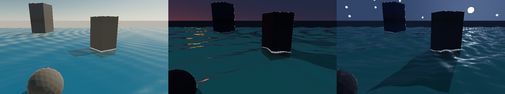

# P1-A 切片 5：C++ Module 驱动昼夜与海况序列

> 状态：栅格 Render Job 的固定昼夜序列已实现；CPU Path Tracer 的水面仍不在本阶段范围内。

- 记录日期：2026-09-24；源码基点 `e8a953b` 加本轮工作区改动
- 构建目录：`build-ci-msvc`，Visual Studio 17 2022，Release，`BUILD_TESTING=ON`
- GPU / 驱动 / OpenGL：NVIDIA GeForce RTX 4060 Laptop GPU / NVIDIA 591.44 / OpenGL 3.3.0

## 目标与范围

让同一海岸场景按固定帧率从正午平静海面过渡到日落风浪和有月光、星空的夜间。`myrenderer.core.coastal-sequence` 是 C++ Module（模块）：它从帧号和参数计算太阳方位、空气雾强度、风向、波幅、波速、水面时间及相机轨迹。编辑器预览和 Render Job 使用同一个模块实现；原始 `.myscene` 不被动画覆盖。

## 实现

### Render Job 与参数

`assets/renderjobs/04_coastal_sequence.renderjob` 固定使用 `20_ocean_synthesis.myscene`，输出 `640×360`、`0..12` 共 `13` 帧的 Beauty PNG。模块在 `ParameterRegistry` 中声明起止太阳仰角/方位角、月光与星光强度、雾强度、二维风向、波幅/波速以及相机 yaw/距离；Inspector 从同一参数表生成控件。时间插值采用 `t²(3−2t)`，波浪采样时间严格取 `(frame-start)/fps`。重复跳转到同一帧得到相同参数，关闭模块后编辑场景的相机和渲染设置保持原值。

### 渲染与批量输出

`ModuleRuntime::applyPresentation` 从作者态计算每帧 Camera 与 RendererSettings。编辑器栅格视口只向渲染调用传入这些临时设置；`MyRenderer raster-sequence` 在隐藏 OpenGL 窗口中加载同一 `.myscene`，逐帧执行 Module 并原子写入 PNG。太阳低于地平线时，模块降低解析天空的太阳能量；蓝色暮光底色从太阳仰角 `+10°` 过渡到 `−8°`，星点与月盘从 `−2°` 至 `−8°` 平滑出现。确定性星点、蓝色夜空底光及月盘写入共享环境，月光方向光与阴影接替太阳，海面散射、泡沫与镜面反射保持夜间层次。栅格与 CPU Path Tracer 共享天空辐亮度和月光方向；CPU 路径仍没有水面求交。普通场景的夜空开关默认关闭，`.myscene` 新字段有兼容默认值，参数变化会失效环境缓存。

CPU Render Job 同样能读取模块产生的相机、天空和雾参数；其 CPU Path Tracer 尚无海面求交和水体材质，因此本阶段的完整海况序列由栅格 Render Job 输出。栅格任务目前限定 Beauty PNG，并拒绝尚无输出 Manifest 校验的 Resume 与 Simulation Cache，以免把旧文件误认为本次结果。

## 截图

下图依次为 `frame_0000` 正午、`frame_0009` 日落、`frame_0012` 月夜；同一 `640×360` 场景与曝光下，太阳色温、月盘与星点、海面波形和相机构图随帧变化。原始图由 `coastal-sequence-acceptance` 生成于 `build-ci-msvc/coastal-sequence-acceptance/first/`。



复现：`cmake --build build-ci-msvc --config Release --target coastal-sequence-acceptance`。该 target 两次运行同一任务，再逐帧比对 PNG 的 SHA-256。

## 验证

`module-runtime` 检查首尾太阳仰角 `48°→−8°`、月光/星空启用、波幅 `0.08→0.34`、雾强度 `0.35→1.1`、相机 yaw `−8°→4°`，并确认 Reset 后可重现同一帧、作者态不变。`atmosphere-model` 检查夜空关闭时旧场景的行为、月亮升起、星点分布与缓存失效；`scene-document-repeat-load` 检查夜空参数往返保存。`coastal-sequence-acceptance` 两次各生成 `13` 张 `640×360` PNG；正午、日落、夜间哈希互不相同，两个运行对应帧的哈希全部一致，并测量夜帧顶部天空、海面平均亮度及亮星/月盘像素。最终夜帧读数：天空 `79.47/255`、海面 `50.28/255`、亮像素 `902`，均高于全黑保护阈值。

MSVC Release 全量 CTest `20/20` 通过；新增 Render Job 边界用例修正后，`render-job-runtime` 与 `module-runtime` 再次通过。MinGW Debug 全构建、`gpu-smoke` 和既有 `water-synthesis-acceptance` 均通过。隐藏编辑器以 `MYRENDERER_MODULE=myrenderer.core.coastal-sequence`、`MYRENDERER_TIMELINE_FRAME=240` 输出夜间预览，日志显示太阳仰角 `−8°`，截图位于 `build-ci-msvc/coastal-editor-preview-night.png`。

## 限制与取舍

月亮相对太阳使用固定演示轨道；星点来自方向哈希，均不是基于经纬度、日历、月相和恒星星表的天文模拟。云层仍待切片 6。栅格 Render Job 目前由 `MyRenderer raster-sequence` 执行，`MyRendererBatch render-sequence` 和编辑器 Render Queue 仍只执行 CPU 任务；栅格路径只输出 Beauty PNG，暂不复用 CPU Batch 的 AOV、Resume、Simulation Cache 和逐帧 Report。海面仍是 Gerstner Wave Synthesis，不是流体模拟。

## 复现命令

```powershell
cmake --build build-ci-msvc --config Release --target coastal-sequence-acceptance
build-ci-msvc/Release/MyRenderer.exe raster-sequence assets/renderjobs/04_coastal_sequence.renderjob --output 'build-ci-msvc/coastal-manual/frame_{frame:04}'
```

第二条命令使用独立的空目录，已有同名输出会被拒绝覆盖。

## 下一步

按 [`todolist.md`](../todolist.md) 的 P1-A 切片 6 加入体积云，并继续扩展栅格 Render Job 的输出 Manifest 与恢复能力。
