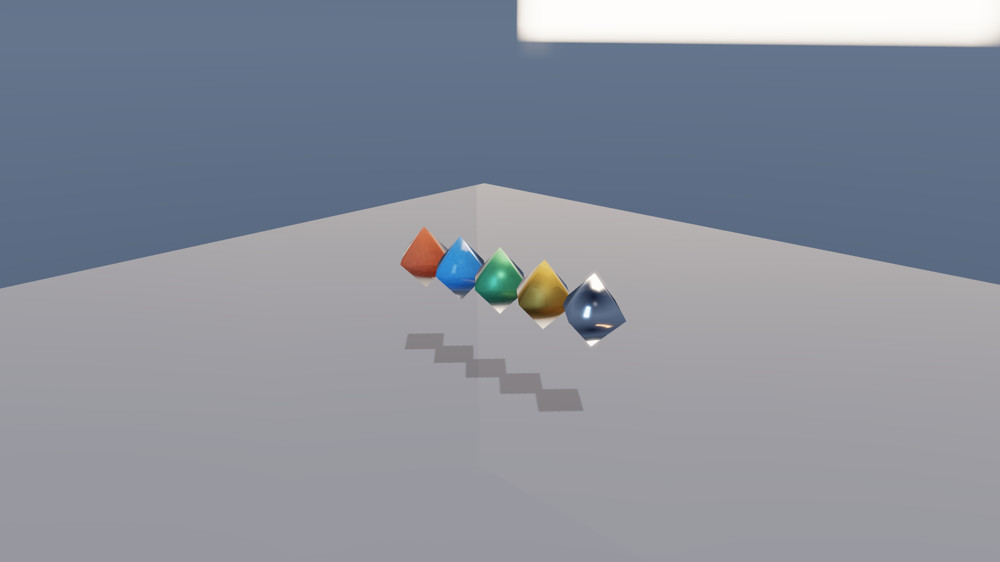
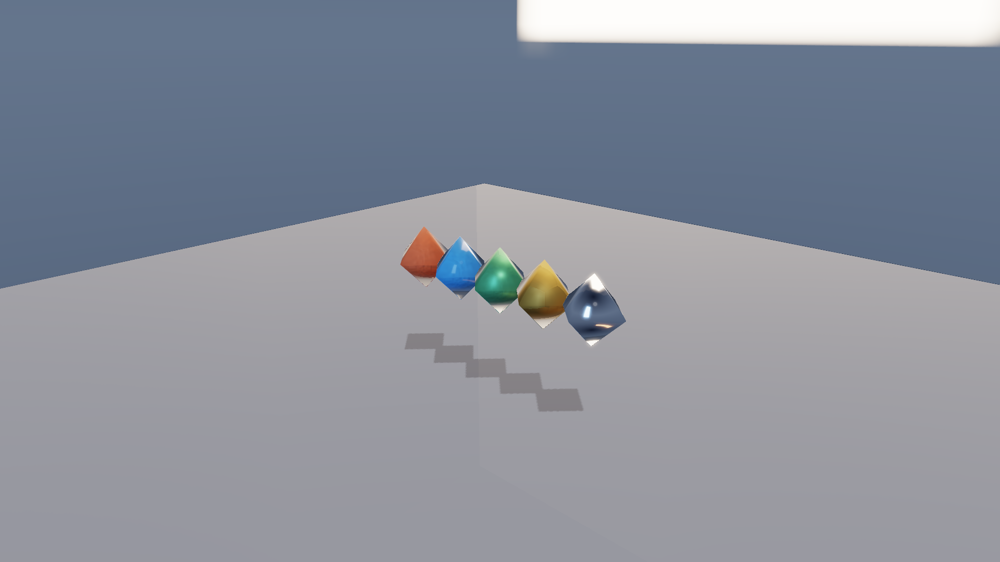
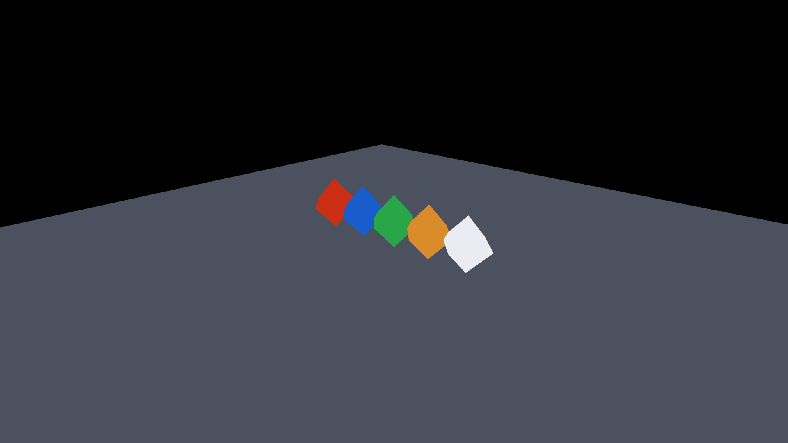
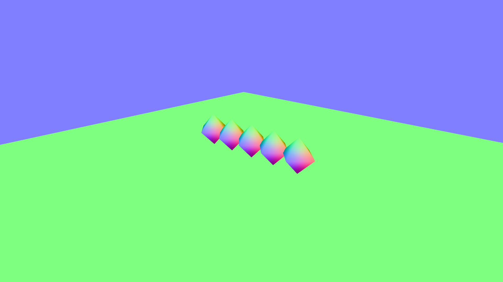
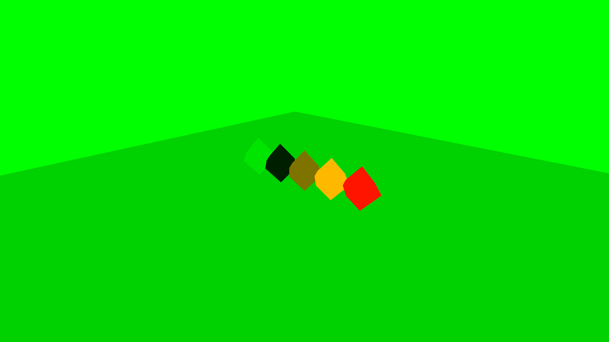
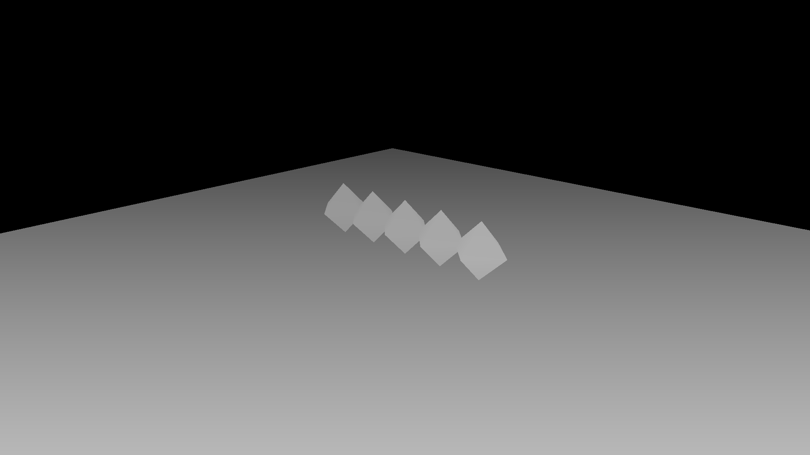

# GP-P1A：Hybrid Deferred Shading 基线

完成日期：2026-08-25

本阶段为 MyRenderer 增加一条可在运行时切换的 Deferred Shading 路径，同时保留原有 Forward 路径作为同机、同场景、同镜头的画质与性能对照。实现采用 **Hybrid Deferred**：不透明物体进入 G-Buffer 和全屏 Lighting Pass；需要排序、折射和体积吸收的透明/玻璃材质继续进入现有 Forward Transparent Pass。

## Pass 顺序

```text
Shadow map / Transmission shadow / Caustics
                    |
                    v
        G-buffer geometry (opaque MRT)
                    |
          resolve color + depth
                    |
                    v
 Deferred lighting (depth reconstruction + PBR/IBL)
                    |
       Opaque HDR + generated mip chain
                    |
                    v
 Forward transparent / refractive scene
                    |
                    v
             Bloom + tone map
```

Forward 模式不分解 Geometry/Lighting，仍由原来的 `Forward opaque HDR scene` 一次完成不透明着色。两条路径后续共用透明折射与后处理，因此 Glass-4 的双界面折射、色散和焦散能力得以保留。

## G-Buffer 布局

| Attachment | OpenGL 格式 | 内容 | 每像素 |
| --- | --- | --- | ---: |
| Albedo | `GL_RGBA8` | 线性基础色；Alpha 保留材质覆盖率 | 4 B |
| Encoded Normal | `GL_RGBA16F` | 世界空间法线编码为 `normal * 0.5 + 0.5` | 8 B |
| Metallic / Roughness | `GL_RG8` | R=Metallic，G=Roughness | 2 B |
| Depth / Stencil | `GL_DEPTH24_STENCIL8` | 世界位置重建、深度测试与后续透明遮挡 | 4 B |

Resolved G-Buffer 合计 18 B/px。4× MSAA 同时保留一套 4 倍采样 Renderbuffer，因此 1920×1080 时相对 Forward 额外占用 186,624,000 B（约 178.0 MiB）。附件尺寸、采样数变化时由 `GBuffer` RAII 对象统一重建并计入 Renderer 的显存估算。

## Lighting Pass

全屏三角形从 Depth 重建世界坐标，从 Encoded Normal 恢复单位法线，并使用与 Forward 路径对应的 Cook-Torrance GGX 直接光、Split-Sum IBL、方向光 PCF Shadow、彩色 Transmission Shadow 与 Caustics。最终模式在无几何像素处 `discard`，保留先绘制的 HDR 天空盒。

逐附件调试模式直接显示原始 MRT 数据。为避免误判，启用 Albedo、Normal、Metallic/Roughness 或 Depth 调试时会自动跳过天空盒、网格/坐标轴、透明折射、光路 Overlay、Bloom 和 Tone Mapping。

## GUI 调试方式

在 `Inspector → Renderer` 中：

1. 将 `Opaque render path` 从 `Forward` 切换到 `Deferred (hybrid)`。
2. 使用 `G-buffer debug` 选择 `Final lighting`、`Albedo`、`Encoded normal`、`Metallic / Roughness` 或 `Depth`。
3. 在 `Final lighting` 下切换 PBR、IBL、Shadows、1×/4× MSAA，观察 Geometry Pass 与 Lighting Pass 的活动时间。
4. 加载玻璃模型时，透明物仍由 Forward Transparent Pass 绘制；这是混合路径的预期行为，不是漏写 G-Buffer。

同样的状态可通过 `MYRENDERER_RENDER_PATH=0|1` 与 `MYRENDERER_GBUFFER_DEBUG=0..4` 自动化。`MYRENDERER_GRID`、`MYRENDERER_AXES`、`MYRENDERER_GROUND` 用于固定回归舞台。

## 固定画面

Forward 与 Deferred 使用 `pbr_material_test.gltf`、同一镜头、同一 HDRI、同一方向光和 4× MSAA。两张最终图的归一化 RGBA MAE 为 **0.000517**，明显变化像素为 **0.135%**。

| Forward | Deferred |
| --- | --- |
|  |  |

| Albedo | Encoded Normal |
| --- | --- |
|  |  |

| Metallic / Roughness | Depth |
| --- | --- |
|  |  |

## RTX 4060 Laptop 基准

环境：NVIDIA GeForce RTX 4060 Laptop GPU，OpenGL 3.3 / 驱动 591.44，1920×1080，30 帧预热 + 90 帧测量。这里仍只有单方向光，因此结果用于建立基线，不宣称 Deferred 已带来性能收益。

| 路径 | MSAA | GPU Frame P50 / P95 | 主要不透明 Pass P50 | Draw Calls | Render Memory |
| --- | ---: | ---: | ---: | ---: | ---: |
| Forward | 1× | 1.186 / 2.352 ms | Forward Opaque 0.204 ms | 22 | 196.2 MiB |
| Deferred | 1× | 1.319 / 2.528 ms | G-Buffer 0.076 + Lighting 0.243 ms | 23 | 231.8 MiB |
| Forward | 4× | 1.435 / 2.571 ms | Forward Opaque 0.358 ms | 22 | 291.2 MiB |
| Deferred | 4× | 1.860 / 3.022 ms | G-Buffer 0.449 + Lighting 0.257 ms | 23 | 469.1 MiB |

当前简单场景中，Deferred 多一次全屏 Pass，并承担 MRT 写带宽；4× MSAA 又把所有 G-Buffer Attachment 扩为多采样存储，所以速度和显存均落后于 Forward。下一阶段会增加点光/聚光与多档光源数量，才评估 Deferred 把“几何复杂度 × 光源数量”解耦后的扩展性。

## 验证命令

```powershell
cmake --build build-release --config Release --target deferred-visual-regression
cmake --build build-release --config Release --target deferred-benchmark
cmake --build build-release --config Release --target gpu-smoke
```

视觉回归会复拍 6 张 1920×1080 图片，并以 MAE 0.015、变化像素 8% 为跨驱动容差。Benchmark JSON 保存在构建目录，包含活动 Pass 的 GPU P50/P95、Draw Call、RenderTarget/纹理/几何显存估算。

## 已知边界

- 当前 Lighting Pass 只有单方向光；多点光/聚光和 Light Volume 尚未进入本阶段。
- G-Buffer 保存世界空间法线，便于调试但带宽较高；后续可评估 Octahedral Normal Encoding。
- 4× MSAA 对 Deferred 的 MRT 成本明显；尚未加入按像素着色、边缘着色或 TAA 替代方案。
- 透明材质不能按普通不透明 G-Buffer 方式合成，因此继续 Forward；这也是路径称为 Hybrid Deferred 的原因。
- 屏幕空间世界位置重建依赖当前深度精度，尚未采用 Reversed-Z。
