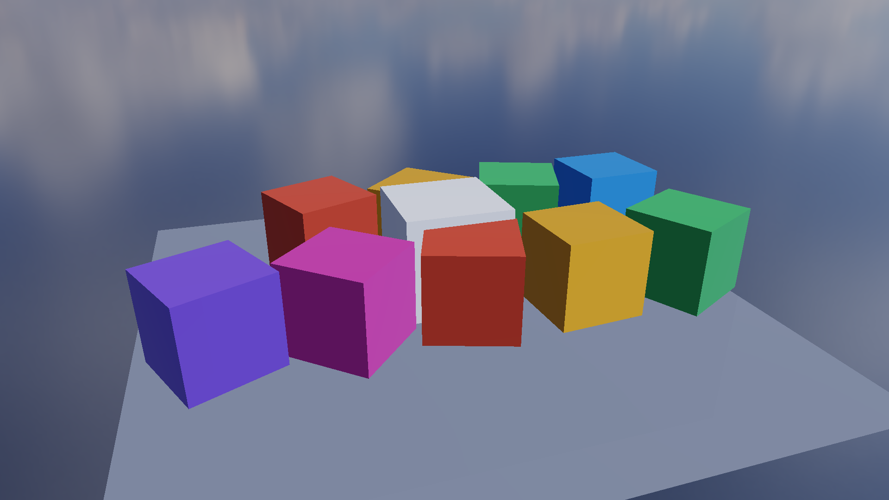

# 单场景编辑器更新（Editor Scene Update）

- 记录日期：2026-09-14（该次提交 `ce77754`）；本文于 2026-09-16 的源码状态下按 [`README.md`](README.md) 规范改写
- 源码 revision：`ce77754`；仓库当前 HEAD 为 `35a726c`
- 构建目录：**待补**——本文原文只写「MSVC Release 构建通过」，没有记录构建目录名。可对应的目录是 `build-ci-msvc`（Visual Studio 17 2022，x64，MSVC Release），但那是 [`editor-workspace-p1.md`](editor-workspace-p1.md) 与 [`regression-baseline-audit.md`](regression-baseline-audit.md) 记录的目录，不是本文当时的记录
- GPU / 驱动 / OpenGL：**待补**——原文只写「RTX 4060 / OpenGL 3.3 隐藏窗口运行」。本文件没有记录驱动版本；[`regression-baseline-audit.md`](regression-baseline-audit.md) 记录的审计环境为 NVIDIA GeForce RTX 4060 Laptop GPU / NVIDIA 591.44 / OpenGL 3.3.0，那一项不能直接当作本文的采集环境
- 阶段归属：本文件记录 SR-P0 之前的那一轮编辑器单场景更新；`Scene` 数据模型本身的设计与边界见 [`scene-rendering-foundation.md`](scene-rendering-foundation.md)，后续的工作台化收口见 [`editor-workspace-p1.md`](editor-workspace-p1.md)

## 目标与范围

这一轮要解决的是**单场景编辑**：把此前「一个命令行模型 + 一组演示预设」的用法推进到可以在同一个场景里追加多个模型、逐个选中并编辑，同时不破坏已有的渲染入口。

范围内落地的能力包括：追加式模型导入（含后台导入与拖放）、层级选择与视口点击拾取、Object 页的 Transform/可见性/父对象/复制/删除编辑、程序化无限网格、选中对象的外轮廓描边、四面板的拖动停靠与布局重置、English / 简体中文双语切换与参数悬停说明、语言与布局的本地持久化。

明确不做、或明确推迟的：场景内容只保留在本次运行中（原文记为没有新增场景文件保存功能，见「限制与取舍」的待复核条目）；`Scene` 没有 Undo/Redo 与 Prefab；演示 / 压力测试预设与「以当前模型重置场景」继续走原有的场景初始化流程，而不是走追加流程。

## 实现

### 持久化：语言与布局

- 语言写入工作目录下 `MyRenderer.language`，布局写入 `MyRenderer.editor.ini`。
- 语言开关只写两个值：`zh-CN` 或 `en`；读取时把非 `en` 一律当作中文。窗口位置与停靠状态由 Dear ImGui 写进 ini；自动化运行（`MYRENDERER_SMOKE_TEST=1`）时 `io.IniFilename` 被置空，因此隐藏窗口运行不会顺手改写用户布局。

### 运行时：追加式导入与场景初始化

- 从「文件 → 导入模型」、底部资源浏览器或拖入文件向当前场景添加模型。一次拖入多个文件会顺序导入。
- 导入不会替换已有模型；新对象自动选中并沿 X 轴错开放置。当前版本沿用资源归一化到统一预览大小的方式。
- 普通导入走追加流程；明确选择演示 / 压力测试预设及「以当前模型重置场景」继续走原有场景初始化流程。这些操作会重置场景。命令行初始模型、基准测试和已有渲染管线保持原有入口。
- 「文件 → 新建空场景」（Ctrl+N）清空当前模型、演示设置、选择和导入队列，重置相机。旧的后台导入结果会被丢弃。随后导入的第一个模型也不会按文件名激活演示预设。

### 运行时：模型 GPU 资源的归属

模型 GPU 资源由应用会话持有，复制对象共享资源。删除追加模型的最后一个实例后释放对应资源；退出时在 OpenGL 上下文销毁前释放全部模型。

### 渲染：程序化网格

Grid 使用世界 Y=0 平面的程序化无限网格，没有固定方形边界；细线随投影密度淡出，远处渐隐，仍受相机裁剪范围约束。

### 渲染：选中外轮廓

- 选中模型显示约 3 像素宽的橙色外轮廓，遮挡由独立深度遮罩处理。取消选择或隐藏、删除对象后消失。
- 描边在色调映射后绘制，不进入 TAA 历史；基准测试和演示影片导出不绘制描边。
- 外壳实现是半径 3 texel 的圆形邻域判别：片元着色器先丢弃落在选中实体自身轮廓内的像素（避免内部出现描边），只在邻域内存在满足 `silhouette.g <= sceneDepth + 0.00001` 的轮廓像素时才写出颜色；因此遮挡者不会在选中遮罩内「打洞」造出假描边。

### UI：面板、Object 页与交互

- 四个面板支持拖动停靠、调整大小。菜单「重置布局」恢复层级 / 视口 / 检查器 / 资源浏览器布局。
- 在左侧层级选择对象，在右侧「对象」页编辑位置、旋转、缩放和颜色。支持复制、删除、可见性和父对象设置。视口「聚焦」按钮对准所选对象。
- Object 页仅展示所选对象的参数和统计；全局舞台、颜色和光照配置放在 Renderer 页。
- 视口左键点击选择前方可见模型，点击空白取消选择；Object 页自动切换到所选对象。视口或层级获得焦点时按 Delete 删除，编辑输入框时不会触发删除。
- 交互模式中的压力测试实例转为可编辑实体，支持选择和删除；基准测试模式继续使用原有提交路径（`materializeStressEntities` 的注释写明「基准模式保留原有合成提交路径」，实体只物化一次）。
- 「Language / 语言」切换 English / 简体中文。参数悬停片刻显示中文用途说明；专业参数可继续使用英文。
- Windows 优先加载系统微软雅黑，回退到黑体或宋体。找不到中文字体时使用英文，中文选项不可用。

## 截图

### 编辑器总览

真实 OpenGL/ImGui 帧完成之后捕获的整个编辑器窗口，而不是只保存 Viewport 纹理：可以看到菜单栏、左侧层级、中央视口与右侧检查器的实际排布，以及中性黑灰分层里用于选中/激活反馈的强调色。它证明这一轮的编辑能力是落在真实 UI 上的，不是只存在于命令行。


复现（这一条是仓库记录的命令；仓库与原文都没有记录当时的窗口尺寸）：

```powershell
$env:MYRENDERER_SMOKE_TEST=1
$env:MYRENDERER_EDITOR_SCREENSHOT=docs/images/editor-ui-overview.png
.\build-mingw\MyRenderer.exe .\assets\models\cube.obj
```

`MYRENDERER_EDITOR_SCREENSHOT` 会在真实 OpenGL/ImGui 帧完成后保存整窗；同一组能力也用于底部的多标签工作区与最小窗口尺寸采集，环境变量写法见 [`media/README.md`](media/README.md)。

### SR-P0 多对象夹具：一份 Mesh 被多个 Entity 引用

同一个 Cube Mesh 被至少 10 个 Entity 共享，各实体的位置沿 X 轴错开。这张固定基线证明「多个对象共用同一份模型资源」在渲染提交层是成立的——这正是本文「导入不会替换已有模型，新对象沿 X 轴错开放置」与「复制对象共享资源」两条行为所依赖的资源复用形态。它不是编辑器追加导入流程本身的截图，追加流程的自动回归在下面「验证」一节。



复现（由 `tools/FoundationVisualRegression.cmake` 采集并比对，1920 × 1080、1× MSAA、关闭阴影 / Bloom / Grid / Axes）：

```powershell
cmake --build build-release --target foundation-visual-regression
```

**待补**：`images/editor-ui-renderer-drawers.png`（Renderer 抽屉与两列属性布局）与本文描述的「Object 页 / Renderer 页分工」直接相关，但仓库里没有记录它的重拍命令，因此本文不把它当作可复现图嵌入。

## 验证

原文记录的验证结论逐条如下（数字与措辞按原文保留）：

- MSVC Release 构建通过。
- 现有 CTest 6 项通过。
- RTX 4060 / OpenGL 3.3 隐藏窗口运行：cube + sphere 追加成功，验证不同实体及模型资源和场景提交列表。
- 不存在的模型导入失败后，已有场景保持有效。
- 布局配置确认四个面板分别保存了对应 DockId。
- GPU 整数 ID 拾取回归：前后遮挡、空白点击、隐藏对象、删除对象；新建空场景、丢弃旧异步任务、普通导入玻璃资源、压力实例删除不重生。
- 轮廓像素回归：选中、取消选择、视口缩放；实际截图确认外轮廓没有面交界处的多余线条。
- 遮挡描边修复：使用完整选中物体轮廓、可见选中区域与场景深度三个信息，避免遮挡者在选中遮罩内形成的孔洞产生假描边。覆盖地面及普通模型、20°/55° 视角、内部遮挡、跨轮廓遮挡和完全遮挡；断言遮挡后不能新增原轮廓之外的橙色像素。
- MinGW 构建通过且无 warning；压力实例矩阵构造改为花括号初始化，消除 GCC 的 `zero-size array` 解析警告。

可使用 `tools/TestEditorScene.ps1` 复现追加回归；界面视觉和鼠标操作仍建议在实际桌面试用。

```powershell
powershell -File tools/TestEditorScene.ps1 -BuildDirectory build-ci-msvc
```

该脚本本身给出了两条可判读的通过条件：标准输出里出现 `Append scene validation: PASS` 与 `Editor interaction validation: PASS`，并且工作目录下的 `MyRenderer.editor.ini` 里 `Hierarchy`、`Inspector`、`Viewport`、`Assets` 四个 `[Window]` 段各自带有 `DockId=`。

## 限制与取舍

- 场景内容只保留在本次运行中：原文记录的边界是「没有新增场景文件保存功能」。
  > **待复核**：仓库当前版本里 `File` 菜单已经有 `Save scene`（Ctrl+S）与 `Save scene as...`（Ctrl+Shift+S）并接到 `SceneDocument` 序列化，[`editor-workspace-p1.md`](editor-workspace-p1.md) 与 [`scene-rendering-foundation.md`](scene-rendering-foundation.md) 也记录 `.myscene` 已落地。这两处对不上，说明该边界是在本文之后被后续阶段改掉的；本次按原文保留该句，没有静默改写，也未核实当时的准确提交状态。
- **待复核**：「现有 CTest 6 项通过」与「RTX 4060 / OpenGL 3.3」这两个数字/描述只有本文一处记录，仓库里没有对应的历史 CI 记录或审计条目可以对上；当前 `CMakeLists.txt` 里的 `add_test` 数量已远多于 6，因此这条只能读作当时的基线快照。
- 中文界面只在 Windows 上成立：字体加载路径硬编码为 `C:/Windows/Fonts/msyh.ttc`、`simhei.ttf`、`simsun.ttc`，找不到时 `chineseFontAvailable` 为假并强制切回英文，中文菜单项同时变为不可用。
- 悬停说明是固定词表：命中词表时显示对应中文说明，未命中时回退到一句通用说明，因此新参数不会自动获得准确解释。
- 程序化网格没有固定方形边界，细线随投影密度淡出；这是观感取舍，不是几何上的无限平面。
- 选中描边是为了编辑可读性：它画在色调映射之后且不进入 TAA 历史，因此基准测试与演示影片导出都要显式关掉它，这也意味着它不在任何像素基线里。
- 压力测试实例的物化只覆盖「转为可编辑实体」这一步：基准测试模式仍走原有合成提交路径，两条路径的实体来源不同，不能互相替代。
- **待复核**：`images/editor-ui-overview.png` 在 [`images/README.md`](images/README.md) 里被登记为「分类待复核」的说明性插图（按规范本应放 `docs/media/`），并绑定了根 `README.md` 的 Editor UI 设计规范（`#0E0F10` → `#202126` 的中性黑灰分层、`#4D9EFF` 只用于选中/激活/拖拽反馈）。本文沿用该图的既有位置，没有移动文件。

## 复现命令

```powershell
# 追加导入、拾取/删除/空场景与四面板 DockId 回归
powershell -File tools/TestEditorScene.ps1 -BuildDirectory build-ci-msvc

# SR-P0 固定夹具（含多 Entity 共享 Cube Mesh 那张图）
cmake --build build-release --target foundation-visual-regression

# 编辑器窗口的整窗截图
$env:MYRENDERER_SMOKE_TEST=1
$env:MYRENDERER_EDITOR_SCREENSHOT=docs/images/editor-ui-overview.png
.\build-mingw\MyRenderer.exe .\assets\models\cube.obj
```

`TestEditorScene.ps1` 会自动设置 `MYRENDERER_SMOKE_TEST=1`、`MYRENDERER_EDITOR_INTERACTION_TEST=1` 与 `MYRENDERER_APPEND_TEST=<仓库>/assets/models/sphere.obj`，以 `assets/models/cube.obj` 作为初始模型，产物写在 `<BuildDirectory>/editor-regression/` 下，并在结束时恢复这三个环境变量的原值。

## 下一步

1. 把本文件两条「待复核」查清并落到具体 revision：一是当时的构建目录、GPU/驱动与 CTest 数量，二是「没有场景文件保存功能」这条边界被后续哪一次提交改掉。查清后回填元信息块与本节的数字，不要靠推测。
2. 按 [`editor-workspace-p1.md`](editor-workspace-p1.md) 与 `todolist.md` 的 `P1-0A`，本文件的 UI 面在后续阶段已由 `EditorCommand` / `EditorSession` 集中入口收口；本文描述的「四个面板」也已经扩展为中央 Viewport + 左侧 Scene Explorer + 右侧 Inspector + 底部多标签 Workspace，引用本文件时应以那一篇为准。
3. 补上 `images/editor-ui-renderer-drawers.png` 的重拍命令，或按 [`README.md`](README.md) 第 3 节的分类把它移入 `docs/media/`（`todolist.md` 的 `P0-A：先锁定回归基线`）。
