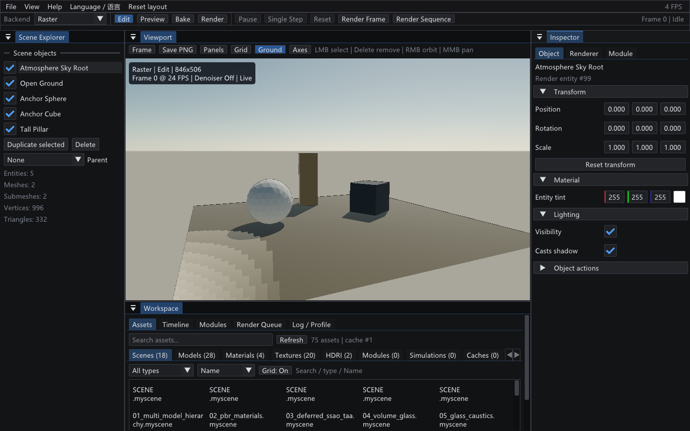
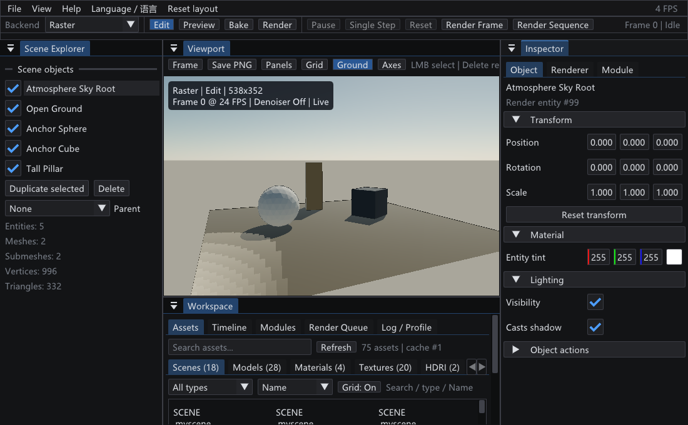
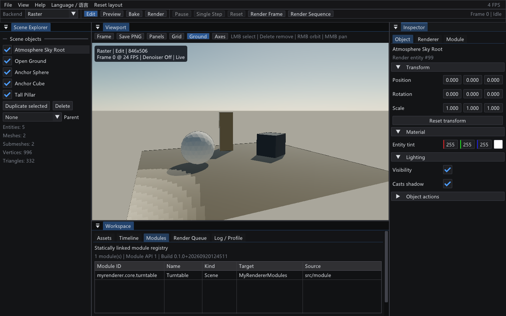

# P1-0A：编辑器工作台（Editor Workspace）

| 项 | 值 |
| --- | --- |
| 日期 | 2026-09-19（A2b2b Renderer 领域命令收口）；2026-09-20 补拍工作区插图并按 [`README.md`](README.md) 规范重写正文 |
| 源码 revision | `35a726c`（本文件与 `src/app/EditorDomain.h`、`EditorSession`、`WorkspaceAssets` 等改动同属该 revision 之后的工作树，尚未提交） |
| 构建目录 | `build-ci-msvc`（Visual Studio 17 2022，x64，MSVC Release，`BUILD_TESTING=ON`） |
| GPU / 驱动 / OpenGL | NVIDIA GeForce RTX 4060 Laptop GPU，`gpu-smoke` 在真实 OpenGL 3.3 上下文通过；驱动 591.44 / OpenGL 3.3.0 为 [`regression-baseline-audit.md`](regression-baseline-audit.md) 记录的参考机数值 |
| 窗口尺寸 | 默认 1440×900（`MYRENDERER_EDITOR_WINDOW_WIDTH/HEIGHT` 可覆盖），应用下限 1100×680 |

## 目标与范围

P1-0A 的纵向切片把现有四面板编辑器推进为渲染/模拟工作台，同时保持 Scene、Renderer 与 CPU Path Tracer 的既有数据合同。编辑会话、命令入口、真实 Asset Catalog、工作区信息架构以及版本化 Render Job Queue 已落地；模块 Manifest 与静态模块 Registry 仍属于后续切片，不在本切片范围内。

本切片同样不承诺：GPU Path Traced 后端、Render Queue 的真实并行调度、模块实例的运行/停止与参数控件，以及 Assets 的真实图像缩略图。这些项目的当前边界逐条写在「限制与取舍」。

## 实现

下面按工作区结构描述：Dock 布局 → 顶部工具栏 → Viewport 状态 → 底部面板 → `EditorCommand` 边界 → 队列持久化；顺序是信息架构的顺序，不是开发时间顺序。

### Dock 布局

默认 Dock Layout 由中央 Viewport、左侧 Scene Explorer、右侧 Inspector 和底部 Workspace 组成；底部默认占中央列约 30%，使 1440×900 首屏可读资源名而不夺走 Viewport 的主区域。布局仍由 Dear ImGui 保存，用户可以自由拖动，`Reset layout` 恢复默认布局。

### 顶部工作流工具栏

顶部工作流工具栏统一显示 Backend 与 `Edit / Preview / Bake / Render` 状态，并提供 Pause、Single Step、Reset、Render Frame、Render Sequence。GPU Path Traced 显示为不可用，直到 Vulkan 后端存在。

### Viewport 状态叠加

Raster 与 CPU Path Traced 在相同 Viewport 位置显示 Backend、活动状态、分辨率、Frame/SPP、Denoiser 与任务状态；CPU 模式继续显示 Render/Denoise 时间、History、Ray 与 BVH 统计。

### 底部 Workspace 面板

底部 Workspace 包含 Assets、Timeline、Modules、Render Queue、Log/Profile 五个标签页：

- **Assets**：递归扫描 `assets/`，按 Scenes、Models、Materials、Textures、HDRI、Modules、Simulations、Caches、RenderJobs、Presets 分类，提供路径/名称搜索、扩展名筛选、名称/大小排序、网格/列表、文件大小和稳定预览缓存键；Scene、Model、Render Job 的动作通过 `EditorCommand` 打开、导入或送往 Queue。
- **Timeline**：提供 Frame Range、FPS、Scrub 和固定步长显示。
- **Modules**：已接入 C1 的真实数据源，读取 `ModuleRegistry::manifests()`（Module ID、Name、Kind、CMake Target、Source、Module API 版本与 Build ID），只消费 Manifest，不扫描也不解析 C++ 源码。
- **Render Queue**：可浏览或输入多个 `.renderjob`，通过 `EditorCommand` 提交到共享 Batch Sequence Runtime，串行调度并显示帧进度、输出计数与明确结果，支持 Pending 重排/移除、运行中安全取消以及 Failed/Cancelled 重试。
- **Log/Profile**：不再只有一个状态行，它汇总**已经存在于应用中的结构化诊断**，不制造任何未上报的状态——导入进度与按 File/Node/Mesh/Material/Texture 分组的导入诊断、Render Queue 的逐任务状态与帧进度/产物计数/失败信息（空队列时明确显示 "No Render Job has been submitted."）、运行 profile（CPU/GPU 帧时间、Draw Call、三角形、活动 Pass 与逐 Pass GPU 时间、RenderTarget 与 Opaque 流量估算、最近一次导入/上传耗时）以及活动模块的日志条目。

### `EditorCommand` 边界

UI 不直接改写渲染状态，而是提交命令；Application 在集中入口消费命令并统一校验、应用与失效。边界由下列规则构成：

- `EditorSession` 保存 Backend、活动状态、Pause、确定性 Frame/FPS/Range 与任务状态。UI 产生 `EditorCommand`，Application 在集中入口消费命令；Scene Explorer 的显隐、复制、删除和父子关系，以及预览任务控制均已迁移到该路径。Object Inspector 也不再直接改写实体：Transform、Tint、Visibility、Casts Shadow 与 Delete 使用带类型载荷的命令，经有限值/Scale 范围校验后更新 Scene，并同步失效 Motion History 与 CPU Preview。
- Renderer Inspector 的领域命令已按共同失效语义收口。每个分组编辑一份领域快照并只提交一条 `EditorCommand`：Stage 一次提交 Ground Receiver/Color/Offset/Comparison Object，Material 一次提交 Base Color/Shininess，Directional Light 一次提交 Direction/Ambient/Diffuse/Specular，PBR / Environment 一次提交 PBR/IBL/Skybox/Shadow/彩色透射阴影/环境强度，Shading 一次提交着色模式、渲染路径、G-Buffer 调试与全部 Stylized/NPR 参数，Post processing 一次提交 SSAO/TAA/曝光/Bloom/Tone Mapping，Rasterization 一次提交线框/剔除/法线贴图/网格/坐标轴/背景色/MSAA，Camera 一次提交 Field of View，Runtime 一次提交 VSync 与 Shader 热重载，Glass 一次提交折射/色散/体积玻璃参数与玻璃调试视图，Caustics 一次提交启用/模式/强度/尺度/方向/锐度/动画，Instancing 一次提交合批/视锥剔除/LOD。光照强度从 Material 语义中移入 Directional Light；集中入口是唯一校验与应用点。
- 领域同时决定失效语义，不再对每个控件单独判断：PBR/Environment 与 Camera 重启 CPU Preview 并失效 TAA History（二者都进入参考快照与投影）；Shading/Stylized、Glass、Caustics、Instancing 与 Rasterization 只失效 TAA History（Stylized、玻璃与焦散是光栅侧效果，参考积分器使用物理材质语义）；Post processing 只在 SSAO 或 TAA 参数变化时失效 History，因为曝光、Tone Mapping 与 Bloom 在 History 解析之后才应用；Runtime 不影响画面。`EditorDomain`（`src/app/EditorDomain.h`）是 `RendererSettings` → 载荷映射的唯一实现，Inspector、命令入口与自动化回归共用它，避免三处字段列表各自漂移。
- 校验分两层，职责不重叠。捕获层（`EditorDomain`）把每个数值夹取到对应控件范围：`.myscene` 读取不做夹取，若一个手改的越界值被原样回传，入口的严格校验会让整个领域永久无法从 Inspector 编辑，所以归一化必须发生在捕获侧，使“捕获 → 提交 → 应用”在合法范围内闭合，并在该领域下一次编辑时修正场景。入口层（`processEditorCommands`）对载荷做严格不变量检查：非有限数值、越界数值与非法枚举/离散值（未知 MSAA、未知调试视图）整条拒绝，不写入任何字段。
- View 菜单与视口工具栏中纯设置的快捷项（Wireframe、Back-face culling、Ground grid、Ground plane、Comparison object、XYZ axes、Reset camera）改走同一批领域命令，不再直接改写 `RendererSettings`。

### Render Queue 持久化

Render Queue 状态默认持久化到 Windows `%LOCALAPPDATA%/MyRenderer/render-queue.json`；测试或便携运行可用 `MYRENDERER_RENDER_QUEUE_STATE` 指定路径。正常关闭时活动任务会在安全取消后保存为 Pending，下次启动依靠 Job 的完整帧 Resume 继续。

## 截图

四张图都是 `docs/media/` 下的文档插图（UI 说明性截图），不参与任何自动像素比对；采集统一使用隐藏窗口的 Smoke Test 入口，窗口尺寸与标签页由环境变量决定：

```powershell
$env:MYRENDERER_SMOKE_TEST='1'
$env:MYRENDERER_EDITOR_WINDOW_WIDTH='1440'; $env:MYRENDERER_EDITOR_WINDOW_HEIGHT='900'
$env:MYRENDERER_EDITOR_SCREENSHOT_TAB='modules'   # 或 render-queue；拍默认布局时省略
$env:MYRENDERER_EDITOR_SCREENSHOT='docs/media/p1-workspace-1440x900.png'
build-ci-msvc/Release/MyRenderer.exe assets/scenes/18_atmosphere_sky.myscene
```

默认工作区把 Viewport 留作主区域，同时让 Scene Explorer、Inspector 与底部多标签工作区在 1440×900 首屏内共存，底部仅占中央列约 30%。



复现：`MYRENDERER_EDITOR_WINDOW_WIDTH=1440`、`MYRENDERER_EDITOR_WINDOW_HEIGHT=900`、`MYRENDERER_EDITOR_SCREENSHOT=docs/media/p1-workspace-1440x900.png`，不设置 `MYRENDERER_EDITOR_SCREENSHOT_TAB`。

布局约束要求应用下限尺寸仍然可用，而不是只在 1440×900 下成立：1100×680 下各面板标签完整、内容可滚动，Viewport 仍是主区域。



复现：同上，窗口尺寸改为 `MYRENDERER_EDITOR_WINDOW_WIDTH=1100`、`MYRENDERER_EDITOR_WINDOW_HEIGHT=680`。

Modules 页直接呈现 `ModuleRegistry::manifests()` 的真实 Manifest 字段（Module ID、Name、Kind、CMake Target、Source、Module API 版本与 Build ID），页面上没有占位参数控件——这张图证明 Modules 只消费 Manifest，不扫描也不解析 C++ 源码。



复现：`MYRENDERER_EDITOR_SCREENSHOT_TAB=modules`，截图路径改为 `docs/media/p1-workspace-modules.png`。

Render Queue 页展示的任务路径输入、Enqueue 与队列状态来自持久化 Queue Runtime，因此空队列与失败/取消结果都是真实上报的状态，而不是占位文案。


复现：`MYRENDERER_EDITOR_SCREENSHOT_TAB=render-queue`，截图路径改为 `docs/media/p1-workspace-render-queue.png`。

## 验证

MSVC Release 使用 `build-ci-msvc`：

```powershell
cmake --build build-ci-msvc --config Release --target MyRendererWorkspaceAssetsTests MyRendererEditorSessionTests MyRenderer --parallel
ctest --test-dir build-ci-msvc -C Release -R "workspace-assets|editor-session" --output-on-failure
ctest --test-dir build-ci-msvc -C Release --output-on-failure
cmake --build build-ci-msvc --config Release --target gpu-smoke
```

最新结果：`workspace-assets`、`editor-session`、`render-job-runtime`、`batch-output-override` 与 `render-queue-runtime` 通过；完整 CTest 14/14 通过；真实 RTX 4060 Laptop GPU / OpenGL 3.3 smoke 通过。额外的 `MYRENDERER_EDITOR_INTERACTION_TEST=1` 已验证 Object Inspector 与 Renderer 全部领域命令真实更新状态、越界载荷被拒绝且可恢复原值：

```powershell
$env:MYRENDERER_SMOKE_TEST = "1"
$env:MYRENDERER_EDITOR_INTERACTION_TEST = "1"
.\build-ci-msvc\Release\MyRenderer.exe .\assets\models\cube.obj
Remove-Item Env:MYRENDERER_SMOKE_TEST, Env:MYRENDERER_EDITOR_INTERACTION_TEST
```

该回归先按 A2b2a 覆盖 Stage/Material/Directional Light，再对 A2b2b 的 9 个领域（PBR-Environment、Shading、Post、Rasterization、Camera、Runtime、Glass、Caustics、Instancing）与 FrameCamera 动作逐一提交合法载荷并核对 `RendererSettings`/`Camera`/VSync 的实际变化；随后提交越界或非法载荷（曝光 12.0、FOV 140、Refraction Steps 64、MSAA 8）确认被整条拒绝且无副作用，并把越界的历史值（曝光 9.0、Lighting bands 32）交给捕获归一化后确认该领域仍可编辑；最后逐领域恢复并核对恢复结果。A2b2a 截图输出到构建目录 `a2b2-renderer-domains.png`（1440×900）与 `a2b2-renderer-domains-1100x680.png`，已人工检查完整标签、语义分组、滚动可达性、最小窗口和主视口比例；A2b1 Object 与 A2a Assets 截图仍保留在同一构建目录。这些截图都没有改写版本化 UI 或渲染固定图。自动化可用 `MYRENDERER_EDITOR_WINDOW_WIDTH/HEIGHT` 覆盖启动尺寸，默认值仍为 1440×900，应用下限仍为 1100×680。

## 限制与取舍

- `Render Frame` 继续复用当前 Raster 截图或 CPU Preview 导出。`Render Sequence` 使用 Render Queue 当前路径中的版本化 Job；Scene、Frame/FPS、Seed、分辨率、AOV 与输出路径全部由 Job 决定，不从 GUI Timeline 隐式覆盖。
- Queue 当前只并发执行一个 Job，但可以持久保存多个 Pending 与历史结果。B4 已完成异常进程终止、主备状态恢复与部分产物诊断；真实并行调度不在 P1-0 的当前范围。
- Modules 页的启动/停止、参数控件、打开 Visual Studio、构建 Target 与编译错误定位仍未实现，随 C1 runner 落地；因此 Modules 页当前只有 Manifest 数据这一条真实数据链。
- Log/Profile 页只汇总已经存在于应用中的结构化诊断，不制造任何未上报的状态。
- Simulation 与 Module Parameters 不展示占位参数；它们等待 C1 Registry/Parameter 数据后再生成真实控件。
- Asset Catalog 刷新采用事务式替换：扫描失败时保留上一代目录；预览缓存键由相对路径、大小和修改时间稳定导出。实际图像缩略图的生成、持久缓存与内容失效仍未实现，当前网格卡只表达类型和元数据。
- Scene Explorer、任务控制、Object Inspector 与全部 Renderer 设置分组（Stage、Material、Directional Light、PBR/Environment、Shading、Post、Raster、Camera、Runtime、Glass、Caustics、Instancing），以及 View 菜单和视口工具栏里的纯设置快捷项，都已走命令队列。仍然直接写入的编辑器界面只有三类，且都不属于 Renderer 设置快照：场景/Preset 构造动作（View 菜单的 Prism / Volume glass / Glass caustics / Local light stress / Instance stress preset，及对应分组的启用开关）、CPU Preview 任务参数弹窗（SPP/Depth/Seed/AOV/降噪，属于 P0-C 的预览任务语义而非渲染状态）、以及 GPU 蒙皮与 Prism 演示面板（含动画播放状态与 Prism 光学参数）。它们各自需要独立的命令设计，不在 A2b2b 的 Renderer 设置范围内。

调整界面前还必须核对 [`todolist.md`](../todolist.md) 的「P1 GUI / Workspace 参考与约束」：那里给出可借鉴的设计语言与**不得照搬**清单，本节是同一约束在 P1-0A 切片上的具体化。

## 复现命令

```powershell
# 本机已验证的 MSVC 构建目录；新机器可改为 build。
cmake -S . -B build-ci-msvc -G "Visual Studio 17 2022" -A x64 -DBUILD_TESTING=ON
cmake --build build-ci-msvc --config Release --target MyRendererWorkspaceAssetsTests MyRendererEditorSessionTests MyRenderer --parallel

# 工作区与编辑会话专项测试
ctest --test-dir build-ci-msvc -C Release -R "workspace-assets|editor-session" --output-on-failure

# 真实 OpenGL 交互回归：逐领域应用、拒绝与恢复
$env:MYRENDERER_SMOKE_TEST = "1"
$env:MYRENDERER_EDITOR_INTERACTION_TEST = "1"
.\build-ci-msvc\Release\MyRenderer.exe .\assets\models\cube.obj
Remove-Item Env:MYRENDERER_SMOKE_TEST, Env:MYRENDERER_EDITOR_INTERACTION_TEST

# 工作区插图：1440×900 默认布局；换 TAB 可拍 modules / render-queue
$env:MYRENDERER_SMOKE_TEST='1'
$env:MYRENDERER_EDITOR_WINDOW_WIDTH='1440'; $env:MYRENDERER_EDITOR_WINDOW_HEIGHT='900'
$env:MYRENDERER_EDITOR_SCREENSHOT_TAB='modules'
$env:MYRENDERER_EDITOR_SCREENSHOT='docs/media/p1-workspace-modules.png'
build-ci-msvc/Release/MyRenderer.exe assets/scenes/18_atmosphere_sky.myscene
```

## 下一步

- A2 Workspace 业务化：用真实 Queue/Job/Module 数据补齐 Inspector、Content Browser、Modules、Log/Profile，见 [`todolist.md`](../todolist.md) 第 4 节「P1-0 当前状态、依赖与执行顺序」中的第 5 条与 A2b/A2c 条目；
- 关闭本切片仍未完成的验收口：真实图像缩略图、Simulation/Module Parameters、Modules 的构建与启停动作、GPU PT Overlay、场景 Preset 构造动作与 CPU Preview 任务参数的命令化；
- `Render Frame` / `Render Sequence` 的 `simulate` / `bake` 真实实现依赖 P1-0C Module Runtime，见同一节的 P1-0C 条目。
