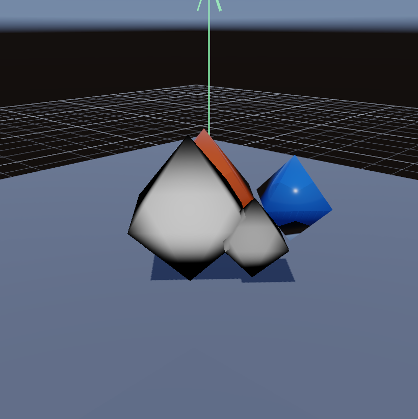
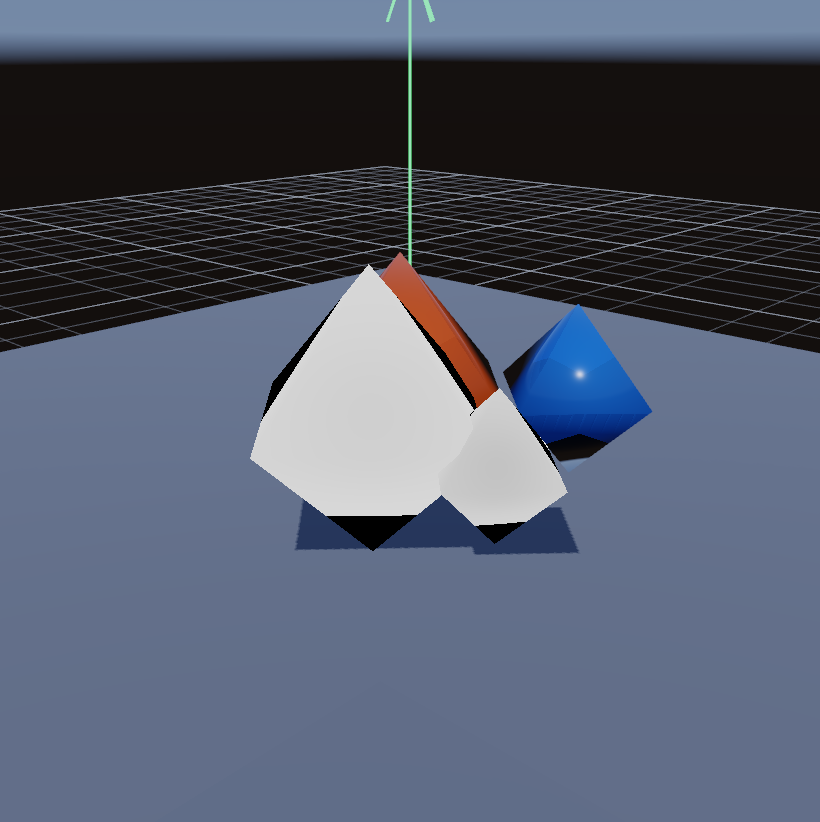
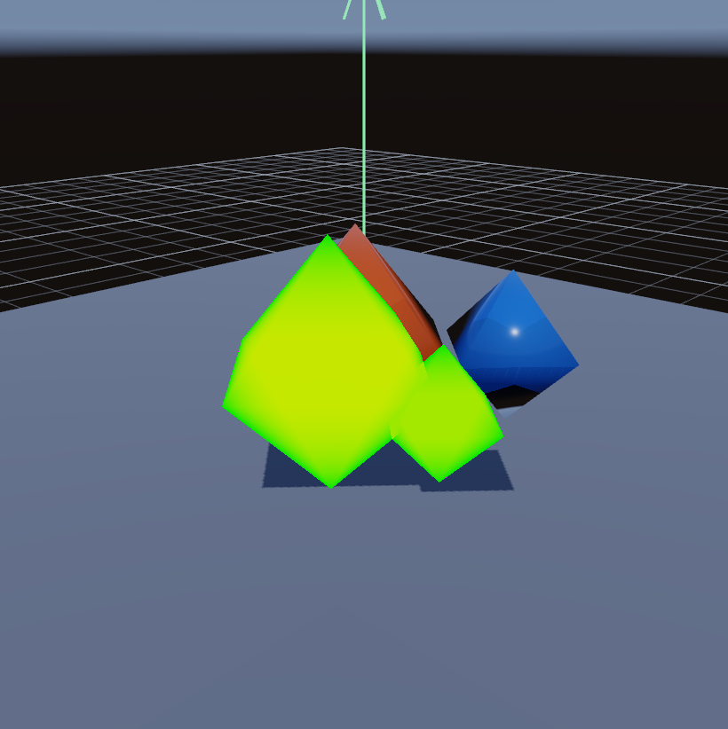

# Glass-2B 几何厚度（Geometric Thickness）

- 记录日期：2026-08-24（本文与三张基线图同属提交 `111908f`，此后未再更新）
- 源码 revision：`111908f`；仓库当前 HEAD 为 `35a726c`
- 构建目录：原文没有记录；`CMakeLists.txt` 与 `tools/` 中也没有 Glass-2B 的视觉回归或 Benchmark target，可用的相关入口只有 `gpu-smoke`（见「复现命令」的复核说明）
- GPU / 驱动 / OpenGL：原文只记录参考机为 NVIDIA GeForce RTX 4060 Laptop GPU；`docs/images/README.md` 与 `docs/performance/prism5_samples_*.json` 把同一台参考机记为驱动 NVIDIA 591.44、OpenGL 3.3.0，但原文没有把这两项写进本文

## 目标与范围

Glass-2B 用一个屏幕空间的前/后表面估计（screen-space front/back surface estimate）取代只有统一厚度（uniform-only）的体积路径代理，用于闭合的透射网格。实现保持与 OpenGL 3.3 兼容，并保留 glTF 材质回退。

本阶段明确不做：精确的曲面出射折射（它属于后续的 Glass-2C 双界面路径）、逐对象深度剥离（per-object depth peeling）、ray query 与硬件光线追踪；这些替代方案列在「限制与取舍」。

## 实现

### 渲染：Pass 与资源流（pass and resource flow）

```text
Opaque HDR (+ optional spectral beam)
  -> Glass front/back thickness
       -> R32F minimum view depth (entry)
       -> R32F maximum view depth (exit)
  -> Forward transparent / refractive scene
       -> geometric path or glTF thickness fallback
       -> Beer-Lambert + RGB dispersion
  -> Bloom + tone map
```

只写深度的几何着色器会把每个透射 submesh 画两遍：`GL_MIN` 选出最近的表面，`GL_MAX` 选出最远的表面。这不依赖导入的绕序（winding）或 `doubleSided`；玻璃 fragment shader 还会丢弃位于已记录入口表面之后的片段，因此一个反向网格不会把它的出射表面误当作可见边界来着色。

在有效像素上：

```text
viewRayDistance = (exitViewDepth - entryViewDepth)
                / abs(viewSpaceCameraRay.z)

normalThickness = viewRayDistance
                * abs(dot(cameraRay, geometricNormal))
                * volumeThicknessScale

volumePathLength = normalThickness
                 / max(abs(dot(refractedRay, interfaceNormal)), 0.15)
```

同一条路径长度同时驱动 Beer-Lambert 衰减与 R/G/B 色散采样。当深度跨度缺失或无效时，着色器遵循 `KHR_materials_volume` 并使用：

```text
fallbackThickness = thicknessFactor * thicknessTexture.g
                  * volumeThicknessScale
```

Khronos 把 `thicknessTexture` 定义为存储在 G 通道、并与 `thicknessFactor` 相乘的线性数据：
<https://github.com/KhronosGroup/glTF/tree/main/extensions/2.0/Khronos/KHR_materials_volume>

### UI：控件与诊断视图

- `Geometric glass thickness`：启用几何深度跨度路径长度；前深度贴图仍然会为稳健的体积渲染选出可见的入口表面。
- `Thickness`：显示算出的折射路径长度。
- `Front/back thickness data`：绿色/黄色表示存在正的前/后跨度；品红表示需要材质厚度/纹理回退。
- `MYRENDERER_GEOMETRIC_THICKNESS=0|1` 与 `MYRENDERER_GLASS_DEBUG=8` 把同样的控件暴露给确定性截图。

## 截图

### 几何厚度与统一厚度回退的同机位对照

同机位的历史截图上，`Thickness` 调试视图在几何模式里让玻璃体呈现随轮廓变化的厚度灰度，说明前/后表面深度跨度确实被用上了，而不是只用统一材质代理。



同一机位、同一调试视图下关闭几何厚度后，厚度退回 `thicknessFactor * thicknessTexture.g * volumeThicknessScale`，玻璃体变成一片均匀的平白，几何模式里那层随轮廓变化的灰度消失。两栏一起证明几何分支在画面里是可观测地生效的。



### 入口/出口深度有效性

`Front/back thickness data` 视图（`MYRENDERER_GLASS_DEBUG=8`）直接显示深度跨度的有效性：绿色/黄色像素表示这里存在有效的正前/后跨度，品红像素标记必须走材质厚度/纹理回退的区域，也就是这一段屏幕空间深度对没有拿到可用出射面的地方。这一轮采集里两个闭合玻璃网格都被涂成绿/黄，没有出现品红像素。



三张图都是同机位、820×822 的历史截图，画面里的四件几何正好是 `glass_material_test.gltf` 的内容：`TransmissionCrystal` 与 `RoughTransmissionCrystal` 两个玻璃网格，加上 `WarmOpaque` 与 `CoolOpaque` 两块不透明背景体。需要注意本文「验证」一节记录的是 1920×1080 与 4x MSAA 下的测量，与这三张 820×822 的 PNG 不是同一次采集，原文也没有解释这个尺寸差异；原文同样没有记录这三张图的采集参数，所以下面的命令给出的是同一调试语义的等价入口，分辨率与 MSAA 由命令指定，重拍结果不保证与历史 PNG 逐像素一致：

```powershell
# 几何厚度视图（Geometric glass thickness On）
$env:MYRENDERER_SMOKE_TEST='1'; $env:MYRENDERER_RENDER_WIDTH='1920'; $env:MYRENDERER_RENDER_HEIGHT='1080'
$env:MYRENDERER_HIDE_SELECTION_OUTLINE='1'; $env:MYRENDERER_MSAA='4'
$env:MYRENDERER_GEOMETRIC_THICKNESS='1'; $env:MYRENDERER_GLASS_DEBUG='5'
$env:MYRENDERER_SCREENSHOT='build-ci-msvc/glass2b_geometric_thickness.png'
build-ci-msvc/Release/MyRenderer.exe assets/models/glass_material_test.gltf

# 同一视图的厚度回退（Geometric glass thickness Off）
$env:MYRENDERER_GEOMETRIC_THICKNESS='0'
$env:MYRENDERER_SCREENSHOT='build-ci-msvc/glass2b_uniform_fallback.png'
build-ci-msvc/Release/MyRenderer.exe assets/models/glass_material_test.gltf

# 入口/出口深度有效性
$env:MYRENDERER_GEOMETRIC_THICKNESS='1'; $env:MYRENDERER_GLASS_DEBUG='8'
$env:MYRENDERER_SCREENSHOT='build-ci-msvc/glass2b_front_back_debug.png'
build-ci-msvc/Release/MyRenderer.exe assets/models/glass_material_test.gltf
```

## 验证

在 RTX 4060 Laptop 参考机上，1920×1080 与 4x MSAA：

- 3 个 CTest 目标全部通过，其中包含新增的线性 Thickness Texture 导入断言；
- 既有的 10 场景 Prism-5 视觉矩阵仍然 10/10 落在其跨驱动阈值内；最大的 changed-pixel 比例是 `1.1454%`；
- `glass_material_test.gltf` 在两个闭合玻璃网格上都报告了有效的正入口/出口跨度；
- 统一回退与几何模式之间的固定机位 Thickness 调试对照得到 normalized RGBA MAE `0.0121168` 与 `6.68002%` changed pixels，证明几何分支在画面上是可观测地生效的；
- Prism benchmark 报告 16 draw calls（Glass-2B 之前是 14）与 `229,866,284` estimated render bytes。两层 1080p R32F 正好解释相对 Prism-5 基线那笔确定性的 `16,588,800` 字节增量；
- 几何模式实测 GPU frame P50/P95 为 `1.432576 / 2.362368 ms`。这一次运行只登记为 smoke benchmark，不算作相对旧基线提速的证据，因为普通驱动波动的量级大于这里观测到的耗时差。

其中两项可以在仓库里对上账：`1920 × 1080 × 4 B = 8,294,400 B`，两层 R32F 即 `16,588,800 B`；而 `229,866,284 - 16,588,800 = 213,277,484`，正好等于 [`docs/performance/prism5_samples_21.json`](performance/prism5_samples_21.json) 记录的 `renderMemoryBytes`（同一文件记录的 Draw call 也是 14），因此「14 → 16 draw calls」与这笔显存增量都与 Prism-5 的版本化采集自洽。

> **待复核**：以下各项按原文保留，但本会话无法从仓库复核：
> - 「3 个 CTest 目标」没有在原文里列名；`tests/AssetImportTests.cpp` 里能看到 `volume_texture_test.gltf` 的 Thickness Texture 导入断言（CTest 用例 `asset-import`），另外两个目标无法确认是哪几个——`regression-baseline-audit.md` 记录 `35a726c` 当时注册的用例是 7 个，数量与本文的「3」不是同一个口径。
> - `1.1454%`、`0.0121168`、`6.68002%`、`1.432576 / 2.362368 ms` 与 `229,866,284` 都只有本文一处记录，`docs/performance/` 里没有 Glass-2B 的版本化 JSON；`229,866,284` 与 Prism-5 采集的算术关系已核对，但其测量轮次本身无法重放（本会话不运行构建）。
> - 「`glass_material_test.gltf` 在两个闭合玻璃网格上都报告有效的正入口/出口跨度」来自运行期诊断输出；仓库里能确认的是该夹具被 `gpu-smoke` 以 Forward 与 Deferred 两条路径各跑一次，没有版本化的跨度报告文件。

## 限制与取舍

- **单一 min/max 深度对无法区分相互重叠的透射物体**；它们的入口与出口深度可能被合并。
- **凹面或嵌套体积可能高估厚度**，因为选到的是最远的表面。
- **出射界面使用局部平行表面法线近似**。精确的曲面出射折射需要出射法线层、逐对象深度剥离、ray query 或硬件光线追踪。
- **该 pass 为每个透射 submesh 增加两个 R32F render target 与两次只写深度的绘制**。它的 GPU 时间与显存应当和后续的 Glass-4 作品集采集一起报告。
- **本文的三张图不能被当作当前输入的复现结果**：`docs/images/README.md` 把 Glass-2B 登记为「历史基线；当前 `tools/` 中没有按文件名引用它们的脚本，重拍入口待复核」，`CMakeLists.txt` 里确实没有对应的视觉回归 target；这三张 PNG 自 `111908f` 起没有被改写，而其后环境路径经历了 `assets/environments/` 从无到有（`12f7ff4` 引入 `glass_studio.hdr`）、再换成 `delta_2_2k.hdr`（`245b663`）与 Kloofendal EXR（`ce77754`）两次替换。因此重拍会得到同一调试语义、但不逐像素相同的结果。
- **本文所有数字来自同一台参考机**，原文没有跨机器证据；`1.432576 / 2.362368 ms` 这一项连同一台机器上的重复运行都没有。

## 复现命令

本阶段没有版本化的重拍 target；可用的仓库入口是把它一起编译链接的 `gpu-smoke`，以及下面按相邻套件写法给出的手工截图命令：

```powershell
# 冒烟：真实 OpenGL 上下文里跑 Forward 与 Hybrid Deferred 两条路径，夹具为 glass_material_test.gltf
cmake --build build-ci-msvc --config Release --target gpu-smoke

# 手工重拍几何厚度视图
$env:MYRENDERER_SMOKE_TEST='1'; $env:MYRENDERER_RENDER_WIDTH='1920'; $env:MYRENDERER_RENDER_HEIGHT='1080'
$env:MYRENDERER_HIDE_SELECTION_OUTLINE='1'; $env:MYRENDERER_MSAA='4'
$env:MYRENDERER_GEOMETRIC_THICKNESS='1'; $env:MYRENDERER_GLASS_DEBUG='5'
$env:MYRENDERER_SCREENSHOT='build-ci-msvc/glass2b_geometric_thickness.png'
build-ci-msvc/Release/MyRenderer.exe assets/models/glass_material_test.gltf
```

## 下一步

1. 给 Glass-2B 补一个版本化入口：要么新增 `tools/Glass2bVisualRegression.cmake` 并把三张历史图重新登记，要么明确把这三张图归档为不再比对的历史证据，并同步 `docs/images/README.md` 里「重拍入口待复核」那一条（路线图见 `todolist.md` 的 `P0-A：先锁定回归基线` 与 [`regression-baseline-audit.md`](regression-baseline-audit.md)）。
2. 同类的调试视图已经在后续套件里有版本化入口：`glass4-visual-regression` 覆盖 `glass4_volume_approximate.png`、`glass4_volume_exit_normal.png` 与 `glass4_volume_object_id.png`；若要保留几何厚度的对照，应把 Thickness 视图并入那套采集，而不是继续维护一份没有脚本的基线。
3. 原文提到的「与未来的 Glass-4 作品集采集一起报告 GPU 时间与显存」还没有落地；Glass-2C 的 `glass2c-benchmark` 已经给出同机位的 P50/P95 口径，可作为登记格式的参照。
