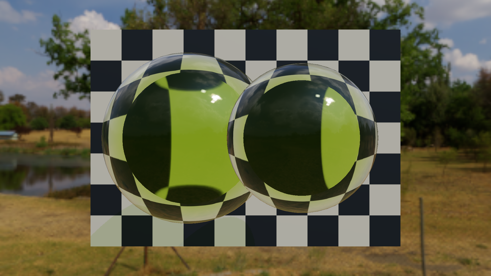

# Glass-2C Curved Volume Glass

Glass-2C upgrades the Glass-2B camera-depth thickness estimate into an
object-aware, two-interface refraction path for smooth closed volumes. The
target is the material behavior demonstrated by `KHR_materials_volume`: curved
background distortion, Fresnel edge reflection, and absorption that increases
with the distance travelled inside the medium.

## Object-aware exit-surface flow

```text
Opaque HDR + Split-Sum IBL
  -> for each transmissive RenderItem, immediately before its sorted draw
       -> R32F entry depth using GL_MIN
       -> R32F exit depth using GL_MAX
       -> RGBA16F encoded exit normal + valid bit
       -> R32UI RenderItem object ID
  -> trace the internal refracted ray against the paired exit-depth field
  -> interpolate the depth crossing to remove step bands
  -> air -> glass Snell refraction
  -> glass -> air Snell refraction using the sampled exit normal
  -> opaque screen-space hit or prefiltered HDR environment fallback
  -> Beer-Lambert attenuation using the entry-to-exit path length
```

The cache is rebuilt and consumed per `RenderItem`. A second glass instance
therefore cannot contribute an exit depth or normal to the current object. The
R32UI layer is still checked in the shader and exposed as an Object ID debug
view, making an accidental mismatch visible and safely forcing the material
thickness fallback.

When the ray crosses the sampled exit-depth field between two march steps, the
shader linearly interpolates the crossing position. This removes the concentric
path-length bands seen with a discrete first-hit position. If the exit leaves
the screen or the mesh does not form a usable closed volume, the shader keeps
the Glass-2B locally parallel exit approximation instead of returning invalid
radiance.

## HDRI and Split-Sum IBL

`assets/environments/delta_2_2k.hdr` is the 2048x1024 Radiance RGBE version of
Poly Haven's CC0 `Delta 2` outdoor environment by Greg Zaal. Source and license
details are recorded in `assets/environments/README.md`. At renderer startup it
is converted into:

- the radiance Cubemap used by the skybox;
- a cosine-weighted Diffuse Irradiance Cubemap;
- a GGX importance-sampled Prefiltered Specular Cubemap;
- a two-channel BRDF integration LUT.

The visible radiance Cubemap uses 512x512 texels per face so the 2K source
retains useful sky and horizon detail. The more expensive GGX prefilter keeps a
separate 64x64 base resolution, preserving the existing startup cost while
remaining sufficient for rough reflections.

The Cook-Torrance ambient term now follows the standard split-sum form. The
sunny park and detailed cloud field provide a natural horizon, readable skybox,
and high-dynamic-range reflections. If the HDR file is unavailable, the same
pipeline is built from a deterministic procedural Studio environment.

## Fixture, controls, and presets

`glass_volume_sphere.gltf` contains a generated 1,986-vertex / 3,968-triangle
closed manifold sphere with `KHR_materials_transmission`,
`KHR_materials_ior`, and `KHR_materials_volume`. The asset test counts every
undirected triangle edge and requires exactly two uses, catching open seams.

Loading the fixture, or choosing `View -> Volume glass preset`, creates two
independent sphere instances, an original procedural checkerboard, and a fixed
front camera. Inspector controls include:

- Two-interface refraction On/Off;
- Transmission, IOR, Roughness, Attenuation Color, Attenuation Distance, and
  Thickness Scale;
- Clear, Olive, and Amber material presets with dispersion disabled;
- Final, Thickness, Transmittance, Exit Surface Normal, Object ID, and the
  earlier glass debug views.

Automation uses `MYRENDERER_TWO_INTERFACE_REFRACTION=0|1` and
`MYRENDERER_GLASS_DEBUG=0..10`.

## Validation

Reference machine: NVIDIA GeForce RTX 4060 Laptop GPU, OpenGL 3.3.0 NVIDIA
591.44, 1920x1080. Each benchmark configuration uses 30 warm-up frames and 90
measured frames with VSync disabled.

| MSAA | Two-interface | GPU P50 | GPU P95 | CPU frame P50 | CPU frame P95 | Draw calls | Render memory |
|---:|:---:|---:|---:|---:|---:|---:|---:|
| 1x | Off | 1.793 ms | 3.055 ms | 3.422 ms | 4.697 ms | 21 | 148.23 MiB |
| 1x | On | 2.203 ms | 3.903 ms | 3.950 ms | 5.483 ms | 21 | 148.23 MiB |
| 4x | Off | 2.201 ms | 3.385 ms | 3.721 ms | 4.754 ms | 21 | 243.16 MiB |
| 4x | On | 2.271 ms | 3.611 ms | 3.848 ms | 5.001 ms | 21 | 243.16 MiB |

The 7-image regression matrix covers 1x/4x Final, local-parallel Approximate,
Thickness, Transmittance, Exit Normal, and Object ID. A clean rerun reports MAE
0 and 0% changed pixels for all seven baselines. The matrix is intentionally
GPU-tolerant for future driver runs (`MAE <= 0.015`, changed pixels <= 8%).



## Boundaries

- The method remains screen-space. Off-screen exits and missing exit pixels use
  the documented Glass-2B fallback.
- Pairing is exact between separate `RenderItem` instances. Multiple nested or
  concave shells packed into one item can still select the farthest shell.
- Transparent composition is still sorted alpha blending rather than
  order-independent transparency.
- Split-Sum resources are CPU-precomputed at startup for OpenGL 3.3 portability;
  they are not a recurring per-frame IBL generation pass.
