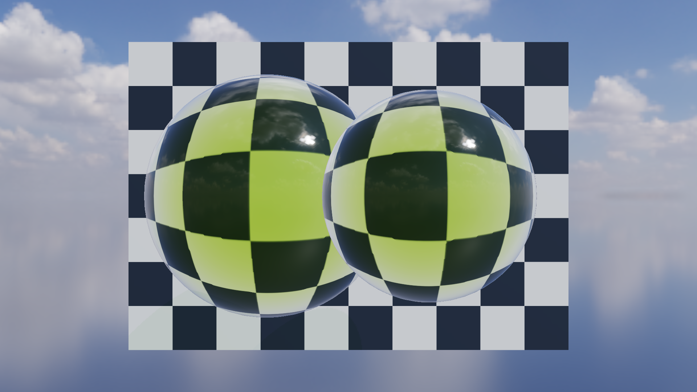
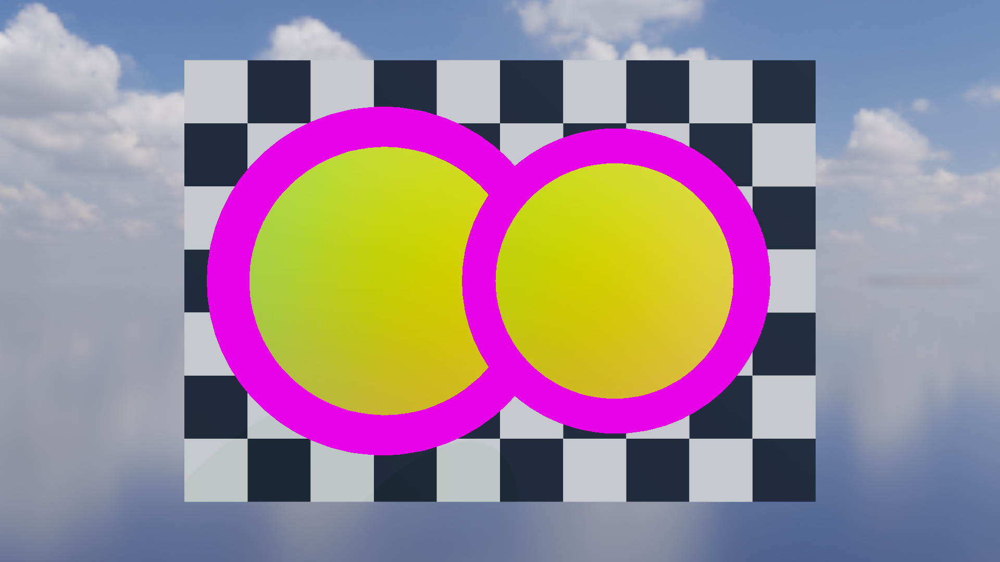

# Glass-2C 曲面体积玻璃（Curved Volume Glass）

- 记录日期：2026-09-14（本文内容最后一次变更）；文中嵌入的基线图在 2026-09-16 的 P0-A 基线重锚定中随 Kloofendal EXR 重拍
- 源码 revision：`ce77754`（`docs/glass2c-volume.md` 最后一次变更所在提交）；仓库当前 HEAD 为 `35a726c`，那一轮 56 张基线 PNG 与 `docs/images/README.md` 仍是未提交的工作树改动，依据见 [`regression-baseline-audit.md`](regression-baseline-audit.md)
- 构建目录：`build-mingw`（`README.md` 记录的 Glass-2C 验收入口）；视觉回归与 Benchmark target 与具体构建树无关，`build-ci-msvc` 同样可用
- GPU / 驱动 / OpenGL：NVIDIA GeForce RTX 4060 Laptop GPU / NVIDIA 591.44 / OpenGL 3.3.0；采集分辨率 1920×1080

## 目标与范围

Glass-2C 把 Glass-2B 的相机深度（camera-depth）厚度估计升级为面向对象的双界面折射（two-interface refraction）路径，适用于平滑闭合体积。目标是复现 `KHR_materials_volume` 所展示的材质行为：曲面背景畸变、Fresnel 边缘反射，以及吸收随介质内行进距离增长。

本阶段仍然只做屏幕空间（screen-space）解法：不重建离屏出射面、不做排序无关透明（order-independent transparency），Split-Sum IBL 资源也不在每帧重新生成。这些边界的具体后果写在「限制与取舍」。

## 实现

### 运行时：夹具与预设

`glass_volume_sphere.gltf` 包含一个生成出来的 1,986 顶点 / 3,968 三角形的闭合流形（closed manifold）球体，带 `KHR_materials_transmission`、`KHR_materials_ior` 与 `KHR_materials_volume` 三个扩展。资产测试逐条统计无向三角形边并要求恰好被使用两次，以此抓出开放接缝（用例 `asset-import`）。

加载该夹具，或选择 `View -> Volume glass preset`，会创建两个相互独立的球体实例、一块原创的程序化棋盘格（procedural checkerboard）背景与一个固定的正面机位。Inspector 控件包括：

- Two-interface refraction On/Off；
- Transmission、IOR、Roughness、Attenuation Color、Attenuation Distance 与 Thickness Scale；
- Clear、Olive 与 Amber 三组材质预设，且关闭色散（dispersion）；
- Final、Thickness、Transmittance、Exit Surface Normal、Object ID，以及更早的玻璃调试视图。

自动化使用 `MYRENDERER_TWO_INTERFACE_REFRACTION=0|1` 与 `MYRENDERER_GLASS_DEBUG=0..10`。

### 渲染：面向对象的出射面流程（object-aware exit-surface flow）

```text
Opaque HDR + Split-Sum IBL
  -> for each transmissive RenderItem, immediately before its sorted draw
       -> R32F entry depth using GL_MIN
       -> R32F exit depth using GL_MAX
       -> RGBA16F encoded exit normal + valid bit
       -> R32UI RenderItem object ID
  -> trace the internal refracted ray against the paired exit-depth field
  -> interpolate the depth crossing to remove step bands
  -> air -> glass Snell refraction
  -> glass -> air Snell refraction using the sampled exit normal
  -> opaque screen-space hit or prefiltered HDR environment fallback
  -> Beer-Lambert attenuation using the entry-to-exit path length
```

这份缓存按 `RenderItem` 重建、也按 `RenderItem` 消费，因此第二个玻璃实例不可能把自己的出射深度或出射法线贡献给当前对象。R32UI 层仍然会在着色器里被校验，并作为 Object ID 调试视图暴露出来：一旦配对出错就能被看见，同时安全地强制回退到材质厚度。

当内部折射射线在两个 march step 之间跨过采样到的出射深度场时，着色器对交点位置做线性插值。这一步消掉了「离散首命中位置」带来的同心路径长度条带（concentric path-length bands）。如果出射面离开屏幕，或者网格不构成可用的闭合体积，着色器保留 Glass-2B 的局部平行出射近似（locally parallel exit approximation），而不是返回无效辐亮度。

### 渲染：HDRI 与 Split-Sum IBL

`assets/environments/kloofendal_48d_partly_cloudy_puresky_4k.exr` 是 Poly Haven 的 4096x2048 OpenEXR 版本，内容为 CC0 许可的 `Kloofendal 48d Partly Cloudy (Pure Sky)` 环境，作者为 Greg Zaal 与 Jarod Guest。TinyEXR 直接把它的 HALF/FLOAT RGB(A) 通道解码进渲染器的线性浮点辐亮度缓冲。来源与许可记录在 `assets/environments/README.md`。渲染器启动时把它转换成：

- skybox 使用的辐亮度 Cubemap；
- 余弦加权（cosine-weighted）的漫反射辐照度 Cubemap；
- GGX 重要性采样的预滤波高光 Cubemap；
- 双通道 BRDF 积分 LUT。

可见的辐亮度 Cubemap 每个面用 512x512 texel，好让 4K 源图保留有用的云与太阳细节。更昂贵的 GGX 预滤波保持独立的 64x64 基础分辨率，从而保住既有启动开销，同时对粗糙反射仍然足够。

辐亮度与预滤波 Cubemap 使用 RGB32F，因为这张未裁剪的 EXR 的太阳大约达到 75,360，超过 RGB16F 的最大有限值 65,504。漫反射辐照度与 BRDF LUT 保持 half-float：它们的积分值仍在范围内；全精度贴图则避免 ACES tone mapping 期间出现 Inf/NaN 黑块，并为高光反射保住太阳高光。

Cook-Torrance 环境项现在遵循标准的 split-sum 形式。这片部分多云的正午天空提供了中性地平线、可读的云场与高动态范围反射。如果 EXR 文件不可用，同一条管线改由确定性的程序化 Studio 环境构建。

### UI：Inspector 控件与调试视图

玻璃开关位于 Inspector 的 `Glass feature toggles` 分组：`Two-interface refraction` 决定是否追踪曲面出射面并在出射时再做一次 Snell 折射，`Geometric glass thickness` 决定是否使用几何深度跨度，体积参数（Transmission、IOR、Roughness、Attenuation Color、Attenuation Distance、Thickness Scale）随体积玻璃材质预设一起提交；调试视图由 `Render diagnostics` 分组下的 `Glass debug view` 下拉框选择。

本阶段新加的四个体积玻璃视图对应 `Glass debug view` 的第 5、6、9、10 项（`Thickness`、`Transmittance`、`Exit surface normal`、`Object ID`），因此它们既能在 UI 里直接看，也能用环境变量在隐藏窗口下确定性地重拍。

## 截图

### 4x MSAA 最终画面：双界面折射 On

固定机位、1920×1080、4x MSAA 下，两个独立玻璃实例同时呈现曲面背景畸变、边缘 Fresnel 反射与橄榄色体积吸收：棋盘格在球体内部被强烈弯折并被压暗，球体轮廓上出现一圈亮环，球面靠近上缘处还能看到天空与云的高光反射。这张图证明几何厚度驱动的 Beer-Lambert 吸收与曲面出射面追踪在同一次绘制里同时生效。


### 双界面折射 On/Off 对照：局部平行近似

同一机位的近似模式使用 Glass-2B 的局部平行出射近似，与上一张 On 图构成对照：关闭双界面折射后，出射面上的第二次 Snell 折射消失，球体内部的棋盘格变成规则的放大图案，不再出现 On 图里那种被弯折并压暗的暗带与亮环。两栏一起证明出射法线采样确实改变了背景畸变的形状，而不只是改变了亮度。



### 曲面出射法线调试视图

`MYRENDERER_GLASS_DEBUG=9` 直接输出采样到的出射法线：球面上是连续渐变的法线方向，说明内部射线确实跨越到了配对的出射表面；品红像素标记文档记录的屏幕空间回退区域，即出射面离开屏幕或网格不构成可用闭合体积的那些像素。



三张图的仓库入口与单张重拍命令如下（视觉回归目标会同时采集 7 张并逐像素比对）：

```powershell
# 一次采集并比对 7 张 1920x1080 基线
cmake --build build-mingw --target glass2c-visual-regression

# 单张重拍：4x MSAA 最终画面
$env:MYRENDERER_SMOKE_TEST='1'; $env:MYRENDERER_RENDER_WIDTH='1920'; $env:MYRENDERER_RENDER_HEIGHT='1080'
$env:MYRENDERER_HIDE_SELECTION_OUTLINE='1'; $env:MYRENDERER_MSAA='4'
$env:MYRENDERER_SCREENSHOT='build-ci-msvc/glass2c_msaa4.png'
build-ci-msvc/Release/MyRenderer.exe assets/models/glass_volume_sphere.gltf

# 单张重拍：局部平行近似（双界面折射 Off）
$env:MYRENDERER_TWO_INTERFACE_REFRACTION='0'
$env:MYRENDERER_SCREENSHOT='build-ci-msvc/glass2c_approximate.png'
build-ci-msvc/Release/MyRenderer.exe assets/models/glass_volume_sphere.gltf

# 单张重拍：出射法线调试视图
$env:MYRENDERER_TWO_INTERFACE_REFRACTION='1'; $env:MYRENDERER_GLASS_DEBUG='9'
$env:MYRENDERER_SCREENSHOT='build-ci-msvc/glass2c_exit_normal.png'
build-ci-msvc/Release/MyRenderer.exe assets/models/glass_volume_sphere.gltf
```

## 验证

参考机：NVIDIA GeForce RTX 4060 Laptop GPU、OpenGL 3.3.0 NVIDIA 591.44、1920x1080。每个 benchmark 配置使用 30 帧预热与 90 帧测量，且关闭 VSync。

| MSAA | Two-interface | GPU P50 | GPU P95 | CPU frame P50 | CPU frame P95 | Draw calls | Render memory |
|---:|:---:|---:|---:|---:|---:|---:|---:|
| 1x | Off | 1.793 ms | 3.055 ms | 3.422 ms | 4.697 ms | 21 | 148.23 MiB |
| 1x | On | 2.203 ms | 3.903 ms | 3.950 ms | 5.483 ms | 21 | 148.23 MiB |
| 4x | Off | 2.201 ms | 3.385 ms | 3.721 ms | 4.754 ms | 21 | 243.16 MiB |
| 4x | On | 2.271 ms | 3.611 ms | 3.848 ms | 5.001 ms | 21 | 243.16 MiB |

这四组配置由 `tools/Glass2cBenchmark.cmake` 固定：1x/4x MSAA × 双界面折射 0/1，1920×1080，`MYRENDERER_BENCHMARK_WARMUP=30`、`MYRENDERER_BENCHMARK_FRAMES=90`，结果写入 `<构建目录>/glass2c-benchmarks/glass2c_msaa{1|4}_two_interface{0|1}.json`。开关双界面折射在 1x 下把 GPU P50 从 1.793 ms 抬到 2.203 ms、CPU frame P50 从 3.422 ms 抬到 3.950 ms，而 4x 下只有 2.201 → 2.271 ms 与 3.721 → 3.848 ms；Draw call 恒为 21，显存只随 MSAA 从 148.23 MiB 变为 243.16 MiB，说明这条路径没有增加 draw call，代价集中在内部折射的着色与采样。

7 张图的回归矩阵覆盖 1x/4x Final、局部平行 Approximate、Thickness、Transmittance、Exit Normal 与 Object ID。一次干净的复跑对全部 7 张基线报告 MAE 0 与 0% changed pixels；该矩阵对未来驱动运行有意保持 GPU 容差（`MAE <= 0.015`、changed pixels <= 8%），与 `tools/Glass2cVisualRegression.cmake` 传给 `MyRendererImageComparison` 的两个阈值一致。夹具侧的断言由 `asset-import` 承担：`glass_volume_sphere.gltf` 必须导入为单个 mesh、顶点数大于 1900，并且是闭合三角形流形，`OliveVolumeGlass` 的 transmissionFactor、thicknessFactor 与 attenuationColor 排序也必须成立。

> **待复核**：本节数字与结论按原文保留，但其中若干项无法在本会话从仓库复核：
> - 四组 P50/P95、Draw call 21 与 148.23 / 243.16 MiB 只在本文有记录；`docs/performance/` 目前只版本化了 Prism-5 的 `prism5_samples_*.json`，Glass-2C 的 benchmark 输出没有入库，因此这些数值只能靠重跑 `glass2c-benchmark` 复核（本会话不运行构建）。
> - 「全部 7 张基线 MAE 0 与 0% changed pixels」是 2026-09-16 基线重锚定那一轮的结论，[`regression-baseline-audit.md`](regression-baseline-audit.md) 记录该轮十个视觉套件全部 Pass、每张图 report MAE `0` 与变化像素 `0%`；本会话没有重跑 GPU 回归，只能引用该审计结论。
> - EXR 的太阳峰值 75,360 需要解码 4K OpenEXR 才能复核，仓库里没有记录它的工具；RGB16F 的最大有限值 65,504 与 `src/render/EnvironmentMap.cpp` 的注释一致。
> - 本文所有数字都来自同一台参考机，原文没有跨机器证据。

## 限制与取舍

- **方法仍然是屏幕空间的。** 离屏出射面与缺失的出射像素都使用已记录的 Glass-2B 回退路径。
- **配对在独立 `RenderItem` 之间是精确的。** 打包进同一个 item 的多个嵌套或凹壳仍然可能选到最远的那层壳。
- **透明合成仍是排序 alpha blending**，不是排序无关透明。
- **Split-Sum 资源在启动时由 CPU 预计算**，为的是 OpenGL 3.3 的可移植性；它们不是每帧重复执行的 IBL 生成 pass。
- **`MYRENDERER_GLASS_DEBUG` 只覆盖 0..10**：原文给出的取值范围到此为止，Glass-3 的 caustics 与 transmission shadow 视图（11、12）不在本阶段范围内。
- **基线图与本文并非同一提交**：图片最近一次改写发生在 2026-08-29 的 `245b663`，本文内容在 2026-09-14 的 `ce77754` 变更，2026-09-16 的 P0-A 重锚定又改写了一批 PNG 且尚未提交；引用这些图时必须同时说明它们属于哪一轮采集。

## 复现命令

```powershell
# 视觉回归：采集并比对 7 张 1920x1080 固定机位图
cmake --build build-mingw --target glass2c-visual-regression

# Benchmark：1x/4x MSAA × 双界面折射 0/1，输出 JSON 到构建目录
cmake --build build-mingw --target glass2c-benchmark

# 手工单张定位（示例：4x MSAA 最终画面）
$env:MYRENDERER_SMOKE_TEST='1'; $env:MYRENDERER_RENDER_WIDTH='1920'; $env:MYRENDERER_RENDER_HEIGHT='1080'
$env:MYRENDERER_HIDE_SELECTION_OUTLINE='1'; $env:MYRENDERER_MSAA='4'
$env:MYRENDERER_SCREENSHOT='build-ci-msvc/glass2c_msaa4.png'
build-ci-msvc/Release/MyRenderer.exe assets/models/glass_volume_sphere.gltf
```

可直接覆盖的相关环境变量是 `MYRENDERER_MSAA`、`MYRENDERER_TWO_INTERFACE_REFRACTION`、`MYRENDERER_GLASS_DEBUG`、`MYRENDERER_HIDE_SELECTION_OUTLINE`、`MYRENDERER_RENDER_WIDTH`、`MYRENDERER_RENDER_HEIGHT` 与 `MYRENDERER_SCREENSHOT`。夹具的完整机位、两个实例与棋盘格背景由加载 `glass_volume_sphere.gltf`（或 `View -> Volume glass preset`）自动建立。

## 下一步

1. 把 2026-09-16 接受基线更新后的 56 张 PNG、`docs/images/README.md` 与 [`regression-baseline-audit.md`](regression-baseline-audit.md) 作为一个明确批准的基线更新整体提交，再进入后续功能改动（`todolist.md` 的 `P0-A：先锁定回归基线`，以及该审计文档的「下一步」）。
2. Glass-2C 的 benchmark 数字目前没有版本化产物；若要像 Prism-5 那样做跨机器对照，需要新增一条把 `glass2c-benchmark` 的 JSON 登记到 `docs/performance/` 的工作包，并在登记后回填本页表格的来源。
