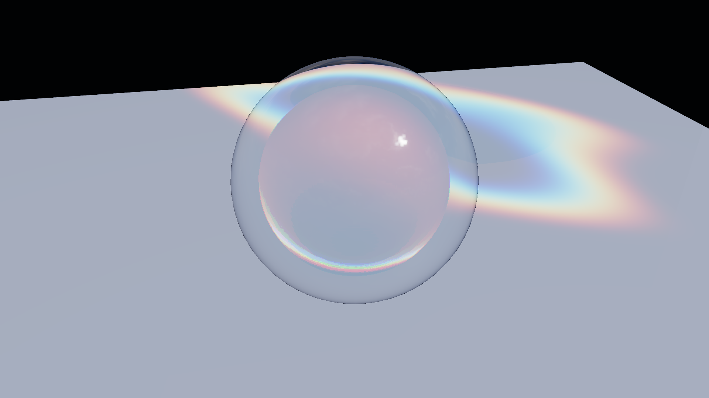
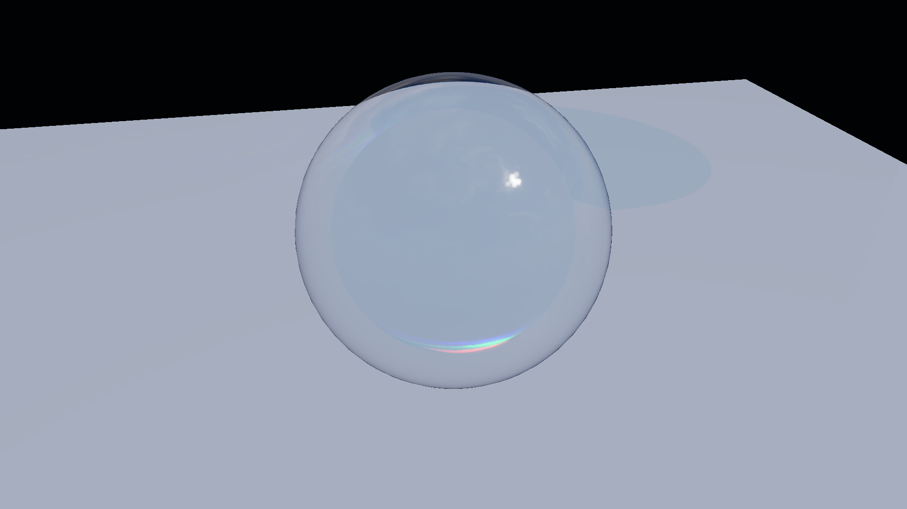

# Glass-3 彩色焦散与透射阴影

- 记录日期：2026-08-24（本文内容最后一次变更，`5cbbf1b`）；本文嵌入的基线图在 2026-09-16 的 P0-A 基线锚定中随 Kloofendal EXR 重拍，其中 `glass3_projector`、`glass3_lightspace_msaa1`、`glass3_lightspace_msaa4`、`glass3_caustics_off` 四张有变化，两张调试视图未变，那一轮改动仍是未提交的工作树改动，依据见 [`regression-baseline-audit.md`](regression-baseline-audit.md)
- 源码 revision：`5cbbf1b`（`docs/glass3-caustics.md` 最后一次变更所在提交）；仓库当前 HEAD 为 `35a726c`，本文描述的两条焦散路线、环境变量与验收目标在该 revision 的 `src/render/CausticsMap.h` / `.cpp`、`src/render/Renderer.cpp` 与 `CMakeLists.txt` 中仍然存在
- 构建目录：`build-release`（`README.md` 记录的 Glass-3 验收入口）；视觉回归与 Benchmark target 与具体构建树无关，`build-ci-msvc` 同样可用
- GPU / 驱动 / OpenGL：NVIDIA GeForce RTX 4060 Laptop GPU / NVIDIA 591.44 / OpenGL 3.3.0；采集分辨率 1920×1080，基准固定 4x MSAA、30 帧预热、90 帧测量
- 回归基线决策与验收面背景见 [`regression-baseline-audit.md`](regression-baseline-audit.md)

## 目标与范围

Glass-3 在现有方向光、透明材质和 HDR 管线之上增加两条互补路线：`Projector / Decal` 用于快速美术定向，`Light-space RGB` 用于展示从灯光和玻璃几何出发的实时光能近似。两种路线共用同一张 1024×1024 RGBA16F 焦散纹理、同一份方向光 View-Projection、同一套接收材质采样与空间滤波，因此切换模式不会换一套接收端逻辑。

本阶段明确不做几件事：不引入接收者 G-Buffer、分层投影或 Ray Query（因此只有单一水平接收平面），不做玻璃内部多次反射或任意接收网格的路径追踪，也不做时序累积——空间滤波是本阶段选定的降噪手段，它降低闪烁但不恢复缺失的几何光路。

## 实现

### 持久化：`.myscene` 里的焦散字段

焦散设置随 `.myscene` 往返：`SceneDocument.cpp` 写入并读回 `causticsEnabled`、`causticsMode`、`causticsStrength`、`causticsScale`、`causticsDirection`、`causticsSharpness`、`causticsAnimated` 与 `causticsReceiverPlaneY`，彩色透射阴影的开关 `coloredTransmissionShadowsEnabled` 也在同一份 `RendererSettings` 列表里。`causticsMode` 以整数写入，`0` 对应 `Projector`、`1` 对应 `LightSpace`。

### UI：Inspector 与自动化入口

焦散控件位于 Renderer Inspector 的 `Lighting & environment` 分组，编辑后提交一条 `EditorCommandType::SetCausticsSettings`：

- `HDR caustics`（`causticsEnabled`）：独立启停焦散，不影响玻璃主体折射。
- `Caustics mode`：`Projector / decal` 或 `Light-space RGB`；该下拉框只在焦散启用时显示。
- `Caustics strength`（0.00～8.00）、`Caustics scale`（0.10～3.00）、`Caustics direction`（每轴 -1.50～1.50）、`Caustics sharpness`（0.00～1.00）：分别控制能量、折射位移、落点偏移和空间滤波宽度。
- `Animate caustics`：只驱动 Projector 的程序化波纹；Light-space 模式保持几何驱动，因此该复选框在非 Projector 模式下整体禁用。
- `Colored transmission shadows`（同一分组的 `Lighting & environment` 小节）：独立启停 RGB 透射阴影。
- Debug 11 / 12：分别显示 Caustics Map 与合成后的 Transmission Shadow Visibility（由 `Render diagnostics` 分组的 `Glass debug view` 选择，第 11、12 项）。

自动化入口：`MYRENDERER_GLASS3_DEMO=1`、`MYRENDERER_CAUSTICS=0|1`、`MYRENDERER_CAUSTICS_MODE=0|1`、`MYRENDERER_TRANSMISSION_SHADOWS=0|1`、`MYRENDERER_GLASS_DEBUG=11|12`。`MYRENDERER_GLASS3_DEMO=1` 同时把演示场景的相机、接收面颜色、背景色、环境强度与 Crystal preset 一并设好，因此隐藏窗口下也能确定性地重拍。

### 渲染：帧流程

```text
Opaque shadow depth
  -> Colored transmission shadow (RGBA16F, multiplicative blend)
  -> Projector or Light-space RGB caustics (RGBA16F, additive blend)
  -> Horizontal + vertical spatial filter
  -> Opaque HDR scene samples shadow transmittance and caustic radiance
  -> Forward transparent / refractive scene
  -> Bloom + tone map
```

不透明 Shadow Map 只写入不透明子网格。透明玻璃在同一 Light-space 中写入独立的透射纹理；纹理先清为白色，再用 `destination × sourceTransmittance` 累积每个玻璃边界。每个表面使用一半光学厚度，因此闭合体的前后边界相乘后近似完整 Beer-Lambert 衰减。接收 Shader 将 PCF 可见度与 RGB 透射率相乘，不再把高透射玻璃当成纯黑遮挡。

### 渲染：Projector / Decal

Projector Shader 直接在 Light-space HDR 纹理中生成可旋转、缩放、变锐和动画的 RGB 环带。它不声称求解真实光路，适合 TA 快速构图、概念验证和低成本档位。Intensity、Scale、Direction、Sharpness 与 Animation 都能在 Inspector 中实时调整。

### 渲染：Light-space RGB

进阶模式从方向光出发，对玻璃入射三角形分别计算 R/G/B 折射率。每个三角形在接收平面的折射落点生成一个小型 Photon Splat，并使用 `GL_ONE + GL_ONE` 累积 HDR 能量；样本越集中，结果越亮。RGB 分别提交（每条通道各遍历一次可见的透射物体），使 Dispersion 能产生可读的通道分离。

当前实现是实时光栅近似：它用入射界面折射方向投影到单一水平接收平面，并未追踪玻璃内部多次反射或任意接收网格。Geometry Shader 的 Splat 避免把变形后的原始三角形直接拉伸到地面，从而消除长尖刺；随后两次可调 Gaussian 空间滤波（水平一遍、垂直一遍）降低低采样网格边缘的闪烁。静态灯光、物体和参数下输出完全确定，不需要历史缓冲。

### 诊断：焦散 Pass 的时间与显存

焦散 Pass 是 `Renderer` 的 Pass 序列里一个具名条目（`Light-space RGB caustics` 或 `Caustics projector HDR`），它自己带一对时间戳查询，因此 Benchmark JSON 的 `gpuCausticsP50Ms` / `gpuCausticsP95Ms` 是独立于整帧的读数；Inspector 也会在旁边显示 `Caustics map: 1024 x 1024 | GPU <毫秒>`。显存侧，`CausticsMap::estimatedBytes()` 按两张 1024² RGBA16F 纹理计算，透射阴影纹理按 2048² RGBA16F 计算，二者都在启动时预分配，所以切换模式或开关焦散不产生新的分配。

## 截图

六张图都由 `glass3-visual-regression` 在同一机位、同一 1920×1080 下采集，夹具与演示场景由 `MYRENDERER_GLASS3_DEMO=1` 建立。

### 固定水晶基线：Light-space RGB + 空间滤波

同一机位下，水晶玻璃球压在白色接收面上、背景接近黑场：地面上出现一段带通道分离的焦散高光，球体下方还有一层带颜色的透射阴影。这张图是 Light-space 模式的参考画面，证明 RGB Photon Splat 的聚焦与两遍空间滤波之后的接收面采样结果稳定可复拍。


### Caustics On/Off 对照：关掉焦散剩下什么

同一机位、同一玻璃与同一组透射阴影参数下，关闭焦散后地面上的聚焦高光整段消失，只剩那层偏蓝的透射阴影；打开后高光重新出现在球体左下方，而阴影的位置与形状不变。两栏一起证明焦散 Pass 只贡献接收面上的额外辐亮度，没有连带改变玻璃主体折射或阴影可见性。下图是 Off 一侧，On 一侧即上面的基线图 `glass3_lightspace_msaa4.png`。


### Projector / Decal：明确的美术近似

同一机位切到 Projector 模式后，地面上出现的是一圈可旋转、缩放与动画的 RGB 环带，形状与水晶几何没有对应关系。这张图是「Projector 不声称求解真实光路」这句结论的可视证据，也是它适合快速构图与低成本档位的原因。



### 调试视图：焦散贴图与透射阴影可见性

`MYRENDERER_GLASS_DEBUG=11` 直接输出滤波后的焦散贴图在接收面上的原始采样：可以看到 splat 的堆叠、三角形边界处的台阶状边缘，以及空间滤波之后的软边。这张图证明通道分离发生在焦散贴图内部，而不是在最终合成里被后处理出来。


`MYRENDERER_GLASS_DEBUG=12` 输出经过 PCF 与乘性 Beer-Lambert 阴影合成后的 RGB 透射可见性：球体在本该纯黑的不透明阴影里留下的是一层带颜色的半透明遮挡。这张图证明高透射玻璃确实不再被当成纯黑遮挡物。


### MSAA 覆盖：1x 与 4x 只差边缘采样

同一机位、同一参数下，1x 与 4x MSAA 的画面内容一致（同样的聚焦位置、同样的通道分离与阴影形状），差别集中在球体轮廓与焦散高光的边缘处。这张图证明焦散与透射阴影不依赖 MSAA 才能成立。



4x 一侧即上面的 `glass3_lightspace_msaa4.png`。一次采集并比对六张基线（「验证」一节的三行性能数字来自另一个 target）：

```powershell
cmake --build build-release --target glass3-visual-regression
cmake --build build-release --target glass3-benchmark
```

单张重拍时，`tools/Glass3VisualRegression.cmake` 使用的固定环境变量是 `MYRENDERER_GLASS3_DEMO=1`、`MYRENDERER_SMOKE_TEST=1`、`MYRENDERER_RENDER_WIDTH=1920`、`MYRENDERER_RENDER_HEIGHT=1080`、`MYRENDERER_HIDE_SELECTION_OUTLINE=1`、`MYRENDERER_GLASS_DEBUG=0`、`MYRENDERER_CAUSTICS=1`、`MYRENDERER_CAUSTICS_MODE=1`、`MYRENDERER_TRANSMISSION_SHADOWS=1`，每次都把 `MYRENDERER_SCREENSHOT` 指向目标文件，再运行 `build-release/Release/MyRenderer.exe`；六张之间只有下面这一列不同：

| 基线图 | 覆盖的环境变量 |
| --- | --- |
| `glass3_lightspace_msaa1` | `MYRENDERER_MSAA=1 MYRENDERER_CAUSTICS_MODE=1` |
| `glass3_lightspace_msaa4` | `MYRENDERER_MSAA=4 MYRENDERER_CAUSTICS_MODE=1` |
| `glass3_caustics_off` | `MYRENDERER_MSAA=4 MYRENDERER_CAUSTICS=0` |
| `glass3_projector` | `MYRENDERER_MSAA=4 MYRENDERER_CAUSTICS_MODE=0` |
| `glass3_caustics_debug` | `MYRENDERER_MSAA=4 MYRENDERER_GLASS_DEBUG=11` |
| `glass3_transmission_shadow` | `MYRENDERER_MSAA=4 MYRENDERER_GLASS_DEBUG=12` |

## 验证

### 视觉回归矩阵

`glass3-visual-regression` 固定为 1920×1080，覆盖 Light-space 1x/4x MSAA、Caustics Off、Projector、Caustics Debug 和 Transmission Shadow Debug 六个场景。空间滤波和静态参数保证同机重拍稳定：比较器 `MyRendererImageComparison` 使用 MAE `0.015` 与变化像素 `8%` 两个阈值（由 `tools/Glass3VisualRegression.cmake` 直接传入），采集或比对失败即报 `FATAL_ERROR`、target 非零退出。本套件也是 `renderer-regression-suite` 的一员，因此它的失败会让整套验收失败。

### 性能

RTX 4060 Laptop、OpenGL 3.3、1920×1080、4x MSAA，30 帧预热、90 帧采样：

| 模式 | Caustics GPU P50 / P95 | Draw Call | 整帧 GPU P50 / P95 |
| --- | ---: | ---: | ---: |
| Off | 0 / 0 ms | 16 | 2.423 / 3.585 ms |
| Projector + 2-pass filter | 0.071 / 0.072 ms | 19 | 2.303 / 3.166 ms |
| Light-space RGB + 2-pass filter | 0.091 / 0.091 ms | 21 | 2.273 / 3.199 ms |

三种模式的 RenderTarget 估算均为 305,299,296 bytes，因为资源在启动时预分配以避免切换模式时卡顿。相较 Glass-2C，新增开销主要来自 2048² RGBA16F 透射阴影（32 MiB）和两张 1024² RGBA16F 焦散/滤波纹理（16 MiB）。整帧差异小于正常运行噪声，因此性能判断使用独立 Caustics Timestamp Query。

### 已知失败与未验证项

> **待复核**：以下数字与标签按原文保留，但本会话无法从仓库逐项复核（本会话不运行构建）：
> - 三行 P50/P95、Draw Call 与 `305,299,296 bytes` 只在本文有记录；`docs/performance/` 只版本化了 Prism-5 的 `prism5_samples_*.json`，Glass-3 的 Benchmark JSON 没有入库（`glass3-benchmark` 把 `glass3_off.json`、`glass3_projector.json`、`glass3_lightspace.json` 写进构建目录），只能靠重跑该 target 复核。
> - `305,299,296 bytes` 的标签是「RenderTarget 估算」，但它是整份渲染资源估算的量级：`Renderer::estimatedRenderMemoryBytes()` 是 RenderTarget、G-Buffer、PostProcessor、SelectionOutline、EnvironmentMap、ShadowMap、SsaoRenderer、CausticsMap 与 SpectralBeam VBO 的估算之和。按当前工作树的 `estimatedBytes()` 实现与 1920×1080 / 4x MSAA 相加得到的值远高于 305,299,296 bytes，因为 TAA/SSAO 缓冲与 Kloofendal 新基线输入都在其后发生过变化；这个数是否就是当年的 `estimatedRenderMemoryBytes()`，本文没有记录，无法在两次采集之间重建。
> - 「相较 Glass-2C 的新增开销」一项：2048² RGBA16F = 33,554,432 bytes ≈ 32 MiB 与两张 1024² RGBA16F = 16,777,216 bytes = 16 MiB 与 `ShadowMap.h` / `CausticsMap.h` 的 `estimatedBytes()` 一致；但「相较 Glass-2C 新增」这一比较关系没有版本化数字可对（Glass-2C 的 benchmark 输出同样没有入库）。
> - 「整帧差异小于正常运行噪声」是原文在没有给出噪声幅度的情况下的判断，本文无法复核其阈值。

## 限制与取舍

- **只支持一个水平接收平面。** 墙面、曲面或多个高度需要接收者 G-Buffer、分层投影或 Ray Query；`causticsReceiverPlaneY` 是唯一的高度控制。
- **Light-space 模式使用单次入射折射和 Photon Splat**，不是完整双界面路径追踪；强凹形、嵌套介质和全反射不完整。
- **折射落点离开 8×8 Light-space 范围时会被裁掉**；Direction/Scale 过大可主动复现离屏失败。
- **低面数玻璃会减少 Splat 密度**；空间滤波能降低闪烁，但不能恢复缺失的几何光路。
- **Projector 是明确的美术近似**，不能作为物理焦散证据；作品集算法对照应使用 Light-space 模式。
- **所有性能数字来自同一台参考机**（RTX 4060 Laptop / 驱动 591.44 / OpenGL 3.3.0），原文没有跨机器证据；`glass3-benchmark` 把结果写进构建目录，换机器复测不会覆盖本文的表格。
- **基线图与本文并非同一提交**：`glass3_projector`、`glass3_lightspace_msaa1`、`glass3_lightspace_msaa4`、`glass3_caustics_off` 四张最近一次入库是 2026-08-29 的 `245b663`，`glass3_caustics_debug` 与 `glass3_transmission_shadow` 两张停在 2026-08-24 的 `5cbbf1b`；2026-09-16 的 P0-A 重锚定又在工作树里改写了前四张且尚未提交。引用这些图时必须说明它们属于哪一轮采集。
- **`MYRENDERER_GLASS3_DEMO=1` 与 `View / Glass caustics preset` 是同一场景的两个入口**，前者是本文与 `tools/` 使用的方式；`README.md` 也以 `MYRENDERER_GLASS3_DEMO=1` 记录 Glass-3 的进入方式。

## 复现命令

```powershell
# 视觉回归：采集并比对 6 张 1920x1080 固定机位图
cmake --build build-release --target glass3-visual-regression

# Benchmark：Off / Projector / Light-space 三档的独立焦散与整帧 GPU P50/P95
cmake --build build-release --target glass3-benchmark
```

单张定位示例（Projector 模式与透射阴影调试视图）：

```powershell
# 单张重拍：Projector / Decal 模式
$env:MYRENDERER_GLASS3_DEMO='1'; $env:MYRENDERER_SMOKE_TEST='1'
$env:MYRENDERER_RENDER_WIDTH='1920'; $env:MYRENDERER_RENDER_HEIGHT='1080'
$env:MYRENDERER_HIDE_SELECTION_OUTLINE='1'; $env:MYRENDERER_GLASS_DEBUG='0'
$env:MYRENDERER_CAUSTICS='1'; $env:MYRENDERER_CAUSTICS_MODE='0'
$env:MYRENDERER_TRANSMISSION_SHADOWS='1'; $env:MYRENDERER_MSAA='4'
$env:MYRENDERER_SCREENSHOT='build-release/glass3_projector.png'
build-release/Release/MyRenderer.exe

# 单张重拍：透射阴影可见性调试视图
$env:MYRENDERER_CAUSTICS_MODE='1'; $env:MYRENDERER_GLASS_DEBUG='12'
$env:MYRENDERER_SCREENSHOT='build-release/glass3_transmission_shadow.png'
build-release/Release/MyRenderer.exe
```

可直接覆盖的相关环境变量是 `MYRENDERER_GLASS3_DEMO`、`MYRENDERER_CAUSTICS`、`MYRENDERER_CAUSTICS_MODE`、`MYRENDERER_TRANSMISSION_SHADOWS`、`MYRENDERER_GLASS_DEBUG`、`MYRENDERER_MSAA`、`MYRENDERER_HIDE_SELECTION_OUTLINE`、`MYRENDERER_RENDER_WIDTH`、`MYRENDERER_RENDER_HEIGHT` 与 `MYRENDERER_SCREENSHOT`。夹具的机位、白色接收地面、黑场背景与 Crystal preset 由 `MYRENDERER_GLASS3_DEMO=1`（或 `View / Glass caustics preset`）自动建立。

## 下一步

1. 把这一阶段的 On/Off 对照、Debug View、性能表与失败案例补齐成可发布的作品集交付物——对应 `todolist.md` 第 7 节「持续交付与作品集任务」，其中「每个旗舰阶段至少提供 Hero Shot、同机位 On/Off、Debug View、性能表、失败案例和复现命令」这一条与本页现有的六张图直接对应。
2. 把 2026-09-16 接受基线更新后的 56 张 PNG、`docs/images/README.md` 与 [`regression-baseline-audit.md`](regression-baseline-audit.md) 作为一个明确批准的基线更新整体提交，再进入后续功能改动（`todolist.md` 的 `P0-A：先锁定回归基线`）。
3. 接收面扩展（墙面、曲面、多高度）与玻璃内部多次反射目前没有路线图条目；若要推进，需要先按 `todolist.md` 的写法写成带验收口的工作包，而不是在本阶段直接扩实现。
4. Glass-3 的 Benchmark JSON 目前没有版本化产物；若要像 Prism-5 那样做跨机器对照，需要新增一条把 `glass3-benchmark` 的 JSON 登记到 `docs/performance/` 的工作包，并在登记后回填本页表格的来源。
