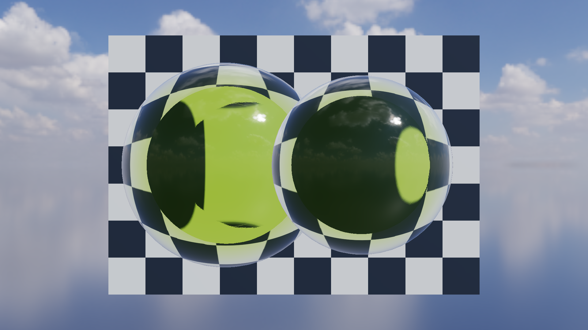

# Glass-4 作品集收口（Portfolio Validation）

- 记录日期：2026-08-25（本文内容最后一次变更，`763bd49`）；本文嵌入的基线图在 2026-09-16 的 P0-A 基线重锚定中随 Kloofendal EXR 重拍，那一轮改动仍是未提交的工作树改动，依据见 [`regression-baseline-audit.md`](regression-baseline-audit.md)
- 源码 revision：`763bd49`（`docs/glass4-validation.md` 最后一次变更所在提交）；仓库当前 HEAD 为 `35a726c`，本文描述的两条场景、Preset 表与验收目标在该 revision 的 `src/app/Application.cpp`、`src/app/ApplicationScene.cpp` 与 `CMakeLists.txt` 中仍然存在
- 构建目录：`build-release`（`README.md` 记录的 Glass-4 验收入口）；视觉回归与 Benchmark target 与具体构建树无关，`build-ci-msvc` 同样可用
- GPU / 驱动 / OpenGL：NVIDIA GeForce RTX 4060 Laptop GPU / NVIDIA 591.44 / OpenGL 3.3.0；采集分辨率 1920×1080，视觉矩阵固定 4x MSAA，性能实测固定 4x MSAA、VSync 关闭
- 回归基线决策与验收面背景见 [`regression-baseline-audit.md`](regression-baseline-audit.md)

## 目标与范围

Glass-4 是玻璃路线的收口阶段：把 Glass-2C 的曲面体积吸收与 Glass-3 的彩色焦散组装成两个确定性的展示场景，配上可独立开关的功能控件、视觉回归矩阵、Pass 级 GPU 证据和一份已保存的图形抓取（graphics capture）。目标是可复现的实时作品集案例（case study），而不是一张手工调出来的截图。

本阶段明确不做两件事：不把体积玻璃与焦散升级为通用光能传输求解（焦散仍然只做方向光到单一水平接收平面的一次折射），也不引入时序累积——空间滤波是本阶段选定的稳定性方案，代价写在「限制与取舍」。

## 实现

### 持久化：Glass-4 控件复用的是既有 `.myscene` 字段

本阶段没有新增持久化字段。三个开关与四组 Preset 全部写进既有的 `RendererSettings` 字段并随 `.myscene` 往返：`transmissionEnabled`、`dispersionEnabled`、`dispersionStrength`、`indexOfRefractionOverride`、`causticsEnabled`、`causticsMode`、`volumeGlassOverrideEnabled`、`volumeGlassTransmission`、`volumeGlassRoughness`、`volumeGlassAttenuationColor`、`volumeGlassAttenuationDistance`、`geometricThicknessEnabled`、`twoInterfaceRefractionEnabled` 与 `volumeThicknessScale` 都在 `SceneDocument.cpp` 的写入/读取列表里，因此「Glass-4 画出来的画面」与「场景文件里记下的参数」是同一份数据。

### 运行时：两条展示场景由 fixtures + 固定机位构成

两条场景都由夹具文件名触发，而不是由手工搭台：

- 加载 `assets/models/glass_volume_sphere.gltf`（或选择 `View -> Volume glass preset`）会点亮体积验证场景：`glassVolumeDemoEnabled_` 为真时，`rebuildSceneEntities()` 创建两个指向同一个 `GpuModel` 的独立 Entity（`primaryEntity_` 与 `comparisonEntity_`，每帧各生成一个 `RenderItem`），`syncSceneEntities()` 把第二个实例放到 `+0.92` 的 X 偏移、旋转归零、缩放取模型归一化比例的 `0.88`，并打开程序化棋盘格背景实体（资源名 `builtin:glass-checkerboard`，常量 `builtinGlassBackdropResource`）。环境中打包的 Kloofendal EXR 经 Split-Sum IBL 的 PBR/IBL 路径提供背景与反射（辐亮度 Cubemap + 余弦加权辐照度 + GGX 预滤波 + BRDF LUT），最后调用 `camera_.setOrbitPose(...)` 固定机位。
- 或选择 `View / Glass caustics preset` 会走 `activateGlassCausticsPreset()`：把 `volumeGlassPreset_` 设为 `Crystal`，把模型放在世界原点，打开白色接收地面、把背景色退到接近黑场、降低环境强度，并把 `causticsMode` 设为 `LightSpace` 且启用彩色透射阴影。焦散场景有它自己的固定机位，因此 Glass、Dispersion 与 Caustics 三个开关可以任意切换而不会改变构图。

### 渲染：四组可复用的体积 Preset

`applyVolumeGlassPreset()` 是唯一的材质参数入口，四组 Preset 共用同一条玻璃着色路径，只换材质参数（每次调用同时把 `volumeGlassOverrideEnabled` 置真、`volumeGlassTransmission` 置 `1.0`、`dispersionEnabled` 置真）：

| Preset | Attenuation RGB | Distance | Roughness | Dispersion | Intended use |
| --- | --- | ---: | ---: | ---: | --- |
| Clear | 1.00, 1.00, 1.00 | 8.00 | 0.04 | material/0 | neutral product glass |
| Olive | 0.68, 0.86, 0.22 | 0.85 | 0.06 | material/0 | thickness/absorption validation |
| Amber | 1.00, 0.48, 0.12 | 0.72 | 0.08 | material/0 | art-directed warm glass |
| Crystal | 0.78, 0.92, 1.00 | 2.00 | 0.06 | 2.00 | dispersion/caustics hero |

体积验证场景在 `MYRENDERER_GLASS_PRESET=1`（Olive）下采集，焦散 Hero 在 `MYRENDERER_GLASS_PRESET=3`（Crystal）下采集；两个场景共用同一套 Beer-Lambert 吸收、双界面折射与出射法线采样代码。

### UI：Renderer Inspector 的三个独立开关

Renderer Inspector 暴露三个互相独立的开关，任何组合都成立：

- `Glass transmission` 控制折射/透射材质路径（`transmissionEnabled`）。
- `Dispersion` 是真正的布尔闸门（`dispersionEnabled`）。关闭时，覆盖值（`Dispersion override`）与 glTF 材质自带的 Dispersion 都被玻璃着色器与 Light-space 焦散着色器忽略——`basic.frag` 与 `caustics_lightspace.geom` 都在 `uDispersionEnabled` 为假时把色散量直接取 0。
- `HDR caustics` 只控制焦散 Pass，玻璃材质与相机保持不变。

`Glass caustics preset` 与 `Volume glass preset` 两个菜单项只负责装载场景与 Preset，不修改上面三个开关的语义。

### 诊断：每个顶层 Pass 都有 `KHR_debug` 区间与时间戳

所有顶层 Pass 现在都带一段 `KHR_debug` 调试区间（`glPushDebugGroup`，名称即 `RenderPassContext::name`）和一对非阻塞时间戳查询。GUI 在每个活动 Pass 旁列出最近一次平滑后的耗时，Benchmark JSON 的 `gpuPasses` 则按 Pass 名给出 P50/P95 与测量帧数。这让「哪一段变慢了」可以直接从抓取或 JSON 里读出来，而不必靠猜。

## 截图

体积验证的两张图与 1x/4x MSAA 对照都由 `glass4-visual-regression` 在 1920×1080、4x MSAA（MSAA 一栏除外）、`assets/models/glass_volume_sphere.gltf` 夹具、棋盘格背景与 Kloofendal EXR 环境光下采集。

### 体积验证最终画面：曲面出口、配对与厚度吸收同时成立

同一机位下，两个独立玻璃实例同时呈现曲面背景畸变、边缘 Fresnel 反射与橄榄色厚度吸收：棋盘格在球体内部被弯折并被压暗，两个实例各自配对自己的入口/出口面、没有互相串用出射深度，球面上缘还能看到天空与云的高光反射。这张图证明曲面包裹的出射法线、对象级入口/出口配对、双界面折射与厚度相关的 Beer-Lambert 吸收在同一次绘制里同时生效。


### MSAA 覆盖：1x 与 4x 只差边缘采样

同一机位、同一材质参数下，1x MSAA 与 4x MSAA 的画面内容一致（同样的畸变、吸收与配对），差别集中在两个球体的轮廓与边缘处：4x 一侧的球体边缘更干净。这张图证明玻璃路径没有依赖 MSAA 才能成立的几何假设，MSAA 只影响边缘覆盖。



4x 一侧即默认 4x MSAA 的 `glass4_volume_final.png`。这两栏与其余调试视图的重拍命令：

```powershell
# 一次采集并比对 14 张 1920x1080 基线
cmake --build build-release --target glass4-visual-regression

# 单张重拍：体积验证最终画面（默认参数 + 4x MSAA）
$env:MYRENDERER_GLASS3_DEMO='0'; $env:MYRENDERER_SMOKE_TEST='1'
$env:MYRENDERER_RENDER_WIDTH='1920'; $env:MYRENDERER_RENDER_HEIGHT='1080'
$env:MYRENDERER_HIDE_SELECTION_OUTLINE='1'; $env:MYRENDERER_MSAA='4'
$env:MYRENDERER_TRANSMISSION='1'; $env:MYRENDERER_GEOMETRIC_THICKNESS='1'
$env:MYRENDERER_TWO_INTERFACE_REFRACTION='1'; $env:MYRENDERER_VOLUME_THICKNESS_SCALE='1.0'
$env:MYRENDERER_GLASS_PRESET='1'; $env:MYRENDERER_IOR='1.5'
$env:MYRENDERER_DISPERSION_ENABLED='0'; $env:MYRENDERER_DISPERSION='0'
$env:MYRENDERER_CAUSTICS='0'; $env:MYRENDERER_GLASS_DEBUG='0'
$env:MYRENDERER_SCREENSHOT='build-release/glass4_volume_final.png'
build-release/Release/MyRenderer.exe assets/models/glass_volume_sphere.gltf

# 单张重拍：1x MSAA 一侧，其余参数完全相同
$env:MYRENDERER_MSAA='1'
$env:MYRENDERER_SCREENSHOT='build-release/glass4_volume_msaa1.png'
build-release/Release/MyRenderer.exe assets/models/glass_volume_sphere.gltf
```

### 焦散 Hero：Light-space RGB 焦散与彩色透射阴影

同一机位下，水晶玻璃球压在白色接收面上、背景接近黑场：地面上出现一段带有通道分离的焦散高光，同时球体投下的是带颜色的透射阴影而不是纯黑阴影。这张图证明 Light-space RGB 焦散、彩色透射阴影与玻璃主体折射在同一次绘制里同时成立，而且三个开关互不影响构图。


```powershell
# 单张重拍：焦散 Hero（默认参数 + 4x MSAA）
$env:MYRENDERER_GLASS3_DEMO='1'; $env:MYRENDERER_SMOKE_TEST='1'
$env:MYRENDERER_RENDER_WIDTH='1920'; $env:MYRENDERER_RENDER_HEIGHT='1080'
$env:MYRENDERER_HIDE_SELECTION_OUTLINE='1'; $env:MYRENDERER_MSAA='4'
$env:MYRENDERER_TRANSMISSION='1'; $env:MYRENDERER_GEOMETRIC_THICKNESS='1'
$env:MYRENDERER_TWO_INTERFACE_REFRACTION='1'; $env:MYRENDERER_VOLUME_THICKNESS_SCALE='1.0'
$env:MYRENDERER_GLASS_PRESET='3'; $env:MYRENDERER_IOR='1.5'
$env:MYRENDERER_DISPERSION_ENABLED='1'; $env:MYRENDERER_DISPERSION='2.0'
$env:MYRENDERER_CAUSTICS='1'; $env:MYRENDERER_CAUSTICS_MODE='1'
$env:MYRENDERER_SCREENSHOT='build-release/glass4_caustics_final.png'
build-release/Release/MyRenderer.exe
```

### 其余十个调试视图

矩阵里还有十个视图用来定位具体环节：`glass4_volume_glass_off`（`MYRENDERER_TRANSMISSION=0`）、`glass4_volume_ior_low`（`MYRENDERER_IOR=1.1`）、`glass4_volume_ior_high`（`MYRENDERER_IOR=1.8`）、`glass4_volume_thickness_low`（`MYRENDERER_VOLUME_THICKNESS_SCALE=0.35`）、`glass4_volume_attenuation_clear`（`MYRENDERER_GLASS_PRESET=0`）、`glass4_volume_exit_normal`（`MYRENDERER_GLASS_DEBUG=9`）、`glass4_volume_object_id`（`MYRENDERER_GLASS_DEBUG=10`）、`glass4_volume_approximate`（`MYRENDERER_TWO_INTERFACE_REFRACTION=0`）以及焦散侧的 `glass4_caustics_dispersion_off`（`MYRENDERER_DISPERSION_ENABLED=0`）与 `glass4_caustics_off`（`MYRENDERER_CAUSTICS=0`）。它们的机位、参数与「这张图证明什么」登记在 [`images/README.md`](images/README.md) 的 Glass-4 两节，本文不重复贴图。

## 验证

### 视觉回归矩阵

`glass4-visual-regression` 采集并比对 14 张经人工复核的 1920×1080 图片。每个变量都使用同一场景相机与显式环境变量默认值，所以两张图之间只差一个开关。

| 覆盖项 | 基线图 |
| --- | --- |
| final / Glass Off | `glass4_volume_final`, `glass4_volume_glass_off` |
| IOR | `glass4_volume_ior_low`, `glass4_volume_ior_high` |
| Thickness / Attenuation | `glass4_volume_thickness_low`, `glass4_volume_attenuation_clear` |
| true exit data | `glass4_volume_exit_normal`, `glass4_volume_approximate` |
| dual-object pairing | `glass4_volume_object_id` |
| Dispersion / Caustics | `glass4_caustics_dispersion_off`, `glass4_caustics_off`, `glass4_caustics_final` |
| 1x / 4x MSAA | volume 与 caustics 的 `msaa1` 图分别对照它们 4x 的 final 图 |

轻量比较器 `MyRendererImageComparison` 接受平均绝对误差（mean absolute error）`0.015`、变化像素最多 `8%`，因此允许小的跨驱动差异，同时仍能抓住材质、对象配对、Pass 顺序与边缘回归。这两个阈值由 `tools/Glass4VisualRegression.cmake` 直接传给比较器；采集或比对失败时报出 `FATAL_ERROR`，该 target 失败即非零退出。

### 性能与 Pass 证据

硬件：NVIDIA GeForce RTX 4060 Laptop GPU、OpenGL 3.3 驱动 591.44。每个 Benchmark 使用 30 帧预热与 90 帧测量，1920×1080、4x MSAA、VSync 关闭。下表是本次运行的 GPU 时间戳查询中位数（median）；临时的操作系统/GPU 负载会影响整帧数值。

| Scenario | Draw calls | GPU frame P50 | Forward glass P50 | Caustics P50 | Measured memory |
| --- | ---: | ---: | ---: | ---: | ---: |
| Volume, local-parallel exit | 23 | 2.190 ms | 0.551 ms | — | 291.3 MiB |
| Volume, true curved exit | 23 | 2.464 ms | 0.703 ms | — | 291.3 MiB |
| Caustics Off | 16 | 2.348 ms | 0.798 ms | — | 291.3 MiB |
| Light-space RGB Caustics | 21 | 2.458 ms | 0.806 ms | 0.094 ms | 291.3 MiB |

本次采集中，真实曲面包裹的出射路径比局部平行近似在 Forward 玻璃 Pass 上多花约 `0.153 ms`；视觉对照说明了为什么更高质量的路径是默认值。启用 Light-space 焦散增加五个 Draw Call，它独立的 Pass 约 `0.094 ms`。焦散资源是预分配的，所以开关该 Pass 时报告的显存不变。

### 图形抓取（graphics capture）

版本化的 [Nsight Systems 抓取](captures/glass4_caustics.nsys-rep) 包含 `Shadow map`、`Colored transmission shadow`、`Light-space RGB caustics`、`Opaque HDR scene`、`Forward transparent / refractive scene` 与 `Bloom + tone map` 六段区间，用法见 [抓取说明](captures/README.md)。

### 其他自动入口

- `editor-session`（CTest）覆盖玻璃与焦散两条命令载荷的往返：`SetGlassSettings` 提交的 `transmissionEnabled`、`refractionSteps`、`volumeGlassAttenuationColor`、`dispersionStrength`、`glassDebugView`，以及 `SetCausticsSettings` 提交的 `causticsEnabled`、`causticsMode`、`causticsStrength`、`causticsDirection`、`causticsAnimated` 都按原值读回，因此本文的开关不是只改了界面状态。
- `asset-import` 覆盖 `glass_volume_sphere.gltf` 的夹具侧合同：必须导入为单个 mesh、顶点数大于 1900、并且是闭合三角形流形，`OliveVolumeGlass` 的 transmissionFactor、thicknessFactor 与 attenuationColor 排序也必须成立。
- `gpu-smoke` 用真实 OpenGL 上下文运行应用，因此本文提到的玻璃与焦散着色器必须真正编译链接，而不只是在单元测试里成立。
- `renderer-regression-suite` 把 Glass-3 与 Glass-4 两套视觉回归连同 Prism-5、Glass-2C、Deferred、Local Lights、Instance Stress、Screen Space、Skinning 与 Scene Foundation 一起跑完，并在末尾汇总失败套件，因此 Glass-4 的任一基线失败会让整套验收非零退出。
- `glass4-benchmark` 把四个配置写进构建目录的 `glass4-benchmarks/`：`glass4_volume_validation`、`glass4_volume_approximate`、`glass4_caustics_off` 与 `glass4_caustics_on`；JSON 里同时有整帧 P50/P95 与逐 Pass 的 `gpuPasses`。
- `glass4-nsight-capture` 只在找到 `nsys` 可执行文件时定义（`CMakeLists.txt` 用 `find_program` 探测），因此没有安装 Nsight Systems 的机器上这条 target 不存在。

### 已知失败与未验证项

> **待复核**：以下数字与结论按原文保留，但本会话无法从仓库逐项复核（本会话不运行构建）：
> - 性能表的 Draw Call、GPU frame / Forward glass / Caustics 的 P50 与 `291.3 MiB` 都只在本文有记录；`docs/performance/` 目前只版本化了 Prism-5 的 `prism5_samples_*.json`，Glass-4 的 Benchmark JSON 没有入库，只能靠重跑 `glass4-benchmark` 复核。
> - 「真实曲面包裹的出射路径比局部平行近似多花约 `0.153 ms`」：表里 `Forward glass P50` 一列的两行差值是 `0.703 - 0.551 = 0.152 ms`，与正文的 `0.153 ms` 差 `0.001 ms`。两个数都按原文保留，本文没有解释这个差异。
> - 「14 张基线全部报出 MAE 0 与变化像素 0%」这类结论只有 [`regression-baseline-audit.md`](regression-baseline-audit.md) 的文字记录（该轮十个视觉套件全部 Pass，每张图 MAE `0`、变化像素 `0%`）；本会话没有重跑 GPU 回归。
> - `Measured memory` 的 `291.3 MiB` 在本文两处等价于 `305,299,296 bytes`（该数除以 1,048,576 得 291.20 MiB，与 291.3 的舍入关系未能复核）；把当前工作树 `Renderer::estimatedRenderMemoryBytes()` 的各组成部分相加得到的值远高于这个数，因为 TAA/SSAO 缓冲与 Kloofendal 新基线输入都在其后发生过变化，本会话无法在两次采集之间重建旧值。
> - 体积夹具两个实例的位置、缩放与棋盘格背景由 `ApplicationScene.cpp` 的常量决定（`+0.92`、`0.88`、`builtin:glass-checkerboard`），本文按原文描述保留；棋盘格模型本身的网格与纹素尺寸没有版本化文件可查。

## 限制与取舍

- **入口/出口配对是对象级、屏幕空间的近似。** 打包在同一个 `RenderItem` 里的嵌套或凹壳、极薄的掠射表面，以及出射点跑出屏幕的情况，会退到稳定的局部平行回退路径。
- **焦散求解器只做一次折射。** 它把方向光的一次折射投到一个水平接收平面上；垂直或曲面接收面、以及落在屏幕外的落点都不支持。
- **Light-space 焦散用三个 RGB IOR 采样，而不是完整光谱传输求解。** 低面数输入会产生稀疏的 splat。
- **两遍空间滤波提升稳定性，但会软化很细的焦散细节。** 这是有意做的画质/稳定性取舍，不是时序累积。
- **所有性能数字来自同一台参考机**（RTX 4060 Laptop / 驱动 591.44 / OpenGL 3.3.0），原文没有跨机器证据；`glass4-benchmark` 会把新结果写进构建目录，因此换机器复测不会覆盖本文的表格。
- **基线图与本文并非同一提交**：图片最近一次入库是 2026-08-25 的 `763bd49`，2026-09-16 的 P0-A 重锚定又在工作树里改写了本套件的 14 张 PNG 且尚未提交；引用这些图时必须说明它们属于哪一轮采集。
- **抓取文件是版本化资产，不是自动验收产物。** `docs/captures/glass4_caustics.nsys-rep` 需要本机安装 Nsight Systems 才能打开；短抓取包含初始化影响，稳定数值请用 `glass4-benchmark` 的 90 帧 P50/P95。

## 复现命令

```powershell
# 视觉回归：采集并比对 14 张 1920x1080 固定机位图
cmake --build build-release --target glass4-visual-regression

# Benchmark：四个配置的整帧与逐 Pass GPU P50/P95、Draw Call、显存估算
cmake --build build-release --target glass4-benchmark

# 保存一份带 Pass 标签的 Nsight Systems 抓取（需要本机有 nsys）
cmake --build build-release --target glass4-nsight-capture

# 完整回归套件：Glass-3/4 与其他八套视觉回归一起跑，末尾汇总失败套件
cmake --build build-release --target renderer-regression-suite
```

可在命令行上覆盖的相关环境变量是 `MYRENDERER_GLASS3_DEMO`、`MYRENDERER_GLASS_PRESET=0|1|2|3`、`MYRENDERER_TRANSMISSION=0|1`、`MYRENDERER_DISPERSION_ENABLED=0|1`、`MYRENDERER_DISPERSION`、`MYRENDERER_CAUSTICS=0|1`、`MYRENDERER_CAUSTICS_MODE=0|1`、`MYRENDERER_IOR`、`MYRENDERER_MSAA`、`MYRENDERER_GEOMETRIC_THICKNESS`、`MYRENDERER_TWO_INTERFACE_REFRACTION`、`MYRENDERER_VOLUME_THICKNESS_SCALE`、`MYRENDERER_GLASS_DEBUG`、`MYRENDERER_HIDE_SELECTION_OUTLINE`、`MYRENDERER_RENDER_WIDTH`、`MYRENDERER_RENDER_HEIGHT` 与 `MYRENDERER_SCREENSHOT`。

## 下一步

1. 把这一阶段的 Hero Shot、同机位 On/Off、Debug View、性能表与失败案例补齐成可发布的作品集交付物，并复核限制列表是否需要更新——对应 `todolist.md` 第 7 节「持续交付与作品集任务」。
2. 把 2026-09-16 接受基线更新后的 56 张 PNG、`docs/images/README.md` 与 [`regression-baseline-audit.md`](regression-baseline-audit.md) 作为一个明确批准的基线更新整体提交，再进入后续功能改动（`todolist.md` 的 `P0-A：先锁定回归基线`）。
3. 焦散求解器的接收面扩展（墙面/曲面/多个高度需要接收者 G-Buffer、分层投影或 Ray Query）目前没有路线图条目，属于 `todolist.md` 第 6 节「明确后移或舍弃」之外的未立项工作；若要推进需先写成具体工作包。
4. Glass-4 的 Benchmark JSON 目前没有版本化产物；若要像 Prism-5 那样做跨机器对照，需要新增一条把 `glass4-benchmark` 的 JSON 登记到 `docs/performance/` 的工作包，并在登记后回填本页表格的来源。
