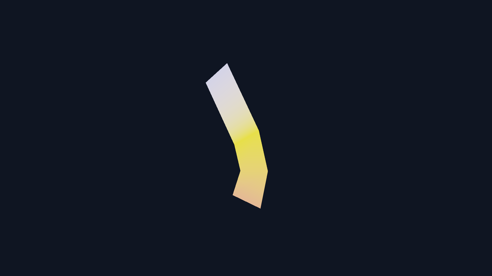
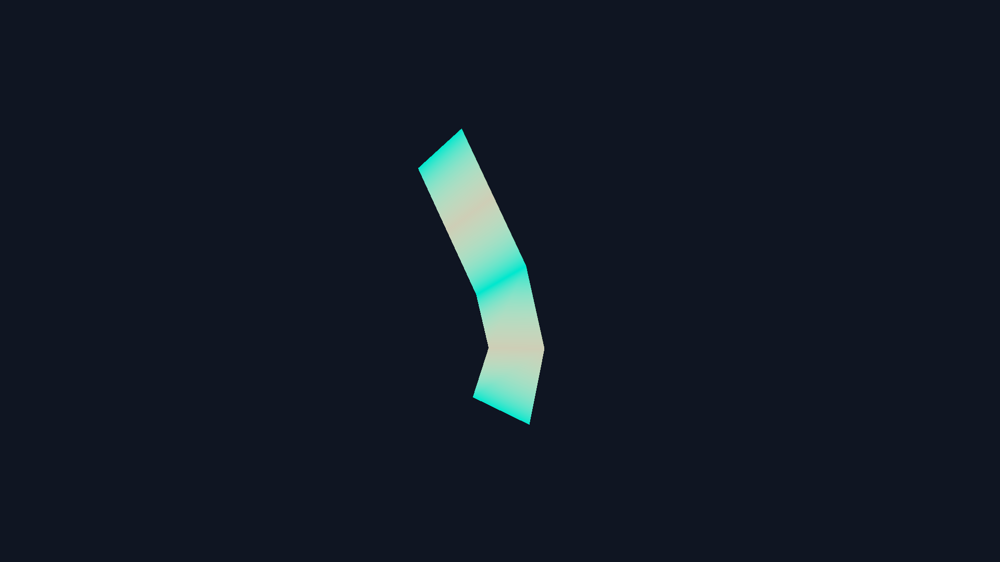

# GP-P1E：glTF 骨骼动画与 GPU Skinning

本阶段完成 glTF 骨骼动画最小闭环：资产导入保存 `JOINTS_0`、`WEIGHTS_0`、Skin Joint、Inverse Bind Matrix、节点层级和 Animation Clip；CPU 按时间采样 Translation / Rotation / Scale，GPU Vertex Shader 使用关节矩阵调色板完成 Linear Blend Skinning。

## 数据与运行时

每个顶点最多保留四个权重最高的关节影响，并在导入后归一化。每个 Mesh 保存独立 Skin Palette，因此多个蒙皮 Mesh 可以共享节点骨架，同时保持各自 Mesh Bind Transform。当前 OpenGL 3.3 路径每个 Mesh 最多上传 64 个 `mat4` 关节矩阵。

运行时从 Bind TRS 开始，将当前 Animation Channel 的 Translation/Scale 做线性插值、Rotation 做 Quaternion Slerp，再按父子层级生成 Global Joint Transform。最终矩阵为：

```text
Joint Matrix = Animated Node Global × Mesh-adjusted Inverse Bind Matrix
Skinned Vertex = Σ(weight[i] × Joint Matrix[i] × Bind Vertex)
```

动画关闭时仍执行 Skin Palette，但节点使用 Bind Pose；这同时验证 Inverse Bind Matrix 是否正确——模型应保持笔直，不能出现位置跳变或缩放。


## 调试视图

Inspector / Renderer 提供 Clip 选择、播放/暂停、时间 Scrub、速度，以及两种 Skinning Debug：

- Joint Influence：以确定性颜色混合显示各顶点的关节影响。
- Dominant Weight：显示当前最大权重，方便发现未归一化、硬断层或权重过散。





主 Forward/G-Buffer、方向光 Shadow、Transmission Shadow、Light-space Caustics 与 Glass Thickness Vertex Pass 共用同一蒙皮公式，避免主体动画和阴影/辅助缓冲不同步。

## 固定资产与测试

`assets/models/skinning_test.gltf` 是项目内生成的 3-Joint、10-Vertex、8-Triangle 固定资源。Wave Clip 长 3 秒，在 1 秒处将中间关节绕 Z 轴旋转 35°。CPU 资产测试验证：

- 三关节 Skin Palette 与一个 Animation Clip 被完整导入；
- Animation Duration 转换为秒；
- 四个 Rotation Keyframe 保留；
- 每个顶点的四权重之和为 1。

```powershell
cmake --build build-release --target skinning-visual-regression
cmake --build build-release --target skinning-benchmark
```

视觉回归固定比较 Bind Pose、1.0 秒动画姿势、Joint Influence 和 Dominant Weight 共四张 1920×1080、4×MSAA 图片。

## 1080p 实测

环境：NVIDIA GeForce RTX 4060 Laptop、OpenGL 3.3、Deferred、4×MSAA、预热 30 帧并采样 90 帧。

| 配置 | CPU Frame P50/P95 | GPU Frame P50/P95 | Draw Call |
|---|---:|---:|---:|
| Bind Pose | 1.467 / 2.464 ms | 0.592 / 0.764 ms | 3 |
| Animated Pose | 1.707 / 2.660 ms | 0.675 / 1.453 ms | 3 |
| Joint Debug | 1.550 / 2.554 ms | 0.650 / 1.223 ms | 3 |

该固定资产用于验证正确性，不用于宣称大规模角色性能；它只有 10 个顶点，GPU 数字容易受驱动与查询抖动影响。真正的扩展性测试需要高顶点角色、多个实例和多关节档位。

## 已知边界

- 当前只播放一个 Clip，不支持 Animation Blending、Cross-fade、Additive Layer 或 Root Motion。
- 运行时统一采用 Linear/Slerp，不保留 glTF `STEP` / `CUBICSPLINE` 插值语义。
- 每顶点最多四权重、每 Mesh 最多 64 关节；超过 64 会给出导入警告并截断。
- Bounds 仍来自 Bind Pose，剧烈动画可能超出视锥剔除包围球；蒙皮模型暂不进入实例 LOD 压力路径。
- GP-P1D 的 TAA Motion Vector 仍只覆盖相机运动；骨骼顶点的上一帧位置尚未写入 Motion Buffer，因此动画与 TAA 同时开启时可能出现 Ghosting。
