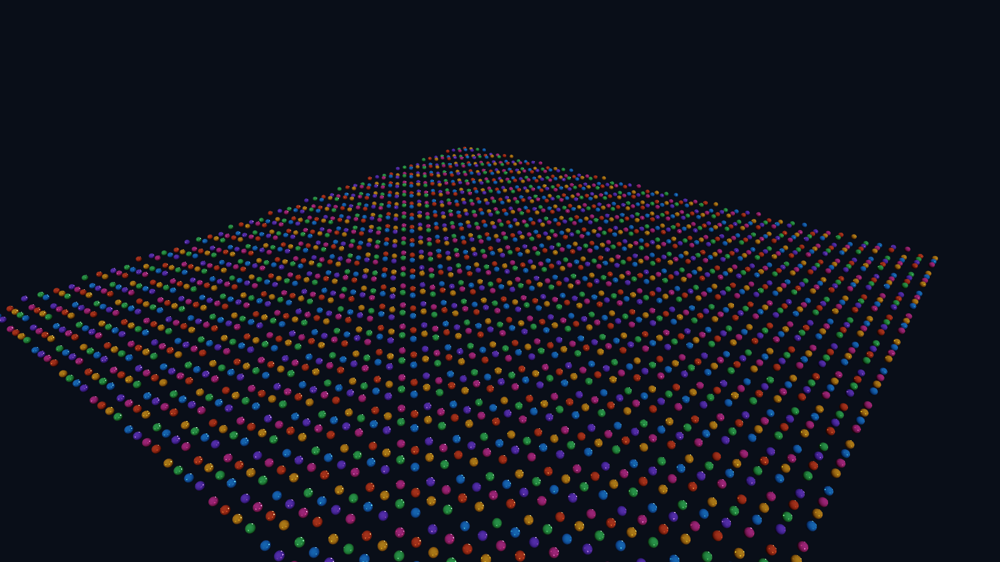

# GP-P1C：Instancing、CPU Frustum Culling 与 LOD

完成日期：2026-08-29

本阶段在同一个 `sphere.obj` GPU 模型上建立 50×50、共 2,500 个实例的固定压力场景。基线逐对象提交，优化路径按模型、Tint 和 LOD 分组后使用 `glDrawElementsInstanced`；CPU 先用世界空间包围球做视锥判断，再按投影半径选择三档索引 LOD。场景始终包含真实几何和固定镜头，不用空场 FPS 代表优化收益。

## 数据流

```text
2,500 RenderItem transforms
          |
          v
local sphere -> world bounding sphere
          |
          +-- outside six frustum planes -> culled
          |
          v
projected radius in pixels -> LOD0 / LOD1 / LOD2
          |
          v
group by GpuModel + tint + LOD
          |
          v
stream mat4 instance buffer -> glDrawElementsInstanced
```

视锥由当前 View-Projection Matrix 提取六个归一化平面。包围球半径使用 Model Matrix 三个基向量中的最大缩放，非均匀缩放下仍保持保守，不会把实际可见物体误剔除。

LOD 使用屏幕投影半径而不是只看世界距离：1080p 固定基准中半径大于等于 14 px 使用 LOD0，7～14 px 使用 LOD1，小于 7 px 使用 LOD2。低档索引在 Mesh 上传时通过顶点网格聚类生成；三档共享同一 Vertex Buffer、材质与实例 Transform，只切换 Element Buffer。

## 固定画面

| 逐对象基线 | Instancing + Culling + LOD |
| --- | --- |
|  |  |

相机外的 110 个包围球只在优化路径被剔除，因此不改变画面；远景 LOD 的几何差异集中在小于 14 px 的实例。两张模式各自拥有固定 1920×1080、4×MSAA 视觉回归基线。

## RTX 4060 Laptop 分阶段结果

环境：NVIDIA GeForce RTX 4060 Laptop GPU，OpenGL 3.3 / 驱动 591.44，1920×1080、4×MSAA、30 帧预热 + 90 帧测量、Forward PBR、关闭 VSync。

| 阶段 | Draw Calls | 可见 / 剔除 | LOD0 / 1 / 2 | 提交三角形 | CPU Frame P50 / P95 | GPU Frame P50 / P95 | Opaque P50 |
| --- | ---: | ---: | ---: | ---: | ---: | ---: | ---: |
| 逐对象基线 | 2,501 | 2,500 / 0 | 2,500 / 0 / 0 | 800,000 | 5.386 / 6.484 ms | 1.465 / 2.827 ms | 1.329 ms |
| Instancing | 7 | 2,500 / 0 | 2,500 / 0 / 0 | 800,000 | 2.364 / 3.427 ms | 1.067 / 2.113 ms | 0.936 ms |
| + Frustum Culling | 7 | 2,390 / 110 | 2,390 / 0 / 0 | 764,800 | 2.290 / 3.430 ms | 1.061 / 2.072 ms | 0.929 ms |
| + Projected-size LOD | 19 | 2,390 / 110 | 170 / 2,041 / 179 | 477,636 | 2.077 / 3.128 ms | 0.653 / 0.941 ms | 0.521 ms |

完整路径相对基线把 Draw Call 减少 99.24%，提交三角形减少 40.30%，CPU Frame P50 降低 61.44%，GPU Frame P50 降低 55.43%。CPU 可见性、LOD 与批次准备耗时为 0.110 ms；LOD 增加到最多 18 个几何批次（6 种 Tint × 3 档），所以总 Draw Call 从纯 Instancing 的 7 上升到 19，但显著减少了顶点工作。

## GUI 与自动化

`View → Instance / culling / LOD stress preset` 加载固定场景。Inspector 的 `Instance submission stress` 区域可分别切换 GPU Instancing、CPU Frustum Culling 与 Projected-size LOD，并显示 Submitted / Visible / Culled、三档实例数、提交三角形和 CPU 准备时间。

自动化变量：

- `MYRENDERER_INSTANCE_STRESS=1`
- `MYRENDERER_INSTANCE_OPTIMIZATION=0|1`
- `MYRENDERER_FRUSTUM_CULLING=0|1`
- `MYRENDERER_LOD=0|1`

可重复验收：

```powershell
cmake --build build-release --config Release --target instance-stress-visual-regression
cmake --build build-release --config Release --target instance-stress-benchmark
```

Benchmark 输出 Baseline、Instancing、Instancing+Culling、完整 LOD 四份 JSON；视觉目标重拍基线与完整优化两张图片。

## 已知边界

- 当前只批处理显式标记的压力场景不透明实例；透明排序、玻璃对象级缓存和阴影实例化仍走原路径。
- LOD 是运行时顶点聚类生成的索引近似，不是离线工具制作的美术 LOD；近景始终保留完整网格。
- 批次键目前包含精确 Tint，因此六种颜色形成六个批次；后续可把颜色加入实例属性以进一步合批。
- CPU Culling 为单线程线性扫描；更大规模场景需要层次包围结构或 GPU-driven Culling。
- 几何内存统计尚未把两份额外 LOD EBO 和每帧 Instance Buffer 峰值计入总显存估算，性能表不虚报这部分数据。
