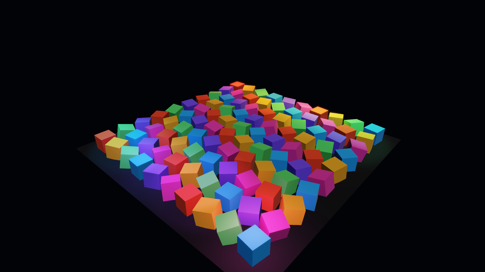
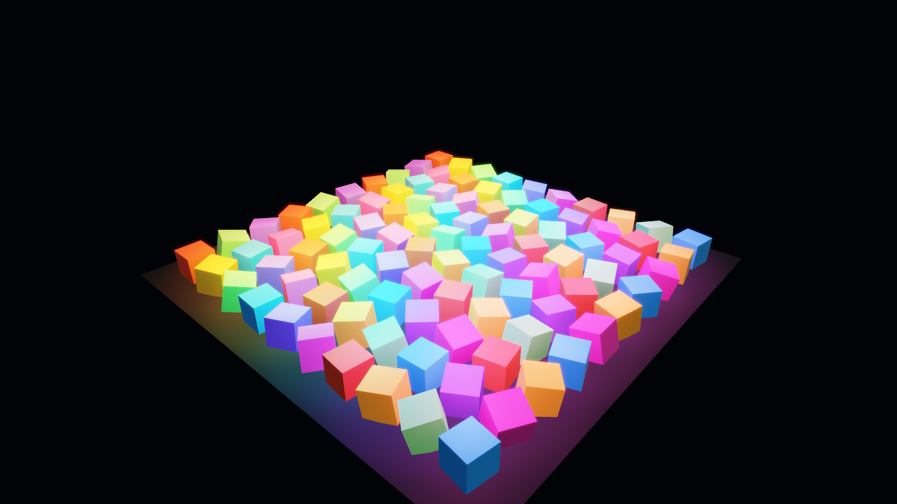

# GP-P1B：多光源压力场景与 Forward / Deferred 曲线

完成日期：2026-08-26

本阶段在 GP-P1A Hybrid Deferred 基线上加入 Point Light 与 Spot Light，并建立 8 / 32 / 64 三档确定性压力场景。每档一半为点光、一半为聚光；Forward 与 Deferred 使用完全相同的光源数组、100 个物体、相机、材质、后处理和 4× MSAA。

## 光源模型

每个局部光源压缩为三个 `vec4` Uniform Array：

| 数据 | 内容 |
| --- | --- |
| Position / Radius | XYZ 为世界坐标；W 的绝对值为作用半径，负号标记 Spot Light |
| Color / Intensity | 线性 RGB 与 HDR 强度 |
| Direction / Outer Cone | Spot 朝向与外锥余弦；Point Light 忽略该项 |

Point Light 使用带有限半径平滑截止的逆平方衰减：

```text
x = clamp(1 - (distance / radius)^4, 0, 1)
attenuation = x^2 / (1 + distance^2)
```

Spot Light 在相同距离衰减上叠加 `smoothstep(outerCos, innerCos, coneCos)`，因此锥体边缘连续，不产生硬切线。两条路径均使用相同 Cook-Torrance GGX BRDF；局部灯暂不投射阴影，以隔离光照循环本身的扩展成本。

## 压力场景

- 100 个独立 `RenderItem`，排列为 10×10 网格；每个对象保持独立 Draw Call，尚未使用 Instancing。
- 8 / 32 / 64 三档灯光均覆盖完整舞台，而不是只在一角增加灯光。
- 每档 Point / Spot 各半，使用固定彩色调色板、位置、半径、方向和强度。
- 固定黑色背景、低强度 IBL、哑光地面、固定 Hero Camera、1920×1080、4× MSAA。

不使用 Instancing 是有意的：这一阶段验证多灯光下 Forward 与 Deferred 的着色扩展性；下一项会在同一场景上实现 Instancing、CPU Frustum Culling 和 LOD，再单独测量提交与几何成本。

## GUI 调试

在 `View → Local light stress preset` 可一键加载固定立方体场景。也可以在 `Inspector → Renderer → Local light stress`：

1. 勾选 `Enable stress scene`。
2. 选择 `Low (8)`、`Medium (32)` 或 `High (64)`。
3. 在 `Opaque render path` 切换 Forward / Deferred (hybrid)。
4. 观察活动 Pass、GPU viewport、Draw calls 和 `Estimated opaque traffic`。

自动化入口为 `MYRENDERER_LIGHT_STRESS=1` 与 `MYRENDERER_LOCAL_LIGHT_TIER=0|1|2`。

## 画质一致性

| 8 lights — Forward | 8 lights — Deferred |
| --- | --- |
|  |  |

| 64 lights — Forward | 64 lights — Deferred |
| --- | --- |
|  |  |

Forward / Deferred 同档比较结果：8 灯 MAE `0.000708`、变化像素 `0.861%`；64 灯 MAE `0.000787`、变化像素 `0.657%`。差异主要位于几何边缘的 MSAA G-Buffer Resolve 与高亮量化，不改变整体光照分布。

## RTX 4060 Laptop 扩展曲线

环境：NVIDIA GeForce RTX 4060 Laptop GPU，OpenGL 3.3 / 驱动 591.44，1920×1080，4× MSAA，30 帧预热 + 90 帧测量。

| Lights | Path | GPU Frame P50 / P95 | Opaque work P50 | Draw Calls | Attachment traffic | Render memory |
| ---: | --- | ---: | ---: | ---: | ---: | ---: |
| 8 | Forward | 1.618 / 1.834 ms | 0.557 ms | 111 | 213.6 MiB/frame | 291.2 MiB |
| 8 | Deferred | 1.517 / 1.990 ms | 0.324 + 0.236 = 0.559 ms | 112 | 387.6 MiB/frame | 469.1 MiB |
| 32 | Forward | 2.314 / 2.847 ms | 1.364 ms | 111 | 213.6 MiB/frame | 291.2 MiB |
| 32 | Deferred | 1.779 / 2.209 ms | 0.312 + 0.509 = 0.821 ms | 112 | 387.6 MiB/frame | 469.1 MiB |
| 64 | Forward | 3.773 / 4.304 ms | 2.815 ms | 111 | 213.6 MiB/frame | 291.2 MiB |
| 64 | Deferred | 2.183 / 2.704 ms | 0.325 + 0.891 = 1.215 ms | 112 | 387.6 MiB/frame | 469.1 MiB |

Deferred 的 Geometry Pass 基本保持在 `0.31–0.33 ms`，灯光增长主要进入单一 Lighting Pass；Forward Opaque 从 `0.557 ms` 增至 `2.815 ms`。64 灯时 Deferred 整帧比 Forward 快约 **1.73×**，代价是额外 178 MiB RenderTarget 显存与约 174 MiB/frame 的估算 Attachment 流量。

`Attachment traffic` 是根据 RenderTarget 格式、分辨率、MSAA 写入与 Resolve 计算的下限估算，不是 Nsight/驱动硬件 Counter。JSON 同时给出 `estimatedOpaqueTrafficBytesPerFrame`，以及用 GPU Frame P50 换算的 `estimatedOpaqueTrafficGiBPerSecondAtGpuP50`；后者用于同机趋势比较，不代表显卡真实总带宽利用率。

## 结论

- 8 灯时 Forward 与 Deferred 的不透明工作时间几乎相同，Deferred 的额外全屏 Pass 尚未形成明显优势。
- 32 灯开始出现明确交叉；Deferred 把多物体重复灯光计算集中到一次屏幕空间 Lighting Pass。
- 64 灯时 Deferred 明显领先，但显存和 Attachment 带宽代价仍然存在。
- Draw Call 基本不随灯数变化；Deferred 固定多一次全屏 Lighting Draw。
- 结果证明的是当前 100 物体屏幕覆盖下的扩展性，不外推到所有场景。

## 验证命令

```powershell
cmake --build build-release --config Release --target local-lights-visual-regression
cmake --build build-release --config Release --target local-lights-benchmark
```

## 已知边界与后续方向

- OpenGL 3.3 Fragment Uniform 上限使本实现固定为最多 64 个局部灯；更大规模应使用 UBO/SSBO。
- 当前 Deferred Lighting 对屏幕中每个几何像素遍历全部灯光，尚未实现 Light Volume、Tiled 或 Clustered Light Culling。
- 局部灯没有 Cubemap Shadow 或 Spot Shadow；加入阴影后必须单独报告 Shadow Pass 成本和显存。
- 估算带宽不含驱动内部压缩、Cache 命中、纹理过滤和 ROP 实际事务。
