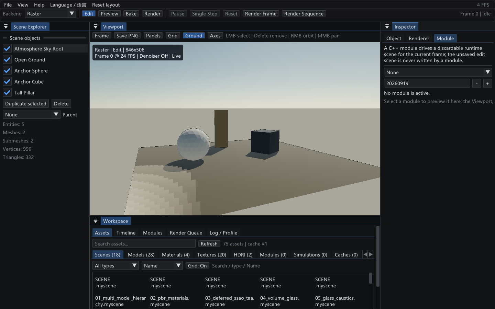

# P1-0C Timeline 与 C++ Module Runtime

- 完成日期：2026-09-19（文档正文）；`docs/media/` 插图采集于 2026-09-20
- 源码 revision：`35a726c`（`git log -1 --format=%h`；工作区含未提交改动，本文档与 `docs/media/` 插图尚未入库）
- 构建目录：`build-ci-msvc`，Visual Studio 17 2022，Release，`BUILD_TESTING=ON`
- GPU / 驱动 / OpenGL：NVIDIA GeForce RTX 4060 Laptop GPU / NVIDIA 591.44 / OpenGL 3.3.0
- 插图采集时的 Module Build ID：`0.1.0+20260920124511`（Modules 页标题行读数）

本文的模块与缓存语义全部在 CPU 侧，与 GPU 无关；上面第四、五行只描述 `docs/media/` 插图的采集环境与那一次 configure 生成的 Build ID。

## 目标与范围

P1-0C 给渲染工作台补上“场景时间与任务语义”：确定性 Timeline、可丢弃的 Runtime Scene、静态 C++ 模块的最小生命周期、轻量 ParameterRegistry 与显式 Module Registry。GUI、CLI Batch 与自动化验收消费同一套定义；模块不拥有 Editor Widget、OpenGL/Vulkan Context 或后台线程。

本文件记录已落地的第一条纵向切片（C1a：Timeline、模块框架与第一个模块）；Simulation Cache、Render Job 模块配置与 `module-rendering-acceptance` 属于同一阶段的后续切片，落在同一套接口之上。

本阶段明确不做的事：

- `.myscene` 尚未持久化模块选择与参数覆盖；`overrides()` / `applyOverrides()` 已经是它的数据接口，但持久化本身没做。
- GPU 侧模块（Vulkan）不在本阶段，模块层完全不依赖渲染后端。
- 模块超时与进程级隔离（模块崩溃不拖垮编辑器）依赖后续的作业级 runner。
- 模块的 Apply/Bake 写回编辑态路径未落地，因此当前不存在隐式污染编辑态的场景。

## 确定性 Timeline

`src/runtime/Timeline.h` 是 GUI 预览与 headless Batch 共用的唯一时间定义。时间只由帧号与固定帧率导出，不读取墙钟时间或 GUI 帧率，因此拖动到某一帧、单步一次与批处理渲染同一帧得到的 `timeSeconds()` / `fixedDeltaSeconds()` 完全一致。

| API | 语义 |
| --- | --- |
| `setFrameRange(start, end)` | `start` 不小于 0；`end` 不小于 `start`；当前帧被夹取回范围 |
| `setFramesPerSecond(fps)` | 夹取到 1～240 |
| `setFrame(frame)` | Scrub：显式帧请求夹取到当前范围 |
| `advance(frames)` | 只按整帧推进；返回是否真的变化。非 Loop 序列停在最后一帧而不是越界，Loop 序列按帧数取模回绕 |
| `setLoop(bool)` / `atEnd()` / `frameCount()` | 序列终止与长度语义 |
| `timeSeconds(frame)` | `frame / fps`，与既有编辑器/批处理时间语义完全一致 |
| `fixedDeltaSeconds()` | `1 / fps`，模块固定步长来源 |

`EditorSession` 不再自己保存 `frame_ / startFrame_ / endFrame_ / framesPerSecond_`，而是持有一个 `Timeline` 并转发访问器，因此旧调用点、`.renderjob` 帧语义与既有测试的夹取/时间行为都没有变化。

## Runtime Scene：编辑态与运行态分离

`src/module/RuntimeScene.h` 持有编辑态 Scene 的独立副本。模块只能通过 `SceneContext` 触达这份副本：

- `resetFrom(editScene)` 重建副本并递增 generation；层级、变换、Tint、可见性与阴影标记整体复制。
- 运行态写入永远不会穿透到编辑态；只有显式的 Apply/Bake 才允许写回资产或缓存。
- `dirty()` 表示运行态确实与其输入不同。模块只在值真的变化时置位，因此“第 0 帧等于基线”不会触发下游无意义的重渲染。
- `contentHash()`（`sceneContentHash`）按实体 id 排序后顺序混合实体 id、父子关系、名称、模型资源路径、局部变换、Tint 与可见性。模型指针**不**参与哈希：它每次运行都会变，会让缓存永远失效。哈希对插入顺序不敏感，但对任何变换变化敏感——缓存宁可多算一次，也不能静默复用陈旧结果。

## 模块契约：`ISceneModule` 与 `SceneContext`

`src/module/SceneModule.h` 定义最小生命周期。第一版 `ISceneModule` 同时承担 Scene 与 Simulation 两种角色，用 `ModuleManifest::kind` 表达用途，不提前分裂成两条 vtable。

```cpp
ModuleManifest manifest() const;                                  // 稳定 id、显示名、CMake Target、API 版本、Build ID
void registerParameters(ParameterRegistry& parameters);           // 参数 schema，只声明一次
bool initialize(const SceneContext& context, std::string& error); // 只读：在这里捕获基线
void reset();                                                     // 回到 initialize 之前
bool fixedUpdate(SceneContext& context, double fixedDeltaSeconds, std::string& error);
bool bake(const SceneContext& context, std::string& error);
std::string serializeState() const;
bool deserializeState(const std::string& state, std::string& error);
```

`SceneContext` 是唯一的协作面：丢弃态 Runtime Scene、`Timeline`、自己的 `ParameterRegistry`、运行 Seed、结构化日志，以及宿主注入的取消检查 `setCancellationCheck()`（GUI 取消按钮、CLI Ctrl+C、任务超时都由宿主拥有，模块只轮询，不持有 token 或线程）。日志接口是 const 的，因此只读的 `bake` 也能报告它写了什么。

## ParameterRegistry：六种参数

`src/module/ParameterRegistry.h` 提供 Bool / Int / Float / Color / Enum / Asset 六种参数，带默认值、范围与 Tooltip；Inspector 只读取元数据生成控件，`.myscene` 只保存与默认值不同的覆盖项。

校验分两层，边界清晰：

- **结构性错误整条拒绝**：未知 id、类型不匹配、非有限数值、没有标签的 Enum、不符合扩展名过滤的 Asset 路径。拒绝时原值不变，并给出点名参数的错误信息。
- **数值越界夹取**：Float/Int/Color 夹取到声明范围，未知 Enum 索引夹取到合法标签。手改过的场景因此不会让某个参数永久不可用。
- `applyOverrides()` 是事务性的：先在一份副本上校验全部覆盖项，全部通过才提交，半套参数不会落盘。
- `overrides()` 只返回与默认值不同的项，顺序即注册顺序，保证面板与序列化确定性。

## Module Registry、`ModuleManifest` 与 Build ID

`src/module/ModuleRegistry.h` 用稳定字符串 id 做显式注册，不扫描也不解析 C++ 源码。`add()` 拒绝空 id、重复 id、没有 factory 以及 API 版本不匹配；`create()` 对未知 id 与“factory 返回空”分别给出点名错误。`manifests()` 按 id 排序，因此面板、报告与缓存键都是确定性的。

`MYRENDERER_BUILD_ID` 由 CMake 在一次 configure 中生成（`项目版本+UTC 时间戳`），注入 `MyRendererModules`，因此同一构建的 GUI 与 CLI 报告同一个 Build ID，而重新 configure 后不会静默复用旧二进制产生的缓存。

`MyRendererModules` 是独立静态库（模块框架 + 具体模块）。`Scene` 符号由消费方提供，与项目其它共享源文件的既有做法一致；GUI、`MyRendererBatch` 与模块测试各自链接它。

## 第一个模块：`myrenderer.core.turntable`

`src/module/BuiltinModules.cpp` 的 Turntable 演示了完整契约，而不是单个 API 调用：

- 参数：`enabled`、`degreesPerFrame`、`axis`(X/Y/Z)、`carouselRadius`、`bobHeight`、`phaseDegrees`、`tintColor`、`tintStrength`。
- `initialize` 捕获每个“引用模型的实体”的基线变换与 Tint（`model != nullptr` 或已记录模型资源路径）。
- 每帧结果是 `基线 + f(帧号)`，不累加增量，因此：拖动到第 k 帧、重复渲染第 k 帧、批处理渲染第 k 帧得到同一个运行态；同一帧重复调用是幂等的；回退到更早的帧会算出该帧的值而不是叠加。
- `enabled=false` 精确恢复基线（含 Tint），保证“关闭”状态不残留上一次动画结果。
- `serializeState()` 返回基线数量的确定性摘要，供后续 Simulation Cache 使用。

## 模块实例 runner：`ModuleRuntime`

`src/module/ModuleRuntime.h` 拥有一个模块实例，以及它的 `ParameterRegistry`、可丢弃 `RuntimeScene` 与 `Timeline`。GUI Preview 与 headless Batch 都通过这一个类驱动模块，因此 Seed、固定步长、帧范围与参数解释不可能出现两套语义。

```cpp
ModuleRuntime runtime(registry);
runtime.configure(moduleId, overrides, seed, error);   // 创建实例、注册默认值、事务性应用覆盖
runtime.reset(editScene, startFrame, endFrame, fps, error);  // 复制编辑场景 + initialize + 起始帧
runtime.runToFrame(frame, error);                       // 逐帧固定步进到目标帧
runtime.bake(error);                                    // 确定性缓存写入点
```

- 帧只能**向前**推进：`runToFrame` 拒绝早于当前帧的请求，调用方要么继续推进，要么重新 `reset`。这样一个累加型模拟始终得到正确的积分，而不是依赖调用顺序的巧合。
- `reset` 会把起始帧本身也求值一次，因此“拖动到起始帧”是一个真实状态，而不是“模块还没跑”。
- `report()` 记录模块 id、显示名、API 版本、Build ID、Seed、帧范围、输入内容哈希、当前内容哈希、`serializeState()` 与结构化错误；这些字段直接进入 Frame Report Manifest。
- 失败隔离：`fixedUpdate` 返回 false，或模块用 Error 级别写日志，都会把状态置为 `Failed` 并停止发布；编辑态场景、渲染上下文与已提交产物都保持有效。宿主取消通过 `setCancellationCheck` 注入，`runToFrame` 在帧边界轮询。

## CLI Batch 接入

`.renderjob` 的 `module` 段（schema 2）驱动渲染序列：`runRenderJobFrame` 载入场景文档，构造模块侧的 `Scene`（实体带资源路径、不带 GPU 模型，因此模块层完全不依赖渲染后端），按 `frames.start` 起逐帧固定步进到目标帧，再把模块输出的局部变换与 Tint 写回这份**每帧临时**文档，交给既有的 Snapshot 路径渲染。磁盘上的场景与编辑器场景都不参与写回。

代价是每帧重跑一次序列（帧数的平方级）；这是刻意的取舍——可复现性优先于步进开销，因此同一 Job 的同一帧永远是输入的纯函数。实测两条独立 CLI 序列（其中一条走事务性 `--output` 覆盖）的 4 帧 PNG 逐字节一致。

`validate` 会真实创建一次模块实例，所以未知模块 id、错误参数名、错误参数类型与非法枚举标签都在渲染前失败；`module.buildId` 与 `module.seed` 进入 Frame Report，`resume=true` 不会复用由别的模块或别的构建产生的帧。

## Simulation Cache：拒绝静默复用陈旧缓存

`src/module/SimulationCache.h` 把一次 bake 的结果与产生它的输入放在一起。缓存键包含**场景内容哈希、模块 id、Module API 版本、Build ID、Seed、模块参数指纹、固定步长（以 FPS 表示）与帧范围**；键里存 FPS 而不是派生出的秒数，是为了避免浮点“几乎相等”的问题。每个缓存帧记录该帧的 `contentHash`、模块状态与**全部**实体的局部变换/Tint——重建一帧不应该依赖“猜模块会改哪些字段”。

参数指纹（`ParameterRegistry::fingerprint()`）覆盖**每个已注册参数及其当前值**。它不能省：逐帧 `contentHash` 校验抓不到参数变化，因为缓存帧总是哈希回它自己记录的值，所以只改 `degreesPerFrame` 这类参数时，键相同会让陈旧缓存被静默复用。指纹与旧缓存文件不兼容——缺少该字段的缓存按 0 加载，永远不等于真实指纹，因此被判为 `Stale` 而不是被复用。

键由 runner 统一生成：`ModuleRuntime::cacheKey(sceneContentHash)` 从自身取模块、参数、Seed 与帧配置，宿主只提供授权场景哈希。曾经在宿手里手工拼装键，结果新增键字段时漏填并静默失配每一个已 bake 的条目——这条路径现在由验收目标覆盖。

```cpp
ModuleRuntime runtime(registry);
SimulationCache cache;
runtime.bakeSimulation(editScene, startFrame, endFrame, fps, cache, error);  // 逐帧记录
saveSimulationCache(path, cache, error);                                     // 原子：.partial + rename
```

复用时先分类再复用：

| 状态 | 含义 | 行为 |
| --- | --- | --- |
| `Disabled` | Job 没有配置 `simulationCache` | 直接模拟 |
| `Missing` | 还没有缓存文件 | 模拟（首次渲染的正常情况） |
| `Stale` | 键不匹配或帧内容校验失败 | **不复用**，重新模拟，并把变化点写进帧报告 |
| `Hit` | 键匹配且该帧存在 | 载入实体、重新哈希校验后复用 |

校验是硬性的：`applyCachedFrame` 把缓存实体写入运行态场景后重新计算内容哈希，必须与缓存里记录的 `contentHash` 一致；不一致（缓存被篡改或损坏）一律降级为 `Stale` 并重新模拟。`Stale` 的消息会点名变化的具体输入（例如 `seed changed (20260919 -> 4242)`），而不是安静地重算。

## CLI：`simulate` 与 `bake`

下面四条命令都用仓库自带的 C++ Module 夹具 `assets/renderjobs/03_cpu_turntable_module.renderjob`：

```powershell
MyRendererBatch.exe validate        assets/renderjobs/03_cpu_turntable_module.renderjob
MyRendererBatch.exe simulate        assets/renderjobs/03_cpu_turntable_module.renderjob   # 只运行并报告每帧内容哈希，不写任何产物
MyRendererBatch.exe bake            assets/renderjobs/03_cpu_turntable_module.renderjob   # 运行并写入 output.simulationCache
MyRendererBatch.exe render-sequence assets/renderjobs/03_cpu_turntable_module.renderjob   # 命中缓存时复用，否则模拟
```

`simulate` 与 `bake` 的区别是刻意的：前者是“把模块跑一遍并给出确定性证据”，后者是“产出可复用的确定性缓存”。没有 `module` 段（或 `bake` 没有 `simulationCache` 路径）返回 65；写入失败返回 74；模块失败返回 70。`render-frame` / `render-sequence` 每帧会打印 `simulation cache Hit|Missing|Stale` 与原因。

## 验收目标 `module-rendering-acceptance`

```powershell
cmake --build build-ci-msvc --config Release --target module-rendering-acceptance
```

`tools/ModuleRenderingAcceptance.cmake` 只写构建目录，逐步验证：

1. `validate` 报告 schema 2。
2. `simulate` 打印每个帧的内容哈希，且**不产生**缓存文件。
3. `bake` 写出包含 schema、Build ID、参数指纹与全部帧的缓存文件。
4. `render-sequence` 产出 24 帧的帧、Depth AOV 与报告；报告记录 `simulationCache.status = Hit` 与模块 Manifest。
5. 24 帧参数动画完成一整圈：`frame_0000` 与 `frame_0023` 必须不同（15°/帧）。
6. 同一 Job 经事务性 `--output` 再跑一次，逐帧 PNG 与上一次**逐字节一致**。
7. 用同一份缓存、但改了模块 Seed 的 Job 渲染：状态必须是 `Stale`，帧仍然正确产出（重新模拟）。
8. 只改模块参数（场景、Seed、Build 都不变）的 Job：状态必须是 `Stale` 且原因写明
   `module parameters changed`，并且该参数动画确实改变了画面。
9. 删除缓存后再渲染：状态必须是 `Missing`，且帧与有缓存时**逐字节一致**——证明缓存复用不改变结果。

## 编辑器接入

底部 Workspace 的 Modules 页只读取 `ModuleRegistry::manifests()`，显示 Module ID、Name、Kind、CMake Target 与 Source，以及 Module API 版本与 Build ID。列使用固定宽度 + 横向滚动 + 悬停提示，因此在 1100×680 最小窗口下标签仍然完整可达，而不会与相邻列重叠。

Inspector 增加 `Module` 页，把 C1 的数据变成可操作界面：

- `Active module` 下拉列出注册表中的模块；选择与清除都提交 `EditorCommand`（`SetActiveModule`）。
- `Seed` 提交 `SetModuleSeed`；任何模块输入变化（选择、参数、Seed、场景 generation、实体数量）都会递增 input revision，并在下一帧重建运行态，而不是让新旧状态混在一起。
- 参数控件**由 `ParameterRegistry` 的元数据生成**：Bool→复选框、Int/Float→带声明范围的滑块、Color→取色器、Enum→下拉框，Tooltip 取自描述符；每次编辑提交一条 `SetModuleParameter`，并按 id 覆盖式写入覆盖集合（保持默认值的参数不会进入覆盖集合）。Asset 参数当前只显示已存路径，原生文件选择属于后续切片，界面不伪造不可用的控件。
- 状态行显示帧号/帧范围、输入内容哈希、当前内容哈希与结构化日志。

**Viewport 渲染的是模块驱动的运行态场景**：`viewportScene()` 在模块激活且未失败时返回 `moduleRuntime_.runtimeScene().scene()`，否则返回编辑态场景。Raster 与 CPU Path Traced 预览共用同一判定，`cpuPreviewInputSignature` 也把模块输入与内容哈希计入预览身份——否则 CPU 预览会停留在它启动时的那一帧。拖动时间轴、单步与 Reset 都会让模块按帧号重新求值；回退到更早的帧会重建运行态，而不是倒放累积状态。

编辑态场景在整个过程中只被读取。`MYRENDERER_EDITOR_INTERACTION_TEST=1` 在真实 GPU 上下文验证：激活后 Viewport 切到运行态、第 0 帧复现原始变换、第 6 帧是四分之一转、编辑态变换未被改写、回退到第 0 帧重建、参数命令改变预览帧、清除模块后 Viewport 回到编辑态场景。

自动化可用 `MYRENDERER_MODULE`（激活模块 id）、`MYRENDERER_MODULE_SEED` 与 `MYRENDERER_TIMELINE_FRAME`（启动时的编辑帧）复现同一画面；`MYRENDERER_CPU_PREVIEW_EXPORT=<stem>` 让编辑器等到 CPU 预览达到目标 SPP 后，用**与 CLI 相同的 reference writer** 导出 PNG 并退出，因此 GUI 帧与批处理帧可以直接逐帧比较。要让两侧用同一个采样器，还需 `MYRENDERER_CPU_PREVIEW_POWER_LIGHTS=0` 与 `MYRENDERER_CPU_PREVIEW_VNDF=0`（CLI 默认 Uniform + NDF，编辑器默认 P0-D 的改进采样），以及相同的 SPP / Depth / Seed / 分辨率。构建目录中的 `c1b-module-frame0.png` / `c1b-module-frame6.png` 是同一场景在两个帧上的验收截图。

### GUI 与 CLI 的同帧对照

`module-rendering-acceptance` 现在同时证明这条：同一个场景、同一个相机、同一帧。

- **无模块**时，编辑器的 CPU Path Traced 预览与 `MyRendererBatch render-frame` 的 PNG **逐字节一致**（comparator MAE 0、changed 0%）。这是硬门槛：它证明场景快照、相机、灯光、采样与显示编码在两条路径上完全相同。
- **有模块**（第 12 帧）时两侧在 `MAE ≤ 1e-5`、changed `0%` 内一致；实测 MAE `4.8e-07`，即仅 1～2 个通道值差 1 个 LSB。差异只出现在模块改写变换的帧上：编辑器渲染自己的运行态副本，而批处理把结果写回场景文档后由自己的层级解析重新合成世界变换。这是最后一位的合成差异，不是积分器或采样差异，因此它按容差断言，并把实测值写在验收脚本注释里。

## 截图

下方两张图分别证明模块清单的读取面与模块参数的编辑面。Modules 页直接读取真实 Module Registry，而不是扫描源码：标题行给出模块数量、Module API 版本与 Build ID，表格给出 Module ID、Name、Kind、CMake Target 与 Source。


```powershell
$env:MYRENDERER_SMOKE_TEST='1'
$env:MYRENDERER_EDITOR_WINDOW_WIDTH='1440'; $env:MYRENDERER_EDITOR_WINDOW_HEIGHT='900'
$env:MYRENDERER_EDITOR_SCREENSHOT_TAB='modules'
$env:MYRENDERER_EDITOR_SCREENSHOT='docs/media/p1-workspace-modules.png'
build-ci-msvc/Release/MyRenderer.exe assets/scenes/18_atmosphere_sky.myscene
```

Inspector 的 `Module` 页在未选择模块时是显式空状态，而不是隐藏控件：选择框显示 `None`，`Seed` 字段仍然可见并保留上一次的值，页面写明未激活时不改写编辑态场景。



```powershell
$env:MYRENDERER_SMOKE_TEST='1'
$env:MYRENDERER_EDITOR_WINDOW_WIDTH='1440'; $env:MYRENDERER_EDITOR_WINDOW_HEIGHT='900'
$env:MYRENDERER_EDITOR_SCREENSHOT_TAB='module'
$env:MYRENDERER_EDITOR_SCREENSHOT='docs/media/c1-module-inspector.png'
build-ci-msvc/Release/MyRenderer.exe assets/scenes/18_atmosphere_sky.myscene
```

除上面两张入库插图外，历史截图只写在构建目录，均未改写版本化 UI 或渲染固定图：Modules 页 1440×900 与 1100×680 的 `c1a-modules-panel.png` / `c1a-modules-panel-1100x680.png`，模块预览第 0 帧与第 6 帧的 `c1b-module-frame0.png` / `c1b-module-frame6.png`。

## 验证

```powershell
cmake --build build-ci-msvc --config Release --target MyRendererTimelineTests MyRendererModuleTests MyRenderer --parallel
ctest --test-dir build-ci-msvc -C Release -R "runtime-timeline|module-runtime|editor-session" --output-on-failure
ctest --test-dir build-ci-msvc -C Release --output-on-failure
```

- `runtime-timeline`：范围/帧率夹取、Scrub、非 Loop 停在末帧、Loop 回绕、多帧推进、`reset`、`fixedDeltaSeconds` 与两条独立 Timeline 的时间一致性。
- `module-runtime`：六类参数的注册顺序与元数据、类型/未知 id/NaN 拒绝、越界夹取、Enum 标签、Asset 扩展名过滤、事务性 `applyOverrides`；Runtime Scene 的层级/变换复制、编辑态不被穿透、内容哈希的顺序无关性与变换敏感性；Registry 的未知 id/重复 id/API 版本/空 factory 诊断；Turntable 的第 0 帧基线、90° 四分之一转、幂等、Scrub 往返、Carousel/轴向/Tint、关闭恢复基线、两个实例的状态一致性、取消检查与 `bake`；Simulation Cache 的键字段、逐帧内容哈希与模块状态可复现、磁盘往返、`Hit`/`Stale` 分类（seed / 场景哈希 / 帧范围）与缓存帧重放及篡改拒绝。
- `render-job-runtime`：除既有 schema/恢复/取消/原子输出覆盖外，新增模块 Job 的覆盖——schema 2 载入、无注册表时必须失败并点名模块、未知模块 id 与错误参数类型在 `validate` 阶段失败、两帧内容哈希不同而输入哈希相同、重跑同一帧得到相同模块状态与逐字节相同的 PNG、报告记录模块 id/Build ID/内容哈希、模块 Seed 变化使 Resume 帧失效；以及 Simulation Cache——bake 覆盖整个帧范围、命中缓存的帧与模拟帧**逐字节一致**、不同 Seed 的缓存被报为 `Stale` 并点名 seed、被篡改的缓存被拒绝并回退到模拟。
- `editor-session`：Timeline 重构后编辑器的帧夹取与时间语义保持不变。
- `module-rendering-acceptance`：`simulate` 不写产物、`bake` 写缓存、命中缓存的序列与无缓存的序列逐字节一致、陈旧缓存被报为 `Stale`、缺失缓存被报为 `Missing` 且结果不变。

## 限制与取舍

- `.myscene` 尚未持久化模块选择与参数覆盖；`overrides()` / `applyOverrides()` 已是其数据接口。
- Asset 参数只显示已存路径，尚无原生文件选择；GPU 侧模块（Vulkan）不在本阶段。
- 模块异常隔离目前只覆盖“模块返回失败或写 Error 日志”这一类；超时与进程级隔离（模块崩溃不拖垮编辑器）依赖后续的作业级 runner。
- 模块不拥有 Editor Widget、OpenGL/Vulkan Context 或后台线程；这一约束由 `SceneContext` 的接口形状保证，而不是靠约定。
- 每帧重跑整条序列是 O(帧数²) 的刻意取舍：可复现性优先于步进开销。作为交换，帧数很大时 Batch 的墙钟成本会明显高于单次顺序模拟。
- GUI 与 CLI 的“有模块”对照是按容差断言的（`MAE ≤ 1e-5`、changed `0%`，实测 `4.8e-07`），不是逐字节相等；差异来自两条路径的世界变换合成顺序，未追溯到比“最后一位合成差异”更细的根因。
- 本文的逐字节结论只覆盖同一构建目录、同一台参考机；不同编译器与不同 CPU 的浮点差异未被验证。

## 复现命令

```powershell
# 构建与测试
cmake --build build-ci-msvc --config Release --target MyRendererTimelineTests MyRendererModuleTests MyRenderer --parallel
ctest --test-dir build-ci-msvc -C Release -R "runtime-timeline|module-runtime|editor-session|render-job-runtime" --output-on-failure

# 模块 Job 的完整验收（含 simulate / bake / 缓存复用 / GUI-CLI 同帧对照）
cmake --build build-ci-msvc --config Release --target module-rendering-acceptance

# 手工复现 simulate 与 bake 的区别
./build-ci-msvc/Release/MyRendererBatch.exe validate assets/renderjobs/03_cpu_turntable_module.renderjob
./build-ci-msvc/Release/MyRendererBatch.exe simulate assets/renderjobs/03_cpu_turntable_module.renderjob
./build-ci-msvc/Release/MyRendererBatch.exe bake assets/renderjobs/03_cpu_turntable_module.renderjob
./build-ci-msvc/Release/MyRendererBatch.exe render-sequence assets/renderjobs/03_cpu_turntable_module.renderjob

# 插图重拍：Modules 页
$env:MYRENDERER_SMOKE_TEST='1'
$env:MYRENDERER_EDITOR_WINDOW_WIDTH='1440'; $env:MYRENDERER_EDITOR_WINDOW_HEIGHT='900'
$env:MYRENDERER_EDITOR_SCREENSHOT_TAB='modules'
$env:MYRENDERER_EDITOR_SCREENSHOT='docs/media/p1-workspace-modules.png'
build-ci-msvc/Release/MyRenderer.exe assets/scenes/18_atmosphere_sky.myscene

# 插图重拍：Inspector 的 Module 页
$env:MYRENDERER_EDITOR_SCREENSHOT_TAB='module'
$env:MYRENDERER_EDITOR_SCREENSHOT='docs/media/c1-module-inspector.png'
build-ci-msvc/Release/MyRenderer.exe assets/scenes/18_atmosphere_sky.myscene
```

## 下一步

- 按 `todolist.md` 的 P1-0C 条目继续勾选仍未落地的子项，其中最直接的三项是：`.myscene` 持久化模块选择与参数覆盖（`overrides()` / `applyOverrides()` 已经是它的数据接口）、模块的 Apply/Bake 写回编辑态路径、以及与共享 Job/Cancellation Token 和 Renderer API 的协作在模块实例接入 GUI/Batch 时补齐。
- `todolist.md` 的 P1-0C 行把「GUI 运行/停止/超时交互、模块超时与进程级隔离、编译错误定位」与 `.myscene` 持久化并列写在待办列，这些依赖后续的作业级 runner。
- Batch 侧的 `simulate` / `bake` 入口与 `todolist.md` 中 P1-0B 的勾选状态仍不一致，见 [`render-job-batch.md`](render-job-batch.md) 的「限制与取舍」。
