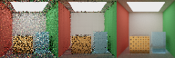
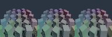

# P0-D：采样与降噪实验

| 项 | 值 |
| --- | --- |
| 日期 | 2026-09-17（实验数据与三联图产出）；2026-09-20 按 [`README.md`](README.md) 规范重写正文，未改动任何数字 |
| 源码 revision | `35a726c`（本文件、`src/pathtracer/AovDenoiser.*`、三联图基线同属该 revision 之后的工作树，尚未提交） |
| 构建目录 | `build-ci-msvc`（Visual Studio 17 2022，x64，MSVC Release） |
| GPU / 驱动 / OpenGL | 本阶段全部证据由 CPU Reference Path Tracer 产出，未记录 GPU；参考机 NVIDIA GeForce RTX 4060 Laptop GPU / 驱动 591.44 / OpenGL 3.3.0 记录在 [`regression-baseline-audit.md`](regression-baseline-audit.md)，未用于复核本文件的 P0-D 指标 |
| 固定实验参数 | 64×64，Max Depth 6，Seed 20260917，无偏参考 2048 SPP |

## 目标与范围

P0-D 在不改变既有无偏累计与固定图合同的前提下，为 CPU Reference Path Tracer 增加了可对照的采样策略、AOV 引导降噪、时序历史和一套可重复的低 SPP 证据流水线。编辑器默认在 CPU Path Traced Preview 中启用 Power-weighted Light Selection（按功率加权的光源选择）、GGX VNDF（visible normal distribution function，可见法线分布采样）、Spatial A-Trous（空间 A-Trous 小波滤波）与 Temporal Reprojection（时序重投影）；旧 CLI 与回归仍默认使用 Uniform Light Selection 与 GGX NDF（normal distribution function，法线分布函数采样），因此历史像素基线不需要重拍。

本阶段明确不做的事：

- 不改变既有固定图合同，新采样策略没有被强行设为旧 CLI 的默认值；
- 不把 Firefly Clamp 写进正式参考图和正式指标，它只是明确标记的可选有偏模式；
- 不冻结 GPU Denoiser 数据接口，冻结门槛未通过的原因写在「限制与取舍」。

## 实现

在 Viewport 顶部把 Render Mode 切换为 `CPU Path Traced` 并打开 `CPU Settings`，即可看到下列开关。实现按「采样 → 降噪 → 时序 → 有偏模式 → 运行时发布与诊断」的数据流排列。

### 采样：Power-weighted 光源选择

- `Power-weighted lights` 使用 Alias Table（别名表）按 Directional、Local、Emissive Triangle 与 Environment 的近似功率选灯；MIS PDF 同步包含离散选择概率。

### 采样：GGX visible normals

- `GGX visible normals (VNDF)` 使用 Heitz 风格可见法线采样，减少掠射角采到下半球的无效反射。

### 降噪：AOV A-Trous

- `AOV A-Trous denoiser` 分别过滤 Direct / Indirect，最后重建 Beauty；Albedo、Normal、Depth 和 Variance 只作为引导，不被滤波。
- `A-Trous passes` 控制 5×5 B3-spline 空洞卷积（à-trous wavelet）次数；边缘停止权重同时使用当前颜色方差、Albedo、Normal 与相对 Depth。

### 时序：Temporal Reprojection 与 History Clamp

- `Temporal reprojection` 从当前平均 Depth 重建世界位置并投影到上一发布帧，使用 Depth、Normal、Albedo 做 Disocclusion Rejection（去遮挡拒绝），并在融合前执行 3×3 History Neighborhood Clamp（历史邻域钳制）。相机、场景、灯光、分辨率或设置改变仍会取消旧任务并清空历史。

### Firefly Clamp：明确标记的有偏模式

- `Firefly clamp (biased)` 是明确标记的可选预览模式；正式参考和下列指标全部关闭它。

### 运行时发布与诊断

后台 `RenderTask` 发布原始 `RenderImage`、`DenoisedImage` 和显示用 RGBA8 staging。OpenGL Texture 创建与 `glTex(Sub)Image2D` 仍只在主线程发生。Overlay 新增 Denoise 耗时及 Temporal Accepted / Rejected 计数；`Export` 同时写出原始 Beauty/AOV 与 `-denoised` Beauty/Direct/Indirect 的 PNG/HDR。

## 截图

`path-tracing-denoising-experiment` 为三个场景各生成一张三联图，从左到右固定为 **Raw 4 SPP / AOV A-Trous / 2048 SPP Reference**。三张图都版本化在 `docs/images/` 下，清单见 [`images/README.md`](images/README.md)。

Diffuse 室内场景在 4 SPP 下的可见噪声最直观，滤波把 RMSE 从 0.217683 压到 0.190481、SSIM 从 0.816675 提到 0.952194（降噪耗时 22.10 ms），但收益几乎全部来自 Indirect 通道（RMSE 0.085679 → 0.028564），Direct 通道只从 0.203918 微降到 0.189332——这张图证明 Direct / Indirect 必须分开观察。


复现：`cmake --build build-ci-msvc --config Release --target path-tracing-denoising-experiment`，三联图输出到 `build-ci-msvc/path-tracing-denoising/diffuse/comparison-4spp-raw-denoised-reference.png`。

PBR + HDRI 高动态范围场景是三者中收益最大的：RMSE 0.358791 → 0.234112（-34.7%）、SSIM 0.556424 → 0.831718，Indirect RMSE 0.296947 → 0.137013，说明 HDRI 环境光下的低频噪声正是 AOV 引导滤波最擅长的部分。



复现：同一条 target，输出到 `build-ci-msvc/path-tracing-denoising/pbr-hdri/comparison-4spp-raw-denoised-reference.png`。

Instancing 几何边缘压力场景本身已经比较干净（Raw RMSE 0.026935、Raw SSIM 0.957473），滤波只带来 -8.5% 的 RMSE 改善，Direct 通道反而从 0.020920 升到 0.022579——这张图证明低误差场景里滤波收益有限，也正是它在 8/16 SPP 出现过平滑的原因。



复现：同一条 target，输出到 `build-ci-msvc/path-tracing-denoising/instancing/comparison-4spp-raw-denoised-reference.png`。

## 验证

实验由 `path-tracing-denoising-experiment` 一次生成三场景的 1/2/4/8/16 SPP 原始 Beauty、Albedo、Normal、Depth、Direct、Indirect、Sample Count、Variance，以及 2048 SPP 无偏参考、降噪输出、三联图和 CSV 指标。输出位于 `build-ci-msvc/path-tracing-denoising/`。`metrics.csv` 对 Beauty、Direct、Indirect 分别记录 RMSE、PSNR、8×8-window SSIM、梯度保留率、Firefly 像素数、渲染耗时和降噪耗时。

结果环境为 Windows / MSVC Release，64×64，Depth 6，Seed 20260917，参考 2048 SPP；以下正式结果关闭 Firefly Clamp：

| 场景（4 SPP） | Raw RMSE | Denoised RMSE | RMSE 变化 | Raw SSIM | Denoised SSIM | Denoise |
| --- | ---: | ---: | ---: | ---: | ---: | ---: |
| Diffuse | 0.217683 | 0.190481 | -12.5% | 0.816675 | 0.952194 | 22.10 ms |
| PBR-HDRI | 0.358791 | 0.234112 | -34.7% | 0.556424 | 0.831718 | 42.04 ms |
| Instancing | 0.026935 | 0.024634 | -8.5% | 0.957473 | 0.968348 | 43.57 ms |

Indirect 是主要收益来源，证明 Direct / Indirect 必须分开观察：

| 场景（4 SPP） | Direct RMSE Raw → Denoised | Indirect RMSE Raw → Denoised | Indirect SSIM Raw → Denoised |
| --- | ---: | ---: | ---: |
| Diffuse | 0.203918 → 0.189332 | 0.085679 → 0.028564 | 0.388205 → 0.840627 |
| PBR-HDRI | 0.209839 → 0.189426 | 0.296947 → 0.137013 | 0.309136 → 0.728637 |
| Instancing | 0.020920 → 0.022579 | 0.017864 → 0.010531 | 0.842959 → 0.930006 |

Power-weighted + VNDF 与旧 Uniform + NDF 的 16 SPP 同预算对照没有在这三组场景上形成普遍优势：PBR-HDRI 的 RMSE 为 0.180649 对 0.169254，另两组差异低于 0.3%。原因是这些固定场景的可选灯数量很少，Alias Table 的收益空间有限，而采样流改变会带来正常的有限样本波动。因此新策略在 GUI 可用且有分布/掠射角单测，但没有被强行设为旧 CLI 的新默认值；后续多灯场景应继续用同预算指标决定默认策略，而不是凭单张图判断。

自动化覆盖：

- `path-tracing-denoising` 覆盖边缘保持与误差下降、Temporal 接受/Disocclusion 拒绝、Power-weighted Alias 分布和 GGX VNDF 掠射角有效率；
- `cpu-progressive-preview` 覆盖取消重启的 stale-task 安全以及原始/降噪 GUI 与 CLI staging 一致性；
- 旧 `path-tracing-regression` 继续验证历史 Beauty/AOV 固定图不变。

已知失败或未验证项见下一节。

## 限制与取舍

- 1 SPP 没有可估计的样本方差，三个场景改善很小；Spatial A-Trous 不伪造低 SPP 置信度。
- Instancing 在 8 SPP 的 RMSE 从 0.019157 轻微升至 0.019420，16 SPP 从 0.013874 升至 0.016915，表明固定四轮滤波在较干净图像上会过度平滑。GUI 可降低 A-Trous passes 或关闭滤波。
- Temporal History 只在同一任务的稳定相机/场景内复用。Depth/Normal/Albedo 阈值与 Neighborhood Clamp 能拒绝测试中的深度突变，但亚像素薄几何、遮挡边缘和没有运动向量的独立对象运动仍可能拖影；任何场景/相机变化当前选择安全重启，而不是跨任务冒险复用历史。
- 当前三组 4 SPP Firefly 计数为 0，不能据此宣称 Clamp 有质量收益。Clamp 保持可选、有偏、默认关闭，并被排除在正式参考指标之外。
- 由于高 SPP 过度平滑和动态对象 Motion Vector 合同尚未解决，GPU Denoiser 数据接口**暂不冻结**。稳定的 CPU 合同仅包括线性 Raw Beauty、Albedo、world-space Normal、ray-distance Depth、Direct、Indirect、Variance 与逐像素 Sample Count。

## 复现命令

```powershell
# 本机已验证的 MSVC 构建目录；新机器可改为 build。
cmake -S . -B build-ci-msvc -G "Visual Studio 17 2022" -A x64 -DBUILD_TESTING=ON
cmake --build build-ci-msvc --config Release --parallel 6

# 三场景 1/2/4/8/16 SPP 原始/AOV 输出、2048 SPP 无偏参考、降噪输出、三联图与 metrics.csv
cmake --build build-ci-msvc --config Release --target path-tracing-denoising-experiment

# 降噪与预览专项测试，以及历史固定图回归
ctest --test-dir build-ci-msvc -C Release -R "path-tracing-denoising|cpu-progressive-preview" --output-on-failure
cmake --build build-ci-msvc --config Release --target path-tracing-regression
```

产物位于 `build-ci-msvc/path-tracing-denoising/`：每个场景子目录包含 `raw-<spp>spp`、`denoised-<spp>spp`、`reference-2048spp` 命名族与 `comparison-4spp-raw-denoised-reference.png`，汇总文件为 `metrics.csv` 与 `summary.md`。

## 下一步

- GPU Denoiser 接口的冻结条件（高 SPP 过度平滑、动态对象 Motion Vector 合同）留待 Vulkan 后端的 GPU Path Tracing 与 SVGF，见 [`todolist.md`](../todolist.md) 第 9 节第 7 条；
- P0-D 本身在 [`todolist.md`](../todolist.md) 第 9 节第 4 条记为「已完成；GPU 接口按门槛暂不冻结」；
- 采样策略的默认值选择应在后续多灯场景中继续用同预算指标决定，而不是凭单张图判断。
