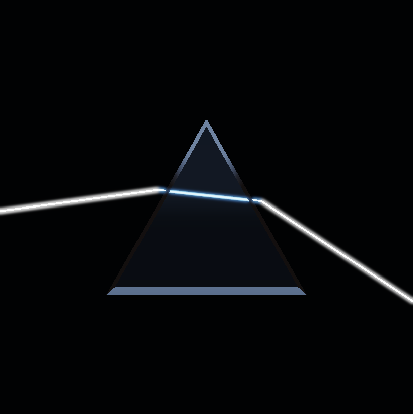
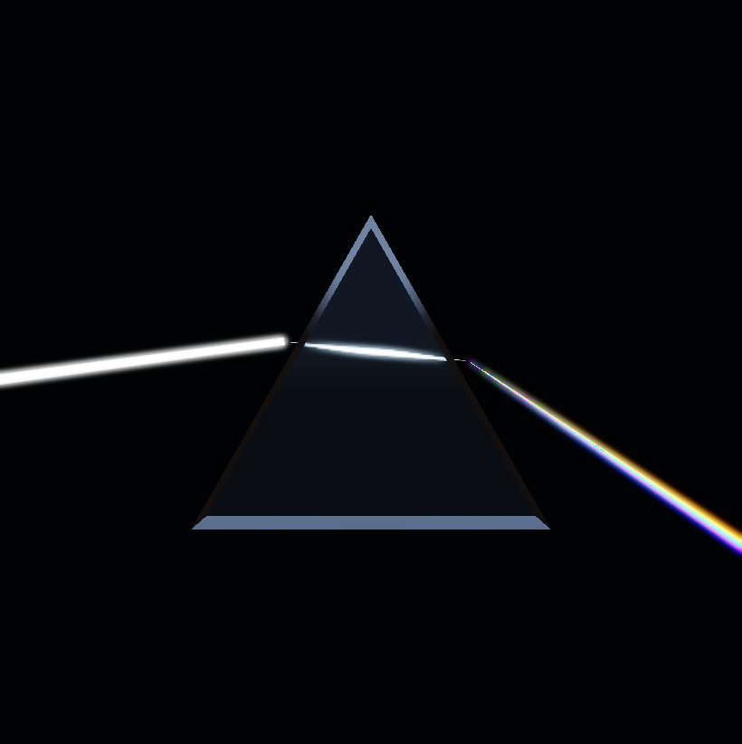
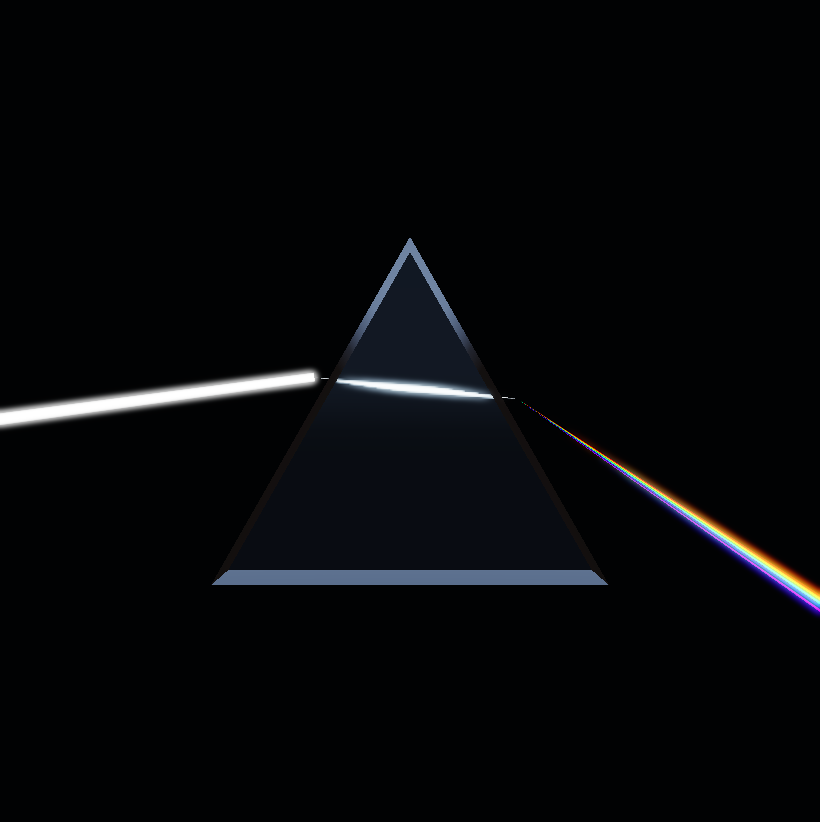
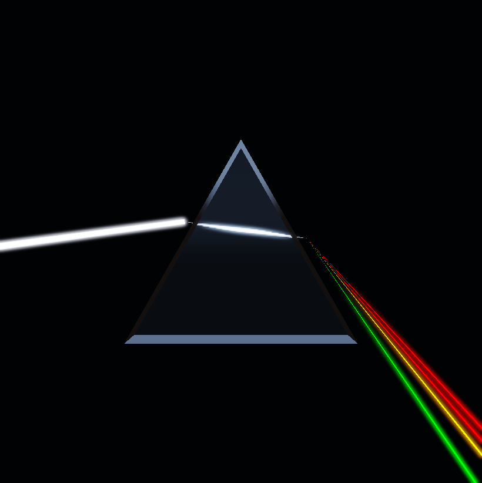

# Prism-0～5：光谱分光 Demo（Prism Spectrum）

- 记录日期：2026-08-24（Prism-0～4 于同日入库；Prism-5 收口见 [`prism5-validation.md`](prism5-validation.md)）；本文于 2026-09-16 的源码状态下按 [`README.md`](README.md) 规范改写
- 源码 revision：`6f50c26`（Prism-1 双界面求解）、`03f99f5`（Prism-2 连续光谱）、`ba07ba2`（Prism-3 HDR ribbon）、`14ccf8b`（Prism-4 交互参数与 Preset）、`7e88fd0`（Prism-5 收口）；仓库当前 HEAD 为 `35a726c`
- 构建目录：沿用仓库既有写法 `build-release`（复现命令一律用仓库相对路径）；Prism-5 的视觉回归与 benchmark 实际写入 `build-ci-msvc`，见 [`prism5-validation.md`](prism5-validation.md)
- GPU / 驱动 / OpenGL：**待补**——本文件在其各阶段没有记录采集机器的 GPU、驱动与 OpenGL 版本。可引用的同类证据只有 [`regression-baseline-audit.md`](regression-baseline-audit.md) 与 [`prism5-validation.md`](prism5-validation.md) 记录的参考机 NVIDIA GeForce RTX 4060 Laptop GPU / NVIDIA 591.44 / OpenGL 3.3.0（Core），那是审计环境而不是本文的逐阶段测量环境
- 相关清单：[`images/README.md`](images/README.md) 的「Prism：光谱与光束基线」一节是本阶段全部版本化基线的唯一清单；性能参考值在 [`performance/README.md`](performance/README.md)

## 目标与范围

本阶段要解决的问题是：在一个原创的封闭三棱柱夹具上，用可重复的方式把「白光穿过色散介质后按波长分离」这件事做成能看见、能调、能回归的画面，而不是只做一次性的效果图。

范围覆盖五级能力：Prism-0 的固定黑场舞台与棱镜几何，Prism-1 的 CPU 双界面光路求交，Prism-2 的连续波长采样与七色美术模式，Prism-3 的柔边 HDR 光束 Ribbon，Prism-4 的实时参数、四个光学 Preset 与光路调试，以及 Prism-5 的固定视觉回归、逐档性能基准与 Demo Reel。Prism-5 的完整验收矩阵、性能表与失败边界写在 [`prism5-validation.md`](prism5-validation.md)，本文不重复。

本文明确不覆盖真实空气体积散射：可见 Ribbon 是光路可视化，不是参与光照的体积介质；这一条写在「限制与取舍」。

## 实现

### 持久化与导入：`KHR_materials_dispersion` 的窄适配层

```text
glTF KHR_materials_ior / dispersion / volume
                    ↓
MaterialData → GpuMaterial → Glass Shader
                    ↓
PrismDemo 参数/Preset → PrismOptics CPU 光谱采样 → SpectralBeamData
                                              ├→ SpectralBeamMesh → SpectralBeamRenderer
                                              └→ OpticalPathDebugRenderer
```

`DebugGrid` 只继续负责地面网格与坐标轴。

Assimp 6.0.5 尚未公开 `KHR_materials_dispersion` 的材质键，因此 `GltfMaterialExtensions` 只解析 glTF/GLB JSON 中这一项扩展；其余资产内容仍由 Assimp 负责。该窄适配层避免让渲染模块依赖 glTF 的 JSON 结构。`ModelData` 里这一项为零即关闭波长相依折射率。

### 运行时：波长相关折射率（wavelength-dependent IOR）

glTF 保存的 `dispersion` 与 Abbe Number（阿贝数）关系为：

```text
Vd = 20 / dispersion
```

中心折射率 `nd` 来自 `KHR_materials_ior`。对波长 `lambda`（单位 nm），项目使用 Khronos 给出的两项 Cauchy 形式：

```text
n(lambda) = max(
    nd + (nd - 1) / Vd * (523655 / lambda² - 1.5168),
    1
)
```

参考：[Khronos KHR_materials_dispersion](https://github.com/KhronosGroup/glTF/tree/main/extensions/2.0/Khronos/KHR_materials_dispersion)。`dispersion=0` 是特殊值，表示所有波长都使用中心 IOR。

### 运行时：光谱采样与显示颜色

Continuous 模式在 380～700 nm 均匀取样，提供 7 / 15 / 21 / 31 四档；默认 21。Seven-band 模式固定使用 650 / 610 / 580 / 540 / 500 / 460 / 420 nm，便于得到分界清楚、适合美术控制的七色结果。

每个波长都独立经过两次 Ray/Prism 求交、Snell 折射、全内反射（total internal reflection）判断与 Schlick Fresnel。波长到颜色的转换使用 Wyman、Sloan、Shirley 对 CIE 1931 2° XYZ Color Matching Functions 的解析高斯近似，再用标准 XYZ→线性 sRGB 矩阵转换；负的显示设备通道被裁剪为 0，但不会对每个波长单独做 Gamma 编码或亮度归一化。参考：[JCGT 2013 analytic CIE fits](https://jcgt.org/published/0002/02/01/)。

### 运行时：能量归一化与 Beer-Lambert

单个样本的透射权重为：

```text
sampleTransmittance = entryFresnel
                    * exitFresnel
                    * beerLambert(distanceInGlass, wavelength)
```

所有有效样本随后统一归一化，使权重总和为 1。这样从 7 个样本切换到 31 个样本不会仅因样本数量增加而让总光束变亮。Prism-3 的 Ribbon Beam Pass 直接读取同一份 `SpectralBeamData`。

### 渲染：Ribbon Mesh 与 Pass 顺序

`SpectralBeamMesh` 在 CPU 上把光路转换为三角形：入射束是一条白色 Ribbon；棱镜内部束在两个界面收窄并保持在轮廓中；连续模式把相邻波长连接成无缝光谱扇面，七色模式则保留独立条带。Ribbon 的横向方向由光束方向和相机视线叉乘得到，因此转动相机时仍以稳定宽度面向观察者。

```text
Shadow Map
→ Opaque HDR Scene（保留 Depth，不立即 Resolve）
→ Spectral Beam HDR（Depth Test + Additive Blend）
→ Resolve Opaque HDR + 生成 Mip
→ Forward Transparent / Refractive（采样含光束的 Opaque HDR）
→ Optical Path Debug Overlay（可选）
→ Bloom + Tone Mapping
```

Beam Pass 不采样当前颜色附件，只向它加光，因此没有 Framebuffer Feedback。随后才 Resolve 成独立纹理供 Glass Pass 读取。Incident / Internal / Exit 三个批次分别放入 OpenGL `KHR_debug` Debug Group，便于 RenderDoc 或驱动调试器定位。

### UI：`PrismDemoParameters`、四个 Preset 与光路调试

`PrismDemoParameters` 是控制层的唯一光学参数源。修改 Beam Direction、Central IOR、Dispersion、Spectral Samples、Spectrum Mode 或 White Point 后，CPU 会立即重新调用 `tracePrismSpectrum`；Renderer 只消费求解结果，不在绘制阶段重复做求交。Central IOR 和 Dispersion 也会覆盖测试棱镜的 Glass Shader 参数，使玻璃外观和光线路径保持一致。

四个内置 Preset 共用同一套 Shader 与 Pass，只保存参数：

| Preset | 用途 |
| --- | --- |
| Crown Glass | 低到中等色散的默认物理基线 |
| Water-like | 较低 IOR、轻微冷色吸收的对照材料 |
| Diamond-like | 高 IOR 与 TIR 压力场景 |
| Exaggerated Cover | 七色模式和增强色散的美术化封面构图 |

White Point 使用 Kelvin 色温近似转换到线性 sRGB，并调制入射、内部和出射光束。Bloom Contribution 只控制 Beam HDR 增益，独立于全局 Bloom Threshold / Intensity，方便美术调整发光感而不改变光路。

`Optical path debug` 在 Glass Pass 之后叠加世界空间线：白色是中心入射线，光谱色线显示各波长的内部与出射路径，黄色/洋红短线分别表示入射/出射界面法线，橙色表示 TIR。交点以 Point 标记，Inspector 的折叠表格逐波长显示 IOR、Entry T、Exit T 和 Total Transmittance。

### 配置与夹具

`assets/models/prism_spectrum.gltf` 是原创的封闭三棱柱几何，`assets/scenes/06_prism_spectrum.myscene` 把它固定成 Prism 夹具：相机 `distance 4.8`、`fieldOfViewDegrees 35`，黑场背景 `[0.0015, 0.002, 0.0025]`，Grid/Axes/Skybox/Shadows 全部关闭，`prismCameraLocked` 为 true，`prismPreset` 为 `0`（Crown Glass），光束 `prismBeamOutputLength 2.4`、`prismBeamWidth 0.055`、`prismBeamIntensity 5.0`、`prismBeamEdgeSoftness 0.72`、`prismBeamBloomContribution 0.35`，并保存完整 `prismParameters`（`beamAngleDegrees 7.65`、`centralIndexOfRefraction 1.52`、`dispersion 0.33`、`spectralSampleCount 21`、`spectrumMode 0`、`whitePointKelvin 6500`、`attenuationDistance 8.0`、`attenuationColor [0.88, 0.96, 1.0]`）。夹具里还有第二个实体 `Optional Prism Mesh`，它默认 `visible: false`，即 Prism-0 那一张的「棱镜隐藏」状态。

## 截图

本阶段没有新增 `docs/media/` 插图；下面四张都取自 `docs/images/` 的版本化基线，清单见 [`images/README.md`](images/README.md)。**这四张图目前都没有仓库记录的重拍入口**，能确定的只有它们的产生方式与参数，逐图标注在下面。

### Prism-1：CPU 双界面光路

Prism-1 只用中心波长求解，因此这张图上是一条而不是一片：入射段、棱镜内部段与出射段都由 CPU prism solver 给出，棱镜本身仍是原始的封闭三棱柱、没有色散分离。它证明的是双界面 Snell 折射与 TIR 判断这条链路先于光谱采样成立——没有它，后面的连续光谱只是在正确的几何上刷颜色。



**待补**：仓库里没有记录这张图的重拍命令。当前 `tools/` 中没有按文件名引用 Prism-0～4 基线的脚本（`docs/images/README.md` 的同类待复核结论一致），最接近的既有写法是根 `README.md` 的 Prism 演示截图命令：

```powershell
$env:MYRENDERER_SMOKE_TEST = "1"
$env:MYRENDERER_PRISM_DEMO = "1"
$env:MYRENDERER_SCREENSHOT = ".\prism0_baseline.png"
.\build-mingw\MyRenderer.exe
Remove-Item Env:MYRENDERER_SMOKE_TEST, Env:MYRENDERER_PRISM_DEMO, Env:MYRENDERER_SCREENSHOT
```

这条命令能重拍 Prism-0 构图（根 `README.md` 明说它「默认加载 Prism-0 固定资产和 Hero Shot 参数」），但没有记录 Prism-1 这一张当时用的环境变量与工具链，因此不把它当成 Prism-1 的可复现命令。

### Prism-3：连续光谱 Ribbon

Prism-3 把连续模式的相邻波长连接成一个面向相机的软边 HDR ribbon 扇面。同一帧里入射束是一条白色 Ribbon、棱镜内部束在两个界面之间收窄、出射端展开成连续光谱——这正是上文「Ribbon Mesh 与 Pass 顺序」描述的几何形态，也说明颜色分离来自波长相依的 `Cauchy IOR`，而不是后处理着色。



**待补**：重拍命令未记录，理由同上。

### Prism-3：七色美术模式

同一套双界面光学求解器下把光谱模式换成 Seven-band，出射端从连续扇面变成 650 / 610 / 580 / 540 / 500 / 460 / 420 nm 七条分立条带。它证明两种模式共用同一份 `SpectralBeamData`，差别只在出射端的 mesh 连接方式，而不是两套求解路径。



**待补**：重拍命令未记录，理由同上。

### Prism-4：Exaggerated Cover 封面预设

Prism-4 的 `Preset=3` 是美术化封面构图：七色模式、被放大的色散、7200 K 白点 tint 与光束 bloom 一起生效，机位仍是固定的 hero 机位。它证明 Preset 只是参数的具名组合——同一套 Shader 与 Pass 不改，换的只有参数。



**待补**：重拍命令未记录，理由同上。可确定的是它对应的 Preset 编号是 `MYRENDERER_PRISM_PRESET=3`，与 Prism-5 里 `prism5_hero_exaggerated` 的写法和参数来源一致（见 [`prism5-validation.md`](prism5-validation.md)）。

## 验证

本阶段的验证分三层，三层都在仓库里有可追溯的入口：

- **CPU 光学求解**：CTest 用例 `prism-optics`（`tests/PrismOpticsTests.cpp`，无 OpenGL 上下文）。覆盖入射/出射两点求交与法线、法线入射不偏折、同输入重复求解逐位一致、不同 IOR 使出射方向分离；在 −12～+12、步长 `0.045` 的采样扫描里用 IOR 2.4 逼出 TIR 分支；`dispersion=0` 时折射率与波长无关且所有出射方向重合（角差 < `1e-4`）；紫光折射率高于红光；650 / 540 / 450 nm 分别映射到红/绿/蓝主导的线性颜色；连续模式 7 / 15 / 21 / 31 四档样本数、七色模式恰好 7 条、归一化能量和为 1（容差 `1e-5`）、红紫出射方向分离；Ribbon mesh 恰好三批且顺序为 Incident → Internal → Exit、逐批顶点数是 6 的整数倍、边坐标落在 `[-1, 1]`；四个 Preset 都能求解且样本数与模式一致；把光束角从 2° 扫到 12°、步长 0.5°，断言路径有限、红紫分离顺序不翻转、相邻步中心方向角差小于 `0.08`。
- **固定视觉回归**：Prism-5 的 `prism5-visual-regression` 采集十张 1920 × 1080 固定机位图并与 `docs/images/prism5_*.png` 比对，阈值 MAE ≤ 0.015 / changed ≤ 8%；参考机上十张全部为 MAE 0 与 0% changed。矩阵、逐图环境变量与复现命令见 [`prism5-validation.md`](prism5-validation.md) 与 `tools/Prism5VisualRegression.cmake`。
- **性能**：`prism5-benchmark` 输出 `spectralSamples` = 7 / 15 / 21 / 31 四档的 CPU 光学、GPU Beam 与整帧 P50/P95。参考值版本化在 `docs/performance/prism5_samples_*.json`，逐字段说明与解读见 [`performance/README.md`](performance/README.md)。

本文没有重跑 GPU 回归；上面「固定视觉回归」那一层的数字（十张全部 MAE 0 与 0% changed）是 [`prism5-validation.md`](prism5-validation.md) 的文字记录，不是本次新测；性能一层引用的四档数值则与 `docs/performance/prism5_samples_*.json` 对得上。

## 限制与取舍

- 当前可见 Ribbon 是光路可视化，不是真实空气体积散射；干净空气中的光束从侧面通常不可见。
- Ribbon 已解决 OpenGL Line 的宽度和柔边限制，但属于透明发光几何；Prism-5 已覆盖固定角度与 MSAA 回归，接近沿光束方向观察的退化视角仍属于已知边界。
- White Point 当前使用 Kelvin 到线性 sRGB 的显示近似，不是黑体辐射谱的逐波长积分；作品集说明中需保持这一工程边界。
- Optical Path Debug 是可读性优先的 Overlay，关闭后不进入最终作品集画面；Prism-5 已用独立 TIR 基线保留该调试证据。
- 归一化是显示口径：把所有有效样本的权重归一到 1，保证换档不改变总亮度，代价是光束总能量不代表物理辐射度量。
- 只有两次界面求交：内部束在轮廓内是收窄的直段，不做多次内部反射的完整追迹；能被求解的 TIR 分支以出射面切换或折返的形式记录，不继续追迹后续界面。
- Prism-0～4 的八张基线图没有仓库记录的重拍入口，本文给出的是逐图的产生方式与环境变量清单，不是可粘贴的重拍命令（见「截图」的逐条「待补」）。根 `README.md` 的 `MYRENDERER_PRISM_DEMO=1` 截图写法记录的是 Prism-0 构图，本文未把它当作其余七张的复现入口。
- 本文没有记录本阶段采集机器的 GPU / 驱动 / OpenGL 版本，元信息块里这一项标为「待补」；性能与画质数字因此只能与同一口径的历史记录比较。
- **待复核**：`docs/images/README.md` 把 Prism-0～4 标为「历史基线，当前 `tools/` 中没有按文件名引用它们的脚本，重拍入口待复核」，本文沿用这一结论，没有把 `screenshots/` 目录下同名的 `prism4_*.png` 当作版本化基线（它们不在 `docs/images/` 清单里）。
- **待复核**：本阶段的 `images/README.md` 清单条目是本阶段全部基线图（含未嵌入本文的 `prism0_baseline.png`、`prism2_continuous_spectrum.png`、`prism2_seven_band.png`、`prism4_optical_debug.png`）的唯一记录；本文按规范只嵌入能证明正文结论的四张，未嵌入的四张仍在清单中可查。

## 复现命令

CPU 光学求解与基础回归（不需要 OpenGL 上下文）：

```powershell
ctest --test-dir build-ci-msvc -C Release -R prism-optics --output-on-failure
```

Prism 演示的交互运行与截图覆盖（`MYRENDERER_PRISM_DEMO=1` 加载 Prism-0 固定资产与 Hero Shot 参数）：

```powershell
$env:MYRENDERER_PRISM_DEMO = "1"
$env:MYRENDERER_PRISM_SAMPLES = "21"
.\build-mingw\MyRenderer.exe
```

切换七色模式：

```powershell
$env:MYRENDERER_PRISM_SPECTRUM_MODE = "seven"
```

光束外观覆盖：

```powershell
$env:MYRENDERER_PRISM_BEAM_WIDTH = "0.055"
$env:MYRENDERER_PRISM_BEAM_INTENSITY = "5.0"
$env:MYRENDERER_PRISM_BEAM_SOFTNESS = "0.72"
$env:MYRENDERER_PRISM_BLOOM_CONTRIBUTION = "0.35"
```

Prism-4 还支持 `MYRENDERER_PRISM_PRESET=0|1|2|3`、`MYRENDERER_PRISM_BEAM_ANGLE`、`MYRENDERER_PRISM_IOR`、`MYRENDERER_PRISM_DISPERSION`、`MYRENDERER_PRISM_WHITE_POINT` 与 `MYRENDERER_PRISM_DEBUG=1`。Preset 编号依次对应 Crown / Water / Diamond / Exaggerated，后续单项环境变量会覆盖 Preset 中的对应参数。

Prism-5 的三组验收目标：

```powershell
cmake --build build-release --target prism5-visual-regression
cmake --build build-release --target prism5-benchmark
cmake --build build-release --target prism5-reel-frames
python tools/encode_prism5_reel.py build-release/prism5-reel-frames docs/media/prism5_demo_reel.mp4 --fps 24
```

固定结果见 `docs/images/prism0_baseline.png`、`prism1_optical_path.png`、`prism2_continuous_spectrum.png`、`prism2_seven_band.png`、`prism3_continuous_ribbon.png`、`prism3_seven_band_ribbon.png`、`prism4_exaggerated_cover.png`、`prism4_optical_debug.png`。

## 下一步

1. Prism-5 的验收入口已经齐备，先按 [`prism5-validation.md`](prism5-validation.md)「下一步」第 1 条，把 2026-09-16 接受基线更新后的 56 张 PNG 与两份清单/审计文档作为一次明确批准的基线更新整体提交（`todolist.md` 的 `P0-A：先锁定回归基线`），再动光学实现。
2. 补上 Prism-0～4 八张基线的重拍入口：按 `prism5-visual-regression` 的写法新增一个逐图捕获并比对的 target，把这些图从「历史基线、重拍入口待复核」推进到可自动重拍，并同步 [`images/README.md`](images/README.md) 的条目（`todolist.md` 的 `renderer-regression-suite` 覆盖范围）。
3. 把 Prism-5 的视觉回归、benchmark 与 reel 三项入口登记进 [`regression-baseline-audit.md`](regression-baseline-audit.md) 的验收矩阵，使本阶段的证据链与 [`performance/README.md`](performance/README.md) 一致（`todolist.md` 第 8.1 节的固定图与输出策略）。
4. 按 `todolist.md` 第 4 节 `P1-0`，Prism 面板目前仍属「直接写入的界面」，剩余的是把它收口到 `EditorCommand` 边界。
