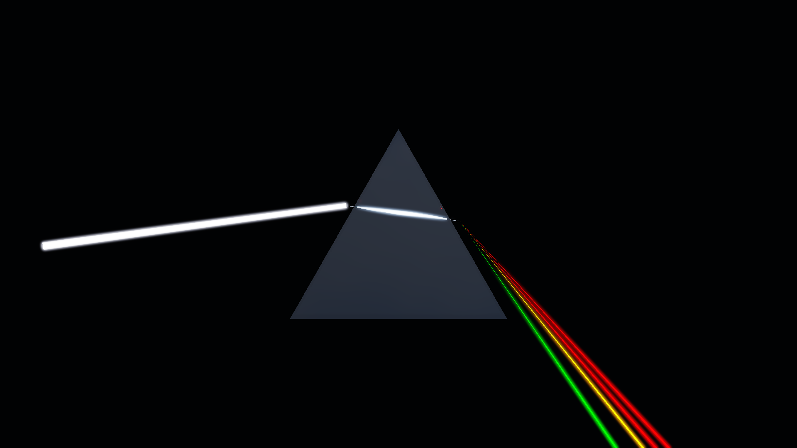
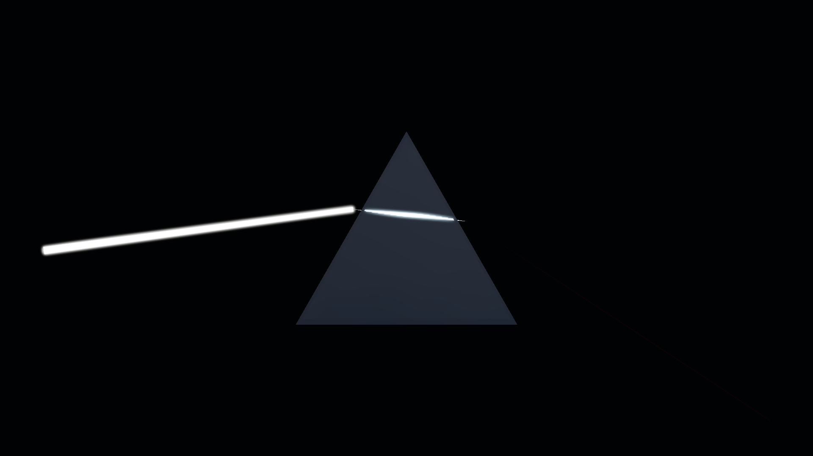
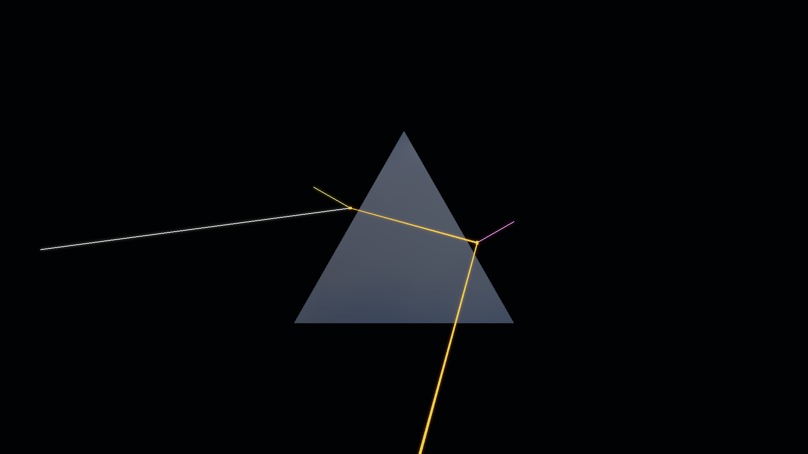
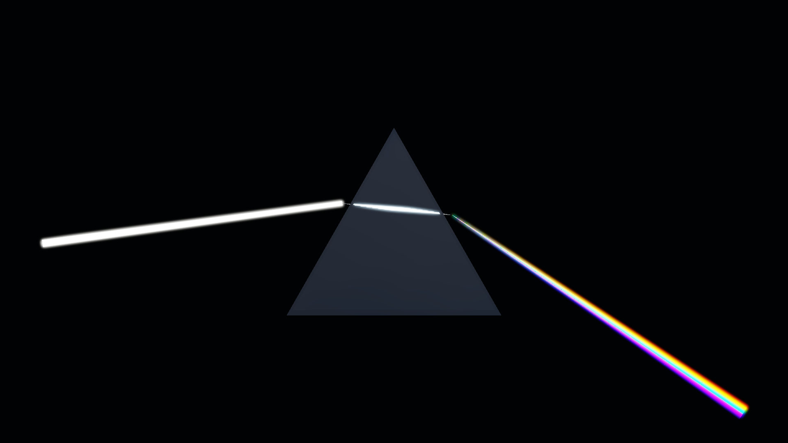

# Prism-5 验收与作品集证据（Validation and Portfolio Evidence）

- 记录日期：2026-08-24（首版 `7e88fd0`；`12f7ff4` 补入 Glass-2C 光照迁移的说明）；文中基线图在 2026-09-16 的 P0-A 基线重锚定中随 Kloofendal EXR 重拍
- 源码 revision：`7e88fd0` 与 `12f7ff4`；仓库当前 HEAD 为 `35a726c`，那一轮基线改动仍是未提交的工作树状态，见 [`regression-baseline-audit.md`](regression-baseline-audit.md)
- 构建目录：`build-release`（MinGW Release，本文复现命令使用的目录）；MSVC 验收目录为 `build-ci-msvc`，`README.md` 记录改动验收会同时编译 MSVC 与 MinGW/GCC 两套工具链
- GPU / 驱动 / OpenGL：NVIDIA GeForce RTX 4060 Laptop GPU / NVIDIA 591.44 / OpenGL 3.3 Core；采集分辨率 1920 × 1080，MSAA 4x
- 版本化原始数据：[`prism5_samples_7.json`](performance/prism5_samples_7.json)、[`prism5_samples_15.json`](performance/prism5_samples_15.json)、[`prism5_samples_21.json`](performance/prism5_samples_21.json)、[`prism5_samples_31.json`](performance/prism5_samples_31.json)

## 目标与范围

本文为 Prism Spectrum 收口，给出可重复的正确性、性能与展示证据：四档光谱采样的性能基线、十张固定机位视觉回归基线、三步作品集展示序列，以及一段确定性的 demo reel。原始 benchmark 采集版本化在 `docs/performance/prism5_samples_*.json`。

本文只记录已经发生的事：它本身不改写光学实现、不移动基线，也不放宽任何阈值。基线真正发生的改写来自 2026-09-16 那一轮被批准的 P0-A 重锚定，过程记录在 [`regression-baseline-audit.md`](regression-baseline-audit.md)。本文没有覆盖的面（多机器数据、reel PNG 序列入库）写在「限制与取舍」。

## 实现

### 运行时：固定夹具与预设

Prism-5 的所有采集都从 Prism-0 固定资产出发：`MYRENDERER_PRISM_DEMO=1` 加载 `prism_spectrum.gltf` 与固定 hero 机位。光谱采样由 `MYRENDERER_PRISM_SAMPLES=7|15|21|31` 选择（其他数值吸附到最近档），`MYRENDERER_PRISM_SPECTRUM_MODE=seven` 切到七波段美术模式；光学预设由 `MYRENDERER_PRISM_PRESET=0|1|2|3`（Crown Glass、Water-like、Diamond-like、Exaggerated Cover）选择，光束方向、IOR、色散、White Point 与 Bloom 另有 `MYRENDERER_PRISM_BEAM_ANGLE`、`MYRENDERER_PRISM_IOR`、`MYRENDERER_PRISM_DISPERSION`、`MYRENDERER_PRISM_WHITE_POINT`、`MYRENDERER_PRISM_BLOOM_CONTRIBUTION` 覆盖。Inspector 侧的同一批控件与四个光学预设见 `README.md` 的 Prism-4 条目。

### 诊断：三个采集入口

- `prism5-visual-regression`（`tools/Prism5VisualRegression.cmake`）：隐藏窗口 + Prism demo + 1920 × 1080 + 显式抑制编辑器选中描边，逐张采集后与 `docs/images/` 基线比对，阈值 MAE 0.015、changed 0.08，任一张失败即以非零退出；
- `prism5-benchmark`（`tools/Prism5Benchmark.cmake`）：1920 × 1080、4x MSAA、四档光谱采样，把 JSON 写进构建目录的 `prism5-benchmarks`；
- `prism5-reel-frames`（`CMakeLists.txt` 中的 custom target）：`MYRENDERER_PRISM_REEL_DIR` + `MYRENDERER_PRISM_REEL_FRAMES=360` + 1280 × 720，按帧序号推进参数并逐帧写出 `frame_####.png`。

## 截图

### 作品集 Hero Shot

最终美术方向的一帧：`MYRENDERER_PRISM_PRESET=3`（Exaggerated Cover）在黑色舞台上让白光入射，出射端被拉开成一组分立的波长路径（画面里能看到红、黄、绿几条），白点 tint 与光束 bloom 一并生效。这张图证明 Prism-5 的最终画质档就是十张回归基线里的 Hero Shot。



### 色散 On/Off 对照

同一机位、同一 1920 × 1080 分辨率下把色散关掉（`MYRENDERER_PRISM_DISPERSION=0`），棱镜仍然可见，但所有波长路径在空间上重合，彩带塌回一束白光。它与上面那张 Hero Shot 构成色散 On/Off 对照，说明颜色分离来自波长相关的 Cauchy IOR，而不是材质着色。



### 高 IOR 全内反射调试证据

`MYRENDERER_PRISM_PRESET=2` 配合 `MYRENDERER_PRISM_DEBUG=1` 打开光学路径 overlay：高 IOR 下内部射线在出射界面处发生全内反射（total internal reflection）并折返向上，同时叠加显示波长路径、界面点与入射/出射表面法线（画面里那条短线段）。这张图证明 TIR 分支是被显式求解、并且能在画面上看见的，而不是被静默丢弃的无效路径。



### 1x / 4x MSAA 边缘覆盖对照

同一机位、同一光谱设置下只改变 MSAA：1x 只做单点采样，细边缘与光谱 ribbon 的上下边界会出现阶梯状走样；4x 用多重采样解析同一构图下这些细边缘，过渡更平滑。两栏一起构成光栅边缘覆盖的对照，也是矩阵里 `prism5_msaa1.png` / `prism5_msaa4.png` 这一对的来源。




重拍命令（与 `tools/Prism5VisualRegression.cmake` 的写法一致：隐藏窗口、Prism demo 资产、1920 × 1080、显式抑制编辑器选中描边；仓库入口是 `prism5-visual-regression`，它一次采集并比对十张）：

```powershell
$env:MYRENDERER_SMOKE_TEST='1'; $env:MYRENDERER_PRISM_DEMO='1'
$env:MYRENDERER_RENDER_WIDTH='1920'; $env:MYRENDERER_RENDER_HEIGHT='1080'
$env:MYRENDERER_HIDE_SELECTION_OUTLINE='1'; $env:MYRENDERER_MSAA='4'

# Hero Shot
$env:MYRENDERER_PRISM_PRESET='3'
$env:MYRENDERER_SCREENSHOT='build-ci-msvc/prism5_hero_exaggerated.png'
build-ci-msvc/Release/MyRenderer.exe

# 色散 Off
$env:MYRENDERER_PRISM_DISPERSION='0'
$env:MYRENDERER_SCREENSHOT='build-ci-msvc/prism5_prism_no_dispersion.png'
build-ci-msvc/Release/MyRenderer.exe

# 高 IOR TIR 调试
$env:MYRENDERER_PRISM_PRESET='2'; $env:MYRENDERER_PRISM_DEBUG='1'
$env:MYRENDERER_SCREENSHOT='build-ci-msvc/prism5_tir_debug.png'
build-ci-msvc/Release/MyRenderer.exe

# 1x / 4x MSAA 对照
$env:MYRENDERER_PRISM_DEBUG='0'
$env:MYRENDERER_MSAA='1'; $env:MYRENDERER_SCREENSHOT='build-ci-msvc/prism5_msaa1.png'
build-ci-msvc/Release/MyRenderer.exe
$env:MYRENDERER_MSAA='4'; $env:MYRENDERER_SCREENSHOT='build-ci-msvc/prism5_msaa4.png'
build-ci-msvc/Release/MyRenderer.exe
```

### 作品集展示序列与 demo reel

三步作品集讲解固定使用这三张基线：

1. `prism5_white_beam_no_prism.png` — White Beam。
2. `prism5_prism_no_dispersion.png` — Prism with coincident wavelengths。
3. `prism5_hero_exaggerated.png` — separated Spectrum and final art direction。

`docs/media/prism5_demo_reel.mp4` 是一段确定性的 15 秒、24 fps、1280 × 720 采集：它从零色散出发，经过一段平滑的色散爬升，扫过连续的 2°–12° 入射角区间，最后停在七波段 Exaggerated Cover 预设上。动画由 `Application::updatePrismReelFrame()` 按帧序号归一化时间 `t` 驱动，因此同一份构建可以逐帧复现。reel 的 PNG 序列只生成在构建目录（`prism5-reel-frames`，360 帧），不入库；入库的只有编码后的 MP4。

```powershell
cmake --build build-release --target prism5-reel-frames
python tools/encode_prism5_reel.py build-release/prism5-reel-frames docs/media/prism5_demo_reel.mp4 --fps 24
```

## 验证

### 光谱质量 benchmark

计时口径：VSync 关闭，60 帧预热、180 帧测量；GPU 时间用 Beam Pass 前后的 timestamp query，全帧时间用四槽 elapsed-time query ring；CPU 光学时间取每个质量档 256 次重复的 `solvePrismDemo` 调用。P50 是中位数，P95 用来暴露较慢的尾部，而不让单个离群值主导整份报告。

| Samples | CPU optics P50 / P95 | GPU Beam P50 / P95 | GPU frame P50 / P95 | Draw calls | Estimated GPU working set |
| ---: | ---: | ---: | ---: | ---: | ---: |
| 7 | 0.0010 / 0.0010 ms | 0.0031 / 0.0205 ms | 1.6056 / 2.6388 ms | 14 | 203.396 MiB |
| 15 | 0.0019 / 0.0019 ms | 0.0041 / 0.0287 ms | 1.6620 / 2.8262 ms | 14 | 203.397 MiB |
| 21 | 0.0027 / 0.0028 ms | 0.0051 / 0.0317 ms | 1.6343 / 2.7535 ms | 14 | 203.398 MiB |
| 31 | 0.0040 / 0.0041 ms | 0.0061 / 0.0328 ms | 1.6968 / 2.8324 ms | 14 | 203.400 MiB |

这一页的每个单元格都与 `docs/performance/prism5_samples_*.json` 对得上：例如 21 样本档的 `gpuBeamP50Ms` 0.005120 与 `gpuBeamP95Ms` 0.031744 即表中的 0.0051 / 0.0317 ms，`gpuFrameP50Ms` 1.634304 即 1.6343 ms，`totalMeasuredMemoryBytes` 213,278,444 B 即 203.398 MiB；四档的 `drawCalls` 都是 14。

实测最差的 Beam P95 是 0.0328 ms，远低于 2 ms 的调查阈值。增加光谱采样主要让那条窄动态 ribbon 的 VBO 与 CPU 求解量变大；它不增加 Draw Call，因为相邻波长是在同样的 Incident/Internal/Exit 三批里一起提交的。工作集估算包含 RenderTarget、Bloom ping-pong 贴图、MSAA attachment、Shadow Map、环境 Cubemap、Beam VBO、棱镜顶点/索引数据与导入纹理，但不含驱动内部的不透明开销与分配器 padding。

### 十张视觉回归矩阵

`prism5-visual-regression` 采集十张 1920 × 1080 固定机位图并与版本化基线比对。比对报告 normalized RGBA mean absolute error（MAE）与「最大通道差超过 8/255 的像素比例」。默认跨驱动容差是 MAE ≤ 0.015、changed pixels ≤ 8%。

| Baseline | Evidence |
| --- | --- |
| `prism5_white_beam_no_prism.png` | White-beam stage with hidden prism, IOR 1, and zero dispersion |
| `prism5_prism_no_dispersion.png` | Visible prism with all wavelength paths spatially coincident |
| `prism5_continuous_21.png` | Physical-mode 21-sample continuous spectrum |
| `prism5_seven_band.png` | Seven-band art-direction mode |
| `prism5_tir_debug.png` | High-IOR TIR path and interface normals |
| `prism5_angle_minus_8.png` / `prism5_angle_plus_12.png` | World-space beam direction and prism-face topology coverage |
| `prism5_msaa1.png` / `prism5_msaa4.png` | Raster edge coverage comparison |
| `prism5_hero_exaggerated.png` | Final portfolio Hero Shot |

在采集机器上，一次干净的重新构建与重拍对全部十张图都产出 MAE 0 与 0% changed pixels。CPU 测试另外把光束角从 2° 扫到 12°、步长 0.5°，并断言路径有限、红/紫顺序稳定、相邻方向连续（CTest 用例 `prism-optics`，断言位于 `tests/PrismOpticsTests.cpp`）。一条恰好穿过棱镜顶点的射线可以合法地切换出射面；更宽的 -8°/+12° 这一对被保留为显式的拓扑覆盖，而不被当作插值区间。

Glass-2C 的接入用 HDRI 驱动的 Split-Sum IBL 取代了此前的近似环境 mip chain。含玻璃体的 Prism 基线因此被复核并针对这次有意的光照迁移重拍；white-beam/no-prism 这张图保持不变。随后完整的十张矩阵在没有放宽阈值的前提下重新回到 MAE 0 与 0% changed pixels。

> **待复核**：本节结论按原文保留，逐项的可复核程度如下：
> - 四档 benchmark 数值已与 `docs/performance/prism5_samples_*.json` 逐项核对一致。
> - 「十张全部 MAE 0 与 0% changed pixels」与「white-beam/no-prism 保持不变」只有原文与 [`regression-baseline-audit.md`](regression-baseline-audit.md) 的文字记录；本会话没有重跑 GPU 回归。可间接核对的是：`12f7ff4` 重写了十张里的九张（`prism5_white_beam_no_prism.png` 未动），而 2026-09-16 的重锚定在工作树里改写了 `prism5_tir_debug.png`、`prism5_msaa1.png`、`prism5_msaa4.png`、`prism5_prism_no_dispersion.png`、`prism5_hero_exaggerated.png` 等图，同样没有动 `prism5_white_beam_no_prism.png`——与「white-beam/no-prism 不变」的说法一致。
> - 「Beam P95 远低于 2 ms 调查阈值」中的阈值只有本文一处记录，仓库里没有把它写成断言或配置项。
> - reel 的时长、帧率与分辨率与 `CMakeLists.txt` 的 `prism5-reel-frames`（360 帧、1280 × 720）及 `tools/encode_prism5_reel.py` 的 `--fps` 默认值 24 一致；动画段落（零色散 → 平滑爬升 → 2°–12° 扫描 → Exaggerated Cover）与 `Application::updatePrismReelFrame()` 的分段一致。

## 限制与取舍

- **跨驱动容差是有意保留的**：阈值 MAE ≤ 0.015 与 changed pixels ≤ 8% 用于容忍不同驱动的浮点与采样差异，而不是用来掩盖固定输入变化；本阶段没有放宽它们。
- **棱镜顶点的出射面切换不算回归**：射线恰好穿过顶点时切换出射面是合法的，因此 -8°/+12° 这一对是拓扑覆盖，不是插值区间。
- **所有性能数字来自同一台参考机**（RTX 4060 Laptop / 驱动 591.44 / OpenGL 3.3 Core），本文没有跨机器证据；`prism5-benchmark` 会把新结果写进构建目录，所以换机器复测不会覆盖版本化参考值。
- **工作集是一个可解释的估算**：它不含驱动内部的不透明开销与分配器 padding，因此只能与同一口径的历史记录比较，不能当作精确显存占用。
- **reel 的 PNG 序列只在构建目录里生成**（360 帧、1280 × 720），不入库；`docs/media/` 里版本化的只有编码后的 `prism5_demo_reel.mp4`，所以重编 MP4 依赖本机 OpenCV 的 mp4v 编码器。
- **十张基线图与本文并非同一提交**：图片最近一次入库是 2026-08-29 的 `245b663`，2026-09-16 的 P0-A 重锚定又在工作树里改写了其中九张且尚未提交；引用这些图时必须说明属于哪一轮采集。

## 复现命令

```powershell
cmake --build build-release --target prism5-visual-regression
cmake --build build-release --target prism5-benchmark
cmake --build build-release --target prism5-reel-frames
python tools/encode_prism5_reel.py build-release/prism5-reel-frames docs/media/prism5_demo_reel.mp4 --fps 24
```

benchmark target 会把 JSON 写进 `build-release/prism5-benchmarks`，因此新机器不会覆盖版本化的参考测量值。单张截图与逐图环境变量的写法见「截图」一节。

## 下一步

1. 把 2026-09-16 接受基线更新后的 56 张 PNG、`docs/images/README.md` 与 [`regression-baseline-audit.md`](regression-baseline-audit.md) 作为一个明确批准的基线更新整体提交，再进入后续功能改动（`todolist.md` 的 `P0-A：先锁定回归基线`）。
2. Prism Spectrum 所属的「玻璃、棱镜与焦散旗舰」里程碑在 `todolist.md` 2.2 里已全部勾选，渲染主线转入 `P1-0：C++ 模块驱动的渲染与模拟工作台`；若要在新阶段里保持 Prism-5 的证据有效，重拍基线与 reel 前先走 P0-A 的基线更新路径。
