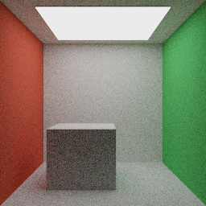
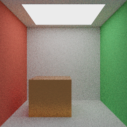

# SR-P1 Reference Path Tracer

SR-P1 先实现 CPU 参考路径追踪器，用可重复的几何、采样和材质结果为实时光栅、
后续 Vulkan 光追与自然场景提供 Ground Truth。SR-P1A 建立共享场景快照
与加速结构；SR-P1B 在其上增加确定性 Diffuse/Emissive 输出和单工作线程任务；
SR-P1C 将积分器升级为 glTF Metallic-Roughness PBR，并加入 Russian Roulette。

## SR-P1A：共享只读场景快照

实时资产仍只经过现有 `ModelImporter`。`GpuModel` 在上传 OpenGL 资源的同时接管并保留
一份 `shared_ptr<const ModelData>`；光栅路径使用 GPU Mesh，参考路径追踪路径使用同一份
CPU Mesh、材质和纹理数据，不会重新读取 OBJ、DAE、glTF 或 GLB。

`captureSceneSnapshot()` 从某一帧的 `Scene` 与 `Camera` 生成值语义快照：

- 相机位置、View/Projection、垂直 FOV 与宽高比；
- 方向光、局部点光/聚光和环境参数；
- 可见 Entity 的世界变换、Tint、投影阴影标记与稳定 Entity ID；
- 去重后的只读 `ModelData` 资产；
- glTF Node → Mesh 引用展开后的 Mesh Instance。

同一 `ModelData` 被多个 Entity 或 Node 引用时，快照只持有一个资产共享引用；实例各自
保存 Object-to-World 与 Normal-to-World。`buildWorldTriangles()` 仅在构建当前 CPU BLAS
基线时展开世界空间三角形，同时保留 Asset / Instance / Mesh / Material / Primitive ID，
以便后续 Surface Interaction 查找材质和纹理。

## Ray、Surface Interaction 与 BVH

几何层不依赖 OpenGL：

- `Ray` 显式保存 `[tMin, tMax]`，用于自相交偏移和有限距离阴影查询；
- `Bounds3` 使用 slab test，并正确处理平行方向、无效 Bounds 和裁剪区间；
- Ray/Triangle 使用双面 Möller–Trumbore 求交，输出重心坐标、UV、几何/着色法线、
  Front Face 与稳定场景标识；
- 退化三角形、非有限顶点和不可逆实例变换不会进入有效求交结果；
- BVH 首版按最大质心轴做确定性的 Median Split，叶节点默认最多 4 个三角形；
- 遍历优先访问近节点，并用当前最近距离裁剪后续 AABB 与 Triangle 查询。

首版选择 Median Split 是为了先锁定正确性、确定性和单元测试接口。等 Cornell-style、
PBR 与 Volume Glass 场景产生可重复的 Build/Traversal Profile 后，再决定是否增加 SAH，
避免在没有数据时增加构建复杂度。

## 验证

纯 CPU 测试不创建 OpenGL 上下文：

```powershell
cmake --build build --config Release --target MyRendererPathTracingTests
ctest --test-dir build -C Release -R path-tracing-foundation --output-on-failure
```

测试覆盖：

- AABB 正向命中、平行 slab 未命中和 `tMax` 裁剪；
- Triangle 正反面命中、重心/UV 插值、法线朝向和退化面拒绝；
- Median BVH 节点统计、Primitive 重排后身份保持、最近命中和有限距离遮挡；
- 同一 Mesh 的多 Node / 多 Entity 实例、资产去重、材质编号与世界变换展开；
- SceneSnapshot → World Triangle → BVH → Surface Interaction 完整 CPU 数据链。

## 当前边界与下一步

- 当前是静态快照；Skinned Mesh 会标记为 `skinned`，但本阶段仅使用源/Bind Pose 顶点，
  不复制运行时关节姿势。
- Snapshot 已承载材质与纹理来源；SR-P1C 已消费常量材质因子，但尚未采样基础色、法线或
  metallic-roughness 纹理。
- 当前 BVH 是展开后的单层世界空间结构；等正确性稳定后再拆分共享 Mesh BLAS 与实例 TLAS。
- SR-P1C 已补充常量 Metallic-Roughness PBR 与 Russian Roulette；纹理、NEE/MIS 与并行优化仍未实现。

SR-P1B 已实现确定性 RNG、Camera Ray、Progressive Accumulation、SPP/Max Depth、
可取消后台任务和最小 Diffuse/Emissive 路径，从“可求交”推进到“可输出第一张参考图”。

## SR-P1B：确定性像素输出（2026-09-05）

`ProgressiveRenderer` 接收 SR-P1A 的 `SceneSnapshot` 值和 `RenderSettings`，不重新解析资产，
也不访问 OpenGL。可直接将 `captureSceneSnapshot(...)` 的结果传给 `RenderTask::start()`。
本阶段提供独立 CPU 命令行入口，不增加实时应用的 ImGui 渲染面板。

- **Camera Ray**：针孔透视相机，使用位置、逆 View 的方向基、垂直 FOV 与快照 Aspect Ratio。
  像素原点在左上；每个像素使用两个 `[0,1)` 随机数抖动；中心像素看向相机局部 `-Z`。
  Projection 是快照元数据，本阶段不支持正交、非对称投影、景深或 GPU TAA jitter。
- **确定性**：用固定 uint32 混合函数从 Seed / Pixel Index / Sample Index 初始化采样流，
  每次返回 24 位精度的 `[0,1)` 浮点值。不依赖标准库随机分布或任务启动时间。
  同一构建/CPU、参数与静态快照可精确复现；不同编译器的三角函数与浮点舍入不保证字节一致。
- **渐进累积**：每轮为所有像素增加一个样本。内部保存线性 RGB Sum 与完整轮数，显示/导出时除以轮数。
  单轮先写临时缓冲，完成后整体提交；中断不会混入部分像素样本。SPP 是目标轮数，不改变已有采样前缀。
  改变相机、场景、分辨率、Seed 或 Max Depth 时必须创建新 renderer 或重新 start，重置累积。
- **Diffuse/Emissive**：共享 `MaterialData` 新增线性 `emissiveFactor`，OBJ Ke 与 glTF emissiveFactor
  经原导入器保留。Lambert 使用几何法线与余弦加权半球采样，`f*cos/pdf` 化简为 Albedo；
  baseColorFactor 按线性值使用，实例 Tint 与光栅路径一致从 sRGB 转线性，再将反射率限制到 `[0,1]`。
  Diffuse 为双面回退；发光面按原始绕序单面发光，`doubleSided` 时双面发光。发光后仍可继续反射。
  漏射线读取常量线性环境色乘强度；没有读取 HDRI，也没有解析或采样显式方向光/点光/聚光。
- **Max Depth**：最多执行的射线段数。1 仅显示相机直接命中的 Emission 或环境；2 允许一次
  Diffuse 反弹后命中发光面/环境。SR-P1B 的终点硬截断存在能量偏差；SR-P1C 已在此基础上补充 RR。
- **后台任务**：只有一个工作线程，没有线程池/Tile 并行。状态为 Idle、Running、Completed、
  Cancelled、Failed；`progress()` 在锁内返回结果副本。工作线程独占 BVH/累积缓冲，异常存入 error。
  cancel 在像素与路径段边界检查；SR-P1A 的三角形展开/BVH 构建尚不支持中途取消，因此构建期间的
  cancel/start/析构 join 可能等待构建结束。start/cancel/wait 由同一拥有者线程调用；progress 可跨线程读取。
  析构会取消并 join；新 start 先取消/join 旧任务，再清空进度，防止旧任务覆盖新结果。
  快照共享的 const ModelData 必须在任务生命周期内保持不可变。
- **输出**：Radiance `.hdr`（线性 RGBE，有量化）与 `.png`（Reinhard `L/(1+L)`，曝光 1，再执行一次
  标准 sRGB 编码）。导出不会修改累积缓冲；零样本/尺寸不一致/非有限输出被拒绝。

### 固定验收图与回归

原创场景在 `src/pathtracer/AcceptanceScene.cpp` 中通过同一 ModelData/SnapshotBuilder 数据链生成。
开放正面的红绿墙房间、灰色箱体、大面积顶灯，无外部贴图。素材与生成图采用项目 MIT 许可证。
固定参数：**256 × 256，256 SPP，Max Depth 6，Seed 20260905**；相机 `(0,1,3.4)` 朝向 `(0,1,0)`，
垂直 FOV 43°、Aspect 1。顶灯线性发射强度 `(5,5,5)`，环境为黑色。



线性文件：[sr-p1b-diffuse.hdr](reference-images/sr-p1b-diffuse.hdr)。
纯 BSDF 采样下仍有明显噪声；该图仅验收最小 Diffuse/Emissive 数据链，不作为已收敛 Ground Truth。

```powershell
# 本机已验证的 MSVC 构建目录；新机器可改为 build。
cmake -S . -B build-ci-msvc -G "Visual Studio 17 2022" -A x64 -DBUILD_TESTING=ON
cmake --build build-ci-msvc --config Release --parallel 6
ctest --test-dir build-ci-msvc -C Release --output-on-failure

# SR-P1B 固定图保留为历史基线；当前自动回归入口已升级到下文 SR-P1C PBR 场景。
```

`path-tracing-progressive` 不创建窗口，覆盖 RNG 范围与复现、中心/边角/旋转相机、非法参数、
直接发光、单面发光、黑场、常量环境下 Lambert 解析能量、Tint 色彩空间、Max Depth、
分批/取消/重新启动的精确累积、后台进度/异常/析构，以及独立 stb 解码器验证 HDR/PNG 数值与上下朝向。
资产测试额外验证 OBJ/glTF Emissive 因子。固定 12×12 场景的 1/64 SPP 与 512 SPP 参考比较：
MSE 为 **1.01474 / 0.0123465**；这是固定样本下的总体趋势，不宣称每个像素误差单调下降。

SR-P1B 不包含 GGX/Metal/Transmission/Volume、纹理采样、NEE/MIS、RR、AOV、线程池或 BVH 性能优化。
后续阶段再分别验收 PBR/Glass/HDRI、直接光采样、调试层及性能；不能将 SR-P1 整阶段标为完成。

本机验收结果（MSVC Release，2026-09-05）：全量构建通过；6/6 CTest 通过；
`path-tracing-regression` 重新渲染后的 HDR 与 PNG 相对 RMSE 均为 **0**。

## SR-P1C：Metallic-Roughness PBR 与 Russian Roulette（2026-09-14）

`PbrBsdf` 将材质求值/采样从积分器中拆开，直接消费共享 `MaterialData` 的常量
`baseColorFactor`、`metallicFactor` 与 `roughnessFactor`；Emission 和实例 Tint 延续 SR-P1B 语义。

- **BRDF**：Diffuse 使用 Lambert，并以 Schlick Fresnel 扣除进入镜面反射的能量；Specular 使用
  Cook-Torrance、GGX NDF、Smith G1/G2 与 Schlick Fresnel。glTF 感知粗糙度先平方为微表面 alpha，
  最低限制为 0.045；F0 在 dielectric 0.04 与金属 base color 之间按 Metallic 插值。
- **采样**：按 F0 亮度选择 cosine-weighted diffuse 或 GGX half-vector，最终始终用两者的 mixture PDF
  计算 `f * cos / pdf`，不会因采样分支选择而改变 BRDF。当前是 GGX NDF sampling，不是 VNDF；掠射角
  可能产生无效反射与更高方差。粗糙金属仍是单次微表面散射，没有 multi-scattering energy compensation。
- **法线与偏移**：BRDF 使用插值 shading normal，射线原点仍沿面向入射侧的 geometric normal 偏移，
  避免平滑法线造成明显自相交。
- **Russian Roulette**：`RenderSettings::russianRouletteDepth` 默认 3，表示完成第三次反射后开始生存测试；
  生存率取 throughput 最大分量并限制到 `[0.05, 0.95]`，存活路径除以该概率保持无偏。设为 0 可关闭，
  Max Depth 仍是最终安全上限。

原创 PBR 验收场景复用 Cornell-style 房间，将箱体改为橙铜色金属（Metallic 1、Roughness 0.32），
并加入低强度冷色常量环境以照亮朝向开放面的镜面反射。固定参数为 **256 × 256、256 SPP、
Max Depth 6、RR Depth 3、Seed 20260914**。



线性文件：[sr-p1c-pbr.hdr](reference-images/sr-p1c-pbr.hdr)。当前仍只做 BSDF sampling；顶灯边缘和箱体
高光的噪声直接说明下一批需要面光源 NEE/MIS，而不是用更高 SPP 掩盖采样问题。

```powershell
# 生成到 build-ci-msvc/path-tracing-acceptance/pbr.{hdr,png}，并与固定图比较。
cmake --build build-ci-msvc --config Release --target path-tracing-acceptance
cmake --build build-ci-msvc --config Release --target path-tracing-regression

# 自定义 SPP/Depth/Seed；固定验收相机只接受方形输出，RR Depth 使用默认值 3。
.\build-ci-msvc\Release\MyRendererReferenceRender.exe build-ci-msvc/preview 128 128 32 6 20260914
```

CPU 测试新增 GGX 粗糙度峰值、金属 F0 着色、下半球拒绝、mixture sample/PDF 有限性、半球反射率，
并验证 RR 确实改变路径、同一 Seed 仍精确复现。4×4×2048 SPP 的灰色 Tint 白炉结果为
**0.166236**；粗糙 GGX 单次散射低于理想多次散射是当前已知边界。固定 Cornell 场景相对 512 SPP
参考的 MSE 从 **1.15996（1 SPP）** 降至 **0.012979（64 SPP）**。

SR-P1C 仍不采样材质纹理、HDRI 或显式灯光，不支持 Transmission/IOR/Volume，也没有 NEE/MIS、AOV、
线程池或 GGX VNDF。下一批优先实现 emissive triangle + 显式灯光 NEE 与 MIS；纹理采样随后接入，玻璃
在不透明 PBR 能量与直接光验证稳定后再推进。

本机验收（MSVC Release，2026-09-14）：完整构建通过，6/6 CTest 通过；固定 HDR 与 PNG 回归的
relative RMSE 均为 **0**。构建仅保留主应用既有的 MSVC `getenv` 弃用警告。
