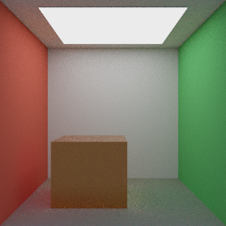
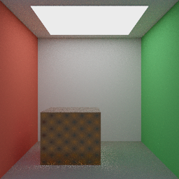
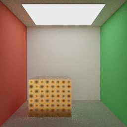
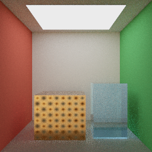
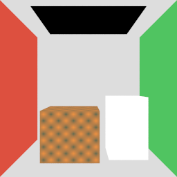
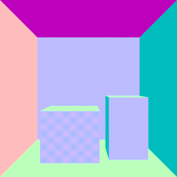
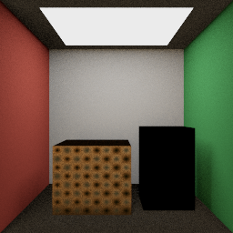
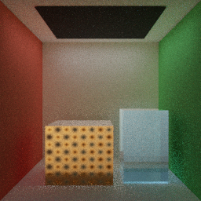
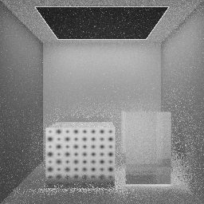

# SR-P1 Reference Path Tracer

SR-P1 先实现 CPU 参考路径追踪器，用可重复的几何、采样和材质结果为实时光栅、
后续 Vulkan 光追与自然场景提供 Ground Truth。SR-P1A 建立共享场景快照
与加速结构；SR-P1B 在其上增加确定性 Diffuse/Emissive 输出和单工作线程任务；
SR-P1C 将积分器升级为 glTF Metallic-Roughness PBR 并加入 Russian Roulette；SR-P1D 增加
发光三角形/显式灯光 NEE、阴影可见性和 MIS；SR-P1E/F 继续补齐材质纹理与 HDR Environment
重要性采样；SR-P1G 增加 Dielectric Transmission、IOR 与 Beer-Lambert Volume；SR-P1H 输出
Primary Surface、Lighting、Sample Count 与 Variance AOV；SR-P1I 加入确定性 Tile 线程池和 BVH Profile；
SR-P1J 用 Binned SAH 降低遍历成本；SR-P1K 为共享 Mesh Instance 增加 BLAS/TLAS 与自动后端选择；
SR-P1L 使用亮度方差和 95% 置信区间执行逐像素 Adaptive Sampling；SR-P1M 将同一固定 `.myscene`
以 Raster 与 Path Tracer 渲染，并自动输出显示空间 Difference、Triptych、指标和 AOV，完成阶段验收闭环。

## SR-P1A：共享只读场景快照

实时资产仍只经过现有 `ModelImporter`。`GpuModel` 在上传 OpenGL 资源的同时接管并保留
一份 `shared_ptr<const ModelData>`；光栅路径使用 GPU Mesh，参考路径追踪路径使用同一份
CPU Mesh、材质和纹理数据，不会重新读取 OBJ、DAE、glTF 或 GLB。

`captureSceneSnapshot()` 从某一帧的 `Scene` 与 `Camera` 生成值语义快照：

- 相机位置、View/Projection、垂直 FOV 与宽高比；
- 方向光、局部点光/聚光和环境参数；
- 可见 Entity 的世界变换、Tint、投影阴影标记与稳定 Entity ID；
- 去重后的只读 `ModelData` 资产；
- glTF Node → Mesh 引用展开后的 Mesh Instance。

同一 `ModelData` 被多个 Entity 或 Node 引用时，快照只持有一个资产共享引用；实例各自
保存 Object-to-World 与 Normal-to-World。`buildWorldTriangles()` 为单层 World BVH 展开世界空间三角形；
SR-P1K 的 `InstancedBvh` 则按 Asset/Mesh 共享局部几何，只为 TLAS 保存实例 Transform 与 Bounds。
两条路径都保留 Asset / Instance / Mesh / Material / Primitive ID，供 Surface Interaction 查找材质和纹理。

## Ray、Surface Interaction 与 BVH

几何层不依赖 OpenGL：

- `Ray` 显式保存 `[tMin, tMax]`，用于自相交偏移和有限距离阴影查询；
- `Bounds3` 使用 slab test，并正确处理平行方向、无效 Bounds 和裁剪区间；
- Ray/Triangle 使用双面 Möller–Trumbore 求交，输出重心坐标、UV、几何/着色法线、
  Front Face 与稳定场景标识；
- 退化三角形、非有限顶点和不可逆实例变换不会进入有效求交结果；
- BVH 首版按最大质心轴做确定性的 Median Split，叶节点默认最多 4 个三角形；
- 遍历优先访问近节点，并用当前最近距离裁剪后续 AABB 与 Triangle 查询。

首版选择 Median Split 是为了先锁定正确性、确定性和单元测试接口。等 Cornell-style、
PBR 与 Volume Glass 场景产生可重复的 Build/Traversal Profile 后，再决定是否增加 SAH，
避免在没有数据时增加构建复杂度。

## 验证

纯 CPU 测试不创建 OpenGL 上下文：

```powershell
cmake --build build --config Release --target MyRendererPathTracingTests
ctest --test-dir build -C Release -R path-tracing-foundation --output-on-failure
```

测试覆盖：

- AABB 正向命中、平行 slab 未命中和 `tMax` 裁剪；
- Triangle 正反面命中、重心/UV 插值、法线朝向和退化面拒绝；
- Median BVH 节点统计、Primitive 重排后身份保持、最近命中和有限距离遮挡；
- 同一 Mesh 的多 Node / 多 Entity 实例、资产去重、材质编号与世界变换展开；
- SceneSnapshot → World Triangle → BVH → Surface Interaction 完整 CPU 数据链。

## 当前边界与下一步

- 当前是静态快照；Skinned Mesh 会标记为 `skinned`，但本阶段仅使用源/Bind Pose 顶点，
  不复制运行时关节姿势。
- Snapshot 已承载材质、纹理、HDR Environment 与 glTF Transmission/IOR/Volume；SR-P1E～G 已在 CPU 端消费这些只读数据。
- 加速后端可选单层 World SAH BVH 或共享 Mesh BLAS + Instance TLAS；Auto 只在展开 Triangle 至少是
  唯一 Triangle 两倍时选两级结构，无复用场景保持 World BVH。
- SR-P1D～L 已补充发光三角形、显式灯光与 HDR Environment NEE/MIS、光滑介质透射、体积吸收、
  七组 AOV、Tile 线程池、Binned SAH、BLAS/TLAS 与 Adaptive Sampling；粗糙透射 GGX/VNDF、
  动态 TLAS Refit 和 Firefly-robust 收敛估计仍未实现。

SR-P1B 已实现确定性 RNG、Camera Ray、Progressive Accumulation、SPP/Max Depth、
可取消后台任务和最小 Diffuse/Emissive 路径，从“可求交”推进到“可输出第一张参考图”。

## SR-P1B：确定性像素输出（2026-09-05）

`ProgressiveRenderer` 接收 SR-P1A 的 `SceneSnapshot` 值和 `RenderSettings`，不重新解析资产，
也不访问 OpenGL。可直接将 `captureSceneSnapshot(...)` 的结果传给 `RenderTask::start()`。
本阶段提供独立 CPU 命令行入口，不增加实时应用的 ImGui 渲染面板。

- **Camera Ray**：针孔透视相机，使用位置、逆 View 的方向基、垂直 FOV 与快照 Aspect Ratio。
  像素原点在左上；每个像素使用两个 `[0,1)` 随机数抖动；中心像素看向相机局部 `-Z`。
  Projection 是快照元数据，本阶段不支持正交、非对称投影、景深或 GPU TAA jitter。
- **确定性**：用固定 uint32 混合函数从 Seed / Pixel Index / Sample Index 初始化采样流，
  每次返回 24 位精度的 `[0,1)` 浮点值。不依赖标准库随机分布或任务启动时间。
  同一构建/CPU、参数与静态快照可精确复现；不同编译器的三角函数与浮点舍入不保证字节一致。
- **渐进累积**：每轮为所有像素增加一个样本。内部保存线性 RGB Sum 与完整轮数，显示/导出时除以轮数。
  单轮先写临时缓冲，完成后整体提交；中断不会混入部分像素样本。SPP 是目标轮数，不改变已有采样前缀。
  改变相机、场景、分辨率、Seed 或 Max Depth 时必须创建新 renderer 或重新 start，重置累积。
- **Diffuse/Emissive**：共享 `MaterialData` 新增线性 `emissiveFactor`，OBJ Ke 与 glTF emissiveFactor
  经原导入器保留。Lambert 使用几何法线与余弦加权半球采样，`f*cos/pdf` 化简为 Albedo；
  baseColorFactor 按线性值使用，实例 Tint 与光栅路径一致从 sRGB 转线性，再将反射率限制到 `[0,1]`。
  Diffuse 为双面回退；发光面按原始绕序单面发光，`doubleSided` 时双面发光。发光后仍可继续反射。
  漏射线读取常量线性环境色乘强度；没有读取 HDRI，也没有解析或采样显式方向光/点光/聚光。
- **Max Depth**：最多执行的射线段数。1 仅显示相机直接命中的 Emission 或环境；2 允许一次
  Diffuse 反弹后命中发光面/环境。SR-P1B 的终点硬截断存在能量偏差；SR-P1C 已在此基础上补充 RR。
- **后台任务**：只有一个工作线程，没有线程池/Tile 并行。状态为 Idle、Running、Completed、
  Cancelled、Failed；`progress()` 在锁内返回结果副本。工作线程独占 BVH/累积缓冲，异常存入 error。
  cancel 在像素与路径段边界检查；SR-P1A 的三角形展开/BVH 构建尚不支持中途取消，因此构建期间的
  cancel/start/析构 join 可能等待构建结束。start/cancel/wait 由同一拥有者线程调用；progress 可跨线程读取。
  析构会取消并 join；新 start 先取消/join 旧任务，再清空进度，防止旧任务覆盖新结果。
  快照共享的 const ModelData 必须在任务生命周期内保持不可变。
- **输出**：Radiance `.hdr`（线性 RGBE，有量化）与 `.png`（Reinhard `L/(1+L)`，曝光 1，再执行一次
  标准 sRGB 编码）。导出不会修改累积缓冲；零样本/尺寸不一致/非有限输出被拒绝。

### 固定验收图与回归

原创场景在 `src/pathtracer/AcceptanceScene.cpp` 中通过同一 ModelData/SnapshotBuilder 数据链生成。
开放正面的红绿墙房间、灰色箱体、大面积顶灯，无外部贴图。素材与生成图采用项目 MIT 许可证。
固定参数：**256 × 256，256 SPP，Max Depth 6，Seed 20260905**；相机 `(0,1,3.4)` 朝向 `(0,1,0)`，
垂直 FOV 43°、Aspect 1。顶灯线性发射强度 `(5,5,5)`，环境为黑色。


线性文件：[sr-p1b-diffuse.hdr](reference-images/sr-p1b-diffuse.hdr)。
纯 BSDF 采样下仍有明显噪声；该图仅验收最小 Diffuse/Emissive 数据链，不作为已收敛 Ground Truth。

```powershell
# 本机已验证的 MSVC 构建目录；新机器可改为 build。
cmake -S . -B build-ci-msvc -G "Visual Studio 17 2022" -A x64 -DBUILD_TESTING=ON
cmake --build build-ci-msvc --config Release --parallel 6
ctest --test-dir build-ci-msvc -C Release --output-on-failure

# SR-P1B 固定图保留为历史基线；当前自动回归入口已升级到下文 SR-P1C PBR 场景。
```

`path-tracing-progressive` 不创建窗口，覆盖 RNG 范围与复现、中心/边角/旋转相机、非法参数、
直接发光、单面发光、黑场、常量环境下 Lambert 解析能量、Tint 色彩空间、Max Depth、
分批/取消/重新启动的精确累积、后台进度/异常/析构，以及独立 stb 解码器验证 HDR/PNG 数值与上下朝向。
资产测试额外验证 OBJ/glTF Emissive 因子。固定 12×12 场景的 1/64 SPP 与 512 SPP 参考比较：
MSE 为 **1.01474 / 0.0123465**；这是固定样本下的总体趋势，不宣称每个像素误差单调下降。

SR-P1B 不包含 GGX/Metal/Transmission/Volume、纹理采样、NEE/MIS、RR、AOV、线程池或 BVH 性能优化。
后续阶段再分别验收 PBR/Glass/HDRI、直接光采样、调试层及性能；不能将 SR-P1 整阶段标为完成。

本机验收结果（MSVC Release，2026-09-05）：全量构建通过；6/6 CTest 通过；
`path-tracing-regression` 重新渲染后的 HDR 与 PNG 相对 RMSE 均为 **0**。

## SR-P1C：Metallic-Roughness PBR 与 Russian Roulette（2026-09-14）

`PbrBsdf` 将材质求值/采样从积分器中拆开，直接消费共享 `MaterialData` 的常量
`baseColorFactor`、`metallicFactor` 与 `roughnessFactor`；Emission 和实例 Tint 延续 SR-P1B 语义。

- **BRDF**：Diffuse 使用 Lambert，并以 Schlick Fresnel 扣除进入镜面反射的能量；Specular 使用
  Cook-Torrance、GGX NDF、Smith G1/G2 与 Schlick Fresnel。glTF 感知粗糙度先平方为微表面 alpha，
  最低限制为 0.045；F0 在 dielectric 0.04 与金属 base color 之间按 Metallic 插值。
- **采样**：按 F0 亮度选择 cosine-weighted diffuse 或 GGX half-vector，最终始终用两者的 mixture PDF
  计算 `f * cos / pdf`，不会因采样分支选择而改变 BRDF。当前是 GGX NDF sampling，不是 VNDF；掠射角
  可能产生无效反射与更高方差。粗糙金属仍是单次微表面散射，没有 multi-scattering energy compensation。
- **法线与偏移**：BRDF 使用插值 shading normal，射线原点仍沿面向入射侧的 geometric normal 偏移，
  避免平滑法线造成明显自相交。
- **Russian Roulette**：`RenderSettings::russianRouletteDepth` 默认 3，表示完成第三次反射后开始生存测试；
  生存率取 throughput 最大分量并限制到 `[0.05, 0.95]`，存活路径除以该概率保持无偏。设为 0 可关闭，
  Max Depth 仍是最终安全上限。

原创 PBR 验收场景复用 Cornell-style 房间，将箱体改为橙铜色金属（Metallic 1、Roughness 0.32），
并加入低强度冷色常量环境以照亮朝向开放面的镜面反射。固定参数为 **256 × 256、256 SPP、
Max Depth 6、RR Depth 3、Seed 20260914**。


线性文件：[sr-p1c-pbr.hdr](reference-images/sr-p1c-pbr.hdr)。当前仍只做 BSDF sampling；顶灯边缘和箱体
高光的噪声直接说明下一批需要面光源 NEE/MIS，而不是用更高 SPP 掩盖采样问题。

SR-P1C 固定图保留为纯 BSDF 历史对照；当前 `path-tracing-acceptance` 与
`path-tracing-regression` 已升级到下文 SR-P1D NEE/MIS 场景。

CPU 测试新增 GGX 粗糙度峰值、金属 F0 着色、下半球拒绝、mixture sample/PDF 有限性、半球反射率，
并验证 RR 确实改变路径、同一 Seed 仍精确复现。4×4×2048 SPP 的灰色 Tint 白炉结果为
**0.166236**；粗糙 GGX 单次散射低于理想多次散射是当前已知边界。固定 Cornell 场景相对 512 SPP
参考的 MSE 从 **1.15996（1 SPP）** 降至 **0.012979（64 SPP）**。

SR-P1C 仍不采样材质纹理、HDRI 或显式灯光，不支持 Transmission/IOR/Volume，也没有 NEE/MIS、AOV、
线程池或 GGX VNDF。下一批优先实现 emissive triangle + 显式灯光 NEE 与 MIS；纹理采样随后接入，玻璃
在不透明 PBR 能量与直接光验证稳定后再推进。

本机验收（MSVC Release，2026-09-14）：完整构建通过，6/6 CTest 通过；固定 HDR 与 PNG 回归的
relative RMSE 均为 **0**。构建仅保留主应用既有的 MSVC `getenv` 弃用警告。

## SR-P1D：直接光采样与 MIS（2026-09-14）

`SceneLights` 在快照建立后扫描世界空间三角形，将有效 Emissive 三角形与方向光、点光、聚光灯
放入同一光源列表。积分器每次命中表面时选择一个光源并发射有限距离或无限距离阴影射线：

- **发光三角形**：以重心变换做均匀面积采样，再用 `distance² / (cosLight * area)` 转为立体角 PDF；
  单面/双面发光与 `MaterialData::doubleSided` 一致。每个三角形目前是一个离散 Light Entry。
- **显式灯光**：方向光、点光和聚光灯视为 Delta Light。点/聚光使用与实时 Shader 一致的有限半径
  平滑逆平方衰减，聚光额外复用 Outer/Inner Cone smoothstep。光源列表当前等概率选择，不做功率分布。
- **可见性**：Shadow Ray 沿 geometric normal 做尺度相关偏移；面光/点光用到光源前的有限 `tMax`，
  方向光使用无限范围。当前所有快照三角形都参与遮挡，尚未区分透明透射阴影。
- **MIS**：面光 NEE 使用 `power(lightPdf, bsdfPdf)`；BSDF 路径命中发光三角形时使用反向权重
  `power(bsdfPdf, lightPdf)`。相机直接看到发光面保持权重 1；Delta Light 只由 NEE 估计。
- **深度语义**：Max Depth 的最后一个表面仍计算 Emission 与直接光，只禁止继续生成下一条 BSDF Ray。
  `RenderSettings::nextEventEstimation=false` 可保留纯 BSDF 对照路径。

固定验收仍使用橙铜箱体 Cornell-style 房间，参数为 **256 × 256、256 SPP、Max Depth 6、
RR Depth 3、Seed 20260914**。与 SR-P1C 相比，顶灯边缘、墙面和地面明显更稳定：



线性文件：[sr-p1d-nee-mis.hdr](reference-images/sr-p1d-nee-mis.hdr)。自动回归入口已切换到本图：

```powershell
cmake --build build-ci-msvc --config Release --target path-tracing-acceptance
cmake --build build-ci-msvc --config Release --target path-tracing-regression
```

固定 12×12 场景对 512 SPP 参考的 MSE：1 SPP 为 **0.579428**，64 SPP 为 **0.00794044**；
同为 8 SPP 时，纯 BSDF 为 **0.210596**，NEE/MIS 为 **0.135364**。测试另外覆盖面积光登记、
面积到立体角 PDF、Power Heuristic 互补性、方向光方向、点/聚光衰减，以及 Max Depth 1 的直接光。

当前未实现 HDRI 亮度重要性采样，因此常量背景仍只由 BSDF 漏射线命中且不参与 MIS。下一批优先接入
Base Color / Metallic-Roughness / Normal 纹理；随后再分别完成 HDRI 分布、Transmission/Volume 和 AOV。

本机验收（MSVC Release，2026-09-14）：完整构建通过，6/6 CTest 通过；重新生成固定图后，HDR 与
PNG relative RMSE 均为 **0**。

## SR-P1E：CPU 材质纹理采样（2026-09-14）

`SceneTextures` 在渲染器建立时把快照资产的外部文件、压缩内嵌字节或 RGBA8 像素统一解码为只读 CPU
纹理缓存。采样器复现实时路径当前的基础层语义：UV 超界按 Repeat 包装，并按 texel center 做双线性过滤。
基础色纹理的 RGB texel 在过滤前从 sRGB 解码到线性空间；Alpha 与 Normal、Metallic-Roughness 数据纹理
保持线性，避免把材质参数误作显示颜色处理。

- **Base Color**：线性纹理 RGB × `baseColorFactor.rgb` × 实例 Tint；纹理 Alpha 与 Factor Alpha 同步求值。
- **Metallic-Roughness**：按 glTF 约定用 G 通道乘 Perceptual Roughness、B 通道乘 Metallic，并限制到 `[0,1]`。
- **Normal**：世界三角形保存并插值切线与 Bitangent Handedness；实例镜像变换会翻转手性。CPU 重新正交化
  TBN 后把线性 RGB 从 `[0,1]` 展开到 `[-1,1]`。缺失、损坏纹理或无有效切线时稳定回退到材质因子/
  原 shading normal。
- **当前边界**：尚未执行 Alpha Mask/Blend 可见性，也未实现各 glTF Sampler 的 Clamp/Mirror、Mip/LOD、
  Normal Scale、UV Transform 或多 UV Set；这些不会被误报为已支持。

验收场景为箱体加入可重复的原创 4×4 Base Color、打包 Metallic-Roughness 与 Tangent-space Normal 纹理，
保留 SR-P1D 的 Cornell-style 房间、顶灯 NEE/MIS 和固定参数 **256 × 256、256 SPP、Max Depth 6、
RR Depth 3、Seed 20260914**：



线性文件：[sr-p1e-textures.hdr](reference-images/sr-p1e-textures.hdr)。`path-tracing-acceptance` 与
`path-tracing-regression` 已切换到本图。CPU 测试覆盖上下朝向、Repeat、texel-center 双线性、过滤前 sRGB
解码、内嵌 PNG、G/B 通道语义、Factor/Alpha 相乘、TBN 法线、镜像手性与无效纹理回退。

本机验收（MSVC Release，2026-09-14）：完整构建通过，6/6 CTest 通过；重新生成固定图后，HDR 与
PNG relative RMSE 均为 **0**。下一批进入 HDR Environment 的亮度分布采样与 MIS；Transmission/Volume、
AOV、GGX VNDF 与多线程保持待做。

## SR-P1F：HDR Environment 重要性采样与 MIS（2026-09-15）

`SnapshotEnvironment` 现在可携带实时渲染器正在使用的 OpenEXR/HDR 路径，也可直接携带线性、top-row-first
等距柱状像素，便于固定场景与单元测试绕过文件系统。`EnvironmentLight` 复用实时路径的方向约定和双线性
查询，将每个 texel 的 Rec.709 Luminance 乘该行中心的 `sin(theta)` 建立确定性 CDF：

- **方向采样**：按 CDF 选择 texel，并把选择随机数重映射为 texel 内 U，第二个随机数作为 V；由
  `phi=2π(u-0.5)`、`theta=πv` 转回世界方向。
- **立体角 PDF**：离散 texel 概率乘 `width*height / (2π² sin(theta))`；采样返回 PDF 与任意方向查询
  使用同一分段分布，数值积分结果为 1。
- **NEE/可见性**：有效 HDR Environment 作为 Infinite-area Light 加入 `SceneLights`，与发光三角形、
  方向光、点光和聚光灯共同选择，并发射无限距离 Shadow Ray。
- **MIS**：环境 NEE 使用 `power(environmentPdf, bsdfPdf)`；BSDF 路径漏出场景命中环境时使用
  `power(bsdfPdf, environmentPdf)`。相机直接看到环境保持权重 1。
- **文件路径**：CPU 支持 OpenEXR（TinyEXR）和 stb 可读取的 Radiance HDR；实时快照在 IBL 开启时
  指向项目当前的 Poly Haven CC0 4K OpenEXR。文件无效时稳定回退到常量背景，且不建立伪分布。

固定验收场景继续保留顶灯 NEE/MIS 与 SR-P1E 三类材质纹理，并加入原创 32×16 高动态等距柱状环境。
固定参数仍为 **256 × 256、256 SPP、Max Depth 6、RR Depth 3、Seed 20260914**：



线性文件：[sr-p1f-hdri-mis.hdr](reference-images/sr-p1f-hdri-mis.hdr)。自动回归入口已切换到本图。
专用 4×4 高对比环境场景以 4096 SPP 为参考；同为 16 SPP 时，纯 BSDF MSE 为 **1.65474**，
环境重要性采样+MIS 为 **0.175639**，降低约 **89%**。测试还覆盖亮区采样集中度、采样/查询 PDF 一致、
球面积分归一化、常量环境回退、无限光登记、外部 RGBE HDR 解码和 Max Depth 1 直接环境光。

当前光源类别仍等概率选择，环境分布使用一维 CDF 而不是 Alias Table；尚未支持环境旋转、Portal、
多环境混合或按光源总功率选择。下一批进入 Dielectric Transmission、IOR 与 Beer-Lambert Volume，
随后补 AOV/Variance 与性能调度。

## SR-P1G：介质透射、IOR 与体积吸收（2026-09-15）

`MaterialBsdf` 在现有 Metallic-Roughness BRDF 外增加光滑介质 Delta 分支。有效透射概率为
`transmission × (1 - metallic)`；其余概率继续采样原不透明 PBR，因此 Transmission 为 0 时保持
SR-P1F 的取样序列和能量语义。进入/离开闭合表面时按 Front Face 在空气与材质 IOR 之间切换：

- **精确 Fresnel 与 TIR**：使用非偏振介质 Fresnel 方程在镜面反射和 Snell 折射间选择；折射不存在时
  自动变为全反射。Delta 事件不与连续光源 PDF 混合，避免错误 MIS 权重。
- **Radiance Transport**：折射事件按 `(etaIncident / etaTransmitted)^2` 更新 throughput；理想闭合介质
  的入射/出射比例相消。
- **Volume State**：穿过带正 Thickness 的前表面后记录单层活动介质，沿实际世界空间线段累计吸收；
  从同一 Asset/Material 的背面透射后退出。
- **Beer-Lambert**：对介质内距离 `d` 应用
  `T(d) = attenuationColor^(d / attenuationDistance)`；Thickness Factor/Texture 的 G 通道决定是否启用
  体积路径，实际闭合几何距离决定吸收量。
- **材质纹理**：CPU 材质求值现同时携带 Transmission、IOR、Thickness、Attenuation Color 与
  Attenuation Distance，并按 glTF 语义采样 Thickness Texture 的 G 通道。

固定 Cornell-style 验收场景在 SR-P1F 的纹理箱、顶灯与 HDR Environment 上增加一个闭合蓝色吸收玻璃体。
固定参数仍为 **256 × 256、256 SPP、Max Depth 6、RR Depth 3、Seed 20260914**：



线性文件：[sr-p1g-volume-glass.hdr](reference-images/sr-p1g-volume-glass.hdr)。自动验收与回归入口已切换到本图。
测试覆盖空气/玻璃正入射 Fresnel 0.04、介质内全反射、入射/出射折射方向与 eta² 权重、材质混合概率、
Thickness Texture G 通道、解析 Beer-Lambert 值，以及厚度为 1/0 的闭合平行玻璃板积分结果。

为让光追相关配置成为可直接打开和版本化的场景输入，`assets/scenes` 新增：

- `10_reference_pathtracer_pbr_hdri.myscene`：Poly Haven 家具/摆件、PBR 纹理、HDR IBL 与固定镜头；
- `11_reference_pathtracer_lights.myscene`：Emissive 与 Point/Spot Light；
- `12_reference_pathtracer_volume.myscene`：闭合玻璃、双界面折射与 Beer-Lambert 参照背景。

`.myscene` v1 冻结共享的 Scene/Camera/Renderer 状态，路径追踪器通过 SceneSnapshot 使用这些模型、材质、
灯光和环境；SPP、Max Depth、RR Depth 与 Seed 仍属于离线渲染任务设置。当前介质实现仅支持光滑 Delta
反射/折射和单层活动介质，不支持嵌套/重叠介质、粗糙透射 BTDF、透明 Shadow Ray、Dispersion 或薄片
单界面模型。下一批进入 AOV/Variance 与 Tile/线程池调度，并建立 Raster/Path Traced/Difference 对照。

## SR-P1H：AOV 与每像素方差（2026-09-15）

`RenderImage` 现在随 Beauty 同步累积七组确定性调试数据，所有缓冲仍只在完整 SPP Pass 完成后一起提交；
取消渲染不会混入半轮 AOV。积分器不额外消耗随机数，因此 SR-P1G Beauty 的 HDR/PNG SHA-256 保持不变：

- **Albedo / Normal / Depth**：只在 Primary Ray 命中表面时记录。Albedo 是纹理、Factor 与实例 Tint
  完成求值后的线性 Base Color；Normal 是朝向相机一侧的世界空间 Shading Normal；Depth 是真实 Ray `t`。
  抗锯齿边缘只对有效命中样本求平均，天空保持黑色/零深度。
- **Direct / Indirect**：相机直接看见的 Emission/Environment 与第一表面 NEE 归入 Direct；一次或更多
  BSDF/BTDF 事件后的 Environment、Emission 和 NEE 归入 Indirect。每个样本严格满足
  `Beauty = Direct + Indirect`。
- **Sample Count**：记录当前每像素完成的事务式样本数；当前整帧 Progressive Pass 下各像素一致，为后续
  Tile/Adaptive Sampling 保留显式接口。
- **Variance**：保存 Beauty 的 Rec.709 线性亮度一阶/二阶矩，并输出 `N-1` 分母的无偏样本方差；少于
  2 SPP 时稳定为零，负的浮点消差结果钳制为零。

`writeReferenceAovs()` 为每组数据同时输出原始 HDR 与可读 PNG：Albedo/编码 Normal 不做 Tone Mapping，
Depth 和 Sample Count 使用 `x/(1+x)` 显示映射，Direct/Indirect 使用与 Beauty 相同的 Reinhard，Variance
先取标准差再映射。固定文件沿用 `sr-p1g-volume-glass` 场景 Stem，并追加：
`-albedo`、`-normal`、`-depth`、`-direct`、`-indirect`、`-sample-count`、`-variance`。











自动回归现在比较 Beauty 加七组 AOV 的全部 HDR/PNG，共 16 个确定性输出。CPU 测试覆盖 Primary AOV、
Direct+Indirect 重建、1/64 SPP 方差、Sample Count、AOV 解码与原数据不变性。下一批进入 Tile/线程池
调度和构建/遍历 Profile；Adaptive Sampling 暂不启用，先用本阶段 Variance 作为后续停止条件依据。

## SR-P1I：确定性 Tile 线程池与 BVH Profile（2026-09-15）

`TileThreadPool` 在 `ProgressiveRenderer` 生命周期内保留工作线程，避免每个 SPP Pass 重建线程。图像按
固定的 row-major Tile 划分，默认 Tile 为 16×16；边缘 Tile 裁剪到实际分辨率，每个像素恰好覆盖一次。
Worker 通过原子索引领取 Tile，但每个像素仍使用 `Seed / Pixel Index / Sample Index` 独立随机流，并写入
唯一的 Pass 槽位；主线程只在所有 Tile 完成后按像素顺序提交，因此调度顺序不影响浮点累积。

- **Worker 数**：`workerCount=0` 自动使用硬件并发数，并受 Tile 数和 256 上限约束；也可显式指定，方便
  单线程复现和性能对照。
- **取消语义**：Worker 在 Tile、Pixel 和 Path Segment 边界检查 Cancel；任一未完成 Pass 的 Beauty、AOV
  和统计全部丢弃，已完成 SPP 前缀保持可复现。
- **发布节流**：后台 `RenderTask` 默认最多每 100 ms 复制一次完整累积图，完成、取消与失败状态总会发布，
  避免 SR-P1H 八组大缓冲在每个快速 Pass 后重复复制。
- **BVH Profile**：`BvhBuildStats` 新增构建时间；每条路径和 Shadow Ray 累积 Bounds/Triangle Test 数。
  `RenderStatistics` 同时记录 Worker、Tile、Path Ray、Shadow Ray 与纯渲染毫秒数。

本机 MSVC Release 固定基准（128×128、32 SPP、Depth 6、Tile 16、Seed 20260914）：

| 调度 | Render | 加速比 | Path / Shadow Rays | Bounds / Triangle Tests |
| --- | ---: | ---: | ---: | ---: |
| 1 Worker | 3110.7 ms | 1.00× | 1,552,408 / 910,333 | 42,336,079 / 48,646,446 |
| 自动 20 Worker | 382.3 ms | 8.14× | 1,552,408 / 910,333 | 42,336,079 / 48,646,446 |

单线程与 20 Worker 的 Beauty 加七组 AOV 共 16 个 HDR/PNG 文件 relative RMSE 全为 **0**。专项测试还
覆盖 35×19 非整除图像的六 Tile 无重叠全覆盖、1/4 Worker 内存累积逐位相等、统计计数一致和取消前缀。
下一批优先建立 BLAS/TLAS 与 SAH 数据对照，再决定 Adaptive Sampling；当前世界空间 Median BVH 的
48.6M Triangle Tests 表明加速结构质量比继续堆 Worker 更值得优化。

## SR-P1J：Binned SAH 与稳健 BVH 边界（2026-09-15）

`Bvh` 现在支持确定性 Median 与 16-bin Surface Area Heuristic 两种 Split Strategy。SAH 对三个非退化
质心轴分别建立 Bin，计算左右 Prefix/Suffix Bounds 与 Primitive Count，以
`1 + (areaLeft × countLeft + areaRight × countRight) / areaParent` 选择最低成本分割；轴、Bin 和输入顺序
共同提供稳定的平局规则。无法形成有效分区时回退到 Median，叶节点上限仍为 4。

对照过程中发现不同树形会让掠射二次/Shadow Ray 在零厚度 Triangle Bounds 边界产生不同可见性。
SR-P1J 因此同时修正两个基础正确性问题：

- Triangle AABB 按世界坐标尺度增加 `1e-5` 保守 Padding，保证实际三角形命中不会被父 Bounds 错误裁掉；
- 距离在尺度相关 `1e-5` 窗口内的近等距命中按稳定 Primitive ID 裁决，树的访问顺序不再决定表面身份。

固定 128×128、32 SPP、Depth 6、20 Worker、Tile 16 对照：

| BVH | Build | Nodes / Depth | Bounds Tests | Triangle Tests | Render |
| --- | ---: | ---: | ---: | ---: | ---: |
| Median | 0.0277 ms | 19 / 5 | 42,362,385 | 48,894,990 | 364.5 ms |
| 16-bin SAH | 0.1043 ms | 21 / 6 | 28,611,663 | 18,316,496 | 252.4 ms |

SAH 将 Bounds Test 降低约 **32.5%**、Triangle Test 降低约 **62.5%**，渲染加速约 **1.44×**；增加的
约 0.08 ms Build 成本可忽略。修复保守 Bounds 后，Median 与 SAH 的 Beauty 加七组 AOV 共 16 个文件
relative RMSE 全为 **0**，因此 Path Tracer 默认切换到 SAH，并保留 Median CLI 对照入口。

256×256、256 SPP 正式 SAH 回归耗时 **8044 ms**，记录 49,671,892 条 Path Ray、29,126,908 条
Shadow Ray、915,562,406 次 Bounds Test 与 586,041,554 次 Triangle Test。当前 Cornell-style 场景只有
20 个世界三角形，尚不足以证明 BLAS/TLAS 的遍历收益；下一批先建立大量共享 Mesh Instance 固定场景，
量化内存、Build 和 Traversal 后再拆两层结构，避免用小场景得出失真的架构结论。

## SR-P1K：共享几何 BLAS/TLAS（2026-09-15）

`InstancedBvh` 为每个唯一 Asset/Mesh 在局部空间构建一次 SAH BLAS，再以场景实例的世界 Bounds 构建
确定性 TLAS。遍历先定位实例，再把 Ray 的 Origin/Direction 乘 World-to-Object；Direction 不归一化，
因此 Ray 参数 `t` 在局部和世界空间一致。命中后恢复世界空间几何/着色法线、镜像 Transform 的切线手性、
Tint、材质和稳定全局 Primitive ID。TLAS 使用单实例叶，减少密集场景中的无效 BLAS Root Test。

`buildWorldLightTriangles()` 只展开 Emissive Triangle，并保留与两种加速后端一致的 Primitive ID；
非发光共享网格不会因为 NEE 再复制一份世界几何。`RenderSettings::accelerationStructure` 支持 Auto、World
和 Two-Level。Auto 以 `expandedTriangles >= uniqueTriangles × 2` 为门槛，避免无复用 Cornell 场景承担
TLAS 额外遍历。

新增 `makeInstancingStressScene(20)`：400 个刚体 Entity 共享同一个 12-Triangle Cube，另有 2-Triangle
Ground。96×64、16 SPP、Depth 4、20 Worker、Seed 20260915 的 MSVC Release 数据如下：

| 后端 | Build | Render | Nodes | Bounds / Instance / Triangle Tests | 估算加速结构内存 |
| --- | ---: | ---: | ---: | ---: | ---: |
| World SAH BVH | 21.00 ms | 47.13 ms | 3,827 | 7,663,018 / 0 / 1,159,377 | 998,232 B |
| BLAS/TLAS | 1.22 ms | 60.06 ms | 811 | 8,990,837 / 259,953 / 616,726 | 121,632 B |

唯一/展开 Triangle 为 **14 / 4,802**。两级结构把估算内存降低 **87.8%**、Build 加速约 **17.2×**、
Triangle Test 降低 **46.8%**；当前 Median TLAS 的纯 Render 仍慢约 **27.4%**，但 Build+Render 总时间
仍降低约 **10.0%**。因此结果没有被包装成无条件遍历加速，而是由 Auto 按复用率选择。压力场景 Beauty
relative RMSE 为 **6.52e-5**、最大绝对误差 `0.0231`；强制 World/TLAS 渲染 volume-glass 后，Beauty 与七组 AOV 的 HDR/PNG 共 16 个输出 RMSE
全部为 **0**。

复现压力基准：

```powershell
cmake --build build --config Release --target MyRendererInstancingBenchmark
.\build\Release\MyRendererInstancingBenchmark.exe
```

当前只构建静态快照，不支持 Transform-only TLAS Refit、动态 BLAS Refit/Rebuild、Motion Blur 或 GPU
Acceleration Structure。下一批可进入 Variance 驱动的 Adaptive Sampling；若继续加速结构，则先让 TLAS
复用 16-bin SAH 并分别记录 TLAS/BLAS Bounds Test。

## SR-P1L：逐像素 Adaptive Sampling（2026-09-15）

Adaptive Sampling 默认关闭，以保持正式固定图的逐位回归；启用后，`samplesPerPixel` 变为每像素最大值。
每个像素至少采样 `adaptiveMinimumSamples`，之后每隔 `adaptiveCheckInterval` 个完整 Pass 检查一次亮度均值
的不确定度。使用已有 Rec.709 亮度一/二阶矩计算无偏方差，95% 置信区间半宽为：

`confidence = 1.95996 × sqrt(sampleVariance / sampleCount)`

当其不大于 `max(adaptiveRelativeError × abs(meanLuminance), adaptiveAbsoluteError)` 时，像素停止采样。
Relative Threshold 让正常曝光区域按比例收敛；Absolute Threshold 避免暗背景因除以接近零的均值永远无法
停止。Minimum SPP 与固定检查批次降低偶然零方差造成的过早停止风险。

`RenderImage::sampleCounts` 为每个像素保存独立的已提交样本数，Beauty、Direct、Indirect 和 Variance
读取时均按该值归一化；Sample Count AOV 现在输出真实分布。Sampler 使用本像素 Sample Count 作为 Sample
Index，因此一个像素停采不会改变其他像素的随机序列，1/4 Worker 输出保持逐位一致。每轮仍先写临时缓冲，
取消时整轮丢弃；统计收敛导致提前结束则由 `RenderTask` 正确报告 Completed。收敛检查后还会重建活跃 Tile
列表，完全停止的 Tile 不再交给线程池。

MSVC Release 固定基准使用 volume-glass 场景、96×96、Max 128 SPP、Depth 6、自动 20 Worker、
Seed 20260915；Adaptive 参数为 Min 16、Interval 8、Relative 0.15、Absolute 0.01：

| 调度 | Camera Samples | Path Rays | Render | SPP min / mean / P50 / P95 / max |
| --- | ---: | ---: | ---: | ---: |
| Uniform 128 SPP | 1,179,648 | 3,492,807 | 623.64 ms | 128 / 128 / 128 / 128 / 128 |
| Adaptive | 984,728 | 2,942,431 | 559.49 ms | 16 / 106.85 / 128 / 128 / 128 |

Adaptive 减少 **16.52% Camera Sample**、**15.76% Path Ray** 和 **10.28% Render Time**；相对同随机
前缀的 Uniform 128 SPP，Beauty relative RMSE 为 **0.0222**。高噪声玻璃、边缘和间接光区域多数仍达到
128 SPP，平滑背景与低方差表面较早停止。

复现：

```powershell
cmake --build build --config Release --target MyRendererAdaptiveSamplingBenchmark
.\build\Release\MyRendererAdaptiveSamplingBenchmark.exe

# 输出 Adaptive Beauty 与七组 AOV
.\build\Release\MyRendererReferenceRender.exe output/adaptive 256 256 256 6 20260914 20 16 sah auto adaptive 16 8 0.15 0.01
```

当前估计器只使用像素自身的亮度统计：它不检查邻域边缘稳定性，也不使用 Winsorized Variance、Median-of-
Means 等 Firefly 鲁棒估计，并可能因停止规则与样本值相关而产生轻微 Optional-stopping Bias。因此 Adaptive
输出用于性能/质量档，不替代关闭 Adaptive 的正式 Ground Truth 回归。下一阶段优先进入 Raster / Path
Traced / Difference 同机位对照，完成 SR-P1 的剩余验收闭环；算法侧后续再评估粗糙透射 VNDF。

## SR-P1M：同机位 Raster / Path Traced / Difference 验收（2026-09-15）

`MYRENDERER_REFERENCE_COMPARE_DIR` 把实时与离线管线接到同一次应用运行。程序先通过正式场景加载器打开固定 `.myscene`，
完成真实 OpenGL 暖机帧并从最终 LDR Framebuffer 保存 `raster.png`；随后从同一 `Scene`、`Camera` 和
`RendererSettings` 捕获 `SceneSnapshot`，按环境变量指定的 SPP、Depth、Seed 完成 CPU Path Tracing。
两条路径因此共享资产、Entity Transform、机位、分辨率、环境和显式灯光，不各自解析一套场景描述。
当场景关闭 Skybox 但保留 IBL（场景 `11`）时，CPU 主相机 Miss 与 Raster 一样显示 `backgroundColor`；
HDRI 仍用于直接环境采样和反弹射线，因此“背景可见性”和“环境照明”不会被错误绑定。

为使对照可解释，自动模式关闭 Bloom、TAA、SSAO、Grid、Axes、G-Buffer/Temporal Debug 和 Selection
Outline。这些效果没有对应的离线积分语义。Raster 保留实时 Shadow、IBL 和材质近似；Path Tracer 保留
多次反弹、MIS 与随机采样，因为这些正是需要显示出来的算法差异。`ReferenceComparison` 对 CPU 线性 HDR
应用与 `postprocess.frag` 相同的 Exposure、ACES 曲线和 sRGB 编码；原有 `writeReferenceImage()` 的
Reinhard 正式回归格式没有改变。

每次运行输出：

- `raster.png`：真实 OpenGL 最终帧；
- `path-traced.png`：匹配实时显示变换的 CPU Beauty；
- `difference-raw.png`：逐像素 RGB 绝对差异的原始 4× 增强热力图，用于检查采样颗粒和单像素异常；
- `difference.png`：同一标量误差经过 5×5 Median 后的展示热力图，色带为黑→紫→洋红→红→暖白；
- `triptych.png`：从左到右 Raster / Path Traced / Difference；
- `comparison.json`：显示空间 RGB 的 MAE、RMSE、PSNR、8-bit 阈值 Changed Fraction，以及 CPU SPP、Ray 和时间统计；
- `aov/path-traced*.{hdr,png}`：线性 Beauty 与 Albedo、Normal、Depth、Direct、Indirect、Sample Count、Variance。

`comparison.json` v2 还会记录 Target SPP、Max Depth、Seed，以及固定的显示/差异规则：Exposure 后使用
ACES fitted curve 与 sRGB 编码；原始差异是 Display-space RGB 平均绝对误差的 4× 热力图，展示差异再经过
5×5 Median，色带固定为黑→紫→洋红→红→暖白。指标始终来自未滤波差异。

自动验收会依次复现三个固定场景：

- `10_reference_pathtracer_pbr_hdri.myscene`：PBR 纹理与 HDRI；
- `11_reference_pathtracer_lights.myscene`：Emissive、Point/Spot Light；
- `12_reference_pathtracer_volume.myscene`：双界面玻璃与 Beer-Lambert 体积。

```powershell
cmake --build build-ci-msvc --config Release --target path-tracing-raster-comparison
```

固定参数为 256×256、Uniform 512 SPP、Depth 8、Seed 20260915。每个场景的 Raster、Path Traced、
Difference、Triptych、JSON 与 AOV 会写入
`build-ci-msvc/path-tracing-raster-comparison/<scene-name>/`。脚本会检查所有产物和 JSON 中的场景名、
采样参数、ACES/sRGB 与 5×5 Median 规则，任一场景加载/渲染失败或产物缺失都会让构建目标失败。

单场景调试仍可直接使用同一入口，例如：

```powershell
$env:MYRENDERER_SMOKE_TEST = 1
$env:MYRENDERER_RENDER_WIDTH = 256
$env:MYRENDERER_RENDER_HEIGHT = 256
$env:MYRENDERER_REFERENCE_COMPARE_DIR = "output/reference-10"
$env:MYRENDERER_REFERENCE_SPP = 512
$env:MYRENDERER_REFERENCE_MAX_DEPTH = 8
$env:MYRENDERER_REFERENCE_SEED = 20260915
.\build-ci-msvc\Release\MyRenderer.exe .\assets\scenes\10_reference_pathtracer_pbr_hdri.myscene
```

现有 `MyRendererReferenceRender` / `path-tracing-acceptance` / `path-tracing-regression` 继续使用原来的
程序化固定场景、Reinhard PNG 和参考文件路径；三场景套件不改写旧基线，也不把跨算法差异当作零误差门槛。

RTX 4060 Laptop / OpenGL 3.3 / MSVC Release，Poly Haven 固定陈列场景，256×256、Uniform 512 SPP、Depth 8、Seed 20260915：

| 指标 | 结果 |
| --- | ---: |
| Display-space RGB MAE | 0.095589 |
| Display-space RGB RMSE | 0.132912 |
| PSNR | 17.53 dB |
| Changed Fraction (`max RGB delta > 8/255`) | 58.58% |
| CPU Path Trace | 13,839.53 ms |
| Path / Shadow Rays | 57,295,622 / 22,648,096 |

三联图中的几何轮廓、相机透视和遮挡位置一致；高差异主要落在实时 IBL/局部光近似、方向阴影、接触区域和
多次间接光。旧 Difference 直接把 RGB 差值映射为高红+高绿，因此视觉上偏黄；同时 128 SPP 的 Monte Carlo
方差被 4× 增益放大。现在正式输出提高到 512 SPP，并分离原始差异与 5×5 Median 展示图。滤波只作用于可视化，
JSON 的 MAE/RMSE/PSNR/Changed Fraction 始终来自未滤波像素。这里不设置“必须接近零”的通过阈值：Raster 和 Path Tracer 的积分目标本就不同，强行用单个
阈值会鼓励把 Path Tracer 降级成实时近似。该输出用于固定差异、观察后续改动趋势并以 AOV 定位来源；
逐位正确性仍由同一 Path Tracer 在 World/SAH/BLAS-TLAS/Worker 配置之间的正式回归负责。

至此 SR-P1 的阶段验收闭环完成。后续算法增强（粗糙透射 VNDF、嵌套介质、透明阴影、Firefly 鲁棒估计）
保留为独立增量，不阻塞下一阶段 SR-P2 Stylized / NPR。
