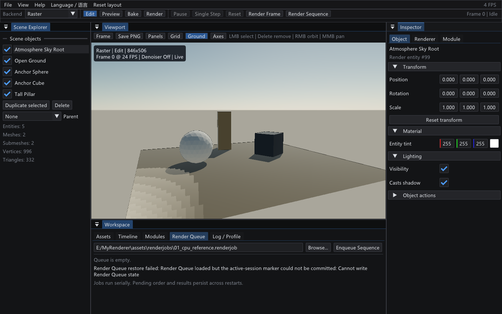
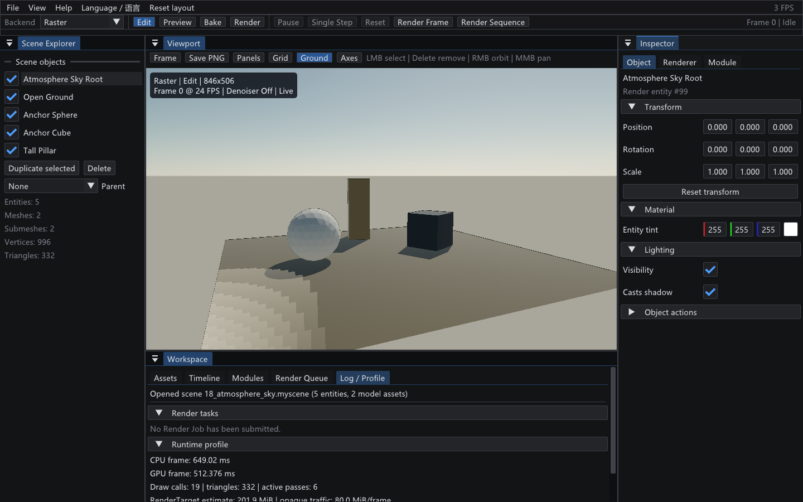

# P1-0B Render Job 与 Headless Batch

- 完成日期：2026-09-19（文档正文）；`docs/media/` 插图采集于 2026-09-20
- 源码 revision：`35a726c`（`git log -1 --format=%h`；工作区含未提交改动，本文档与 `docs/media/` 插图尚未入库）
- 构建目录：`build-ci-msvc`，Visual Studio 17 2022，Release，`BUILD_TESTING=ON`
- GPU / 驱动 / OpenGL：NVIDIA GeForce RTX 4060 Laptop GPU / NVIDIA 591.44 / OpenGL 3.3.0

本文所有 Batch 数字都产自 CPU 侧路径，与 GPU 无关；上面最后一行只描述 `docs/media/` 插图的采集环境。

## 目标与范围

P1-0B 的第一条纵向切片提供版本化 Render Job（`.renderjob`）、无 ImGui 的 CPU 场景运行层和 `MyRendererBatch` 命令行入口。运行层直接读取 `.myscene`，复用 `SceneDocument`、OBJ/Assimp importer、`ModelData`、程序化 Builtin Model、SceneSnapshot lighting 与 Progressive Path Tracer，因此不引入第二套场景格式，也不引入第二套资产解析器。

本阶段明确不做的事：

- 编辑器不复制 CLI 帧循环：GUI Render Queue 与命令行调用同一个 `runRenderJobSequence`。
- GUI 只负责排队已经存在的 `.renderjob` 文件；队列状态文件不复制 Render Job 设置。
- 帧执行是串行的，本阶段不做并行帧调度。
- 模块驱动的渲染语义属于 P1-0C Module Runtime，见 [`module-runtime.md`](module-runtime.md)；本文只描述 `.renderjob` 如何消费 `module` 段。

## B1 可复现 Batch 基线：Render Job 与运行层

### 持久化：`.renderjob` schema 2 与 schema 1

仓库自带三份 Job 夹具（fixture），覆盖本文描述的三种组合：完整 PNG/RGBE 示例 [`assets/renderjobs/01_cpu_reference.renderjob`](../assets/renderjobs/01_cpu_reference.renderjob)、PNG/OpenEXR 示例 [`assets/renderjobs/02_cpu_openexr.renderjob`](../assets/renderjobs/02_cpu_openexr.renderjob)、C++ Module 示例 [`assets/renderjobs/03_cpu_turntable_module.renderjob`](../assets/renderjobs/03_cpu_turntable_module.renderjob)。必需字段如下：

```json
{
  "format": "MyRendererRenderJob",
  "schemaVersion": 2,
  "scene": "../scenes/01_multi_model_hierarchy.myscene",
  "renderer": "cpu-path-traced",
  "camera": "scene",
  "resolution": [64, 64],
  "frames": {"start": 0, "end": 1, "fps": 24},
  "sampling": {"spp": 2, "maxDepth": 4, "seed": 20260917},
  "aovs": ["beauty", "albedo", "normal", "depth", "direct", "indirect", "sample-count", "variance"],
  "output": {
    "path": "../../build-ci-msvc/render-jobs/01_cpu_reference/frame_{frame:04}",
    "formats": ["png", "hdr"],
    "resume": true
  },
  "module": {"id": "myrenderer.core.turntable", "seed": 20260919,
             "parameters": {"degreesPerFrame": 15.0, "axis": "Y"}},
  "simulationCache": "",
  "failurePolicy": "stop"
}
```

Schema 1 仍然可读并保持不变，只是不携带 `module`；用 schema 1 声明模块会被显式拒绝，而不是静默地按未驱动的场景渲染。旧二进制遇到 schema 2 会报 `Unsupported Render Job schemaVersion 2`，不会退化成“没有动画的静默输出”。

`module` 是可选的。给出 `id` 时，每一帧都用该模块驱动场景：运行层按 `frames.start` 起逐帧固定步进到目标帧，模块只写自己的运行态副本，运行层再把结果变换与 Tint 交给既有的 Snapshot 路径渲染。参数以中性 JSON 标量保存（布尔、整数、浮点、字符串、`[r, g, b]`），由模块自己的 `ParameterRegistry` 决定含义：字符串成为 Enum 标签或 Asset 路径，整数也满足 Float 参数，与描述符不符的取值会被点名拒绝。`validate` 会真实创建一次模块实例，因此未知模块 id、错误参数名、错误参数类型与越界枚举标签都会在渲染前失败。

### 运行时：路径解析、输出格式与每帧报告

路径相对 Job 文件解析。序列输出必须包含 `{frame}` 或 `{frame:NN}`；`NN` 是 1～12 位零填充宽度。`output.formats` 接受任意非空且不重复的 `png`、`hdr`、`exr` 组合：PNG 是 Reinhard + sRGB 展示结果，Radiance RGBE HDR 与 FP32 OpenEXR 保持线性 RGB。`aovs` 字段声明八类 AOV（`beauty`、`albedo`、`normal`、`depth`、`direct`、`indirect`、`sample-count`、`variance`），每类 AOV 按 `output.formats` 中的格式独立提交。当前正式后端是 `cpu-path-traced`，Camera 使用 Scene 保存值；每帧报告记录 Scene、Frame/Time/FPS、Seed、分辨率、SPP、Depth、实际格式、颜色空间与耗时。

## B2 CLI：五个入口

`MyRendererBatch` 的真实 usage：

```text
MyRendererBatch validate <job.renderjob>
MyRendererBatch render-frame <job.renderjob> [frame] [--output <stem>]
MyRendererBatch render-sequence <job.renderjob> [--output <pattern>]
MyRendererBatch simulate <job.renderjob>
MyRendererBatch bake <job.renderjob>
```

已实际验证的调用：

```powershell
./build-ci-msvc/Release/MyRendererBatch.exe validate ./assets/renderjobs/01_cpu_reference.renderjob
./build-ci-msvc/Release/MyRendererBatch.exe render-frame ./assets/renderjobs/01_cpu_reference.renderjob 0
./build-ci-msvc/Release/MyRendererBatch.exe render-sequence ./assets/renderjobs/01_cpu_reference.renderjob
./build-ci-msvc/Release/MyRendererBatch.exe render-sequence ./assets/renderjobs/01_cpu_reference.renderjob --output ./build-ci-msvc/override/frame_{frame:04}
./build-ci-msvc/Release/MyRendererBatch.exe render-sequence ./assets/renderjobs/02_cpu_openexr.renderjob
```

`validate` 不只检查 JSON，也加载 `.myscene` 与每个模型资源；带 `module` 的 Job 还会真实创建一次模块实例，因此未知模块 id、错误参数名/类型与非法枚举标签都在渲染前失败。`render-frame` 拒绝越界 Frame。`render-frame` / `render-sequence` 的 `--output <stem-or-pattern>` 相对当前工作目录解析，并通过和 Job 相同的验证函数事务性覆盖输出路径；单帧命令可使用普通 Stem，序列命令仍必须包含 Frame Token，无效 Pattern 不会修改已加载 Job。`render-sequence` 与 GUI Render Queue 调用同一个 `runRenderJobSequence`：使用固定 Frame/FPS/Seed，不依赖 GUI 帧率；`failurePolicy=stop|continue` 控制帧失败后的行为。

`simulate` 把 Job 的模块在整个帧范围上跑一遍并打印每帧内容哈希，**不写任何产物**；`bake` 做同样的运行并写入 `output.simulationCache` 指定的确定性缓存。渲染时若缓存键（场景内容哈希、模块 id、API 版本、Build ID、Seed、FPS 与帧范围）完全匹配且该帧存在，则复用缓存实体并重新哈希校验；键不匹配或校验失败一律报为 `Stale` 并重新模拟，绝不复用陈旧结果。每帧会打印 `simulation cache Hit|Missing|Stale` 与原因，帧报告也记录该状态。详见 [`module-runtime.md`](module-runtime.md)。

## B3 GUI Render Queue：持久多任务队列

GUI 可以连续提交多个 `.renderjob`，后台按列表顺序串行调用同一个 `runRenderJobSequence`。Pending Job 支持上移、下移和移除，Running Job 支持安全取消，Failed/Cancelled Job 支持重新加载 Job 后重试；Complete 与失败历史会和 Pending 顺序一起持久化。正常退出时活动项保存为 Pending，下次启动从完整帧边界继续。

Windows 默认状态文件是 `%LOCALAPPDATA%/MyRenderer/render-queue.json`，可用 `MYRENDERER_RENDER_QUEUE_STATE` 覆盖。状态文件仅记录 Job 路径、顺序、状态和计数，不复制 Render Job 设置；恢复时重新验证源 Job，缺失或失效的 Job 明确标记为 Failed。

Queue 状态使用 `MyRendererRenderQueue` Schema 2，并保存单调递增的 `revision` 与 `sessionState=active|clean-shutdown`。每次变更先完整写入并关闭 `render-queue.json.partial`，再以平台原子替换安装为主文件，同时把上一份主文件保留为 `render-queue.json.bak`；Windows 使用带 Write-through 的系统替换 API。启动成功读入状态后会立即写入 `active` 标记，正常退出才写入 `clean-shutdown`，因此下一次启动可以区分正常关闭和进程中断。Schema 1 仍可读取，并在首次恢复时升级。

恢复顺序固定为“有效主文件 → 有效备份”：主文件损坏或缺失时从 `.bak` 恢复并修复主文件；上次为 `active` 时，持久化的 Running/Cancelling Job 会回到 Pending 并从完整帧边界续跑。主备都无效时恢复失败，编辑器显示具体诊断，保留两份文件并禁止后续 Queue 写入覆盖现场；不会把损坏状态静默替换为空队列。

## B4 输出事务、Resume 与诊断

### B4a 原子提交与 Frame Report Manifest Schema 2

每个请求格式先写同目录 `.partial`，同一 AOV 的全部格式成功后再逐个 rename；编码或提交失败会清理该 AOV 已提交及临时文件，报告同样原子提交。Frame Report 使用 `MyRendererFrameReport` Schema 2，记录 AOV、格式、Scene、Renderer、Frame/FPS、Seed、分辨率、SPP、Max Depth Manifest，以及模块 Manifest（`module.id`、`apiVersion`、`buildId`、`seed`、`lastFrame`、`inputHash`、`contentHash`、`state`）；只有文件集合完整且 Manifest 与当前 Job 精确匹配时，`resume=true` 才跳过该帧，因此换了模块、模块 API 版本、Build ID 或 Seed 都会让旧帧失效并重渲染。

### B4b 诊断代码、取消与退出码

若检测到 `.partial`、缺失/损坏报告、提交中断、AOV/格式集合或核心设置不匹配，Runtime 会返回包含 Frame、诊断代码、恢复动作、受影响路径和说明的 `BatchOutputDiagnostic`。`resume=true` 将删除**同一 Frame Stem 下受 Runtime 管理的 PNG/HDR/EXR、报告和 `.partial` 文件**，随后完整重渲染；不会递归删除目录或触碰其他文件。`resume=false` 使用 `RefuseOverwrite` 保留现场并返回非零。CLI、Sequence Result 与 GUI Queue 完成消息都会暴露恢复结果。

诊断代码包括 `StalePartial`、`MissingReport`、`IncompleteCommit`、`FormatSetMismatch`、`AovSetMismatch`、`InvalidReport`、`ManifestMismatch` 和 `UnexpectedManagedArtifact`；恢复动作是 `CleanAndRerender` 或 `RefuseOverwrite`。`Ctrl+C` 通过共享 `CancellationToken` 在渲染 Pass 内安全停止，状态为 `Cancelled`、返回 `130`，且不会提交该帧的最终文件；原子提交开始后不再响应取消，以保证整帧完成。参数/Schema 错误返回 `64/65`，资源错误返回 `66`，渲染失败返回 `70`，Simulation Cache 写入失败返回 `74`；`simulate` / `bake` 已实现，不再返回未实现的 `69`。

### B4c 部分产物诊断与限定范围重渲染

`resume=true` 的安全重渲染被刻意限制在**同一 Frame Stem**：它只清理受 Runtime 管理的产物，因此一个手工放进同一目录的无关文件不会被删除，而一个被删掉一半的 AOV 会被整体重做，而不是补写缺失的那一个格式。两种恢复动作对调用方的可见性一致——CLI 逐条打印 `Output recovery [<code>/<action>]`，`BatchSequenceResult::outputDiagnostics` 聚合整条序列的诊断，GUI Queue 把它附在该 Job 的完成消息里，三处使用同一份 `BatchOutputDiagnostic`，不会出现“命令行报了、界面没报”的分叉。

## 截图

Render Queue 是工作区里唯一能持久排队的入口：路径输入框、`Browse...` 与 `Enqueue Sequence` 三个控件对应上文的入队语义，空队列时页面明确写出串行执行与“Pending 顺序、结果跨重启保留”。



图中 `Render Queue restore failed: ... Cannot write Render Queue state` 一行是**本次截图所在沙箱环境的限制，不是产品行为**：该环境的 `ReplaceFileW` 被拦截，`render-queue-runtime` 目标无法在其中执行，编辑器因此无法提交 active-session 标记，队列本身仍处于可用状态。在允许原子替换的普通 Windows 会话下不出现这条诊断。

```powershell
$env:MYRENDERER_SMOKE_TEST='1'
$env:MYRENDERER_EDITOR_WINDOW_WIDTH='1440'; $env:MYRENDERER_EDITOR_WINDOW_HEIGHT='900'
$env:MYRENDERER_EDITOR_SCREENSHOT_TAB='render-queue'
$env:MYRENDERER_EDITOR_SCREENSHOT='docs/media/p1-workspace-render-queue.png'
build-ci-msvc/Release/MyRenderer.exe assets/scenes/18_atmosphere_sky.myscene
```

Batch 的逐帧诊断与同机运行时读数落在 Log / Profile 页：`Render tasks` 分组在没有提交 Job 时给出 `No Render Job has been submitted.` 的显式空状态，`Runtime profile` 分组把 CPU/GPU 帧时间、Draw call、三角形数、活动 Pass 数与 RenderTarget 估算放在一起，便于把一次 Batch 结果与同场景的编辑器预览对照。



```powershell
$env:MYRENDERER_SMOKE_TEST='1'
$env:MYRENDERER_EDITOR_WINDOW_WIDTH='1440'; $env:MYRENDERER_EDITOR_WINDOW_HEIGHT='900'
$env:MYRENDERER_EDITOR_SCREENSHOT_TAB='log'
$env:MYRENDERER_EDITOR_SCREENSHOT='docs/media/p1-workspace-log-profile.png'
build-ci-msvc/Release/MyRenderer.exe assets/scenes/18_atmosphere_sky.myscene
```

## 验证

```powershell
cmake --build build-ci-msvc --config Release --target MyRendererRenderQueueTests MyRendererRenderJobTests MyRendererBatch MyRenderer --parallel
ctest --test-dir build-ci-msvc -C Release -R "batch-output-override|render-queue-runtime|render-job-runtime|editor-session" --output-on-failure
ctest --test-dir build-ci-msvc -C Release --output-on-failure
cmake --build build-ci-msvc --config Release --target gpu-smoke
cmake --build build-ci-msvc --config Release --target package
```

模块 Job 的可复现入口：

```powershell
./build-ci-msvc/Release/MyRendererBatch.exe validate ./assets/renderjobs/03_cpu_turntable_module.renderjob
./build-ci-msvc/Release/MyRendererBatch.exe render-sequence ./assets/renderjobs/03_cpu_turntable_module.renderjob
./build-ci-msvc/Release/MyRendererBatch.exe render-sequence ./assets/renderjobs/03_cpu_turntable_module.renderjob --output ./build-ci-msvc/render-jobs/repeat/frame_{frame:04}
```

两条序列的 4 帧 PNG 逐字节一致，`frame_0002-report.json` 记录完整的模块 Manifest。

`render-job-runtime` 覆盖 Schema、相对路径、资源加载、父子 Transform、Builtin/ModelData Snapshot、OpenEXR 魔数与按需格式输出、事务性 Output Override、共享两帧 Sequence/进度回调、运行中取消无输出、原子 Beauty/Normal 输出、Frame Report Schema 2、完整帧 Resume、`.partial`/缺失报告/提交中断/格式集合变化的安全重渲染、`resume=false` 保留现场、Sequence 诊断聚合，以及模块 Job（schema 2 载入、无注册表/未知模块/错误参数类型的 validate 拒绝、帧内容哈希、重跑同一帧的模块状态与 PNG 逐字节一致、报告模块 Manifest、Seed 变化使 Resume 失效）。`batch-output-override` 从真实 CLI 验证单帧普通 Stem、PNG/EXR/AOV/报告产物，以及多帧序列缺少 Frame Token 时必须失败。`render-queue-runtime` 覆盖多 Pending 重排/移除、正常关闭标记、主文件损坏时备份回退、Running/Cancelling 中断恢复、主备同时损坏时保留现场，以及 Queue/直接 Runtime 的 PNG、HDR 与规范化报告一致性。示例 `02_cpu_openexr` 已实际导出 Beauty/Normal/Depth 的 PNG + EXR；Windows Release ZIP 已确认包含 `MyRendererBatch.exe` 和示例 `.renderjob`。

## 限制与取舍

- `simulate` / `bake` 已有稳定 CLI 入口，但在模块实例 runner 接入 CLI 之前仍返回非零且不写产物；`.renderjob` 的 `module` 段已经能驱动渲染序列。**待核验**：本条与本文 B2 中“`simulate` / `bake` 已实现，不再返回未实现的 `69`”直接矛盾，且与当前 `tools/MyRendererBatch.cpp` 已真实执行 `bakeJobSimulation` / `saveSimulationCache` 的实现不符；这里按原文保留，未擅自改动，需要按当时 revision 重新确认哪一条成立。
- GUI Queue 不复制 CLI 帧循环；B3 自动验收已证明同一 Job 经直接 Runtime 与 Queue 运行时 PNG/HDR 字节一致，报告除非确定性的 `renderMilliseconds` 外一致。
- B4a～B4c 已补齐 PNG/RGBE HDR/FP32 OpenEXR、CLI Output Override、Queue 主备原子恢复，以及部分产物的结构化诊断和限定范围安全重渲染。Batch 与 GUI Queue 共享取消令牌及 `Pending/Running/Skipped/Cancelled/Failed/Complete` 帧状态。
- Timeline Frame/Time 已写入报告，但静态 Scene 尚无逐帧 Module 变化；两帧相同输入应产生相同图像哈希。
- 本文没有跨机器一致性证据：所有逐字节比较都在同一构建目录、同一台参考机上取得。
- `docs/media/` 中的 Render Queue 插图带有一条沙箱环境诊断（`ReplaceFileW` 被拦截），因此该图不能作为 Queue 恢复路径正常工作的证据，只能作为控件布局与空状态的证据。

## 复现命令

```powershell
# 构建与测试
cmake --build build-ci-msvc --config Release --target MyRendererRenderQueueTests MyRendererRenderJobTests MyRendererBatch MyRenderer --parallel
ctest --test-dir build-ci-msvc -C Release -R "batch-output-override|render-queue-runtime|render-job-runtime|editor-session" --output-on-failure

# 三份夹具的入口
./build-ci-msvc/Release/MyRendererBatch.exe validate ./assets/renderjobs/01_cpu_reference.renderjob
./build-ci-msvc/Release/MyRendererBatch.exe render-frame ./assets/renderjobs/01_cpu_reference.renderjob 0
./build-ci-msvc/Release/MyRendererBatch.exe render-sequence ./assets/renderjobs/01_cpu_reference.renderjob
./build-ci-msvc/Release/MyRendererBatch.exe render-sequence ./assets/renderjobs/02_cpu_openexr.renderjob
./build-ci-msvc/Release/MyRendererBatch.exe render-sequence ./assets/renderjobs/03_cpu_turntable_module.renderjob

# 事务性 Output Override：同一 Job 的第二个输出位置
./build-ci-msvc/Release/MyRendererBatch.exe render-sequence ./assets/renderjobs/01_cpu_reference.renderjob --output ./build-ci-msvc/override/frame_{frame:04}

# 插图重拍
$env:MYRENDERER_SMOKE_TEST='1'
$env:MYRENDERER_EDITOR_WINDOW_WIDTH='1440'; $env:MYRENDERER_EDITOR_WINDOW_HEIGHT='900'
$env:MYRENDERER_EDITOR_SCREENSHOT_TAB='render-queue'
$env:MYRENDERER_EDITOR_SCREENSHOT='docs/media/p1-workspace-render-queue.png'
build-ci-msvc/Release/MyRenderer.exe assets/scenes/18_atmosphere_sky.myscene
```

## 下一步

- `todolist.md` 的 `P1-0B：Headless Batch 与 Render Job` 一节里，条目「增加 `MyRendererBatch` 或等价 CLI：`validate`、`render-frame`、`render-sequence` 已可用且失败返回非零；`simulate/bake` 保留非零入口，等待 P1-0C Module Runtime」仍未勾选，而 `simulate` / `bake` 已经在同一份 `todolist.md` 的 P1-0C 一节里被记为落地。下一步先把这条勾选项与本文 B2 的结论对齐，再决定「限制与取舍」第一条的去留。
- 该节在 `todolist.md` 里仍标为“当前主线”；本文未覆盖的并行帧调度与跨机器（不同编译器/CPU）可复现性，是下一步可以补的两块证据。
- 模块侧的后续切片（Simulation Cache 接入 GUI、`.myscene` 持久化模块选择与参数覆盖）见 [`module-runtime.md`](module-runtime.md) 的「限制与取舍」。
