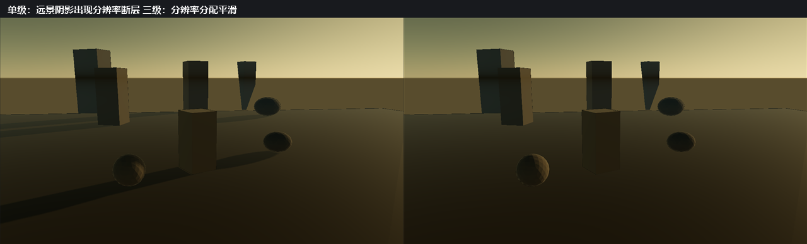

# P1-A 切片 3：级联阴影贴图（Cascaded Shadow Maps）

> 状态：**GPU 侧已接线，基线已按流程更新**。数学层、GPU 路径与视觉基线都已落地并验证。
> 剩余待办（`.myscene` 持久化、Inspector 分组、级联调试视图、`gpu-smoke` 分支）见文末清单。
> 在这些待办完成前不要把 `todolist.md` 的切片 3 勾选为完成。

- 记录日期：2026-09-20
- 构建目录：`build-ci-msvc`，Visual Studio 17 2022，Release，`BUILD_TESTING=ON`
- GPU / 驱动 / OpenGL：NVIDIA GeForce RTX 4060 Laptop GPU / NVIDIA 591.44 / OpenGL 3.3.0

## 目标与范围

海岸场景里一个正交阴影盒不够用：近处几何需要厘米级精度，远处需要几百米覆盖，而单张贴图必须在两者之间取舍。级联（cascade）把相机视锥沿视深切分，为每一片单独拟合一个光源空间盒。

本切片做：3～4 级拟合、Texel Snapping、按视深逐片选择、每片独立的光源空间盒，以及可检查切分位置的调试视图。
本切片不做：PCSS（留给后续质量档）、把彩色透射阴影与焦散也做成逐级级联。

## 已落地并验证的部分

### `src/render/ShadowCascade.h` / `.cpp`

纯矩阵与向量运算，因此**不需要 OpenGL 上下文就能单元测试**——切分方案、子视锥角点、盒包含性与 texel 网格稳定性正是 CSM 里会静默出错的部分。

- `splitDistances(near, far, count, lambda)`：实用切分方案，在**对数**（等屏幕空间误差）与**均匀**（等世界空间）之间按 `lambda` 混合。`count` 夹取到 `[1, maximumCascadeCount]`；退化区间（`near <= 0`、`far <= near`）返回全为 `far` 的递增序列，而不是递减或 NaN 序列。
- `subFrustumCorners(camera, splitDistance)`：按**相机基向量 + 投影参数**构造子视锥，而不是反投影 NDC 角点。反投影必须知道投影写的是哪种深度范围（GLM 的 `perspective` 即便面向 OpenGL 也写 0..1），猜错会返回相机另一侧的点。
- `buildLightView(pivot, directionToLight, range)`：所有级联**共享**的光源视图。共享是让级联与渲染器其余部分兼容的关键决定——透射阴影与焦散消费同一个矩阵，逐级各建视图会让它们没有自洽的矩阵可用。视图锚定在世界空间 pivot 上，因此只在太阳或 pivot 移动时改变、**不随相机移动**，这也是 texel 吸附能生效的前提。
- `fitCascade(corners, lightView, lightViewRange, splitDistance, resolution)`：在共享光源空间里测量切片范围、把盒子平方化、按整 texel 取整并在光源空间对齐网格。

### `Camera` 暴露真实深度范围与基向量

`Camera::projectionMatrix()` 用 `nearPlane_ = 0.1f`、`farPlane_ = 100.0f`，新增 `Camera::nearPlane()` / `farPlane()` / `forwardDirection()` / `rightDirection()` / `upDirection()` 让消费者读取**投影自己**的数值与**同一套**基向量。

这一条来自一个真实的调试结论：拟合代码原先假设近平面是 `0.05`，而投影实际是 `0.1`。围绕一个没人渲染的视锥拟合盒，症状是阴影在特定距离整片消失，很难追。**任何需要与相机光栅化结果一致的代码都必须读同一个来源，不能各留一份常量。**

### GPU 接线

分两道关口完成，顺序本身是有意的。

**关口一，类型一致性。** `ShadowMap` 深度附件改为 `GL_TEXTURE_2D_ARRAY`（4 层，匹配 `shadow::maximumCascadeCount`），**同一步**把 `basic.frag` 与 `deferred_lighting.frag` 的 `uShadowMap` 改成 `sampler2DArray`、以 `texture(uShadowMap, vec3(uv, layer))` 采样，此时只写第 0 层。跑完整 `renderer-regression-suite` → **零漂移**，关口通过。

这一步为什么必须独立验证：上一轮把「改类型」与「改逻辑」合成一步，结果是所有带阴影的基线同时漂移，而 GL 一声不响。把 `GL_TEXTURE_2D_ARRAY` 绑到 `sampler2D` **不是错误、是未定义采样**，没有编译期或运行期信号。拆成两步后，同类故障会在第一步被拦下。**与近平面那次同源：改变一个资源的类型时，必须同时改掉每一个声明它的接口。**

**关口二，逐级渲染与逐片选择。**

- 光源 pass 对每一级 `glFramebufferTextureLayer` 渲染到自己的层，逐级清深度并使用该级的矩阵。
- 顶点着色器输出每级 `vShadowPosition[MAX_SHADOW_CASCADES]` 与 `vViewDepth`；片元着色器按 `uCascadeSplits` 选层。**视深沿相机前向轴测量**（forward 路径来自 `uView` 的第三行，deferred 路径来自 `uCameraForward`），不能用视线长度——两者在画面边缘相差 `1 / cos(angle)`，足以选错级联。
- 未使用的层重复最后一级的矩阵而不是留单位矩阵：读错层时会投影进一个真实的盒，比退化盒容易发现。
- 彩色透射阴影与投影焦散**继续使用它们自己的旧框**（`ortho(±4, 0.1..16)` 乘 `lookAt(sceneCenter - lightDirection * 6)`）。这条是实测出来的：改用某一级的矩阵会让焦散位置明显移动（当时 MAE `0.0234`），因为它们当初就是围绕那个框调出来的。

### 光源视图范围按场景内容而非相机远平面

光源视图的 `range` 决定级联盒的深度带。原先按相机远平面（`100`）计算，对一个十来单位的场景等于白扔一个数量级的 texel 密度。现在按场景内容半径（由各 `RenderItem` 的包围球并集得出）乘以 `1.2` 计算，并用相机远平面封顶。

实测（Glass-3 固定水晶场景）：

| | 旧单框 | 级联第 0 级 |
| --- | --- | --- |
| 阴影 texel 尺寸 | 约 `0.0221` 世界单位 | 约 `0.00628` 世界单位（细 `3.5` 倍） |
| 覆盖半径 | ±4（宽 8） | 约 ±10.3（宽 20.6，宽 `2.6` 倍） |

### `shadow-cascade-fitting`（CTest 第 5 项）

覆盖：切分递增且末端到达远平面、级联更多使近端切分更短、`lambda = 0/1` 可复现均匀与对数端点、单级联跨越全范围、超量级联数被夹取、退化区间仍有限且不递减；子视锥角点在**视空间**落在请求深度上（世界空间的 `dot(dir, forward)` 度量不是视深，用它会误判）、保持相机宽高比；拟合盒包含自己切片的所有角点与中心；任意光源角度下都能包含自己的切片、texel 尺寸有界；零光源方向与零分辨率不产生 NaN。

**记录一条被替换掉的断言**：包围球拟合时代曾断言「texel 尺寸与光源角度无关」。共享光源视图之后，切片在光源空间里的轴对齐包围盒会随太阳角度变化，这条性质不再成立。测试改为断言变化有界（小于 `8` 倍）且**任何角度下盒仍包含切片**——把一个真实的性质变化记录下来，而不是悄悄删断言。

## 视觉基线

级联改变了阴影质量，因此 20 张包含阴影的基线被独立重新采集：Glass-3 的 6 张与 Glass-4 的 14 张。触发更新的漂移是 `glass3_lightspace_msaa1`（MAE `0.00222` / changed `10.1%`）与 `glass4_volume_glass_off`（MAE `0.00603` / changed `8.16%`），两项都是 MAE 远低于阈值、变化面积略超阈值，与「阴影覆盖面积扩大后边界扫过更多像素」一致。逐张审查确认变化只在阴影及其内部焦散读数上，**没有级联接缝、没有几何或折射变化**；阈值没有被改动。原因、旧/新差异与更新范围记录在 [`regression-baseline-audit.md`](regression-baseline-audit.md) 与 [`images/README.md`](images/README.md)。

## 海岸场景验证

切片 3 的真正目标是让**远景阴影**可用，而在此之前所有证据都来自十来单位进深的小场景——那种尺度下一个正交盒本来就够用。因此新增了开放海岸夹具 `assets/scenes/19_coastal_cascades.myscene`：80×80 的地面、近/中/远三排礁石与海蚀柱，跨约 110 单位进深，低太阳（仰角 12 度）制造长阴影，默认 3 级级联。

同一机位、同一 1280×720、同一太阳参数下，`MYRENDERER_SHADOW_CASCADES` 取 1 与 3 的对照：



左栏（单级）在远处礁石的阴影上出现可见的**分辨率断层**：阴影边缘沿一条线突然变软、地面上的阴影失去与近处一致的清晰度，因为整个 110 单位进深被压进同一个正交盒。右栏（三级）在同一位置没有断层，近处与远处的阴影边缘保持一致的锐度——这正是级联要解决的问题。

```powershell
$env:MYRENDERER_SMOKE_TEST='1'; $env:MYRENDERER_RENDER_WIDTH='1280'; $env:MYRENDERER_RENDER_HEIGHT='720'

$env:MYRENDERER_SHADOW_CASCADES='1'
$env:MYRENDERER_SCREENSHOT='build-ci-msvc/coast-csm1.png'
build-ci-msvc/Release/MyRenderer.exe assets/scenes/19_coastal_cascades.myscene

$env:MYRENDERER_SHADOW_CASCADES='3'
$env:MYRENDERER_SCREENSHOT='build-ci-msvc/coast-csm3.png'
build-ci-msvc/Release/MyRenderer.exe assets/scenes/19_coastal_cascades.myscene
```

`gpu-smoke` 在这个夹具上跑级联 1 / 3 / 4 三条分支（第三条同时覆盖 Deferred 与 `lambda = 0.5`），因此三条 uniform 路径都在真实上下文里编译链接过。

## 剩余待办

- [ ] 级联调试视图：把所选层级着色到画面，供人工检查切分位置。当前只能靠上面对照图与不同级联数的 smoke 分支间接覆盖；这是本切片唯一还没有的**可检查性**手段，也是 `todolist.md` 切片 3 里明确要求的一项。
- [ ] 帧分析：级联把光源 pass 从 1 次变成 N 次，逐级各画一遍所有投影物。本轮没有测量它对 GPU 时间的影响，`shadowCascadeCount` 的默认值目前只由画质决定，没有性能证据支撑。

## 复现命令

```powershell
cmake --build build-ci-msvc --config Release --target MyRendererShadowCascadeTests
ctest --test-dir build-ci-msvc -C Release -R shadow-cascade-fitting --output-on-failure
cmake --build build-ci-msvc --config Release --target renderer-regression-suite
```
