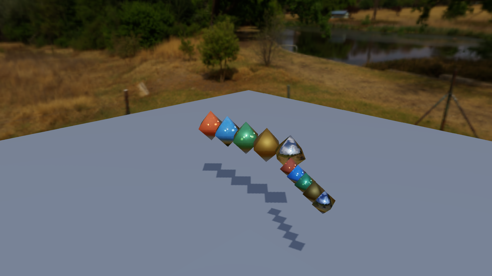
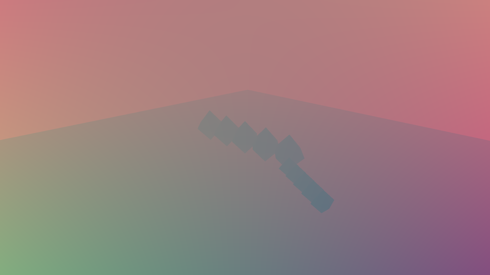
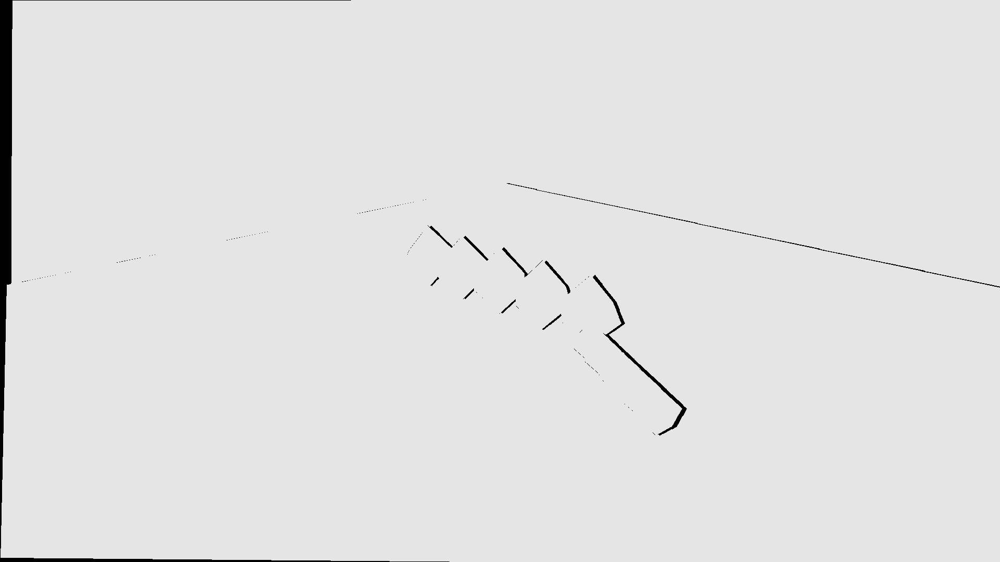
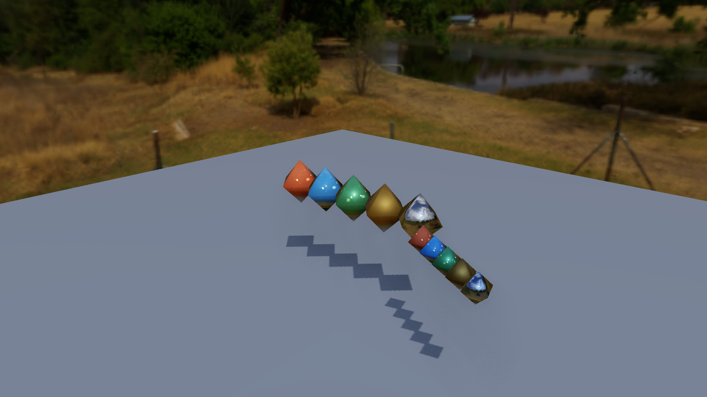
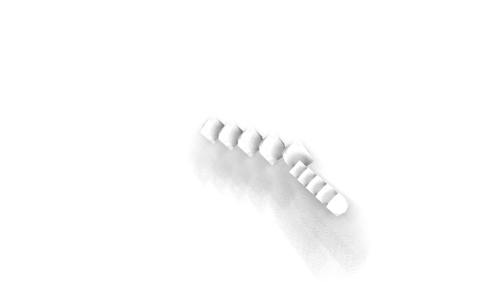

# GP-P1D：TAA 与 SSAO

本阶段完成两项屏幕空间效果，并保持默认关闭，避免改变既有 Forward/Deferred 基线。SSAO 仅用于 Hybrid Deferred；TAA 可用于 Forward 与 Deferred，位置在 HDR 场景完成之后、Bloom/Tone Mapping 之前。

## TAA

每帧使用 8 样本 Halton(2,3) 序列偏移投影矩阵。Temporal Resolve 从当前深度和逆 View-Projection 重建世界坐标，再投影到上一帧得到 Motion Vector 与 History UV。历史颜色会经过当前帧 3×3 Neighborhood Min/Max Clamp；越界或历史深度不兼容时权重归零，正常像素默认使用 0.90 历史权重。

Ping-pong 历史资源为两组 RGBA16F Color、R32F Depth 与 RG16F Motion。分辨率变化、TAA 开关变化或历史首次建立会自动重置。Inspector 提供 Final、Motion Vectors 与 History Weight 三种视图。







## SSAO

SSAO 从 G-Buffer Depth 重建 View-space Position，并将 Encoded World Normal 变换到观察空间。16 个确定性半球样本在每像素随机旋转后进行深度测试，再用 5×5 深度感知滤波平滑；结果只乘到 Ambient/IBL，不削弱方向光和局部直接光。Radius、Bias 与 Strength 可实时调整，G-Buffer Debug 的 SSAO 视图可单独检查遮蔽。





## 1080p 实测

环境：NVIDIA GeForce RTX 4060 Laptop、OpenGL 3.3、1920×1080、Deferred、1× MSAA、Bloom Off，预热 30 帧并采样 90 帧。

| 配置 | GPU Frame P50 | GPU P95 | 相关 Pass P50 | Draw Call | 估算渲染资源 |
|---|---:|---:|---:|---:|---:|
| Baseline | 0.536 ms | 0.541 ms | Tone map 0.038 ms | 24 | 306.9 MiB |
| SSAO | 1.258 ms | 2.154 ms | SSAO 0.727 ms | 26 | 314.8 MiB |
| TAA static | 0.694 ms | 1.011 ms | TAA + tone 0.228 ms | 25 | 306.9 MiB |
| TAA moving | 0.695 ms | 0.723 ms | TAA + tone 0.227 ms | 25 | 306.9 MiB |
| SSAO + TAA moving | 1.457 ms | 2.357 ms | SSAO 0.728 ms；TAA + tone 0.230 ms | 27 | 314.8 MiB |

PostProcessor 当前会在首次 resize 时预分配 TAA ping-pong 资源，因此表中 Baseline 已包含约 63.3 MiB TAA 历史资源；SSAO 启用后额外分配两张 R16F 全分辨率纹理，约 7.9 MiB。该策略避免运行时开关带来的分配抖动，但不是最低显存方案。

## 自动验收

```powershell
cmake --build build-release --target screen-space-visual-regression
cmake --build build-release --target screen-space-benchmark
```

视觉矩阵固定比较 Baseline、SSAO Final/Debug、TAA Static/Moving、Motion Vector 与 History Weight 共 7 张图。运动场景每帧以固定角速度旋转相机，因此输出可重复，也能暴露边界反投影和 Ghosting。

## 已知边界

- Motion Vector 由相机矩阵与当前深度生成，能覆盖相机运动，但尚未保存每个 RenderItem 的上一帧 Model Matrix，因此独立运动物体会被当成静态物体。
- SSAO 是屏幕空间近似：屏幕外遮挡、极薄几何和大半径会产生信息缺失；当前 16 样本 + 全分辨率 5×5 滤波更偏画质验证，后续可改为半分辨率、蓝噪声与时序积累。
- History Clamp 使用 RGB AABB，不是 YCoCg/Variance Clip；高对比细线更稳健的方案仍可继续演进。
- TAA 与 MSAA 可以同时开启，但本阶段性能/画质对照固定在 1× MSAA，明确展示 TAA 自身成本。
