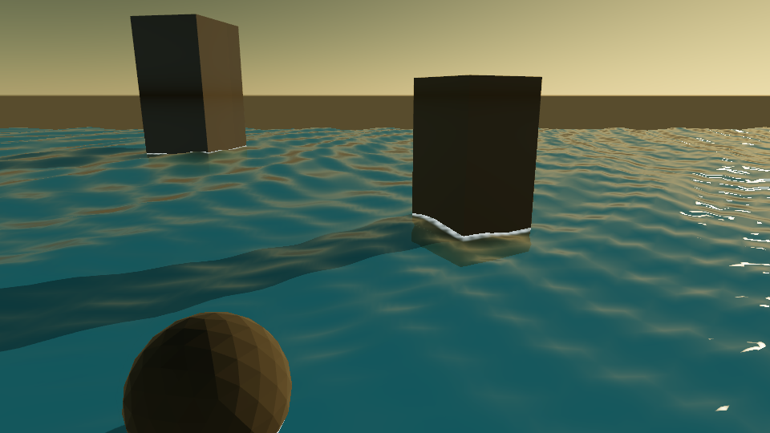
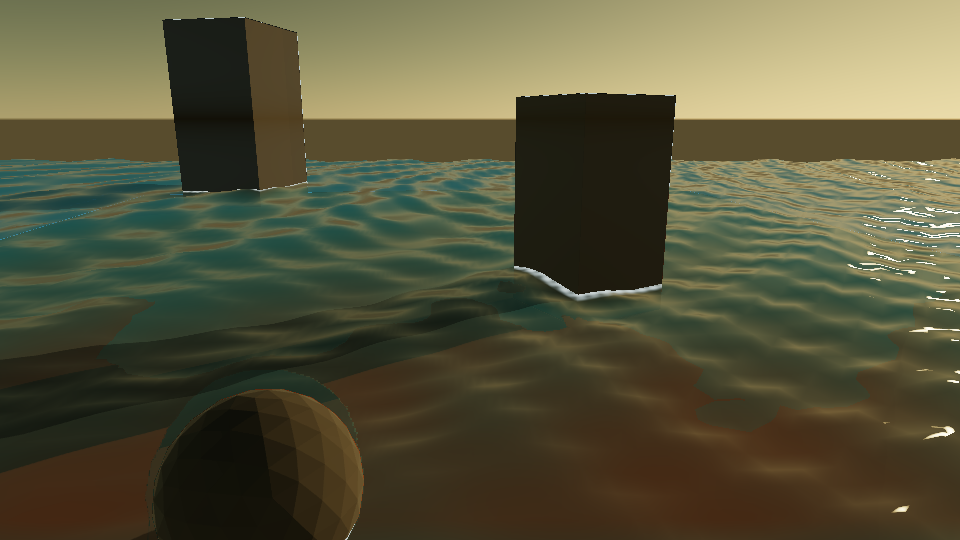
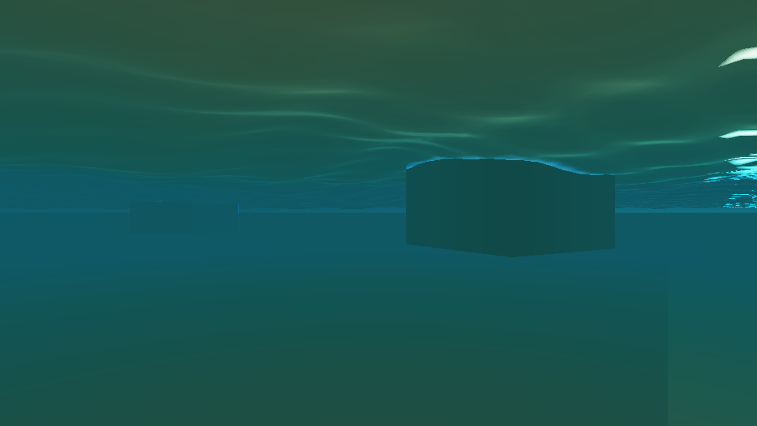

# P1-A 切片 4：Gerstner 海面、透射与水下雾

> 状态：切片 4 已完成并通过固定场景与 GPU 预算验收。波浪仍属于 Wave Synthesis（波形合成）。

- 记录日期：2026-09-24；源码基点 `fb4a6f2` 加本轮工作区改动
- 构建目录：`build-ci-msvc`，Visual Studio 17 2022，Release，`BUILD_TESTING=ON`
- GPU / 驱动 / OpenGL：NVIDIA GeForce RTX 4060 Laptop GPU / NVIDIA 591.44 / OpenGL 3.3.0

## 目标与范围

在既有透明折射通道中渲染海面，读取不透明 HDR 场景颜色与深度，以水面到海床的可见距离进行 Beer-Lambert 吸收。两条光栅路径共享这一水面通道；固定夹具覆盖海床、岸线接触、水下视角、海况和质量档。Gerstner 波不模拟 Navier-Stokes 流体、近岸浅水或频谱海浪。

## 实现

### 场景与编辑器

`RendererSettings::water` 默认关闭，使既有场景和固定图不变。`.myscene` 保存开关、海面高度/范围、振幅、速度、陡度、泡沫强度、风向、海况预设及 Low/High 质量档；旧文件使用关闭、Custom、High 的默认值。Inspector 的 `Water surface` 分组通过 `SetWaterSettings` 命令提交修改，入口逐字段验证有限值与控件范围，修改后清除 TAA 历史。手动修改波浪参数会切回 Custom。Calm / Windy / Storm 是确定性参数组合，`water-wave-synthesis` 检查波幅的递增顺序。时间来自现有动画时钟；固定采集可用 `MYRENDERER_ANIMATION_TIME`，自动验收用 `MYRENDERER_WATER_PRESET` 与 `MYRENDERER_WATER_QUALITY` 覆盖场景值。

### 相机相关网格与波形

High 使用 `192×192` 逻辑网格（`73,728` 三角形，顶点与索引约 `1.18 MB`），Low 使用 `96×96`（`18,432` 三角形，约 `0.30 MB`）。顶点着色器以相机水平位置为中心，通过 `sign(u)·u²·extent` 映射到世界坐标。High 且 `extent=110` 时，中心附近单格约 `0.012` 世界单位，边缘单格约 `2.28` 世界单位；连续映射避免分块 LOD 接缝，拖动相机不重建网格。两档网格常驻 GPU，因此质量档降低顶点工作量但不释放另一档缓冲。

High 的四组 Gerstner 波由风向派生方向，波长分别为 `15 / 7.5 / 3.4 / 1.6` 世界单位；Low 只计算前两组。`WaterWaves::evaluate()` 在 CPU 上按相同质量档给出位移、解析法线、切线和速度；GPU 使用同一组参数计算当前与上一时刻位置。`water-wave-synthesis` 验证解析速度与时间差分在 `0.003` 世界单位每秒内一致，并检查法线/切线正交、零振幅平面和两档波数。

### 透射、泡沫与运动

不透明场景先完成 HDR 光照和深度解析；海面随后在 Forward Refractive pass 读取独立的不透明颜色、深度贴图并写入另一颜色目标，避免反馈采样。水面前后深度差沿视线估算水中路程，`exp(-absorption·distance)` 衰减实际海床颜色，再补入水体散射色。High 从 IOR=`1.333` 的折射方向重投影场景坐标；Low 保留同一吸收模型，省去额外折射深度采样。精确介质 Fresnel 处理水下视角的全内反射，环境预滤波提供反射，太阳高光和水体颜色接收级联阴影。

坡度与波峰阈值叠加空间扰动形成白冠；海面与海床交点附近的短水深生成岸线泡沫。相机低于海面时，后处理使用可见距离对整个画面再积分水下消光，并关闭空气的 Aerial Perspective。独立的折射深度贴图供 TAA 和后处理读取，水面折射着色器仍采样原始不透明深度。Deferred 模式另写 G-buffer 的运动附件，保留不透明材质与深度；前一时刻采样同一世界坐标的水面，避免相机相关网格移动污染运动矢量，时间跳变时拒绝复用历史。

## 截图

`20_ocean_synthesis.myscene` 是开放海域夹具，三处礁石提供近中远遮挡。下图以 `960×540`、Forward、固定 `1.25 s` 采集。`21_ocean_depth.myscene` 增加赭色海床，使真实颜色透射、水深吸收和礁石接水泡沫可见；`22_ocean_underwater.myscene` 将相机置于水下。







复现：运行 `water-synthesis-acceptance`，将构建目录中的 `forward_t1.png`、`depth_on.png` 和 `underwater_on.png` 分别复制到上图。验收还保存 On/Off、Forward/Deferred、时间、运动矢量、三种海况和质量档的图像。

## 验证

`water-synthesis-acceptance` 在该机位测得水面 On/Off 的变化面积为 Forward `60.65%`、Deferred `60.65%`；时间 `0→1.25 s` 的变化面积为 `37.45%` / `37.46%`。后一时刻 Forward/Deferred 的 MAE 为 `0.000410`、变化面积为 `0.188%`，满足 MAE ≤ `0.004`、变化面积 ≤ `2%`。海床加入后，透水画面相对开放海域变化 `51.96%`；水下开关对照变化 `100%`；海床夹具关闭泡沫后变化 `0.218%`，风暴白冠关闭后变化 `3.62%`。Calm→Windy 和 Windy→Storm 分别变化 `35.98%`、`43.81%`；Low/High 风暴海况 MAE `0.0298`、变化 `35.10%`，满足单独的构图连续性阈值。TAA 运动矢量调试图在静止与 `0.033333 s/帧` 推进之间变化 `10.65%`。这些是固定 GPU/驱动与场景的像素验收，不代表跨 GPU 逐像素相同。

MSVC Release 全量 CTest `20/20` 通过，包含 `water-wave-synthesis` 与覆盖预设/质量字段往返的 `scene-document-repeat-load`。`gpu-smoke`、`renderer-regression-suite`、真实编辑器命令（含非法预设拒绝）和 MinGW 构建均通过；旧固定图没有新增未解释漂移。`build-ci-msvc/water-editor-1100x680.png` 已人工检查最小窗口下主视口、面板标签和 Inspector 滚动区域。两档网格合计约 `1.48 MB`；折射深度贴图以原有 `4 byte/pixel` 深度附件的容量替换 renderbuffer，没有新添第二份深度容量。

### GPU 预算

`water-synthesis-benchmark` 在同一 `21_ocean_depth.myscene`、`1280×720`、MSAA 4x、Storm 固定 `1.25 s` 下各取 16 帧预热与 60 帧测量。预算门槛为折射阶段 GPU P95 ≤ `2 ms`、整帧 GPU P95 ≤ `8 ms`，且折射阶段至少有 30 个有效计时样本。

| 海面 | 网格三角形 | 波数 | 折射阶段 P50 / P95 | 整帧 GPU P50 / P95 |
| --- | ---: | ---: | ---: | ---: |
| Off | 0 | 0 | `0.179 / 0.181 ms` | `1.945 / 2.402 ms` |
| Low | 18,432 | 2 | `0.431 / 0.475 ms` | `2.998 / 3.966 ms` |
| High | 73,728 | 4 | `0.468 / 0.585 ms` | `1.885 / 2.501 ms` |

三轮运行的整帧时间受 GPU 时钟与其他 pass 波动影响，不能把该表当成 Low 比 High 慢的稳定结论；折射阶段的测量显示 Low 更便宜。JSON 原始报告保存在 `build-ci-msvc/water-synthesis-benchmark/`。

## 限制与取舍

折射是屏幕空间近似：屏幕外海床、被前景挡住的第二层表面和玻璃后面的水不能正确重建；岸线泡沫来自深度阈值而非破碎波求解。水下判定用相机高度与平均海面，贴近波峰处可出现切换。海面接收阴影，但不向其他物体投射波浪形阴影。CPU Path Tracer 暂不渲染水面，Raster/CPU 水面一致性留待后续阶段。Low/High 共存网格目前只降低顶点/着色工作量，不回收另一档常驻显存。

## 复现命令

```powershell
cmake --build build-ci-msvc --config Release --target MyRendererWaterWavesTests MyRendererSceneDocumentTests
ctest --test-dir build-ci-msvc -C Release -R 'water-wave-synthesis|scene-document-repeat-load' --output-on-failure
cmake --build build-ci-msvc --config Release --target water-synthesis-acceptance
cmake --build build-ci-msvc --config Release --target water-synthesis-benchmark
cmake --build build-ci-msvc --config Release --target renderer-regression-suite
powershell -NoProfile -ExecutionPolicy Bypass -File tools/TestEditorScene.ps1 -BuildDirectory build-ci-msvc
```

## 下一步

按 [`todolist.md`](../todolist.md) 进入 P1-A 切片 5：将太阳时间、雾、风、波浪和相机轨迹暴露为 C++ Module 参数，并通过 Render Job 固定输出昼夜与海况序列。
