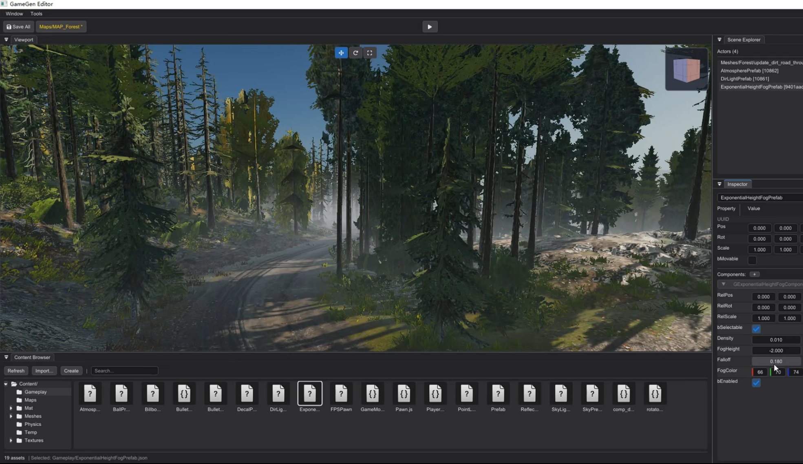

# MyRenderer 路线图

> 重排日期：2026-09-16
>
> 项目定位：**C++ Module-driven Scene Rendering & Simulation Lab**——同一套 Scene / Asset / Material / Camera / Light 数据，支持实时 Raster PBR、实时 Stylized/NPR、CPU/GPU Path Tracing，以及由 Timeline、Render Job 和 C++ Scene/Simulation Module 驱动的专项场景模拟。

本文档是当前唯一活跃路线图。旧版按开发日期不断追加的清单已经压缩为“已完成里程碑”；只有“执行队列”中的未勾选项才代表当前承诺。

状态与优先级：

- `[x]`：已实现且有测试、固定图、文档或性能证据。
- `[ ]`：尚未完成。
- **P0**：当前连续执行，不再插入新的大型方向。
- **P1**：P0 结束后的下一条主线。
- **P2**：有价值但不阻塞主线的增强或研究验证。
- **舍弃**：不再保留为项目待办；只有出现新的明确需求才重新立项。

## 1. 当前结论

### 1.1 已具备的能力

| 能力 | 当前状态 | 结论 |
| --- | --- | --- |
| OpenGL Raster PBR | 实时 GUI 可用 | 已是稳定对照后端，继续维护，不再大规模扩张 OpenGL 架构 |
| Stylized / Toon / Outline | SR-P2A～C 已收口 | Toon、描边、Dither、Height Fog、3D LUT、三组 Preset、六种调试视图和 Low/High 性能分档均已完成 |
| CPU Reference Path Tracer | GUI 渐进预览与自动验收可用 | 材质、灯光、HDRI、体积、MIS、AOV、SAH、BLAS/TLAS、Adaptive Sampling 已闭环；Viewport 已接入可取消的渐进预览 |
| Raster / Path Traced / Difference | 三个固定 `.myscene` 可自动导出 | 作为跨算法诊断，不要求差异为零；旧固定图回归合同保持不变 |
| Editor Workspace | Docking、Hierarchy、Viewport、Inspector、Content Browser 已有基础 | 后续做成大视口为中心的渲染/模拟工作台，不扩展成游戏编辑器 |
| C++ Module / Batch Runtime | Batch B1～B3 已完成，Module 未开始 | 当前按 B4 输出/恢复 → C1/C2 静态 Module 与固定时间步推进；DLL 动态加载后移 |
| GPU Path Tracing | 未开始 | 当前 OpenGL 3.3 不承载 Compute/硬件 RT；在独立 Vulkan 后端实现 |
| Denoising | 未开始 | 先做 AOV 引导的空间降噪，再做时序降噪；它降低方差，不替代正确采样 |
| ReSTIR | 未开始 | 只在基础 GPU PT 稳定后验证 ReSTIR DI；不提前承诺 ReSTIR GI/PT |
| MMIS | 不进入主线 | 当前标准 MIS 已有效降噪；“MMIS”需先绑定具体论文/算法和目标问题，不能视为通用去噪器 |

### 1.2 接下来只保留五条主线

1. 收口 Stylized/NPR，完成一个可发布的短周期视觉成果。
2. 把 CPU Path Tracer 接入 GUI 渐进预览，并建立低 SPP 降噪/采样实验。
3. 建立 C++ Module 驱动的 Editor Workspace、Headless Render Job、Timeline 与专项 Simulation Runtime。
4. 制作物理天空 + 体积云 + Gerstner 海面自然 Hero Scene，并通过 C++ 模块和 Render Job 批量生成昼夜与海况序列。
5. 建立 Vulkan Raster 基线，再进入 GPU Ray Query / Path Tracing / ReSTIR DI。

体积云的调研结论是它不需要 compute shader（ray march、时间累积、深度引导升采样都是逐像素操作），因此并入第 4 条主线作为 P1-A 切片 6，而不是留在 P2。极光、FFT Ocean、浅水与完整天气不与上述主线并行开发。

### 1.3 UI 与工作流目标

界面采用“大视口 + Scene Explorer + Inspector + Content Browser”的渲染工作台布局；当前 ImGui Docking 外壳继续演进，不替换 UI 框架。推荐默认工作区：

| 区域 | 职责 |
| --- | --- |
| 顶部菜单/工具栏 | Scene、Render、Simulation、Window；Raster/CPU PT/GPU PT；Preview/Pause/Step/Reset/Bake/Render |
| 中央 Viewport | 实时或渐进渲染、Transform Gizmo、Beauty/AOV/Debug View、SPP 与任务进度 |
| Scene Explorer | Camera、Mesh、Light、Atmosphere、Fog、Ocean、Volume、Simulation Module |
| Inspector | Transform、Material、Lighting、Volume、Simulation 与 C++ 模块公开参数；不显示 Gameplay 组件 |
| 底部工作区 | Assets、Timeline、Modules、Render Queue、Log/Profile，多标签共享空间 |

Content Browser 只保留与渲染和模拟有关的分类：Scenes、Models、Materials、Textures、HDRI、Modules、Simulations、Caches、RenderJobs、Presets。C++ 源码使用 Visual Studio 等外部 IDE；MyRenderer 负责模块发现、参数显示、构建日志和运行控制，不自建代码编辑器。

运行状态只有 `Edit / Preview / Bake / Render`：Preview 使用可丢弃的运行态副本，Bake 写确定性缓存，Render 从固定场景或缓存输出；顶部三角按钮不定义为 Play Game。

## 2. 已完成里程碑

### 2.1 渲染器与资产基础（2026-08-05）

- [x] C++17 / CMake / OpenGL 3.3 Core 工程、GLFW/GLAD/GLM、RAII GPU 资源和 `KHR_debug`。
- [x] OBJ、DAE、glTF/GLB 静态资产导入；统一 `ModelData`、Mesh、Submesh、Material、Node 数据。
- [x] UV、切线、基础色/法线纹理、纹理缓存、内嵌/外部纹理和缺失纹理回退。
- [x] 线性工作流、sRGB 输入输出、1x/4x MSAA、截图导出和真实 OpenGL smoke test。
- [x] 后台资产导入、文件选择/拖放、结构化诊断、CPU/GPU 时间与资源统计。
- [x] Metallic-Roughness PBR、IBL、方向光阴影、HDR、Bloom、ACES Tone Mapping 和轻量多 Pass 编排。

### 2.2 玻璃、棱镜与焦散旗舰（2026-08-08 ～ 2026-08-25）

- [x] Forward Refractive Pass、透明排序、可采样 Opaque Color/Depth、粗糙背景折射和环境回退。
- [x] Transmission / IOR / Fresnel / TIR、双界面折射、几何厚度、Beer-Lambert、RGB 色散与对象配对。
- [x] 标准 Split-Sum IBL、Volume Glass Preset、固定机位调试视图与 1x/4x MSAA 验收。
- [x] Prism Spectrum：双界面 Snell 光路、连续波长采样、七色美术模式、HDR 光束、自动回归和 Demo Reel。
- [x] Projector 与 Light-space Caustics、彩色透射阴影、空间过滤、性能报告和 GPU Capture。

证据：[`docs/glass2c-volume.md`](docs/glass2c-volume.md)、[`docs/glass3-caustics.md`](docs/glass3-caustics.md)、[`docs/glass4-validation.md`](docs/glass4-validation.md)、[`docs/prism5-validation.md`](docs/prism5-validation.md)。

### 2.3 现代实时渲染基线 GP-P1（2026-08-25 ～ 2026-09-01）

- [x] Hybrid Deferred、G-Buffer 与逐附件调试，保留 Forward 对照。
- [x] Point/Spot 多光源压力场景；64 灯下 Deferred GPU P50 相对 Forward 约 `1.73×`。
- [x] Instancing、CPU Frustum Culling、三档 LOD；2,500 实例场景 Draw Call `2501 → 19`。
- [x] TAA、动态 Motion Vector、History Reprojection、Neighborhood Clamp、SSAO 与调试视图。
- [x] glTF Skin/Animation Sampling/GPU Skinning 最小闭环；Bind Pose、动画和权重调试可用。

证据：[`docs/deferred-shading.md`](docs/deferred-shading.md)、[`docs/local-light-stress.md`](docs/local-light-stress.md)、[`docs/instance-culling-lod.md`](docs/instance-culling-lod.md)、[`docs/taa-ssao.md`](docs/taa-ssao.md)、[`docs/gpu-skinning.md`](docs/gpu-skinning.md)。

### 2.4 Scene Rendering 共用基础 SR-P0（2026-09-02）

- [x] 轻量 Scene / Entity / Transform / Parent-Child、多对象选择、复制、删除、显隐和共享 Mesh 实例。
- [x] ImGui Docking 编辑器外壳、Hierarchy、Viewport、Object/Renderer Inspector 与基础 Content Browser 已具备，可在现有结构上扩展渲染工作区。
- [x] glTF Node 与 Mesh Geometry 解耦；SceneSnapshot 能复用真实场景、相机、材质和灯光语义。
- [x] 显式 Pass Context、OpenGL State Cache、GPU Debug Label 与失败安全 Shader Hot Reload。
- [x] 相机、对象和骨骼上一帧数据、统一 History Reset、Jitter 与动态 Motion Vector。
- [x] `renderer-regression-suite`、`renderer-benchmark-suite`、Windows CI、许可证清单与 CPack Release ZIP。
- [x] 旧 `cube.obj` 许可证待办已随项目/依赖/资产许可证清单收口。

证据：[`docs/scene-rendering-foundation.md`](docs/scene-rendering-foundation.md)。

### 2.5 CPU Reference Path Tracer SR-P1A～M（2026-09-03 ～ 2026-09-15）

| 阶段 | 已完成结果 |
| --- | --- |
| A | 只读 SceneSnapshot、Ray/AABB/Triangle、Surface Interaction、确定性 BVH |
| B–C | Progressive Accumulation、可取消后台任务、确定性 RNG、Lambert/GGX PBR、Russian Roulette |
| D–F | Emissive/Directional/Point/Spot NEE、Power-Heuristic MIS、HDRI 重要性采样、CPU 纹理/法线采样 |
| G–H | Dielectric Fresnel/TIR、IOR、Beer-Lambert Volume、Beauty + 7 组确定性 AOV |
| I–J | Tile 线程池、统计/Profile、16-bin SAH；测试场景 Triangle Test 降低约 `62.5%` |
| K–L | 共享 BLAS/TLAS、400 实例压力场景、95% 置信区间 Adaptive Sampling |
| M | 三个 `.myscene` 的同机位 Raster / Path Traced / Difference / Triptych / JSON / AOV 自动导出 |

标准 MIS 已有明确收益：8 SPP 面光场景 MSE `0.210596 → 0.135364`；16 SPP 高对比 HDRI 场景 MSE `1.65474 → 0.175639`。因此下一步应优化采样分布与降噪，不应把 MMIS 当成“消除噪点”的替代方案。

固定场景：

- `assets/scenes/10_reference_pathtracer_pbr_hdri.myscene`
- `assets/scenes/11_reference_pathtracer_lights.myscene`
- `assets/scenes/12_reference_pathtracer_volume.myscene`

证据：[`docs/reference-path-tracer.md`](docs/reference-path-tracer.md)。

### 2.6 Stylized / NPR SR-P2A～C（2026-09-16）

- [x] PBR / Stylized 实时切换、2～8 档 Toon Ramp、分层高光、Rim Light 与 Shadow Tint。
- [x] Forward / Deferred 共用风格参数，透明/玻璃继续使用物理路径。
- [x] View-space Relative Depth + G-Buffer Normal 的屏幕空间描边；Forward 使用 Depth-only 回退。
- [x] 描边宽度按像素定义，在 TAA 后合成；分辨率、TAA、透明边界与 On/Off 自动验收已覆盖。
- [x] 像素锚定的 4×4 Bayer Dither、解析 Height Fog 和 32³ RGB16F Color Grading LUT 已接入最终合成。
- [x] Clean Toon、Painterly、Night Aurora 三组 Preset 与材质展台、室内陈列、室外自然代理场景已写入 `.myscene`。
- [x] Lighting Bands、Rim、Outline、Dither、Fog、LUT 六种调试视图和 Low/High GPU 档已记录。
- [x] `.myscene` 往返、`stylized-acceptance` 与 `stylized-benchmark` 已接入，输出只写构建目录，不改写既有固定图。

证据：[`docs/stylized-rendering.md`](docs/stylized-rendering.md)。

## 3. 活跃执行队列

### P0-A：先锁定回归基线（预计 2～4 天）

目标：在继续加效果前，确认当前工作树的所有“不能破坏”合同。

- [x] 跑通 CTest、`path-tracing-regression`、`path-tracing-raster-comparison`、`stylized-acceptance` 与 `renderer-regression-suite`，当前结果矩阵见 [`docs/regression-baseline-audit.md`](docs/regression-baseline-audit.md)。
- [x] 审计现有 Raster 固定图中的 Glass-2C 基线漂移：已确认主要来自 `delta_2_2k.hdr` → Kloofendal EXR 的固定环境替换，并修复自动化选择描边污染。结果见 [`docs/regression-baseline-audit.md`](docs/regression-baseline-audit.md)。
- [x] 经确认将 Kloofendal EXR 作为新固定输入，独立更新 56 张受影响 Raster 基线；原因、参数、硬件与旧/新差异记录见 [`docs/regression-baseline-audit.md`](docs/regression-baseline-audit.md)，未改动 Path Tracer 历史证据。
- [x] 核对 README、参考路径追踪文档和 CMake 目标名称；当前 P0-A 的 MSVC 命令与目标均存在，规范入口记录在 [`docs/regression-baseline-audit.md`](docs/regression-baseline-audit.md)。

完成门槛：现有 Raster 固定图与逐位 Path Tracer 回归无未解释漂移；当前已满足。

### P0-B：收口 Stylized/NPR SR-P2C（预计 1～2 周）

保留能形成完整视觉交付的组合功能，不继续扩展角色专用材质系统。

- [x] 增加时序稳定的 Dither；提供开关、强度与调试视图。
- [x] 增加 Height Fog，并明确与深度、透明物和天空的合成顺序。
- [x] 增加 Color Grading LUT；Bloom 复用已有实现，只做风格化 Preset 集成。
- [x] 完成 Clean Toon、Painterly、Night Aurora 三组 Preset，并写入 `.myscene`。
- [x] 用材质展台、室内建筑/陈列场景、室外自然代理场景验证三类构图；不再强制新增角色资产。
- [x] 增加 Lighting Bands、Rim、Outline、Dither、Fog、LUT 调试视图和 Low/High 两档 GPU 数据。
- [x] 扩展 `stylized-acceptance`，继续只写构建目录，不触碰旧固定图。

完成门槛：同一机位一键切换 PBR 与三种 Preset；Forward/Deferred、两种分辨率、TAA、透明物边界均有自动验收和限制说明。

### P0-C：GUI CPU Progressive Path Tracing（预计 1～2 周）

这是“交互式参考预览”，目标是持续更新且不阻塞 GUI，不承诺 CPU 实时帧率。

- [x] 新增 Raster / CPU Path Traced 视图切换；复用当前 SceneSnapshot 和 Camera，不建立第二套场景加载器。
- [x] 复用现有 `RenderTask`、Tile 线程池和取消机制；后台只写 CPU staging image，主线程负责 OpenGL Texture 上传。
- [x] 相机、Scene、Transform、Material、Light、分辨率或积分器设置变化时可靠取消并重启；旧任务不得覆盖新结果。
- [x] 提供 1/2、1/4 与全分辨率预览，交互期间低分辨率，静止后逐步升档。
- [x] UI 显示 SPP、进度、耗时、Ray/BVH 统计、Seed、Max Depth、AOV、Pause/Resume/Restart 和导出。
- [x] 在固定 Seed/分辨率/SPP 下，GUI 最终结果与 CLI/自动验收输出逐位一致或 RMSE 为 0。
- [x] 快速拖动相机和连续加载场景时 GUI 保持响应，无 use-after-free、陈旧纹理或退出卡死。

实现与操作证据：[`docs/cpu-progressive-preview.md`](docs/cpu-progressive-preview.md)。

完成门槛：GUI 可连续看到噪声随 SPP 降低，取消/重启稳定，且 `path-tracing-regression` 的旧输出合同完全不变。

### P0-D：采样与降噪实验（预计 2～3 周）

先建立可量化基线，再决定算法复杂度。

- [x] 为 1/2/4/8/16 SPP 保存 Raw Beauty、Albedo、Normal、Depth、Direct、Indirect、Variance；以 2048 或 4096 SPP 作为参考。
- [x] 第一版实现 AOV 引导的 Spatial A-Trous / Cross-Bilateral Denoiser；边缘停止权重使用 Albedo、Normal 与 Depth。
- [x] GUI Progressive 稳定后再实现 Temporal Accumulation + SVGF 风格方差估计、History Reprojection 与 Disocclusion Rejection。
- [x] 分开评估 Direct 与 Indirect；报告 Raw/Denoised 的 RMSE、PSNR、SSIM、耗时、过度模糊、拖影和 Firefly。
- [x] 将光源均匀离散选择升级为 Power-weighted Distribution / Alias Table；增加 GGX VNDF 采样并与现有采样做同预算对照。
- [x] Firefly Clamp 只作为可选有偏模式，不用于“让指标好看”的正式无偏参考图。
- [x] 验证 GPU Denoiser 接口冻结门槛；因高 SPP 过度平滑与动态 Motion Vector 合同未稳定，明确暂不冻结。

完成门槛：至少三个固定场景证明低 SPP 方差显著下降，同时报告细节损失与时序失败案例；不能只展示一张平滑后的静帧。

## 4. 下一阶段主线

### P1-0：C++ 模块驱动的渲染与模拟工作台（预计 4～7 周）

这个阶段先建立可自动运行的“场景时间与任务语义”，再让自然场景和 GPU 后端接入；核心扩展使用 C++ Scene/Simulation Module，不以制作蓝图、脚本节点、通用反射系统或游戏运行时为目标。

#### P1 GUI / Workspace 参考与约束

以下截图是 P1 整体 GUI 与工作台重构的**结构参考**，不是要求像素级复刻，也不是功能范围来源。后续 AI Coding 在调整界面前必须先核对本节、[`docs/editor-workspace-p1.md`](docs/editor-workspace-p1.md) 和 `EditorUi` 约束。



可借鉴的设计语言：

- Viewport 占据绝对主区域；操作栏短而稳定，不用大卡片或装饰抢占画面。
- Scene Explorer 与 Inspector 构成同一对象的“选择 → 属性”邻近工作流；窄面板仍需完整标签、分组和滚动。
- Content Browser / Timeline / Modules / Render Queue / Log/Profile 共用底部可切换工作区，允许增高、收起、拖出或重新 Dock。
- 深色中性分层、细边框、紧凑控件与有限强调色；颜色只辅助状态，必须同时提供文字、图标或禁用语义。
- 视口工具、Backend、Edit/Preview/Bake/Render 和任务状态使用稳定位置，避免因切换后端或选中对象造成整栏跳动。

不得照搬的部分：

- 不引入 Gameplay、Actor、Prefab、脚本组件等游戏编辑器概念；对象与资源分类必须服务于 Rendering、Simulation、Module、Cache 和 Render Job。
- 不使用单一三角形 Play 按钮混合 Edit/Preview/Bake/Render；状态转换和副作用必须显式。
- 不把面板永久锁死在截图中的左右位置，不依赖固定分辨率，不用硬编码像素坐标承载功能逻辑。
- 不把 UI 直接连接到渲染线程、GPU 资源或 Batch 循环；UI 只提交 `EditorCommand`，共享运行层拥有任务生命周期。
- 不为了接近截图而削弱现有 Raster/CPU PT Overlay、中文支持、1100×680 应用下限、260×120 面板下限或键盘可访问性。

后续 AI Coding 的变更合同：

1. 新工作区控件先归属到 Scene、Render、Simulation、Module、Timeline、Job 或 Diagnostics 之一；无法归类时先补信息架构，不创建临时浮窗。
2. 新增/改名 Dock 窗口必须保持稳定 `###ID`，同步默认布局、View/Panels 菜单、README 和截图验收。
3. 任何任务按钮必须定义 Idle/Pending/Running/Paused/Cancelled/Failed/Complete 状态、取消点、失败文案和可重复输入；不能只实现“点了有反应”。
4. GUI 与 CLI 不得各自解释 Scene、Camera、Frame/FPS、Seed、Render Settings 或输出路径；二者必须消费同一个版本化 Job/Runtime API。
5. 视觉改动必须在构建目录生成 1440×900 默认工作区截图并人工检查大视口比例、1100×680 最小窗口、长标签、空场景、任务失败和禁用态；除非明确批准，不覆盖渲染固定图。
6. 参考图只约束层级、密度和工作流，不约束具体字体、图标、资产缩略图样式、面板左右顺序或未来 Vulkan/GPU PT 的表现形式。

#### P1-0 当前状态、依赖与执行顺序

| 工作包 | 当前状态 | 已有可复用基座 | 尚未关闭的验收口 |
| --- | --- | --- | --- |
| P1-0A Workspace | A2a/A2b1/A2b2a/A2b2b 已落地，继续业务闭环 | `EditorSession/EditorCommand`、默认 Dock、顶部状态栏、统一 Raster/CPU Overlay、递归十类 Asset Catalog、搜索/类型筛选/排序、Object Inspector 命令化、Renderer 全部设置分组（Stage/Material/Directional Light/PBR-Environment/Shading/Post/Raster/Camera/Runtime/Glass/Caustics/Instancing）领域快照命令与 `EditorDomain` 映射、View 菜单与视口快捷项命令化、Timeline/Modules/Queue/Log 工作区 | 真实图像缩略图、Simulation/Module Parameters、Modules/Log 操作、GPU PT Overlay、场景 Preset 构造动作与 CPU Preview 任务参数的命令化 |
| P1-0B Render Job / Batch | B1～B4 已收口 | `.renderjob` v1、无 ImGui Batch Runtime、Validate、CPU 帧/序列、PNG/RGBE/OpenEXR+AOV、Output Override、原子提交/精确 Resume、Frame Report Manifest、部分产物诊断与安全恢复、Cancellation/状态、持久 Queue 主备恢复、GUI/CLI 一致性验收 | - |
| P1-0C Timeline / Module Runtime | C1 主体已收口（GUI/Batch/Cache/验收） | `Timeline`、`RuntimeScene` 与内容哈希、`ISceneModule`/`SceneContext`、`ParameterRegistry`、Module Registry/Manifest/Build ID、`ModuleRuntime` runner、`MyRendererModules` 与首个模块 `myrenderer.core.turntable`、`.renderjob` schema 2 模块段与模块 Manifest Frame Report、`simulate`/`bake` 与 Simulation Cache（Hit/Missing/Stale）、`module-rendering-acceptance`、Modules 页面读取真实 Manifest、Inspector `Module` 页自动生成参数控件、Viewport/CPU 预览渲染模块运行态 | `.myscene` 模块选择与参数覆盖、GUI 运行/停止/超时交互、模块超时与进程级隔离、编译错误定位 |

固定编排如下；除非前一项暴露架构阻塞，不并行扩张后续范围：

1. [x] **B1 可复现 Batch 基线**：冻结 Job v1、CPU Frame/Sequence、AOV、报告、原子提交与完整帧 Resume。
2. [x] **B2 任务状态与取消**：Batch/未来 GUI Queue 共享取消令牌和明确帧状态；取消不得提交最终输出，CLI 使用退出码 `130`。
3. [x] **B3 GUI Render Queue 闭环**：从 `EditorCommand` 提交同一 Job/Runtime，显示 Pending/Running/Cancelled/Failed/Complete，并验证 GUI/CLI 同输入同报告。
   - [x] **B3a 单任务纵向切片**：GUI 可浏览/提交 `.renderjob`，后台调用与 CLI 相同的 Sequence Runtime，显示帧进度、输出计数与失败信息，支持安全取消和退出等待。
   - [x] **B3b 完整 Queue 验收**：支持多个 Pending Job、重排/移除/重试、正常退出与重启恢复，并自动比较 GUI/CLI 同 Job 的 PNG、HDR 与报告（报告只忽略运行耗时）。
4. [x] **B4 输出与恢复收口**：OpenEXR、Output Override、异常退出后的 Queue/Resume 加固，以及崩溃/部分产物诊断。
   - [x] **B4a 输出格式与路径覆盖**：Job 支持任意非空且不重复的 PNG/RGBE HDR/线性 FP32 OpenEXR 格式集合；CLI `--output` 通过共享校验事务性覆盖路径，Resume 按请求格式集合判断完整性。
   - [x] **B4b 异常退出恢复**：Queue 状态升级为带 Revision 与 Session State 的 Schema 2；使用 `.partial` 原子替换和 `.bak` 最后已知良好回退，区分正常关闭/进程中断/损坏状态，Running/Cancelling 均恢复为 Pending；主备同时损坏时保留现场并阻止覆盖。
   - [x] **B4c 部分产物诊断**：Frame Report Schema 2 冻结 AOV/格式/核心渲染设置 Manifest；`.partial`、缺失/损坏报告、格式或 AOV 集合不匹配、设置变化和提交中断均返回代码/动作/路径。`resume=true` 只清理同帧受管产物后重渲染，`resume=false` 保留现场并拒绝覆盖。
5. [ ] **A2 Workspace 业务化**：用真实 Queue/Job/Module 数据完成 Inspector、Content Browser、Modules、Log/Profile；届时再做 P1 GUI 整体验收，避免围绕占位数据反复重构。
   - [x] **A2a Asset Catalog 纵向切片**：递归索引 `assets/`，按十类资源归档；提供路径/名称搜索、扩展名筛选、名称/大小排序、网格/列表、文件大小与稳定预览缓存键。Scene、Model、Render Job 的显式动作统一提交 `EditorCommand`，其他类型保持只读元数据。
   - [ ] **A2b Inspector 业务化**：按 Transform / Material / Lighting / Atmosphere & Volume / Simulation / Module Parameters 分组，并把可变更 Scene/Renderer 状态的 UI 写操作收口到命令入口。
     - [x] **A2b1 Object Inspector**：Transform、Entity Tint、Visibility、Casts Shadow 与 Delete 不再直接修改 `SceneEntity`；UI 编辑副本后提交带类型载荷的 `EditorCommand`，集中入口校验并更新 Scene、Motion History 与 CPU Preview。
     - [x] **A2b2 Renderer Inspector**：将 Stage、Material、Lighting、Atmosphere/Volume、Post、Raster 与运行设置按领域快照/命令收口；避免为每个控件制造无边界命令枚举。
       - [x] **A2b2a Stage / Material / Directional Light**：按三个领域快照提交命令；Material 只保留 Base Color/Shininess，Ambient/Diffuse/Specular 归入 Directional Light。集中入口校验、应用，并统一失效 CPU Preview 与 TAA History。
       - [x] **A2b2b PBR / Environment / Post / Raster / Camera / Runtime**：继续按具有共同失效语义的领域分批迁移，Glass/Atmosphere 参数随真实渲染合同归组，不制造逐控件命令。
  - [x] PBR / Environment、Shading（含全部 Stylized 参数）、Post processing、Rasterization、Camera、Runtime、Glass、Caustics、Instancing 各提交一条领域快照命令；`EditorDomain` 是 `RendererSettings` → 载荷映射的唯一实现。
  - [x] 失效语义按领域绑定：PBR/Environment 与 Camera 重启 CPU Preview 并失效 TAA History；Shading/Glass/Caustics/Instancing/Rasterization 只失效 History；Post 仅在 SSAO/TAA 变化时失效；Runtime 不影响画面。
  - [x] 校验分两层：捕获层（`EditorDomain`）按控件范围归一化，避免手改 `.myscene` 的越界值锁死整个领域；入口层对非有限、越界与非法枚举/离散值整条拒绝且无副作用。View 菜单与视口工具栏的纯设置快捷项改走同一批命令。
  - [x] `editor-session` 覆盖 27 条命令的顺序与领域载荷；`MYRENDERER_EDITOR_INTERACTION_TEST=1` 在真实 GPU 上下文逐领域验证应用、拒绝与恢复。
  - [ ] 仍直接写入的界面明确留在 A2b2b 范围之外：场景/Preset 构造动作、CPU Preview 任务参数弹窗、GPU 蒙皮与 Prism 演示面板。
     - [x] **A2b3 Simulation / Module Parameters**：等待 C1 的 Registry/Parameter 数据后生成真实控件，不展示虚构参数。
       - [x] Inspector 新增 `Module` 页：活动模块选择、Seed、运行状态（帧号 / 输入内容哈希 / 内容哈希 / 结构化日志）与按 `ParameterRegistry` 元数据生成的控件（Bool/Int/Float/Color/Enum + Tooltip）；每次编辑提交 `SetActiveModule` / `SetModuleSeed` / `SetModuleParameter`。
       - [x] Viewport 的 Raster 与 CPU Path Traced 预览都渲染模块驱动的运行态场景，编辑态不被写回；真实 GPU 交互回归覆盖激活 / 帧推进 / 回退 / 参数 / 清除。
       - [ ] Asset 类参数仅显示已存路径，原生文件选择留待后续切片。
   - [ ] **A2c Modules 与 Diagnostics 业务化**：Modules 等待 C1 Manifest/Registry 的真实数据；Log/Profile 接入结构化任务、导入、构建与运行诊断，不制造占位运行状态。
     - [x] Modules 页读取 `ModuleRegistry::manifests()` 的真实 Manifest（ID/Name/Kind/CMake Target/Source/API 版本/Build ID），只消费 Manifest、不扫描也不解析 C++ 源码。
     - [x] Log/Profile 汇总真实结构化诊断：状态行与导入进度、Render Queue 的逐任务状态/帧进度/产物计数/失败信息、运行 profile（CPU/GPU 帧时间、Draw Call、三角形、活动 Pass 与逐 Pass GPU 时间、RenderTarget 与 Opaque 流量估算、最近一次导入/上传耗时）以及活动模块的日志；空状态明确写"No Render Job has been submitted."，不制造占位运行状态。截图 `c1c-log-profile.png`（1440×900）与 `c1c-log-profile-1100x680.png`。
     - [ ] Modules 的打开 Visual Studio、构建指定 CMake Target、启动/停止模块实例与编译错误定位尚未实现（需先设计构建调用与日志捕获，不做假状态）。
6. [x] **C1/C2 Module Runtime**：先确定性 Runtime Scene/Timeline，再实现静态 C++ Module、参数、Cache、Bake 与故障隔离。
7. [x] **P1-0 总验收**：固定 Module + 24 帧动画贯通 GUI Preview、CLI Batch、Seed/Build ID、AOV、取消与缓存失效。
   - [x] `module-rendering-acceptance`：24 帧参数动画（15°/帧恰好一圈）、validate / simulate / bake、命中缓存与无缓存序列逐字节一致、Seed 与**参数**变化均报 `Stale`、缺失缓存报 `Missing`。
   - [x] 取消、模块异常（`fixedUpdate` 返回失败与写 Error 日志两种）与缓存失效均有 CTest 覆盖；失败后编辑态场景不被改写、runner 拒绝继续步进。
   - [x] Frame Report 记录模块 id / API 版本 / Build ID / Seed / **参数指纹** / 内容哈希 / 缓存状态；GUI 与 CLI 通过同一个 `createBuiltinModuleRegistry()` 解析模块、共享同一 `Timeline` 定义。
   - [x] GUI 与 CLI 的同帧对照进入验收：新增 `MYRENDERER_CPU_PREVIEW_EXPORT`（等到目标 SPP 后用与 CLI 相同的 reference writer 导出 PNG 并退出）与采样器对齐钩子；**无模块的帧逐字节一致**，模块帧在 MAE ≤ 1e-5 / changed 0%（实测 4.8e-07，仅 1～2 个通道差 1 LSB）内一致，差异只来自两条世界变换合成路径。

依赖门：B3 只能消费 B1/B2 的运行层，不复制 Batch 循环；A2 的 Queue/Modules 面板分别等待 B3/C1 的真实数据；P1-A 只在 P1-0 平台验收后成为主线；P1-B Vulkan 最终作为同一 Workspace/Render Job 的 Backend 接入，不提前分叉任务与场景格式。

#### P1-0A：Editor Workspace 收口（基座已落地，业务化收口排在 B3/B4 之后）

第一条纵向切片已落地：`EditorSession` / `EditorCommand`、顶部 Backend 与运行状态工具栏、Raster/CPU 共用 Overlay、Scene Explorer 命令入口、十类 Assets 浏览器、确定性 Timeline，以及底部多标签工作区；其中 Render Queue 已接入持久多任务 Runtime，Modules / Log 仍待业务化。当前边界与验证见 [`docs/editor-workspace-p1.md`](docs/editor-workspace-p1.md)；下列项目只有完整满足时才勾选。

- [x] 固化可保存/恢复的默认 Dock Layout：中央 Viewport、Scene Explorer、Inspector、底部多标签工作区；允许用户拖动布局，不把左右位置写死进功能逻辑。
- [x] 顶部工具栏增加 Render Mode 与 `Edit / Preview / Bake / Render` 状态，提供 Pause、Single Step、Reset、Render Frame、Render Sequence；不得复用含糊的 Play Game 语义。
- [ ] Viewport Overlay 统一显示 Backend、Render Mode、分辨率比例、SPP/Frame、Denoiser、任务进度和取消状态；Raster/CPU PT 已统一，GPU PT 待 Vulkan 后端接入同一位置。
- [ ] Scene Explorer 只展示渲染/模拟对象；Inspector 按 Transform、Material、Lighting、Atmosphere/Volume、Simulation、Module Parameters 分组。
  - [x] Object Inspector 已完成 Transform / Material / Lighting 分组及命令化；Simulation / Module Parameters 等待 C1 真实数据。
  - [x] Renderer Inspector 已完成 Stage / Material / Directional Light / PBR-Environment / Shading-Stylized / Post / Raster / Camera / Runtime / Glass / Caustics / Instancing 的语义重排与领域命令，且未新增占位状态。
- [ ] Content Browser 增加 Scenes、Models、Materials、Textures、HDRI、Modules、Simulations、Caches、RenderJobs、Presets 分类，以及搜索、筛选、刷新和缩略图缓存。
  - [x] 递归目录、十类归档、搜索/扩展名筛选、排序、刷新、网格/列表、稳定预览缓存键与 Scene/Model/Render Job 命令动作。
  - [ ] 为可预览资产生成真实栅格缩略图并按内容键失效；当前元数据卡不冒充最终缩略图。
- [ ] 底部增加 Timeline、Modules、Render Queue、Log/Profile 标签；第一版 Modules 提供打开 Visual Studio、构建指定 CMake Target、启动/停止模块实例和编译错误定位。
- [ ] UI 只通过 EditorSession/Command 修改 Scene 与任务，不直接持有渲染线程或 GPU 资源生命周期。
  - [x] Scene Explorer、Asset 动作、Render Queue、Object Inspector，以及 Renderer 的 Stage/Material/Directional Light 已走命令入口。
  - [x] Renderer 的 PBR/Environment/Glass/Post/Raster/Camera/Runtime 与 View 菜单、视口工具栏中纯设置的快捷项已由 A2b2b 收口到领域命令；场景/Preset 构造动作、CPU Preview 任务参数弹窗与 GPU 蒙皮/Prism 演示面板是剩余的直接写入面。

#### P1-0B：Headless Batch 与 Render Job（当前主线，预计 1～2 周）

P1-0B 的 B1～B4 已收口：`.renderjob` v1、无 ImGui 的 `MyRendererBatchRuntime`、资源级 `validate`、CPU PT `render-frame/render-sequence`、Frame Token、PNG/RGBE HDR/线性 FP32 OpenEXR + 八类 AOV、Output Override、按请求格式原子提交与精确 Resume、Frame Report Manifest、逐帧结构化恢复诊断、共享 Cancellation Token / 明确帧状态、持久多任务 GUI Queue，以及带主备回退和 Session 标记的异常退出恢复。示例和退出码见 [`docs/render-job-batch.md`](docs/render-job-batch.md)。`simulate/bake` 曾保留非零入口等待 P1-0C；P1-0C 落地后它们已真实运行并写出确定性 Simulation Cache，因此本节按完整门槛全部勾选。

- [x] 把场景加载、Snapshot 捕获、Render Settings、帧推进与导出提取为无 ImGui 依赖的运行层；GUI 与 Batch 调用同一实现。
- [x] 定义带 `schemaVersion` 的 Render Job：Scene、Renderer、Camera、Resolution、Frame Range/FPS、SPP/Depth/Seed、AOV、Output、Simulation Cache 和失败策略。
- [x] 增加 `MyRendererBatch` 或等价 CLI：`validate`、`render-frame`、`render-sequence`、`simulate` 与 `bake` 五个入口均已可用，失败返回非零（退出码 64/65/66/70/74，取消 130；曾经的未实现码 69 已退役）。`simulate/bake` 的实现在 P1-0C 落地，见 [`docs/module-runtime.md`](docs/module-runtime.md)。
- [x] 输出路径支持 Frame Token、CLI `--output` 与按请求格式原子写入；PNG、RGBE HDR、线性 FP32 OpenEXR 均支持 Beauty/AOV 序列，颜色空间和 Tone Mapping 写入逐帧报告。
- [x] Render Queue 显示 Pending/Running/Cancelled/Failed/Complete，支持安全取消、Pending 重排/移除、失败重试、持久恢复和从已完成帧续跑；不得用 GUI 帧循环隐式决定任务进度。
- [x] 同一 Job 从 GUI 和 CLI 执行使用相同相机、时间、Seed 与设置，并自动验证 PNG/HDR 字节一致、报告除耗时外一致。

#### P1-0C：Timeline、C++ Module 与 Simulation Runtime（基座已落地，预计 2～3 周）

- [x] 定义确定性 Timeline：Frame、Time、FPS、Start/End、固定 `deltaTime`、Loop 与 Scrub；渲染序列不依赖实时 GUI 帧率。
  - [x] `src/runtime/Timeline.h` 只由帧号与固定帧率导出时间，`EditorSession` 持有一个 `Timeline` 并转发访问器，既有夹取/时间语义不变。
  - [x] 非 Loop 序列停在末帧、Loop 按帧数回绕、多帧推进与 Scrub 夹取均有 `runtime-timeline` 覆盖。
- [x] 区分编辑态 Scene 与可丢弃 Runtime Scene；Preview/模块异常/Reset 不应污染未保存的编辑态，只有显式 Apply/Bake 才写回资产或缓存。
  - [x] `RuntimeScene::resetFrom` 复制层级/变换/Tint/可见性并递增 generation；运行态写入不穿透编辑态，`dirty()` 只在值真的变化时置位。
  - [ ] Apply/Bake 写回编辑态的显式路径与模块实例生命周期一起落地（当前没有写回路径，因此不存在隐式污染）。
- [x] 定义 `ISceneModule` / `ISimulationModule` 最小生命周期：`registerParameters/initialize/reset/fixedUpdate/bake/serialize`，以及 Seed、Fixed Step、输入依赖、输出 Cache 和版本号。
  - [x] 第一版用一个接口 + `ModuleManifest::kind` 承担 Scene/Simulation 两种角色，不提前分裂 vtable；Seed 与 `fixedDeltaSeconds` 由 `SceneContext` / `Timeline` 提供。
  - [x] `SceneContext` 提供宿主注入的取消检查，模块只轮询，不持有 token 或线程；日志接口是 const 的，只读 `bake` 也能报告。
- [x] 第一版把模块静态编译进独立 `MyRendererModules` 或等价 CMake Target，通过显式 Registry 按稳定字符串 ID 创建实例；不先处理 DLL ABI、卸载和二进制热补丁。
- [x] 定义轻量 Module Manifest：稳定 ID、Display Name、CMake Target、Source Root、Module API Version 与 Build ID；Content Browser/Modules 面板只读取 Manifest，不扫描或解析 C++ 源码。
  - [x] `MYRENDERER_BUILD_ID` 由 CMake 在一次 configure 中生成并注入 `MyRendererModules`，GUI 与 CLI 报告同一个 Build ID。
  - [x] 底部 Modules 页读取真实 Manifest（ID/Name/Kind/Target/Source + API 版本 + Build ID），固定列宽 + 横向滚动 + 悬停提示保证 1100×680 下标签完整可达。
- [ ] 定义轻量 `ParameterRegistry`，支持 Bool/Int/Float/Color/Enum/Asset、默认值、范围和 Tooltip；Inspector 自动生成控件，`.myscene` 保存参数覆盖。
  - [x] 六类参数、注册顺序稳定的元数据、结构性错误整条拒绝、数值越界夹取、事务性 `applyOverrides`、只返回差异的 `overrides()` 均已落地并有 `module-runtime` 覆盖。
  - [x] Inspector 的 `Module` 页由元数据自动生成控件（Bool/Int/Float/Color/Enum + Tooltip），每次编辑提交 `SetModuleParameter`，Asset 参数暂只显示已存路径。
  - [ ] `.myscene` 持久化模块选择与参数覆盖（`overrides()`/`applyOverrides()` 已是其数据接口）。
- [x] 模块不得直接拥有 Editor Widget、OpenGL/Vulkan Context 或后台线程；通过受限 `SceneContext`、Job/Cancellation Token 与 Renderer API 协作。
  - [x] 约束由接口形状保证：`SceneContext` 只暴露丢弃态 Runtime Scene、Timeline、自身参数、Seed 与日志，没有 Widget/GL/线程句柄。
  - [ ] 与共享 Job/Cancellation Token 及 Renderer API 的协作在模块实例接入 GUI/Batch 时补齐。
- [x] Simulation Cache 记录场景内容哈希、模块版本、Seed、时间步和帧范围；输入变化时拒绝静默复用陈旧缓存。
  - [x] `sceneContentHash` 顺序无关、对变换敏感，且不哈希每次运行都会变化的模型指针。
  - [x] `SimulationCache` 以「场景哈希 + 模块 id + API 版本 + Build ID + Seed + FPS + 帧范围」为键，逐帧记录内容哈希、模块状态与全部实体变换；`.partial` + rename 原子落盘。
  - [x] 复用前先分类 `Hit`/`Missing`/`Stale`，命中后仍重新哈希校验；篡改或损坏一律降级为 `Stale` 重新模拟，并在帧报告与 CLI 写明变化点。
- [x] Render Job 记录模块 ID、参数、Module API Version 与 Build ID；GUI Preview 和 Batch 必须加载相同模块配置。
  - [x] `.renderjob` schema 2 增加可选 `module` 段（id / seed / 中性 JSON 参数），schema 1 仍可读但声明模块会被拒绝；`validate` 真实创建实例，未知 id、错误参数名/类型/枚举标签在渲染前失败。
  - [x] Frame Report 记录 `module.id/apiVersion/buildId/seed/lastFrame/inputHash/contentHash/state`，模块、API 版本、Build ID 或 Seed 变化都会让 `resume=true` 的旧帧失效。
  - [x] CLI `validate` / `render-frame` / `render-sequence` 与 GUI Render Queue 都通过同一个 `ModuleRegistry` 解析模块；两条独立序列（含事务性 `--output` 覆盖）帧 PNG 逐字节一致。
  - [x] GUI Preview 由模块驱动：Viewport 的 Raster 与 CPU Path Traced 预览都渲染运行态场景，Inspector `Module` 页生成参数控件，CPU 预览签名计入模块输入与内容哈希；真实 GPU 交互回归验证激活/帧推进/回退/参数/清除且编辑态未被改写。
- [ ] 支持模块 Initialize/Run/Stop/Reset、超时/取消、结构化日志和源码/编译错误定位；失败不能导致当前 GUI 场景或渲染上下文失效。
  - [x] 生命周期、结构化日志、`serializeState` 与第一个模块 `myrenderer.core.turntable` 已落地并有确定性/幂等/Scrub 覆盖。
  - [x] `ModuleRuntime` runner：只向前固定步进、起始帧也求值、帧边界轮询宿主取消、失败或 Error 日志即置 `Failed` 且不影响编辑态与已提交产物。
  - [x] `simulate` 只运行并输出每帧内容哈希、不写产物；`bake` 写出确定性缓存；写入失败返回 74。
  - [x] `module-rendering-acceptance` 目标：validate/simulate/bake、命中缓存的序列与无缓存序列逐字节一致、陈旧缓存报 `Stale`、缺失缓存报 `Missing`。
  - [ ] GUI 侧运行/停止/超时交互、模块超时与进程级隔离、编译错误定位。
- [x] 第一版采用“重新编译并重启应用/Batch 后恢复 Scene”的可靠迭代方式；只有该成本成为真实瓶颈时，才进入 P2-D DLL Plugin Reload。

P1-0 验收：一个固定 C++ Module 驱动场景与 24 帧参数动画，GUI Preview、CLI Batch 和重复运行共享同一 Timeline/Seed/Build ID；输出帧/AOV 与 Job 报告可复现，取消、模块异常和缓存失效均有自动测试。该阶段新增独立 `module-rendering-acceptance`，不改写既有固定图。

### P1-A：自然 Hero Scene——天空、室外阴影与 Gerstner 海面（预计 4～6 周）

分片交付。切片 1「Rayleigh/Mie 天空与统一太阳方向」已收口，见 [`docs/atmosphere-sky.md`](docs/atmosphere-sky.md)；体积云（切片 6）的调研依据见 [`docs/research/volumetric_clouds_brief.md`](docs/research/volumetric_clouds_brief.md)。

| 切片 | 状态 | 已落地 | 待办 |
| --- | --- | --- | --- |
| 1 天空与统一太阳 | 已收口 | `src/optics/Atmosphere.*` 解析式单次散射模型、`EnvironmentMap::useAtmosphere/useHdrSource`、`.myscene` atmosphere 字段、Inspector `Atmosphere` 分组（`SetAtmosphereSettings` 域命令）、`18_atmosphere_sky.myscene` 外景夹具、逐通道方向光颜色（`skyLightColor` + `uLightColor` + CPU PT 同一光源）、CPU Path Tracer 同一天空（`captureSceneLighting` 生成 equirect + `parametersMatch` 缓存，Raster/PT 对照 MAE 0.061）、`atmosphere-model` 测试与 `gpu-smoke` 双后端覆盖 | - |
| 2 Aerial Perspective | 已收口 | `opticalDepthAlongSegment()` / `verticalOpticalDepth()` 有限线段积分器与整柱光学厚度、`.myscene` 三个新字段、Inspector `Aerial perspective` 子节、`postprocess.frag` 深度重建合成（Height Fog → Aerial Perspective → 显示变换）、disk-free 天顶/地平线 in-scatter、`MYRENDERER_AERIAL_*` 覆盖项、`gpu-smoke` On/Off 两条分支、[`docs/atmosphere-sky.md`](docs/atmosphere-sky.md) 记录实现与近似 | CPU Path Tracer 尚不做空中透视 |
| 3 室外阴影 | 未开始 | - | 稳定 3～4 级 CSM、Texel Snapping、Bounds 拟合、Bias 与 Cascade 调试 |
| 4 海面 | 未开始 | - | Projected Grid/Clipmap、Gerstner、Foam/Whitecap/Underwater Fog、水面 Shadow/Motion Vector/TAA |
| 5 昼夜与海况序列 | 未开始 | - | Calm/Windy/Storm 预设、太阳/雾/风暴露为 Module 参数、Render Job 帧序列、Low/High GPU 预算 |
| 6 体积云 | 调研完成，未开始 | 文献、算法流水线、OpenGL 3.3 可行性边界、集成风险、分阶段路径与确定性要求已写入 [`docs/research/volumetric_clouds_brief.md`](docs/research/volumetric_clouds_brief.md) | 见下方「P1-A 切片 6」工作包 C1～C7 |

- [x] 实现 Rayleigh/Mie Atmosphere（解析单次散射 + Kasten-Young 气团 + 闭式指数积分）并统一太阳方向：天空、方向光、阴影贴图、方向光能量共用同一 `sunDirection()`；太阳盘亮度锚定到晴天地面照度比 `E_sun/E_sky≈10`，使环境下半球与关键光照亮的地面一致。
- [x] 统一太阳的逐通道颜色：`skyLightColor()` 把 `sunTransmittance` 归一化到最亮通道，`uLightColor` 进入 Forward/Deferred 的 PBR、非 PBR 与 Stylized 三条直接光路径，`captureSceneLighting()` 让 CPU Path Tracer 的方向光共享同一方向、能量与颜色；大气关闭时恒为白色，既有固定图不变。
- [x] 统一天空到 CPU Path Tracer：`captureSceneLighting()` 在大气启用时用 `atmosphere::generateEquirect()`（1024×512）生成同一模型的环境辐亮度，替换原先固定指向的打包 HDR；`atmosphere::parametersMatch()` 把「参数是否变化」的容差从 `Renderer` 提到模型层，GUI 每批 tile 与 Batch 每帧的重复捕获走同一份缓存（互斥保护）。`18_atmosphere_sky.myscene` 在 `256×256 / 512 SPP / Depth 8 / Seed 20260915` 下 Raster↔PT 为 MAE `0.061105`、PSNR `20.30 dB`，优于既有三个对照场景。
- [x] 完成统一太阳的剩余部分：Aerial Perspective（相机到场景的同一积分器）。`opticalDepthAlongSegment()` 沿同一指数剖面与同一 Kasten-Young 气团约定积分有限线段，`verticalOpticalDepth()` 给出整根气柱作为计量单位；合成放在 `postprocess.frag`（复用已有的深度重建，透明物体与天空自动走同一路径），顺序为 Height Fog → Aerial Perspective → 显示变换；in-scatter 取不含太阳盘的天顶/地平线天空色，保证无穷远精确收敛到天空、零距离不改像素。`gpu-smoke` 增加 On/Off 两条分支，`atmosphere-model` 覆盖两个积分极限、单位换算与极端输入，证据见 [`docs/atmosphere-sky.md`](docs/atmosphere-sky.md)。已知边界：CPU Path Tracer 尚未接入。
- [ ] 完成稳定 3～4 级 CSM、Texel Snapping、Bounds 拟合、Bias 与 Cascade 调试；PCSS 仅作为后续质量档。
- [ ] 用 Projected Grid、Clipmap 或可解释的相机相关 LOD 承载大范围海面。
- [ ] 实现多组 Gerstner Waves，输出解析位移、法线、切线与速度；明确标注为 Wave Synthesis。
- [ ] 复用 Fresnel、IOR、Transmission、Beer-Lambert 与环境反射，增加水深、Foam、Whitecap 和 Underwater Fog。
- [ ] 水面接入 Shadow、Motion Vector、TAA 与调试视图，制作 Calm / Windy / Storm 三组海况。
- [ ] 将太阳时间、雾、风、波浪和相机轨迹暴露为 C++ Module 参数；通过 Render Job 输出固定昼夜/海况帧序列，而不是只保存手调静帧。

#### P1-A 切片 6：体积云

依据：[`docs/research/volumetric_clouds_brief.md`](docs/research/volumetric_clouds_brief.md)。该简报的结论是**体积云不需要 compute shader**：ray march、时间累积、深度引导升采样本质都是逐像素操作，全屏 fragment pass + `#version 330 core` 足够；唯一不可替代 compute 的是动态 3D 体积更新，而「CPU 生成 + `glTexImage3D` 上传」既避开 OpenGL 3.3 的限制，又更契合本项目离线可复现的价值取向。因此体积云从 P2 提前到 P1-A 主线，紧接切片 2（Aerial Perspective）之后，因为云的 raymarch 要复用同一套大气消光。

工作包按依赖顺序排列；C1～C2 可以在切片 2/3 之后独立推进，C4 起必须与前一项的验收结果绑定：

- [ ] **C1 云层参数与 2D 解析云层**：`RendererSettings` 增加云层开关、云底/云顶高度、coverage、密度尺度与风向；先用一张可平铺 2D 噪声做解析投影，确认「云在天空里」的构图与参数语义，不引入新 pass 结构。验收：固定机位云量 On/Off 对照图 + CPU 侧可复算的解析期望值；明确记录「无厚度、无视差、无自阴影」的限制。
- [ ] **C2 CPU 生成 3D 噪声资产 + Raymarched slab**：CPU 生成可平铺 Worley + Perlin FBM（32³～64³），用 `glTexImage3D`/`glTexSubImage3D` 上传；实现 slab 内 24～48 步 march、coverage 重映射与 detail 侵蚀、蓝噪声抖动、`T < 0.01` 提前退出，不做时间累积。验收：与 C1 的形状连续性对照；**建立 CPU 参考 raymarch**（复用同一密度函数与采样方案）做数值交叉验证，这是本仓库相对其他引擎的独特优势，必须在这一步就建立而不是等到最后。
- [ ] **C3 Sun light march + 多重散射近似**：每个有效样本向太阳走 4～6 步累加光学深度；相位函数用双叶 Henyey-Greenstein（前向 `g≈0.8`，后向 `g≈-0.3`，混合权重约 `0.5`）得到 silver lining；多重散射先做 Hillaire octave 近似（多次 HG + 衰减 `a≈0.5～0.7`），预计算 LUT 作为后续可选路径。硬约束：云的太阳方向与辐照度必须与 shadow map、`sunTransmittance()` 共用同一 `sunDirection()`，这是最容易做错且观感代价最大的一点。验收：日出/正午/黄昏三组固定机位对照，确认云被照亮的方向与地面阴影一致。
- [ ] **C4 半分辨率 + 时间重投影**：1/2 分辨率渲染，用低分辨率 pass 自身的「首个非零密度处深度」做深度引导升采样（不能用 opaque depth 直接双线性）；为云体积生成独立 volume motion vector（取云层入口深度的风场位移），history 拒绝用低分辨率深度差 + 邻域 min/max clamp；云缓冲与几何 TAA 解耦，避免半分辨率噪声渗入前景几何。验收：Low/High 两档；稳定相机下的多帧一致性（闪烁度量）与运动相机的 ghosting 失败案例都要出图。
- [ ] **C5 Weather map 与云型预设**：2D weather map（R = coverage，G = cloud type，B = height）由 CPU 生成或离线导入；提供 cumulus / stratus / cirrus 预设与 Low/High 参数档。验收：同一 weather map 在 Low/High 下结构一致，且 CPU 参考图使用同一 weather map；明确记录 cirrus 这类薄高层云与 slab 模型不匹配、需要单独密度剖面。
- [ ] **C6 云阴影与 god rays**：太阳正交视图额外跑一次廉价 raymarch 得到云透射率，调制地面与水面；god rays 复用该透射率缓冲做屏幕空间径向散射。验收：云影位置与太阳方向/时间一致；屏幕空间 god rays 在遮挡边缘的漏光作为已知 artifact 记录，不假装解决。
- [ ] **C7 确定性模式与验收合同**：提供一等公民的 `determinism` 开关——history 权重置 0、抖动使用固定序列而非帧序号、禁用自适应步数；3D 噪声与 LUT 来自 CPU 生成且可哈希校验的离线资产；headless Render Job 必须显式声明预热帧数与是否启用时间累积并写入输出元数据。验收：确定性模式下固定机位 PNG 可入库为基线；跨厂商逐像素一致**不做承诺**，基线按「给定 GPU + 驱动」固化，或对云区域使用更宽容差而非放松非云区域。


完成门槛：同一海岸场景能从正午平静海面切到日落风浪，天空、太阳、雾、水面与阴影方向一致；同一 C++ Module + Render Job 可重复输出参数动画，并有 Low/High GPU 预算。

### P1-B：Vulkan 与 GPU Path Tracing（预计 8～12+ 周）

独立后端通过 SceneSnapshot 共享数据；不先设计大一统 RHI。

1. [ ] Vulkan Raster Baseline：静态 glTF、Dynamic Rendering、Descriptor、上传、Frame-in-flight、同步验证和 RenderDoc Capture。
2. [ ] 定义 GPU Scene/Material/Texture 数据布局；唯一 Mesh 建 BLAS、Entity 建 TLAS，先支持静态与刚体 Transform Update。
3. [ ] 用 `VK_KHR_ray_query` 完成一种混合效果，优先 Ray-traced Shadow，并与 CSM 保留同机位质量/性能对照。
4. [ ] 用 `VK_KHR_ray_tracing_pipeline` 实现基础 GPU Path Tracer，对齐 SR-P1 的 Camera、PBR、Light、HDRI 与固定场景语义。
5. [ ] 加入每帧 1 SPP、Temporal Accumulation、AOV 与 SVGF；以 720p、Depth 3～4、约 30 FPS 作为首轮测量目标，不作为未测先承诺的硬指标。
6. [ ] 对 `10/11/12_reference_pathtracer_*.myscene` 输出 CPU/GPU 同机位图和误差报告；区分浮点/算法差异与实现错误。
7. [ ] Vulkan 作为现有 Workspace/Render Job 的新 Backend 接入；同一 Job 能在 GUI 或 Batch 运行，不维护独立的 Vulkan Demo 场景格式。

完成门槛：OpenGL、CPU PT 与 Vulkan GPU PT 能加载同一场景；GPU 输出随样本收敛并与 CPU Reference 趋势一致；GUI 中可交互预览且有明确硬件、画质和性能边界。

### P1-C：ReSTIR DI 可行性验证（GPU PT 基线之后，预计 2～4 周）

- [ ] 建立 8/64/256/1024 灯固定压力场景，先记录传统 NEE/MIS 的时间、方差与可见性成本。
- [ ] 实现 Candidate Generation、Weighted Reservoir Update、Temporal Reuse、Spatial Reuse 与 Visibility Test。
- [ ] 明确目标分布、权重与 Bias Correction；通过禁用 Temporal/Spatial 的消融定位收益来源。
- [ ] 比较相同 Ray Budget 下的 NEE/MIS 与 ReSTIR DI：RMSE/SSIM、稳定性、Ghosting、Disocclusion、GPU 时间和显存。
- [ ] 只有 DI 在多光源动态场景中证明稳定收益，才评估 ReSTIR GI/PT；否则停在可复现实验结论。

判断标准：ReSTIR 不是“所有场景都比传统光追更好”。它最可能在低 SPP、多光源、动态场景提高直接光采样效率；少量灯光或离线高 SPP 场景可能得不偿失。

## 5. P2 可选分支

### P2-A：极光与体积扩展

体积云已按 [`docs/research/volumetric_clouds_brief.md`](docs/research/volumetric_clouds_brief.md) 的结论**提前到 P1-A 切片 6**，不再留在此处。本节只保留极光与体积框架的后续扩展。

- [ ] Aurora 作为与云同一体积框架的发光帘幕案例；只做可导演视觉模型，不宣称磁层物理模拟。
- [ ] 云层之上再评估更复杂的体积效果（多层薄高层云、体积雾级联、雨雪体积散射），每项都必须先说明它复用了哪一层已有密度场与采样器，避免出现第二套体积管线。
- [ ] 若云的时间重投影暴露出与几何 TAA 解耦成本过高，再评估统一的体积/几何 TAA 缓冲设计；在此之前不为假设需求重构现有 TAA。

进入条件：P1-A 切片 6 已稳定，且该阶段不会阻塞 Vulkan/GPU PT。

### P2-B：FFT Ocean、浅水与 GPU Weather

- [ ] Gerstner 海面达到画质/性能基线后，再用 Vulkan Compute 实现 Tessendorf FFT Ocean，并做同场景对照。
- [ ] Shallow Water 作为独立局部 Height-field Solver；第一版不与远海 FFT 双向耦合。
- [ ] Rain/Snow、3D Noise 和体积预计算在 Compute 后端实现；OpenGL 只保留低档或离线回退。

进入条件：Vulkan Compute/同步/资源生命周期已由 P1-B 证明稳定。

### P2-C：CPU Reference 增量维护

以下项目只在 GPU 对齐、真实资产或实验明确需要时实现，不单独抢占主线：

- [ ] 粗糙 Dielectric Transmission、透明阴影与嵌套介质。
- [ ] 完整 glTF Sampler/Mip/UV Transform 与 Alpha Visibility。
- [ ] TLAS Binned SAH、Transform-only Refit、环境旋转/Portal 与更鲁棒的 Adaptive Sampling。
- [ ] Skinned Mesh 动态 Bounds 和上一帧 Skin 数据只做兼容维护；动态 BLAS Refit/Rebuild 留到 GPU RT 专项测量。

### P2-D：动态 C++ Plugin 与 DCC 协作

- [ ] 在 P1-0 稳定后提供轻量 Blender Helper：导出选中资产为 glTF、生成/更新 `.myscene`、提交 Render Job 并打开结果目录；不在 MyRenderer 内复制建模工具。
- [ ] 当静态模块的重启成本成为明确瓶颈后，将稳定 Module API 编译为独立 DLL；插件入口使用版本化接口，Core 继续拥有内存、线程和 GPU 资源。
- [ ] 安全 Reload 流程必须先暂停 Timeline/Job、销毁实例、卸载旧 DLL、加载带 Build ID 的新 DLL、恢复参数，再重启 Preview；不实现 UE 式二进制 Live Coding/Object Reinstancing。
- [ ] DLL 边界避免传递 STL 容器所有权和 OpenGL/Vulkan 对象；为 API Version、编译器/配置不匹配、加载失败和旧缓存建立明确诊断。
- [ ] Python 只保留为可选的外部批处理、实验汇总或 Blender Helper 实现语言，不成为 MyRenderer Runtime、Scene Module 或可复现 Render Job 的依赖。
- [ ] 若需要更复杂后期，只增加可测试的固定 Compositor Pass/Module 参数，不实现通用合成节点图。

进入条件：静态 C++ Module + Batch 已稳定；只有重复编译/重启显著阻碍模块迭代时才承担 DLL ABI 与安全卸载成本。

## 6. 明确后移或舍弃

| 项目 | 决策 | 原因 / 重新进入条件 |
| --- | --- | --- |
| Face Map | 舍弃 | 角色专用，当前没有角色 Hero Scene；需要角色项目时再立项 |
| Direction Map | 后移 | Toon Ramp 已能完成当前 Preset；只有构图控制明显不足时再加 |
| Inverted Hull Outline | 舍弃 | 屏幕空间描边已覆盖当前需求，避免维护第二条主路径 |
| 蓝图 / Visual Scripting / Behavior Tree | 舍弃 | 场景逻辑由 C++ Module、Timeline 与确定性 Simulation Runtime 驱动 |
| 通用节点材质/合成编辑器 | 舍弃 | 工作量大且不服务当前五条主线；使用固定 Shader/Pass 与代码扩展 |
| 完整 ECS / 通用 Render Graph / 大一统 RHI | 舍弃 | 维持轻量 Scene、Pass Context 与独立 Vulkan 后端 |
| Animation Blending / State Machine / IK / Root Motion / Morph / FBX Animation | 后移且默认不做 | 保留 glTF Skin 最小兼容；自然场景不需要角色系统 |
| 完整 TA Asset Audit 工具 | 后移 | 只有求职主方向切换为 TA Pipeline 时恢复；轻量 Blender Export/Launch Helper 保留在 P2-D |
| Python 作为 Runtime/Scene Module 主接口 | 舍弃 | 核心扩展统一使用 C++；Python 只允许作为可选外部工具，不进入正式渲染复现合同 |
| 内置代码 IDE/调试器 | 舍弃 | 使用 Visual Studio 等外部 IDE；MyRenderer 只负责构建、运行、日志和参数面板 |
| UE 级反射/UHT、Object Reinstancing 与二进制 Live Coding | 舍弃 | 第一版使用显式 Registry/Parameter Metadata；动态 DLL Reload 只有在 P2-D 有真实需求时实现 |
| Blender 式建模、雕刻、UV、复杂绑定工具 | 舍弃 | 继续使用 Blender 等 DCC 制作资产，通过 glTF 与 Helper 协作 |
| PCSS | 可选 | 稳定 CSM 完成后再评估画质/成本，不阻塞室外场景 |
| 完整 Weather Simulation、SPH、3D Navier-Stokes、磁流体极光 | 舍弃 | 只做视觉可信、可解释、可测的实时近似 |
| FFT Ocean 与 Shallow Water 同时开发 | 舍弃 | 先 Gerstner，再分别验证频谱海面与局部动力学 |
| 首版 GPU RT 支持 Skinned BLAS | 后移 | 首版只做静态与刚体；动态几何作为独立成本实验 |
| ReSTIR GI/PT | 后移 | ReSTIR DI 先证明价值 |
| MMIS 主线实现 | 舍弃 | 名称/目标未绑定具体方法；标准 MIS + 更好采样 + Denoiser 优先 |
| 通用游戏物理、音频、网络、AI 和 Gameplay | 舍弃 | 项目是渲染/模拟实验室；只实现 Hero Scene 明确需要的专项 Solver |

## 7. 持续交付与作品集任务

这些任务不再作为单独的大阶段，而是每个 P0/P1 里程碑的完成条件。

- [ ] 每个旗舰阶段至少提供 Hero Shot、同机位 On/Off、Debug View、性能表、失败案例和复现命令。
- [ ] GPU 阶段保存带 Pass/Resource Label 的 RenderDoc 或 Nsight Capture；性能报告同时写 CPU、GPU、显存与画质代价。
- [ ] UI/C++ Module 阶段提供默认 Workspace 截图、完整批处理示例、Module API/Parameter Schema、Render Job Schema、错误示例和 24 帧最小可复现序列。
- [ ] README 首屏只保留定位、最强功能、Hero 图和快速运行；长篇算法与基准放入 `docs/`。
- [ ] 每个可发布里程碑生成无需源码目录和联网的 Windows Release ZIP，并记录硬件要求与已知限制。
- [ ] Demo Reel 在有两个以上完整新阶段后统一更新，避免每个小功能重复剪辑。

## 8. 不可破坏的验收合同

### 8.1 固定图与输出策略

- `path-tracing-regression`：程序化固定场景、原 Reinhard 输出和既有参考路径保持不变；用于逐位/数值正确性。
- `path-tracing-raster-comparison`：加载三个正常 `.myscene`，固定 `256×256 / 512 SPP / Depth 8 / Seed 20260915 / ACES+sRGB / 5×5 Median 展示差异`；用于产物完整性和跨算法趋势，不以零差异判定通过。
- `stylized-acceptance`：固定机位验证 PBR/三组 Preset、Forward/Deferred、分辨率、TAA、透明边界、组合效果和六种调试视图；输出只写构建目录。
- `renderer-regression-suite`：继续覆盖既有 Glass、Prism、Deferred、Lighting、Culling/LOD、TAA/SSAO、Skinning 与 Scene 基线。
- 新功能默认新增测试目标和输出目录，不复用旧目标去重拍历史基线。

### 8.2 阶段完成定义

每个阶段必须同时满足：

1. 同一 Scene、Camera、分辨率和参数可重复运行。
2. 自动入口在失败、缺产物或元数据不一致时返回非零。
3. 正确性图、Debug/AOV、性能数据和已知限制齐全。
4. 新功能默认关闭或有兼容默认值，旧 `.myscene` 行为不变。
5. 全量回归无未解释漂移；固定图变化必须独立审查。
6. Timeline、C++ Module 或 Simulation 功能必须记录固定 FPS/Time Step/Seed/API Version/Build ID 与输入哈希；GUI 和 Batch 不允许各自解释任务语义。
7. 阶段文档符合 [`docs/README.md`](docs/README.md)：中文正文加英文术语、元信息块、至少一张有中文图注且可重拍的截图、带单位与对照基线的数字、写明的限制与未验证项，以及可直接粘贴的复现命令。写作规范与一致性审计脚本见该文档第 1～6 节，可复用流程见 `$myrenderer-documentation`。

常用验收入口：

```powershell
ctest --test-dir build-ci-msvc -C Release --output-on-failure
cmake --build build-ci-msvc --config Release --target path-tracing-regression
cmake --build build-ci-msvc --config Release --target path-tracing-raster-comparison
cmake --build build-ci-msvc --config Release --target stylized-acceptance
cmake --build build-ci-msvc --config Release --target stylized-benchmark
cmake --build build-ci-msvc --config Release --target renderer-regression-suite
cmake --build build-ci-msvc --config Release --target renderer-benchmark-suite
```

## 9. 实际执行顺序

1. **P0-A 回归基线审计（已完成）**。
2. **P0-B Stylized/NPR 收口（已完成）**。
3. **P0-C GUI CPU Progressive Preview（已完成）**。
4. **P0-D AOV Denoising + Sampling 改进（已完成；GPU 接口按门槛暂不冻结）**。
5. **P1-0 C++ 模块渲染工作台（已完成）**：Workspace 业务化（A2a/A2b1/A2b2/A2b3、Log/Profile 汇总真实诊断）、Batch B1～B4、C1/C2（Timeline / Runtime Scene / Module API / ParameterRegistry / Registry / runner / Simulation Cache）、`.renderjob` schema 2 模块段与 `module-rendering-acceptance` 均已落地并通过总验收（含 GUI/CLI 同帧对照）。仅剩 A2c 的 Modules 构建与启停动作，不属于平台门槛。
6. **P1-A 物理天空 + Aerial Perspective + 体积云 + CSM + Gerstner Water Hero Scene**，同时交付由 C++ Module 驱动的可重复昼夜/海况序列。切片 1「Rayleigh/Mie 天空与统一太阳方向」与切片 2「Aerial Perspective」已完成（解析式大气模型、环境贴图重建、`.myscene` 持久化、Inspector 分组、`18_atmosphere_sky` 夹具、逐通道方向光颜色、CPU Path Tracer 使用同一天空并与 Raster 达到现有对照场景中最好的一致性，以及相机到场景的同一光学厚度积分器）；切片 6「体积云」已完成文献与可行性调研，工作包 C1～C7 见第 4 节，排在切片 2 之后。下一步是切片 3（3～4 级 CSM）。
7. **P1-B Vulkan Raster → Ray Query → GPU Path Tracing + SVGF**，接入同一 Workspace/Render Job。
8. **P1-C ReSTIR DI 对照实验**。
9. 根据作品集缺口在 **P2 极光/体积扩展**、**P2 水体/天气 Compute** 与 **P2-D 动态 C++ Plugin/DCC 协作**中只选一个继续。

文档规范（[`docs/README.md`](docs/README.md)）是第 8.2 节的完成条件之一，任何阶段文档不达标即视为该阶段未完成；规范自身变更时要跑一次全目录一致性审计，而不是只改手上那一篇。体积云调研简报位于 [`docs/research/`](docs/research/)，它属于「将要做什么以及依据」，不承担阶段文档的截图与实测数字义务。

同一时间最多进行一个底层系统任务和一个小型视觉打磨任务。任何阶段没有自动回归、性能预算和限制说明时，不启动下一个大型效果。
